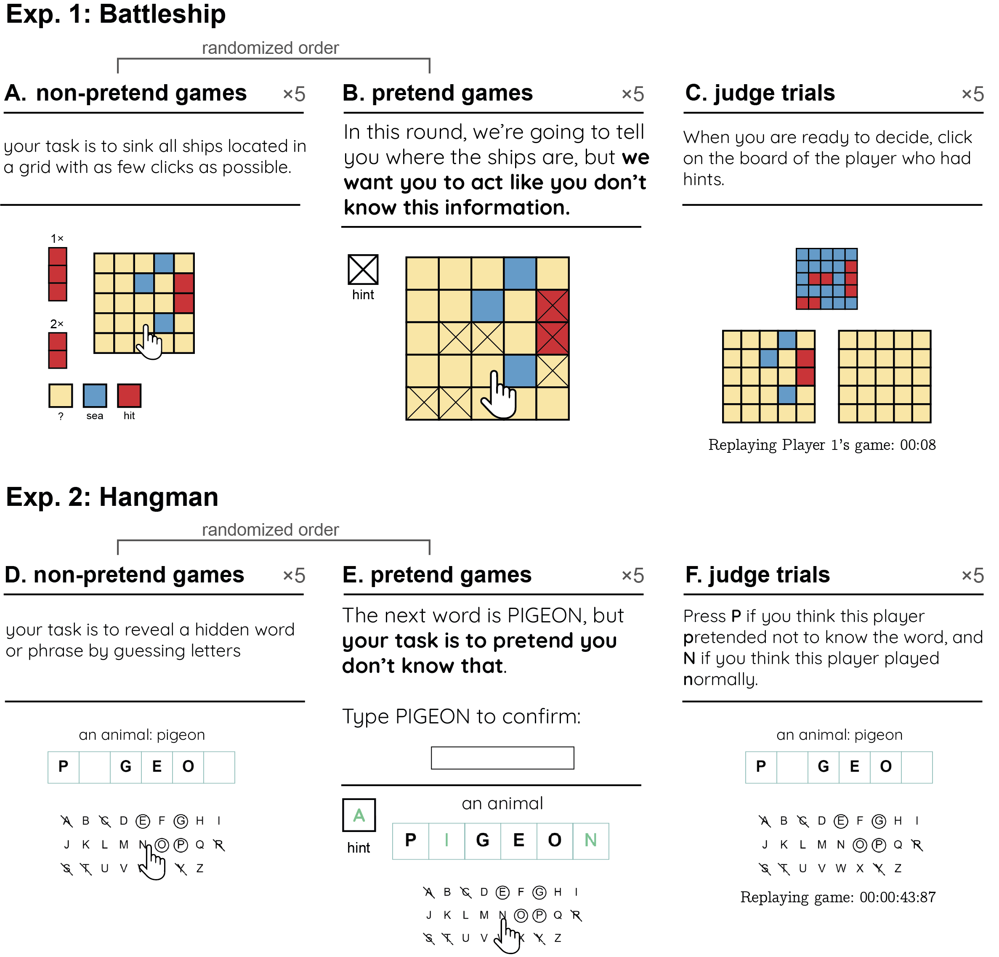

# Pretending not to know

A series of experiments looking at people's ability to pretend they don't know something.

## Data

Raw data from all four experiments is available on the project's OSF repository: [osf.io/zma9b/](https://osf.io/zma9b/files/osfstorage/).

## Analysis Scripts

[All pre-registered analyses](https://github.com/matanmazor/ignorance/blob/main/docs/preregisteredMethodsAndResults.Rmd), [exploratory analyses](https://github.com/matanmazor/ignorance/blob/main/docs/ExploratoryResults.Rmd), and [the paper itself in a data-to-paper Rmarkdown format](https://github.com/matanmazor/ignorance/blob/main/docs/paper.Rmd) are available in the 'docs' subdirectory.

The outputs of the scripts are available in gitbook format (both [preregistered](https://matanmazor.github.io/ignorance/docs/exp.-1-battleship.html) and [exploratory](https://matanmazor.github.io/ignorance/docs/exp.-1-battleship-exploratory-results.html) analyses).

## Experiment demos

You can try [demos of the two experiments](https://matanmazor.github.io/ignorance/experiments/demos/pretend), as experienced by our participants.

## Pre-registration and pre-registration time-locking 🕝🔒

OSF pre-registrations are available for [Battleship](https://osf.io/v9zsb) and [Hangman](https://osf.io/3thry).

To ensure preregistration time-locking (in other words, that preregistration preceded data collection), we employed [randomization-based preregistration](https://medium.com/@mazormatan/cryptographic-preregistration-from-newton-to-fmri-df0968377bb2). We used the SHA256 cryptographic hash function to translate our preregistered protocol folder (including the pre-registration document) to a string of 256 bits. These bits were then combined with the unique identifiers of single subjects, and the resulting string was used as seed for initializing the Mersenne Twister pseudorandom number generator prior to determining all random aspects of the experiment, including the order of game boards (grid configurations or target words) presented to participants, and their assignment of boards to experimental conditions. This way, experimental randomization was causally dependent on, and therefore could not have been determined prior to, the specific contents of our preregistration document ([Mazor, Mazor & Mukamel, 2019](https://doi.org/10.1111/ejn.14278)).

### Exp. 1: Battleship
[protocol folder](https://github.com/matanmazor/ignorance/blob/main/experiments/Battleships2/protocolFolder.zip)

protocol sum: 60c270410375e8a192468fc1a0e9c93da60d5e203eb2760b621a8631a26f4c5c

[relevant pre-registration lines of code](https://github.com/matanmazor/ignorance/blob/0015bfeb46b9b85e3e25304671d943335cca4a53/experiments/Battleships2/code/index.html#L864-L876)

### Exp. 2: Hangman
[protocol folder](https://github.com/matanmazor/ignorance/blob/0015bfeb46b9b85e3e25304671d943335cca4a53/experiments/Hangman2/protocolFolder2.zip)

protocol sum: c4929c7fe33df1b7b52f15c789d98eab30a9cee09a8121807a3c59e28e7430a4

[relevant pre-registration lines of code](https://github.com/matanmazor/ignorance/blob/0015bfeb46b9b85e3e25304671d943335cca4a53/experiments/Hangman2/code/index.html#L772-L783)

⚠️ Notice that the due to an error in the experimental code, only the second batch of Hangman participants was effectively time-locked. [See here](https://github.com/matanmazor/ignorance/blob/0015bfeb46b9b85e3e25304671d943335cca4a53/experiments/Hangman2/whyIsThereTwoOfEverything.txt).
