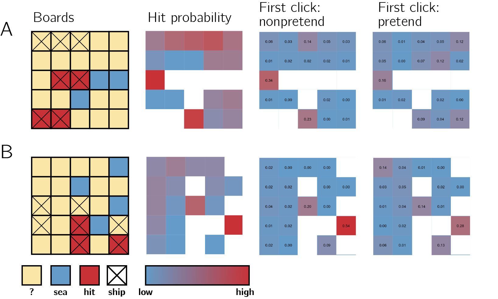

```{r global_options, include=FALSE}
set.seed(42)
knitr::opts_chunk$set(fig.crop = F, fig.pos = "tb", fig.path='figs/',
                      echo=F, warning=F, cache=T, 
                      message=F, sanitize = T, 
                      fig.width = 10, fig.height = 5,
                      dev = "ragg_png", dpi = 300, fig.width = 6, fig.height = 4)
```

```{r, libraries, echo=FALSE, warning=FALSE, cache=F}

# Run on R 4.2.2 ("Innocent and Trusting")

library(groundhog)

groundhog.library(c(
  'png',
  'grid',
  'ggplot2',
  'svglite',
  'xtable',
  'papaja',
  'tidyverse',
  'broom',
  'cowplot',
  'MESS', # for AUCs
  'lsr', # for effect sizes
  'pwr', # for power calculations
  'brms', # for mixed effects modeling
  'BayesFactor', # for Bayesian t test
  'jsonlite', # parsing data from sort_trial
  'caret', #for cross validation
  'ggrepel', #for word scatterplots
  'ragg' # for png
), '2022-12-01')

```

# Exp. 1: Battleship; Exploratory results

```{r battleship-load, warning=FALSE}

E2.df <- read.csv('../experiments/Battleships2/data/batch1/jatos_results_batch1.csv',na.strings=c(""," ","NA")) %>%
  mutate(subj_id = paste(as.character(participant_number),substr(PROLIFIC_PID,1,4),sep='')) %>%
  mutate(subj_id = factor(subj_id)) %>%
  # the dash is breaking r
  mutate(test_part = ifelse(test_part=='non-pretend','nonpretend',test_part)) %>%
  mutate(genuine_first=genuine_first=='True');

E2.click_df <- E2.df %>%
  dplyr::select(subj_id, 
         test_part, 
         grid_number, 
         num_clicks,
         click_log,
         genuine_first) %>%
  mutate(click_log = gsub("\'","\"", click_log)) %>%
  filter(test_part=='pretend' | test_part=='nonpretend');

E2.lucky_pretenders <- E2.click_df%>%filter(num_clicks==7)%>%pull(subj_id)%>%unique();

E2.click_log <- readRDS('../experiments/Battleships2/data/batch1/click_log.Rda');

load('../experiments/Battleships2/data/batch1/click_log_with_boards.RData')

```

```{r functions, warning=FALSE}

N_perm <- 1000;
bootstrap_error <- function(x, N_perm) {
  N <- length(x)
  medians = c();
  for (i in 1:N_perm) {
    medians = c(medians,sample(x,replace=TRUE,size=N)%>%median(na.rm=T))
  };
  return(sd(medians,na.rm=T))
}

all_possible_boards <- read.csv('../analysis/flat_boards.csv',header=FALSE);

create_board_states <- function(flat_positions,hit) {
  
  board_state = rep(NA,25)
  board_states = c();
  for (p in seq_along(flat_positions)) {
    board_states = c(board_states, paste(board_state,collapse=','));
    board_state[flat_positions[p]]=ifelse(hit[p],1,0);
  }
  
  return(board_states)
};

get_likelihood <- function(board_state) {
  
  board_state = scan(text= board_state, what = numeric(), sep="," , quiet = TRUE);
  
  revealed_positions <- which(!is.na(board_state));
  
  boards_to_remove = c();
  
  for (position in revealed_positions) {
    boards_to_remove = union(boards_to_remove, which(all_possible_boards[,position] != board_state[position]))
  }
  
  survived_boards = setdiff(1:nrow(all_possible_boards), boards_to_remove);
  likelihood = all_possible_boards[survived_boards,]%>%colMeans();
  likelihood[revealed_positions]=NA;
  
  return(paste(likelihood,collapse=','))
  
};

get_posterior <- function(likelihood) {
    likelihood = scan(text= likelihood, what = numeric(), sep="," , quiet = TRUE);
    posterior = likelihood/sum(likelihood,na.rm=TRUE); # assuming a uniform prior
    return(paste(posterior,collapse=','))
}


get_p_click <- function(posterior, flat_position) {
  posterior <- scan(text= posterior, what = numeric(), sep="," , quiet = TRUE);
  return(posterior[flat_position])
}

get_p_click_rank <- function(posterior, flat_position) {
  posterior <- scan(text= posterior, what = numeric(), sep="," , quiet = TRUE);
  rank_posterior = rank(-posterior)
  return(rank_posterior[flat_position])
}

get_posterior_entropy <- function(posterior) {
  posterior <- scan(text= posterior, what = numeric(), sep="," , quiet = TRUE);
  posterior[which(posterior==0)]=NA; #to avoid infinity*0
  entropy <- -sum(unlist(posterior)*(unlist(log2(posterior))),na.rm=TRUE);
  return(entropy);
}

```

## Ship completion

```{r, child=c('../analysis/shipCompletion.Rmd')}
```

To get at subtler dynamics in a more direct way, in a follow-up exploratory analysis we focused on decision latencies following a hit. We categorized hits into four types: first hit on a ship, second hit on a ship when the size-three submarine hasn't been sunk yet, second hit on a ship when the size-three submarine has already been sunk, and third hit on a submarine. In the first case, players know the ship must continue in one of the neighboring cells. In the second case, there is a good chance the ship continues (if this ship turns out to be a submarine). In the third and fourth cases, it is clear that the ship is fully sunk.

In non-pretend games, participants were significantly slower to select the next cell when they knew they had just completed a ship (categories 3 and 4) compared to when they just hit a ship, but were not sure (category 2) or knew they had not completely sunk it (category 1; `r apa_print(E2.RT_by_hit_order%>%spread(prev_hit_type,RT)%>%mutate(diff=first+second-secondlast-thirdlast)%>%filter(test_part=='nonpretend')%>%pull(diff)%>%t.test())$statistic`). Specifically, we find that participants were slower by `r E2.RT_by_hit_order%>%spread(prev_hit_type,RT)%>%mutate(diff=secondlast-second)%>%filter(test_part=='nonpretend')%>%pull(diff)%>%median(na.rm=TRUE)%>%round()` ms to make the next cell selection after hitting the second cell of a ship if the size-three submarine had already been sunk (`r apa_print(E2.RT_by_hit_order%>%spread(prev_hit_type,RT)%>%mutate(diff=secondlast-second)%>%filter(test_part=='nonpretend')%>%pull(diff)%>%t.test())$statistic`).

Strikingly, we found the exact same pattern in pretend games. Players were faster to make the next cell selection when they pretended to think that the current ship might not be fully sunk (`r apa_print(E2.RT_by_hit_order%>%spread(prev_hit_type,RT)%>%mutate(diff=first+second-secondlast-thirdlast)%>%filter(test_part=='pretend')%>%pull(diff)%>%t.test())$statistic`). This was not merely a difference between the first, second and third hits: participants were slower by `r E2.RT_by_hit_order%>%spread(prev_hit_type,RT)%>%mutate(diff=secondlast-second)%>%filter(test_part=='pretend')%>%pull(diff)%>%median(na.rm=TRUE)%>%round()` ms to make the next cell selection after hitting the second cell of a ship if the size-three submarine had already been sunk (`r apa_print(E2.RT_by_hit_order%>%spread(prev_hit_type,RT)%>%mutate(diff=secondlast-second)%>%filter(test_part=='nonpretend')%>%pull(diff)%>%t.test())$statistic`). Further analysis confirmed that this effect remained significant when controlling for click number (`r apa_print(E2.corrected_RT_by_hit_order%>%spread(prev_hit_type,corrected_RT)%>%mutate(diff=secondlast-second)%>%filter(test_part=='nonpretend')%>%pull(diff)%>%t.test())$statistic`), and when restricting the analysis to the second hit of a ship that is in fact of size-two (`r apa_print(E2.RT_by_hit_order_boats_only%>%spread(prev_hit_type,RT)%>%mutate(diff=secondlast-second)%>%filter(test_part=='pretend')%>%pull(diff)%>%t.test())$statistic`).

This last finding bears emphasizing: In both classes two and three, pretenders *knew* that they had just sunk a size-two ship, but in the second case they *pretended not to know* this fact, and this affected their response latency in the same way it would have been affected had they been in a non-pretend game.

```{r battleship-ship-completion-plot}

E2.RT_by_hit_order %>%
  filter(!is.na(prev_hit_type))%>%
  mutate(prev_hit_type = factor(prev_hit_type,levels=c('first','second','secondlast','thirdlast'), labels = c('first','second','second and last','third')))%>%
  group_by(test_part,prev_hit_type) %>%
  summarise(RT = median(RT),
            sem_RT = bootstrap_error(RT,N_perm)) %>%
  ggplot(aes(x=prev_hit_type,y=RT,fill=test_part)) +
  scale_fill_manual(values=c("#69b3a2", "#404080")) +
  scale_color_manual(values=c("#69b3a2", "#404080")) +
  geom_bar(stat='identity',color='black',position=position_dodge()) +
  geom_errorbar(aes(ymin=RT-sem_RT,ymax=RT+sem_RT),width=.2,position=position_dodge(.9))+
  labs(fill=' ',x='previous hit', y='median RT')+
  theme_classic()

```

## Half games

Our optimality analysis showed that pretenders' click selections closely resemble those of non-pretenders, at least in that they are not random, but rather guided by where a ship might be. However, due to the high number of possible board configurations, data from full games provide limited opportunity to compare cell selections for specific game states. In addition to asking, "What guides cell selections in pretend and non-pretend games?", we also wanted to ask, "Where exactly would pretenders and non-pretenders click, given a specific board configuration?".

To achieve this, the sixth game in each block started not with an empty grid, but with the contents of some cells already revealed by a previous player. As before, pretenders also knew where the remaining ships were hidden, but tried to play as if they only knew what was known to this previous player. Having cell selections from 250 players for each board configuration and condition allowed us to plot and compare the distribution of clicks under a genuine, or pretend, knowledge state.

```{r, child=c('half_games.Rmd')}
```

In the third column we plot the distribution of clicks for non-pretend players. This distribution is in agreement with the hit probability map (board A: `r cor_A_nonpretend%>%apa_print()%>%'$'(full_result)`; board B: `r cor_B_nonpretend%>%apa_print()%>%'$'(full_result)`). Finally, in the fourth column we plot the distribution of cell selections for pretend players. Although noisier, this distribution is also in agreement with the hit probability map (board A: `r cor_A_pretend%>%apa_print()%>%'$'(full_result)`; board B: `r cor_B_pretend%>%apa_print()%>%'$'(full_result)`), and more importantly, with the hit distribution of non-pretenders for the same board configuration (board A: `r cor_A_pretend_nonpretend%>%apa_print()%>%'$'(full_result)`, board B: `r cor_B_pretend_nonpretend%>%apa_print()%>%'$'(full_result)`).

```{r half-games, echo=FALSE, out.width = '100%', fig.cap = "Half games. First column: the two boards, as they appeared to pretenders. Second column: objective hit probability, given game state. Third and fourth columns: empirical click probabilities in non-pretend and pretend games, respectively."}

```

## Heuristic use

In Battleship, players sometimes have a fixed sequence of clicks that they follow, at least for the first moves. To quantify this, we plot the distribution of the first 5 clicks from all all games of a random subset of 100 players:

```{r get-Battleship-prior, fig.cap="Distribution of the first 5 clicks in all games, from a subset of 100 random players"}

set.seed(42)
all_subjects <- E2.click_log$subj_id%>%unique();
random100 <- all_subjects[sample(length(all_subjects),100)]

E2.prior_first5 <- E2.click_log %>%
  filter(click_number<6 & subj_id %in% random100)%>%
  group_by(i,j)%>%
  summarise(n=n()) %>%
  mutate(p=n/sum(n),
         flat_position = 1+i*5+j)

ggplot(E2.prior_first5,aes(x=j,y=i,fill=p)) +
  geom_tile() +
  coord_equal() +
  scale_x_continuous(breaks=c()) +
  scale_y_continuous(breaks=c(),trans='reverse') +
  scale_fill_gradient(low='#649bc8',high='#c83237', na.value ='white')+
  labs(x='',y='') +
  theme_classic() +
  labs(title='click probability in Battleship')
```

As can be seen, subjects prefer to click on the diagonals, with a slight preference for the left hand side. We then asked how well aligned are players' clicks with this map in pretend and non-pretend games. For this analysis, we only used data from the remaining `r all_subjects%>%length()-random100%>%length()` players whose games were not used for generating the above map.

```{r battleship-prior-comparison}

battleship_prior <- E2.prior_first5$p;

get_p_heuristic_rank <- function(posterior, flat_position) {
  posterior <- scan(text= posterior, what = numeric(), sep="," , quiet = TRUE);
  prior = battleship_prior*posterior/posterior #to get rid of nans
  rank_prior = rank(-prior)
  return(rank_prior[flat_position])
}

E2.click_log_with_heuristic <- E2.click_log_with_boards %>%
  rbind(E2.click_log_with_boards_optimal) %>%
  rbind(E2.click_log_with_boards_random) %>%
  rowwise() %>%
  mutate(p_heuristic_rank = get_p_heuristic_rank(posterior,flat_position))

E2.mean_P_heuristic_rank <- E2.click_log_with_heuristic %>%
  filter(!(subj_id %in% random100))%>%
  group_by(subj_id,test_part) %>%
  summarise(p_heuristic_rank=mean(p_heuristic_rank))

E2.mean_P_heuristic_rank %>%
    filter(test_part != 'optimal') %>%
    ggplot(aes(x=p_heuristic_rank,fill=test_part))+
    geom_histogram( color="black", alpha=0.6, position = 'identity') +
    scale_fill_manual(values=c("#69b3a2", "#404080", "#FDE725")) +
    labs(x='mean rank according to the above map', y='number of players')+
    theme(legend.position=c(0.10,0.85)) +
    # facet_wrap(~genuine_first, nrow=2)+
    # scale_x_reverse() +
    theme_classic();

```

We find no difference in this measure between pretend and non-pretend games (`r E2.mean_P_heuristic_rank%>%spread(test_part,p_heuristic_rank)%>%mutate(diff=nonpretend-pretend)%>%pull(diff)%>%t.test()%>%apa_print()%>%'$'(statistic)`). In the next analysis we use a more sensitive, player-specific measure of players' tendency to follow a fixed heuristic, versus playing flexibly.

## Variability in number of misses

```{r battleship-num-misses-variability}

E2.sd_num_clicks <- E2.click_df %>%
  filter(!(subj_id %in% E2.lucky_pretenders))%>%
  group_by(subj_id,test_part, genuine_first) %>%
  summarise(sd_num_clicks=sd(num_clicks)) %>%
  spread(test_part,sd_num_clicks) %>% 
  mutate(diff=nonpretend-pretend);

E2.sd_num_clicks_relative_to_np <- E2.click_df %>%
  filter(!(subj_id %in% E2.lucky_pretenders))%>%
  group_by(subj_id)%>%
  mutate(mean_nonpretend=mean(num_clicks[test_part=='nonpretend']),
         squared_dist_to_mean = (num_clicks-mean_nonpretend)**2)%>%
  group_by(subj_id,test_part, genuine_first) %>%
  summarise(sd_num_clicks=sqrt(sum(squared_dist_to_mean)/(n()-1))) %>%
  spread(test_part,sd_num_clicks) %>% 
  mutate(diff=nonpretend-pretend);

p<- E2.click_df %>%
  mutate(test_part=factor(test_part,labels=c('non-pretend','pretend')))%>%
  filter(!(subj_id %in% E2.lucky_pretenders))%>%
  group_by(subj_id,test_part, genuine_first) %>%
  summarise(sd_num_clicks=sd(num_clicks)) %>%
  group_by(test_part)%>%
  summarise(
    mean=mean(sd_num_clicks),
    se=se(sd_num_clicks)
    ) %>%
  ggplot(aes(x=test_part,
             color=test_part,
             y=mean))+
  geom_point(size=6)+
  geom_errorbar(aes(ymin=mean-se,ymax=mean+se),color='black', width=0.3)+
  scale_color_manual(values=c("#69b3a2", "#404080")) +
  labs(x="",y="")+
  theme(legend.pos='na')+
  theme_classic()+
  scale_y_continuous(limits=c(0,2.8))+
  theme(legend.pos='na')
  
ggsave('figures/Battleship2/num_guess_sd.png',p,width=2.5,height=1.5,dpi=300)


```

We quantified the within-subject variability in the number of misses in pretend and non-pretend games. This is a function of how similar games were to each other, within condition and within individual. The standard deviation in non-pretend games was on average `r E2.sd_num_clicks$nonpretend%>%mean()%>%printnum()`, and significantly higher than in pretend games (mean SD = `r E2.sd_num_clicks$pretend%>%mean()%>%printnum()`, `r apa_print(E2.sd_num_clicks$diff%>%t.test())$statistic`). In other words, pretend games were significantly more similar to each other, in number of guesses, than non-pretend games were to each other.

<!-- Next, we asked whether pretend games were not only more similar among themselves, but also to the average non-pretend game, than were non-pretend games. We therefore replaced the $\mu_{pretend}$ in the standard deviation formula with $\mu_{non-pretend}$: $\sigma'=\sqrt{\frac{1}{N}\Sigma_{i=1}^{N} (x_{i}-\mu_{non-pretend})^2}$. Here, a typical pretend game was less similar, in number of misses, to the average non-pretend game, than was a typical non-pretend game (`r apa_print(E2.sd_num_clicks_relative_to_np$diff%>%t.test())$full_result`). -->

## Within-participant sequential guess entropy

```{r, child=c('../analysis/clickEntropyBattleship.Rmd')}
```

In this analysis, we asked how flexible players were in their click sequences, across games. We quantified flexibility as the Shannon entropy of cell selections across games, for a given click number. For example, if a player always started their games by clicking in the top left corner, their flexibility score for the first click will be $H([1,1,1,1,1])=0$. Flexibility was quantified separately for pretend and non-pretend games.

```{r battleship-flexibility-plot}

E2.click_entropy_by_serial_position_summary %>%
  filter(test_part %in% c('pretend','nonpretend') & click_number<=20) %>%
  ggplot(aes(x=click_number,y=mean_entropy,color=test_part,group=test_part)) +
  geom_line() +
  geom_ribbon(aes(ymax=mean_entropy+se_entropy,ymin=mean_entropy-se_entropy, fill=test_part),alpha=0.5) +
  scale_fill_manual(values=c("#69b3a2", "#404080", "#FDE725", "black")) +
  scale_color_manual(values=c("#69b3a2", "#404080", "black", "black")) +
  labs(x='click number', y='flexibility score (Shannon entropy)') +
  theme_classic() +
  scale_x_continuous(breaks=seq(20))

p<- E2.click_entropy_by_serial_position_summary %>%
    filter(test_part %in% c('pretend','nonpretend') & click_number<=8) %>%
    ggplot(aes(x=click_number,y=mean_entropy,color=test_part,group=test_part)) +
    geom_line() +
    geom_ribbon(aes(ymax=mean_entropy+se_entropy,ymin=mean_entropy-se_entropy, fill=test_part),alpha=0.5) +
    scale_fill_manual(values=c("#69b3a2", "#404080", "#FDE725", "black")) +
    scale_color_manual(values=c("#69b3a2", "#404080", "black", "black")) +
    labs(x='click number', y='') +
    theme_classic() +
    scale_x_continuous(breaks=seq(20))+
  theme(legend.pos='na')

ggsave('figures/Battleship2/sequential_guess_entropy.png',width=2.5,height=1.5,dpi=300)

```

Flexibility scores increased as a function of click number for both pretend and non-pretend games, as expected if players adjust their behavior based on the outcomes of previous clicks. This process reached a plateau of around $H=2.1$ at click number 6.

Importantly, before that point, flexibility was persistently lower in pretend games (click #1: `r apa_print(E2.click_entropy_by_serial_position_wide %>% filter(click_number==1)%>%pull(diff)%>%t.test())$statistic`; click #2: `r apa_print(E2.click_entropy_by_serial_position_wide %>% filter(click_number==2)%>%pull(diff)%>%t.test())$statistic`; click #3: `r apa_print(E2.click_entropy_by_serial_position_wide %>% filter(click_number==3)%>%pull(diff)%>%t.test())$statistic`; click #4: `r apa_print(E2.click_entropy_by_serial_position_wide %>% filter(click_number==4)%>%pull(diff)%>%t.test())$statistic`; click #5: `r apa_print(E2.click_entropy_by_serial_position_wide %>% filter(click_number==5)%>%pull(diff)%>%t.test())$statistic`).

We reasoned that this tendency to rigidly follow a pre-defined plan may underlie at least some of the difference in game optimality between pretend and non-pretend games. Interestingly, however, we find no significant correlation between the pretend/non-pretend differences in flexibility and optimality in the first 5 clicks (`r apa_print(cor.test(E2.entropy_cost$entropy_cost, E2.entropy_cost$p_click_cost))$full_result`).

## Suppression or simulation?

```{r battleship-suppression-or-simulation}

E2.debrief_labeled <- read.csv('../experiments/Battleships2/data/debrief.csv',na.strings=c(""," ","NA")) %>%
  dplyr::select(-subj_id) %>%
  merge(E2.debrief <- E2.df %>%
          filter(!is.na(responses) & is.na(test_part)) %>%
          dplyr::select(subj_id,responses) %>%
          mutate(comments = map(responses, ~fromJSON(.) %>%as.data.frame()))%>%
          unnest(comments)%>%
          dplyr::select(subj_id,debrief)%>%
          filter(!is.na(debrief) & debrief != "")%>%
          mutate(debrief = gsub("[\r\n]", "",debrief)))


E2.simulators <- E2.debrief_labeled %>%
  filter(simulation==1 & suppression==0) %>%
  pull(subj_id)

E2.suppressors <- E2.debrief_labeled %>%
  filter(simulation==0 & suppression==1) %>%
  pull(subj_id)

```

At the end of the experiment, players were asked whether they had a strategy for pretending or for detecting pretense. I (MM) manually labeled their responses according to three criteria: mentions of suppression (e.g., "Trying to ignore the hints"), simulation (e.g., "Trying to imagine how I would react"), and rules (e.g., "Checking the corners and center before random selection of tiles"). Some answers got more than one label and some got none. Overall, `r E2.debrief_labeled$suppression%>%sum()` mentioned using suppression, `r E2.debrief_labeled$simulation%>%sum()` mentioned using simulation, and `r E2.debrief_labeled$rules%>%sum()` mentioned following rules.

In the following analysis, we focus on the first two labels and sort players into two groups: `r E2.suppressors%>%length` players who reported using suppression but not simulation, and `r E2.simulators%>%length` who reported using simulation but not suppression.

### Click optimality

```{r battleship-p_click-sup-sim, echo = FALSE, cache=TRUE}

E2.sup_sim.mean_P_click_rank <- E2.click_log_with_boards %>%
  rbind(E2.click_log_with_boards_optimal) %>%
  rbind(E2.click_log_with_boards_random) %>%
  ungroup() %>%
  filter(subj_id %in% c(E2.simulators, E2.suppressors)) %>%
  mutate(group = ifelse(subj_id %in% E2.simulators, 'simulators','suppressors')) %>%
  group_by(subj_id,test_part, group) %>%
  summarise(p_click_rank=mean(p_click_rank));

E2.sup_sim.mean_P_click_rank_misses_only <- E2.click_log_with_boards %>%
  rbind(E2.click_log_with_boards_optimal) %>%
  rbind(E2.click_log_with_boards_random) %>%
  ungroup() %>%
  filter(subj_id %in% c(E2.simulators, E2.suppressors) & !hit_bin) %>%
  mutate(group = ifelse(subj_id %in% E2.simulators, 'simulators','suppressors')) %>%
  group_by(subj_id,test_part, group) %>%
  summarise(p_click_rank=mean(p_click_rank));

E2.sup_sim.mean_P_click_rank %>%
    filter(test_part != 'optimal') %>%
    ggplot(aes(x=p_click_rank,fill=test_part))+
    geom_histogram( color="#e9ecef", alpha=0.6, position = 'identity') +
    scale_fill_manual(values=c("#69b3a2", "#404080", "#FDE725")) +
    labs(x='p(ship in clicked square) - rank', y='number of players')+
    theme(legend.position=c(0.10,0.85)) +
    facet_wrap(~group, nrow=2)+
    # scale_x_reverse() +
    theme_classic();

ggsave('figures/E2_pclick_rank_by_heuristic.pdf')
ggsave('figures/E2_pclick_rank_by_heuristic.png',width=5,height=2,dpi=300)

p<- E2.sup_sim.mean_P_click_rank %>%
    filter(test_part != 'optimal') %>%
    ggplot(aes(x=p_click_rank,fill=test_part))+
    geom_histogram( color="#e9ecef", alpha=0.6, position = 'identity') +
    scale_fill_manual(values=c("#69b3a2", "#404080", "#FDE725")) +
    labs(x='p(ship in clicked square) - rank', y='number of players')+
    scale_x_continuous(limits=c(0,15))+
    theme(legend.position=c(0.10,0.85)) +
    facet_wrap(~group, nrow=2)+
    # scale_x_reverse() +
    theme_classic();

ggsave('figures/E2_pclick_rank_by_heuristic_misses_only.pdf',p)
ggsave('figures/E2_pclick_rank_by_heuristic_misses_only.png',p,width=5,height=2,dpi=300)

```

The mean negative optimality score of non-pretend games was `r E2.sup_sim.mean_P_click_rank%>%filter(group=='suppressors' & test_part=='nonpretend') %>%pull(p_click_rank)%>%mean()%>%printnum()` among suppressors and `r E2.sup_sim.mean_P_click_rank%>%filter(group=='simulators' & test_part=='nonpretend') %>%pull(p_click_rank)%>%mean()%>%printnum()` among simulators (`r apa_print(t.test(E2.sup_sim.mean_P_click_rank%>%filter(group=='suppressors' & test_part=='nonpretend') %>%pull(p_click_rank), E2.sup_sim.mean_P_click_rank%>%filter(group=='simulators' & test_part=='nonpretend') %>%pull(p_click_rank)))$statistic`). The mean negative optimality score of pretend games was `r E2.sup_sim.mean_P_click_rank%>%filter(group=='suppressors' & test_part=='pretend') %>%pull(p_click_rank)%>%mean()%>%printnum()` among suppressors and `r E2.sup_sim.mean_P_click_rank%>%filter(group=='simulators' & test_part=='pretend') %>%pull(p_click_rank)%>%mean()%>%printnum()` among simulators (`r apa_print(t.test(E2.sup_sim.mean_P_click_rank%>%filter(group=='suppressors' & test_part=='pretend') %>%pull(p_click_rank), E2.sup_sim.mean_P_click_rank%>%filter(group=='simulators' & test_part=='pretend') %>%pull(p_click_rank)))$statistic`). Note that a higher score here means lower optimality. To the very least, simulators did as well as suppressors in pretending.

### RT by outcome

```{r RT_by_accuracy-sup-sim}

E2.RT_by_lag3 <- E2.click_log %>%
  filter(click_number>3) %>%
  group_by(subj_id,test_part,lag3,genuine_first)%>%
  summarise(RT=median(RT))  %>%
  spread(lag3,RT,sep='_') %>%
  mutate(lag3_diff = lag3_TRUE-lag3_FALSE);

E2.RT_by_lag2 <- E2.click_log %>%
  filter(click_number>2) %>%
  group_by(subj_id,test_part,lag2,genuine_first)%>%
  summarise(RT=median(RT))  %>%
  spread(lag2,RT,sep='_') %>%
  mutate(lag2_diff = lag2_TRUE-lag2_FALSE);

E2.RT_by_lag1 <- E2.click_log %>%
  filter(click_number>1) %>%
  group_by(subj_id,test_part,lag1,genuine_first)%>%
  summarise(RT=median(RT))  %>%
  spread(lag1,RT,sep='_') %>%
  mutate(lag1_diff = lag1_TRUE-lag1_FALSE)

E2.RT_by_hit <- E2.click_log %>%
  filter(click_number>0) %>%
  group_by(subj_id,test_part,hit_bin,genuine_first)%>%
  summarise(RT=median(RT))  %>%
  spread(hit_bin,RT,sep='_') %>%
  mutate(hit_diff = hit_bin_TRUE-hit_bin_FALSE)

E2.RT_by_lead1 <- E2.click_log %>%
  filter(click_number<num_clicks) %>%
  group_by(subj_id,test_part,lead1,genuine_first)%>%
  summarise(RT=median(RT))  %>%
  spread(lead1,RT,sep='_') %>%
  mutate(lead1_diff = lead1_TRUE-lead1_FALSE);

E2.RT_by_lead2 <- E2.click_log %>%
  filter(click_number<num_clicks-1) %>%
  group_by(subj_id,test_part,lead2,genuine_first)%>%
  summarise(RT=median(RT))  %>%
  spread(lead2,RT,sep='_') %>%
  mutate(lead2_diff = lead2_TRUE-lead2_FALSE)

E2.RT_by_lead3 <- E2.click_log %>%
  filter(click_number<num_clicks-2) %>%
  group_by(subj_id,test_part,lead3,genuine_first)%>%
  summarise(RT=median(RT))  %>%
  spread(lead3,RT,sep='_') %>%
  mutate(lead3_diff = lead3_TRUE-lead3_FALSE)

E2.RT_by_hit_lags <- E2.RT_by_lag3 %>%
  merge(E2.RT_by_lag2) %>%
  merge(E2.RT_by_lag1) %>%
  merge(E2.RT_by_hit) %>%
  merge(E2.RT_by_lead1) %>%
  merge(E2.RT_by_lead2) %>%
  merge(E2.RT_by_lead3);

E2.RT_by_hit_lags_long <- E2.RT_by_hit_lags %>%
  gather("position","difference",c("lag3_diff","lag2_diff", "lag1_diff", "hit_diff", "lead1_diff", "lead2_diff", "lead3_diff"))%>%
  mutate(position = ifelse(position=="lag3_diff", 3,
                           ifelse(position=="lag2_diff",2,
                                  ifelse(position=="lag1_diff",1,
                                         ifelse(position=="hit_diff",0,
                                                ifelse(position=="lead1_diff",-1,
                                                       ifelse(position=="lead2_diff",-2,-3
                                                              ))))))) %>%
  dplyr::select(subj_id,test_part,genuine_first,position,difference);

E2.RT_by_hit_lags_long %>% 
  filter(position<2 & position > -2)%>%
  filter(subj_id %in% E2.simulators | subj_id %in% E2.suppressors) %>%
  mutate(group = ifelse(subj_id %in% E2.simulators, 
                        'simulators','suppressors')) %>%
  group_by(test_part,position, group) %>%
  summarise(median_difference=median(difference),
            sem_difference=bootstrap_error(difference,N_perm)) %>%
  ggplot(aes(x=position,color=test_part,fill=test_part,y=median_difference)) +
  scale_fill_manual(values=c("#69b3a2", "#404080")) +
  scale_color_manual(values=c("#69b3a2", "#404080")) +
  scale_x_continuous(breaks=-1:1,labels=c('hit on next trial', 'hit on current trial', 'hit on previous trial'))+
  geom_abline(slope=0,intercept=0,linetype=3)+
  geom_path(size=1)+
  geom_ribbon(aes(ymin=median_difference-sem_difference,ymax=median_difference+sem_difference),alpha=0.3,show.legend=F)+
  labs(fill=' ',x='', y='RT effect (ms) of hit on trial t')+
  theme_classic() +
  facet_wrap(~group, nrow=2)


ggsave('figures/E2_RT_by_lag_sim_sup.pdf',width=7)
ggsave('figures/E2_RT_by_lag.png_sim_sup.png',width=4, height=3.5, dpi=300)


```

Visual inspection reveals similar temporal profiles in both groups (the higher standard error among suppressors is due to the lower number of subjects in this group). Specifically, in pretend games, cell selections that resulted in a hit were faster than those that resulted in a miss in both groups (suppressors: `r apa_print(E2.RT_by_hit_lags %>% filter(test_part=='pretend' & subj_id %in% E2.suppressors)%>%pull(hit_diff)%>%t.test())$full_result`; simulators: `r apa_print(E2.RT_by_hit_lags %>% filter(test_part=='pretend' & subj_id %in% E2.simulators)%>%pull(hit_diff)%>%t.test())$full_result`), and cell selections that followed a hit were slower than those that followed a miss in both groups (suppressors: `r apa_print(E2.RT_by_hit_lags %>% filter(test_part=='pretend' & subj_id %in% E2.suppressors)%>%pull(lag1_diff)%>%t.test())$full_result`; simulators: `r apa_print(E2.RT_by_hit_lags %>% filter(test_part=='pretend' & subj_id %in% E2.simulators)%>%pull(lag1_diff)%>%t.test())$full_result`).

# Exp. 2: Hangman; Exploratory results

```{r hangman-load, warning=FALSE}

E4.df <- read.csv('../experiments/Hangman2/data/jatos_results_batch2.csv',na.strings=c(""," ","NA")) %>%
  rbind(read.csv('../experiments/Hangman2/data/jatos_results_batch1.csv',na.strings=c(""," ","NA"))) %>%
  mutate(subj_id = paste(as.character(participant_number),substr(PROLIFIC_PID,1,5),sep='')) %>%
  mutate(subj_id = factor(subj_id)) %>%
  # the dash is breaking r
  mutate(test_part = ifelse(test_part=='non-pretend','nonpretend',test_part)) %>%
  filter(PROLIFIC_PID != '5ec4a156bc5aac3819ac52f2' & #reported some of the letters not showing up on their screen
        PROLIFIC_PID != '58211fc787f6b90001f13f9' & #reported some of the letters not showing up on their screen
        PROLIFIC_PID != '6149256f6335b06ade3723e0' &  # due a PROLFIIC bug, participated twice
        PROLIFIC_PID != '615ddab1e4f013092538b6c5')# due a PROLFIIC bug, participated twice

E4.click_df <- E4.df %>%
  dplyr::select(subj_id, 
         PROLIFIC_PID,
         test_part, 
         category,
         word,
         num_clicks,
         click_log,
         genuine_first,
         trial_type) %>%
  rowwise()%>%
  mutate(num_hits = strsplit(gsub(' ','',word),split='')[[1]]%>%unique()%>%length(),
         genuine_first= genuine_first=='True',
         num_misses = num_clicks-num_hits,
         click_log = gsub("\'","\"", click_log),
         click_log = gsub("None","null", click_log),
         word = factor(word,levels=c(
           'eleven',
           'ninety six',
           'dalai lama',
           'taylor swift',
           'strawberry',
           'lemon',
           'tooth',
           'head',
           'iowa',
           'montana'
         ))) %>%
  filter(test_part=='pretend' | test_part=='nonpretend') %>%
  filter(trial_type=='Hangman')


load('../experiments/Hangman2/data/E4.click_log.RData')

load('../experiments/Hangman2/data/E4.click_log_with_boards.RData') 

load('../experiments/Hangman2/data/E4.judge_df.RData')

```

## Correlation in number of misses

```{r hangman-misses-per-word}

E4.misses_per_word <- E4.click_df %>%
  group_by(test_part,word) %>%
  summarise(num_misses=median(num_misses)) %>%
  spread(test_part,num_misses)

```

Some words were more difficult to reveal. This required in players making more unsuccessful letter guesses in attempting to reveal some words compared to others. When pretending, players made more unsuccessful letter guesses for the exact same words `r cor.test(E4.misses_per_word$pretend, E4.misses_per_word$nonpretend,method='spearman')%>%apa_print()%>%'$'(full_result)`.

```{r hangman-correlation-plot}

E4.misses_per_word %>%
  ggplot(aes(x=nonpretend,y=pretend, label=toupper(word))) +
  geom_abline(intercept=0,slope=1, color='lightgray') +
  geom_point()+
  geom_text_repel()+
  coord_fixed(ratio=1)+
  scale_x_continuous(limits=c(0,5), breaks=seq(0,5))+
  scale_y_continuous(limits=c(0,5), breaks=seq(0,5)) +
  theme(legend.position = 'none')+
  theme_bw() +
  labs(x='median number of misses: non-pretend',
       y='median number of misses: pretend')

ggsave('figures/E4_scatter_misses.png',width=3.5, height=3.5)

```

## Variability in number of misses

```{r hangman-num-misses-variability}

E4.sd_num_misses <- E4.click_df %>%
  group_by(subj_id,test_part, genuine_first) %>%
  summarise(sd_num_misses=sd(num_misses)) %>%
  spread(test_part,sd_num_misses) %>% 
  mutate(diff=nonpretend-pretend);

E4.sd_num_misses_relative_to_np <- E4.click_df %>%
  group_by(subj_id)%>%
  mutate(mean_nonpretend=mean(num_misses[test_part=='nonpretend']),
         squared_dist_to_mean = (num_misses-mean_nonpretend)**2)%>%
  group_by(subj_id,test_part, genuine_first) %>%
  summarise(sd_num_clicks=sqrt(sum(squared_dist_to_mean)/(n()-1))) %>%
  spread(test_part,sd_num_clicks) %>% 
  mutate(diff=nonpretend-pretend);

E4.sd_num_misses_relative_to_np_controlling_for_word_difficulty <- E4.click_df %>%
  group_by(word)%>%
  mutate(num_misses_corrected=num_misses-mean(num_misses[test_part=='nonpretend']))%>%
  group_by(subj_id)%>%
  mutate(mean_nonpretend=mean(num_misses_corrected[test_part=='nonpretend']),
         squared_dist_to_mean = (num_misses_corrected-mean_nonpretend)**2)%>%
  group_by(subj_id,test_part, genuine_first) %>%
  summarise(sd_num_clicks=sqrt(sum(squared_dist_to_mean)/(n()-1))) %>%
  spread(test_part,sd_num_clicks) %>% 
  mutate(diff=nonpretend-pretend);

p<- E4.click_df %>%
  mutate(test_part=factor(test_part,levels=c('nonpretend','pretend'),labels=c('non-pretend','pretend')))%>%
  group_by(subj_id,test_part, genuine_first) %>%
  summarise(sd_num_clicks=sd(num_misses)) %>%
  group_by(test_part)%>%
  summarise(
    mean=mean(sd_num_clicks),
    se=se(sd_num_clicks)
    ) %>%
  ggplot(aes(x=test_part,
             color=test_part,
             y=mean))+
  geom_point(size=6)+
  geom_errorbar(aes(ymin=mean-se,ymax=mean+se),color='black', width=0.3)+
  scale_color_manual(values=c("#69b3a2", "#404080")) +
  labs(x="",y="")+
  theme(legend.pos='na')+
  theme_classic()+
  scale_y_continuous(limits=c(0,2.8))+
  theme(legend.pos='na')
  
ggsave('figures/Hangman2/num_guess_sd.png',p,width=2.5,height=1.5,dpi=300)

```

Similar to Battleship, the within-subject standard deviation in number of misses in non-pretend games (`r E4.sd_num_misses$nonpretend%>%mean()%>%printnum()`) was on average significantly higher than in pretend games (mean SD = `r E4.sd_num_misses$pretend%>%mean()%>%printnum()`, `r apa_print(E4.sd_num_misses$diff%>%t.test())$statistic`). Here too, pretend games were significantly more similar to each other, in terms of number of misses, than non-pretend games.

<!-- In order to test whether pretend games were more similar to the average non-pretend game than non-pretend games themselves, we first regressed out the effect of word on number of misses, since within-subject differences between the conditions can reflect the random assignment of words to conditions. We then replaced the $\mu_{pretend}$ in the standard deviation formula with $\mu_{non-pretend}$: $\sigma'=\sqrt{\frac{1}{N}\Sigma_{i=1}^{N} (x_{i}-\mu_{non-pretend})^2}$, as we did for Battleship. We again find that a typical pretend game was less similar, in number of misses (controlling for word difficulty), to the average non-pretend game, than was a typical non-pretend game (`r apa_print(E4.sd_num_misses_relative_to_np_controlling_for_word_difficulty$diff%>%t.test())$full_result`).  -->

## Within-participant sequential guess entropy

```{r, child=c('../analysis/clickEntropyHangman.Rmd')}
```

```{r hangman-flexibility-plot}

E4.click_entropy_by_serial_position_summary %>%
  filter(test_part %in% c('pretend','nonpretend') & click_number<=10) %>%
  ggplot(aes(x=click_number,y=mean_entropy,color=test_part,group=test_part)) +
  geom_line() +
  geom_ribbon(aes(ymax=mean_entropy+se_entropy,ymin=mean_entropy-se_entropy, fill=test_part),alpha=0.5) +
  scale_fill_manual(values=c("#69b3a2", "#404080", "#FDE725", "black")) +
  scale_color_manual(values=c("#69b3a2", "#404080", "black", "black")) +
  labs(x='click number', y='flexibility score (Shannon entropy)') +
  theme_classic() +
  scale_x_continuous(breaks=seq(20))

p<- E4.click_entropy_by_serial_position_summary %>%
    filter(test_part %in% c('pretend','nonpretend') & click_number<=8) %>%
    ggplot(aes(x=click_number,y=mean_entropy,color=test_part,group=test_part)) +
    geom_line() +
    geom_ribbon(aes(ymax=mean_entropy+se_entropy,ymin=mean_entropy-se_entropy, fill=test_part),alpha=0.5) +
    scale_fill_manual(values=c("#69b3a2", "#404080", "#FDE725", "black")) +
    scale_color_manual(values=c("#69b3a2", "#404080", "black", "black")) +
    labs(x='click number', y='') +
    theme_classic() +
    scale_x_continuous(breaks=seq(20))+
  theme(legend.pos='na')

ggsave('figures/Hangman2/sequential_guess_entropy.png',width=2.5,height=1.5,dpi=300)

```

Like for Battleship, flexibility scores increased as a function of click number for both pretend and non-pretend games, as expected if players adjust their behavior based on the outcomes of previous clicks. This process reached a plateau of around $H=2$ and click number 6.

Importantly, before that point, flexibility was persistently lower in pretend games (click #1: `r apa_print(E4.click_entropy_by_serial_position_wide %>% filter(click_number==1)%>%pull(diff)%>%t.test())$statistic`; click #2: `r apa_print(E4.click_entropy_by_serial_position_wide %>% filter(click_number==2)%>%pull(diff)%>%t.test())$statistic`; click #3: `r apa_print(E4.click_entropy_by_serial_position_wide %>% filter(click_number==3)%>%pull(diff)%>%t.test())$statistic`; click #4: `r apa_print(E4.click_entropy_by_serial_position_wide %>% filter(click_number==4)%>%pull(diff)%>%t.test())$statistic`; click #5: `r apa_print(E4.click_entropy_by_serial_position_wide %>% filter(click_number==5)%>%pull(diff)%>%t.test())$statistic`).

We reasoned that this tendency to rigidly follow a pre-defined plan may underlie at least some of the difference in game optimality between pretend and non-pretend games. We find evidence for such a correlation (`r apa_print(cor.test(E4.entropy_cost$entropy_cost, E4.entropy_cost$p_click_cost))$full_result`). Note that the direction is negative because high optimality is mapped to low values, but high flexibility is mapped to high values.

## Model-based analysis

We considered three factors that contribute to letter selections in Hangman:

1.  The prior probability of a letter in the English language $p(X)$.
2.  The posterior probability that a letter is present in the target word, given the game state $S$ and the category $p(X|S)$.
3.  The expected information gain this letter provides regarding the identity of the target word $H(S)-\sum p(x_v)H(S,x_v)$ (where $x_v$ is one potential outcome of guessing the letter $X$, for example, finding it in the second and fifth positions).

To quantify the contribution of each of these factors to letter selection, we fitted a multinomial logistic regression model to the data of each player. The model was specified and fit using the Turing Julia library for Bayesian inference with probabilistic programming [@ge2018]. We compared the ensuing coefficients in 'pretend' and 'non-pretend' conditions.

```{r hangman-load-coefficients, echo=FALSE}
E4.model_coefficients <- read.csv('../analysis/model_fits/model_coefficients.csv')
```

```{r hangman-coefficients_plot, echo-FALSE, cache=TRUE, fig.width=10,fig.height=5}

E4.model_coefficients %>%
  filter(type=='basic') %>%
  gather('term','coefficient',prior,post,eig) %>%
  mutate(test_part = factor(test_part, levels=c('nonpretend','pretend'),
                            labels=c('non-pretend','pretend')),
         term = factor(term, levels = c('prior','post','eig'), labels = c('prior','posterior','expected information gain'))) %>%
  ggplot(aes(x=coefficient,fill=test_part, color=test_part))+
  geom_histogram( alpha=0.6, position = 'identity', bins=100) +
  scale_fill_manual(values=c("#69b3a2", "#404080")) +
  scale_color_manual(values=c("#146464", "#404080")) +
  labs(x='coefficient (a.u.)', y='number of players')+
  theme(legend.position=c(0.10,0.85)) +
  scale_x_continuous(limits=c(-2,5)) +
  facet_wrap(~term, nrow=3)+
  # scale_x_reverse() +
  theme_classic();

ggsave('../docs/figures/E4coefs.png',width=5,height=4.5)
```

All three terms had a positive effect in both conditions. Prior probability (base rate) had a stronger effect in pretend games (`r apa_print(E4.model_coefficients %>% filter(type=='basic') %>% dplyr::select(subj_id,test_part,prior)%>%spread(test_part,prior)%>%mutate(diff=pretend-nonpretend)%>%pull(diff)%>%t.test())$full_result`). Hit posterior probability showed no such difference, and had a similar effect on players' decisions in both conditions (`r apa_print(E4.model_coefficients %>% filter(type=='basic') %>% dplyr::select(subj_id,test_part,post)%>%spread(test_part,post)%>%mutate(diff=pretend-nonpretend)%>%pull(diff)%>%t.test())$full_result`). Finally, expected information gain had a weaker effect in pretend games (`r apa_print(E4.model_coefficients %>% filter(type=='basic') %>% dplyr::select(subj_id,test_part,eig)%>%spread(test_part,eig)%>%mutate(diff=pretend-nonpretend)%>%pull(diff)%>%t.test())$full_result`).

Given collinearity between model predictors, we suspected that the effects of expected information gain may be driven by posterior probability effects. To isolate unique contributions of prior probability and expected information gain, we repeated the same analysis, but this time serially orthogonalizing the features (in the order [posterior, prior, expected information gain], and using the Gram Schmidt algorithm) prior to fitting the multinomial regression model. This time, expected information gain had no significant effect on decisions in non-pretend (`r  apa_print(E4.model_coefficients %>% filter(type=='orth') %>%filter(test_part=='nonpretend')%>%pull(eig)%>%t.test())$statistic`) and pretend games (`r  apa_print(E4.model_coefficients%>% filter(type=='orth') %>%filter(test_part=='pretend')%>%pull(eig)%>%t.test())$statistic`), rendering it possible that the previously observed effects were confounded with prior and posterior probability. In contrast, both prior and posterior probability had a significant positive effect, with prior probability having a stronger effect in pretend games (`r apa_print(E4.model_coefficients %>% filter(type=='orth') %>% dplyr::select(subj_id,test_part,prior)%>%spread(test_part,prior)%>%mutate(diff=pretend-nonpretend)%>%pull(diff)%>%t.test())$full_result`).

```{r hangman-coefficients_plot_orth, echo-FALSE, cache=TRUE, fig.width=10,fig.height=5}

E4.model_coefficients %>%
  filter(type=='orth') %>%
  gather('term','coefficient',prior,post,eig) %>%
  mutate(test_part = factor(test_part, levels=c('nonpretend','pretend'),
                            labels=c('non-pretend','pretend')),
         term = factor(term, levels = c('prior','post','eig'), labels = c('prior','posterior','expected information gain'))) %>%
  ggplot(aes(x=coefficient,fill=test_part, color=test_part))+
  geom_histogram( alpha=0.6, position = 'identity', bins=100) +
  scale_fill_manual(values=c("#69b3a2", "#404080")) +
  scale_color_manual(values=c("#146464", "#404080")) +
  labs(x='coefficient (a.u.)', y='number of players', title='Orthogonalized vectors')+
  theme(legend.position=c(0.10,0.85)) +
  scale_x_continuous(limits=c(-2,5)) +
  facet_wrap(~term, nrow=3)+
  # scale_x_reverse() +
  theme_classic();

ggsave('../docs/figures/E4coefs_orth.png',width=5,height=4.5)
```

## Suppression or simulation?

```{r hangman-suppression-or-simulation}


E4.debrief_labeled <- read.csv('../experiments/Hangman2/data/debrief.csv',na.strings=c(""," ","NA"))

E4.simulators <- E4.debrief_labeled %>%
  filter(simulation==1 & suppression==0) %>%
  pull(subj_id)

E4.suppressors <- E4.debrief_labeled %>%
  filter(simulation==0 & suppression==1) %>%
  pull(subj_id)

```

At the end of the experiment, players were asked whether they had a strategy for pretending or for detecting pretense. I (MM) manually labeled their responses according to three criteria: mentions of suppression (e.g., "I just tried to forget what the word was"), simulation (e.g., " I tried to focus on how I would have deduced the word if I hadn't known it"), and rules (e.g., "I started with vowels in the order we receive them in school"). Some answers got more than one label and some got none. Overall, `r E4.debrief_labeled$suppression%>%sum()` mentioned using suppression, `r E4.debrief_labeled$simulation%>%sum()` mentioned using simulation, and `r E4.debrief_labeled$heuristic%>%sum()` mentioned following a heuristic.

Since there were only `r E4.suppressors%>%length` players who reported using suppression but not simulation, we focus our analysis only on the `r E4.simulators%>%length` who reported using simulation but no suppression.

### Click optimality

```{r battleship-p_click-sim, echo = FALSE, cache=TRUE}

E4.sim.mean_P_click_rank <- E4.click_log_with_boards %>%
  rbind(E4.click_log_with_boards_random) %>%
  ungroup() %>%
  filter(as.numeric(substr(subj_id,1,3)) %in% c(E4.simulators)) %>%
  group_by(subj_id,test_part) %>%
  summarise(p_click_rank=mean(p_click_rank));

E4.sim.mean_P_click_rank_misses_only <- E4.click_log_with_boards %>%
  rbind(E4.click_log_with_boards_random) %>%
  ungroup() %>%
  filter(as.numeric(substr(subj_id,1,3)) %in% c(E4.simulators) & !hit_bin) %>%
  group_by(subj_id,test_part) %>%
  summarise(p_click_rank=mean(p_click_rank));

E4.sim.mean_P_click_rank %>%
    filter(test_part != 'optimal') %>%
    ggplot(aes(x=p_click_rank,fill=test_part))+
    geom_histogram( color="#e9ecef", alpha=0.6, position = 'identity') +
    scale_fill_manual(values=c("#69b3a2", "#404080", "#FDE725")) +
    labs(x='p(letter in word) - rank', y='number of players', title='Simulators only')+
    theme(legend.position=c(0.10,0.85)) +
    # scale_x_reverse() +
    theme_classic();

ggsave('figures/E4_pclick_rank_sim_only.pdf')
ggsave('figures/E4_pclick_rank_sim_only.png',width=5,height=2,dpi=300)

p<- E4.sim.mean_P_click_rank_misses_only %>%
    filter(test_part != 'optimal') %>%
    ggplot(aes(x=p_click_rank,fill=test_part))+
    geom_histogram( color="#e9ecef", alpha=0.6, position = 'identity') +
    scale_fill_manual(values=c("#69b3a2", "#404080", "#FDE725")) +
    labs(x='p(letter in word) - rank', y='number of players', title='Simulators only: misses')+
    theme(legend.position=c(0.10,0.85)) +
    # scale_x_reverse() +
    theme_classic();

ggsave('figures/E4_pclick_rank_sim_only_misses_only.pdf',p)
ggsave('figures/E4_pclick_rank_sim_only_misses_only.png',p,width=5,height=2,dpi=300)

```

Among simulators, pretend games were significantly more optimal than random (`r apa_print(E4.sim.mean_P_click_rank%>%spread(test_part,p_click_rank)%>%mutate(diff=pretend-random)%>%pull(diff)%>%t.test())$full_result`) even when restricting the analysis to letter selections that resulted in a miss (`r apa_print(E4.sim.mean_P_click_rank_misses_only%>%spread(test_part,p_click_rank)%>%mutate(diff=pretend-random)%>%pull(diff)%>%t.test())$full_result`). Like in the full sample, simulators were more optimal when playing normally than when pretending (`r apa_print(E4.sim.mean_P_click_rank%>%spread(test_part,p_click_rank)%>%mutate(diff=pretend-nonpretend)%>%pull(diff)%>%t.test())$full_result`), also when focusing on misses (`r apa_print(E4.sim.mean_P_click_rank_misses_only%>%spread(test_part,p_click_rank)%>%mutate(diff=pretend-nonpretend)%>%pull(diff)%>%t.test())$full_result`).

### RT by outcome

```{r hangman-RT-by-accuracy-sim}


E4.click_log <- E4.click_log %>%
  group_by(subj_id,test_part,word) %>%
 mutate(hit_bin = hit !=0,
        lag3 = lag(hit,3)!=0,
        lag2 = lag(hit,2)!=0,
        lag1 = lag(hit,1)!=0,
        lead1 = lead(hit,1)!=0,
        lead2 = lead(hit,2)!=0,
        lead3 = lead(hit,3)!=0)

E4.RT_by_lag1 <- E4.click_log %>%
  filter(click_number>1 & click_number<num_clicks-1) %>%
  group_by(genuine_first,subj_id,test_part,lag1)%>%
  summarise(RT=median(RT, na.rm=T))  %>%
  spread(lag1,RT,sep='_') %>%
  mutate(lag1_diff = lag1_TRUE-lag1_FALSE)

E4.RT_by_hit <- E4.click_log %>%
  filter(click_number>1 & click_number<num_clicks-1) %>%
  group_by(genuine_first,subj_id,test_part,hit_bin)%>%
  summarise(RT=median(RT, na.rm=T))  %>%
  spread(hit_bin,RT,sep='_') %>%
  mutate(hit_diff = hit_bin_TRUE-hit_bin_FALSE)


E4.RT_by_lead1 <- E4.click_log %>%
  filter(click_number>1 & click_number<num_clicks-1) %>%
  group_by(genuine_first,subj_id,test_part,lead1)%>%
  summarise(RT=median(RT, na.rm=T))  %>%
  spread(lead1,RT,sep='_') %>%
  mutate(lead1_diff = lead1_TRUE-lead1_FALSE);


E4.RT_by_hit_lags <- E4.RT_by_lag1 %>%
  merge(E4.RT_by_hit) %>%
  merge(E4.RT_by_lead1) 

E4.RT_by_hit_lags_long <- E4.RT_by_hit_lags %>%
  gather("position","difference",c("lag1_diff", "hit_diff", "lead1_diff"))%>%
  mutate(position = ifelse(position=="lag1_diff",1,
                                         ifelse(position=="hit_diff",0,-1))) %>%
  dplyr::select(genuine_first,subj_id,test_part,position,difference);

E4.RT_by_hit_lags_long %>%
  filter(as.numeric(substr(subj_id,1,3)) %in% c(E4.simulators)) %>%
  group_by(test_part,position) %>%
  summarise(median_difference=median(difference, na.rm=T),
            sem_difference=bootstrap_error(difference,N_perm)) %>%
  ggplot(aes(x=position,color=test_part,fill=test_part,y=median_difference)) +
  scale_fill_manual(values=c("#69b3a2", "#404080")) +
  scale_color_manual(values=c("#69b3a2", "#404080")) +
  scale_x_continuous(breaks=-3:3,labels=c('t-3','t-2','t-1','t','t+1','t+2','t+3'))+
  geom_abline(slope=0,intercept=0,linetype=3)+
  geom_vline(xintercept=0,linetype=3)+
  geom_path(size=1)+
  geom_ribbon(aes(ymin=median_difference-sem_difference,ymax=median_difference+sem_difference),alpha=0.3,show.legend=F)+
  labs(fill=' ',x='Relative serial position', y='RT difference (ms) between hit or miss on timepoint t', title='Simulators only')+
  theme_classic()

ggsave('figures/Hangman2/RT_by_lag_acc_sim.pdf',width=7)
ggsave('figures/Hangman2/RT_by_lag_acc_sim.png',width=5, height=3, dpi=300)

E4.sim.RT_by_hit_lags_by_condition <- E4.RT_by_hit_lags_long %>%
  filter(as.numeric(substr(subj_id,1,3)) %in% c(E4.simulators)) %>%
  spread(test_part,difference) %>%
  mutate(interaction = pretend-nonpretend)

```

The simulators group showed a similar temporal profile to that of the entire sample. Specifically, in pretend games, cell selections that resulted in a hit were faster than those that resulted in a miss (`r apa_print(E4.RT_by_hit_lags %>% filter(test_part=='pretend' & as.numeric(substr(subj_id,1,3)) %in% c(E4.simulators))%>%pull(hit_diff)%>%t.test())$full_result`), and cell selections that followed a hit were slower than those that followed a miss (`r apa_print(E4.RT_by_hit_lags %>% filter(test_part=='pretend' & as.numeric(substr(subj_id,1,3)) %in% c(E4.simulators))%>%pull(lag1_diff)%>%t.test())$full_result`).

### The letter frequency heuristic

In this analysis, we asked whether pretenders are doing more than guessing frequent letters such as vowels. We therefore compared behaviour in pretend and non-pretend games to the behaviour of an agent that selects the most frequent letter among the ones that were not selected so far. By focusing our analysis on misses only (that is, selections of letters that are not in the target word), we ensured that any observed advantage in real players' behaviour is not simply due to making more correct guesses.

```{r hangman-letter-freuqency}

E4.misses_with_simulations <- E4.click_log_with_boards %>%
  filter(!hit_bin)%>%
  rbind(E4.click_log_with_boards_random %>%
          filter(!hit_bin)) %>%
  rbind(E4.click_log_with_boards_most_frequent %>%
          filter(!hit_bin))


E4.nic <- E4.misses_with_simulations%>%
  group_by(subj_id,test_part, genuine_first) %>%
  summarise(nic=sum(p_click>0)/n()*100) 

E4.nic %>%
  group_by(test_part) %>%
  mutate(test_part=factor(test_part,
                          levels=c('random','nonpretend','pretend','most_frequent'),
                          labels=c('random','non-pretend','pretend','most frequent'))) %>%
  summarise(p_irrational=mean(nic),
            sep_irrational=se(nic)) %>%
  ggplot(aes(x=test_part,y=p_irrational, fill=test_part))+
  geom_bar(stat="identity", color="black",
           position=position_dodge()) +
  geom_errorbar(aes(ymin=p_irrational-sep_irrational, ymax=p_irrational+sep_irrational), width=.2,
                position=position_dodge(.9)) +
  labs(x='',y='% errors that make sense') +
  scale_fill_manual(values=c("#FDE725", "#69b3a2", "#404080", "#E88567")) +
  theme_classic()+
  theme(legend.position='na')

ggsave('figures/forPresentation/hangman_rational.png',width=5,height=3,dpi=300)


```

Our dependent measure was the proportion of guesses that "make sense", that is, that are consistent with the board state and the word category. Pretend guesses made more sense according to this measure than what we would expect if people were only guessing the most frequent letters (difference in percentage of sensible errors between pretend and heuristic behaviour: `r apa_print(E4.nic %>% spread(test_part,nic) %>% mutate(diff=pretend- most_frequent)%>%pull(diff)%>%t.test())$full_result`).

```{r save data, echo-FALSE}

save.image(file = file.path(getwd(), "explor_results.RData"))

```
\newpage

# References

::: {#refs custom-style="Bibliography"}
:::
