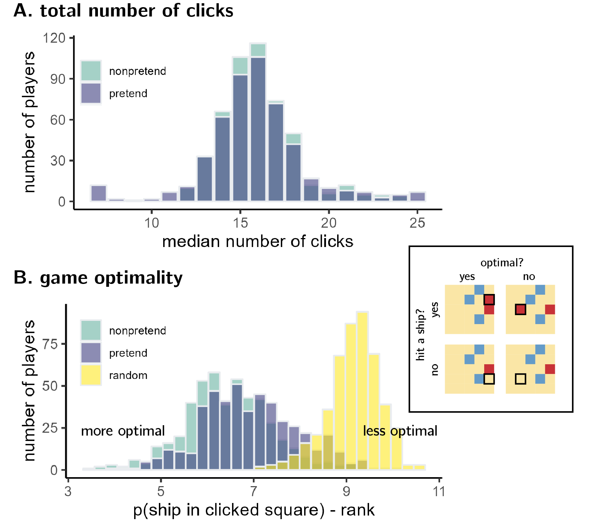
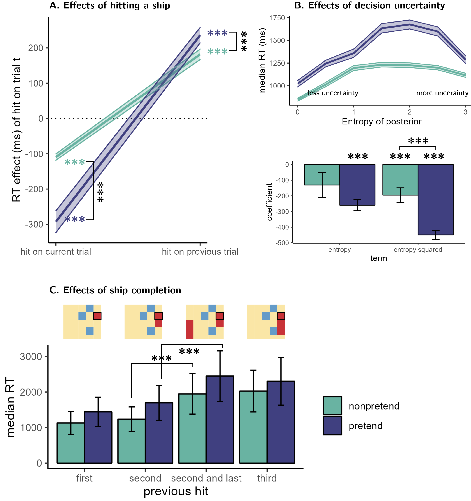

```{r global_options, include=FALSE}
knitr::opts_chunk$set(fig.width=3, fig.height=3, fig.crop = F, 
                      fig.pos = "tb", fig.path='figs/',
                      echo=F, warning=F, cache=F, 
                      message=F, sanitize = T)
```

```{r, libraries, echo=FALSE, warning=FALSE}

library(groundhog)

groundhog.library(c(
  'png',
  'grid',
  'ggplot2',
  'svglite',
  'xtable',
  'papaja',
  'tidyverse',
  'broom',
  'cowplot',
  'MESS', # for AUCs
  'lsr', # for effect sizes
  'pwr', # for power calculations
  'brms', # for mixed effects modeling
  'BayesFactor', # for Bayesian t test
  'jsonlite', # parsing data from sort_trial
  'caret' #for cross validation
), '2022-12-01')

```

# Introduction

The ability to intentionally deceive others relies on a capacity to reason about mental states [@frith2005theory]. This is evident in a similar developmental trajectory for the acquisition of theory of mind and the ability to deceive and detect deception [@wimmer1983beliefs; @shultz1981development; @sodian1991early], and a similar distribution of deception and theory of mind in the animal kingdom [e.g., @emery2004mentality; @hall2017cooperation]. This link makes conceptual sense: to deceive others, one needs to understand that others can have different knowledge and beliefs than one's own.

Moreover, deception often involves pretense behavior, which in turn relies on an ability to simulate and mimic one's own behavior under a hypothetical belief state. For example, in order to successfully deceive your friends into thinking that you were surprised by the birthday party they threw for you, it is not sufficient that you are able to reason about their mental states ("I know that they are planning a surprise party, but they don't know that I know that.") --- you also need to convincingly simulate and mimic your hypothetical behavior had you not known about the party ("Where would I look first? What would I say? How long would it take me to recover from the surprise?"). This reliance of pretense behavior on self-simulation makes it an ideal opportunity to examine metacognitive knowledge about one's own mental states, and the potential reliance of this knowledge on a self-simulation. By comparing non-pretend and pretend behavior, we can ask which aspects of their own cognitive processes subjects can and cannot effectively simulate, and which aspects are not well-represented in their mental models of their own cognition.

To this end, here we examine pretense in a game setting. Using an online version of the game Battleships, participants played a 'non-pretend' (normal) version of the game (trying to sink ships whose locations are unknown), as well as a 'pretend' version where they were given secret information about the location of hidden ships, but were instructed to behave as if they didn't have this information.

# Methods

A detailed pre-registration can be accessed at [osf.io/v9zsb](https://osf.io/v9zsb)

```{r load-data, warning=FALSE}
E2.df <- read.csv('../../experiments/Battleships2/data/batch1/jatos_results_batch1.csv',na.strings=c(""," ","NA")) %>%
  mutate(subj_id = paste(as.character(participant_number),substr(PROLIFIC_PID,1,4),sep='')) %>%
  mutate(subj_id = factor(subj_id)) %>%
  # the dash is breaking r
  mutate(test_part = ifelse(test_part=='non-pretend','nonpretend',test_part)) %>%
  mutate(genuine_first=genuine_first=='True');

E2.export <- read.csv('../../experiments/Battleships2/data/batch1/prolific_export_batch1.csv',na.strings=c(""," ","NA"));

E2.bonus <- read.csv('../../experiments/Battleships2/data/batch1/bonus.csv',na.strings=c(""," ","NA"))


```

## Participants

The research complied with all relevant ethical regulations and was approved by the Research Ethics Committee of Johns Hopkins University. 500 Participants were recruited via Prolific (prolific.co) and gave their informed consent prior to their participation. They were selected based on their acceptance rate (\>95%) and for being native English speakers. The entire experiment took approximately 20 minutes to complete. Participants' pay was equivalent to an hourly wage of 9.50 USD, in addition to a bonus payment (`r E2.bonus$bonus%>%min()` - `r E2.bonus$bonus%>%max()` USD, mean = `r E2.bonus$bonus%>%mean()%>%printnum()`).

## Procedure

Participants were first instructed that the experiment, based on the game Battleships, had three parts, and that they could accumulate 'points' that would later translate to a monetary bonus payment. They were then presented with a leaderboard of previous players, and given the rules of the game:

> "In the game Battleships, your task is to sink all ships located in a grid with as few clicks as possible. What makes the game difficult is that you can't see the ships; all you can see is a grid of squares, and you have to guess where the ships are. To sink a ship, you need to click on all of the squares it is located in. If you hit part of a ship, the square will turn red. If there is no ship in the square, it will turn blue."

We further explained that in this version of the game, ships can touch corners, but their sides can't touch. This explanation was accompanied by a visual presentation of legal and illegal ship configurations.

After completing a comprehension question and a practice round, participants completed one 'pretend' and one 'non-pretend' block, each comprising five full games and one half game (see below for details). The order of pretend and non-pretend blocks was counterbalanced between participants. The allocation of boards (spatial configurations of ships; see Fig. 1A) to conditions was randomized between participants such that exactly one board was played in both pretend and non-pretend conditions, and this common board was different for different participants. The order of boards within a block was fully randomized, with the exception that half-games were always played last.

### Non-pretend (normal) games

In non-pretend games (Fig. 1B), participants aimed to sink two 2-square patrol boats and one 3-square submarine with as few clicks as possible. An online counter of the number of clicks was displayed on the screen. After each game, feedback was given about the number of clicks and resulting number of points obtained.

### Pretend games

Participants in pretend games were given the same explanation of Battleships, and played a practice round. However, they were then given an additional twist:

> "This time your goal is different. In this round, we're going to tell you where the ships are, but **we want you to act like you don't know this information**. We've marked the ships' locations with a cross, so you'll know where they are the whole time; but your job is to play the game as if these hints aren't there. To see how good you are at this, we're going to compare your games to the games of people who actually had no hints, and see how similar they are. We will measure where and when you clicked; if your clicks look similar to people who played like normal (trying to reveal all ships with as few clicks as possible, but without any hints), you'll get bonus points. But if your games look different, you won't get these bonus points. Your number of clicks in this part will not affect your bonus. Only your ability to play like you had no hints."

We informed participants that both the location and timing of their cell clicks will be measured. After one practice round and one comprehension question, participants played five pretend games (Fig. 1C), followed by one pretend half-game. Each game was followed by a short message, reminding them that a game that looks similar to the games of participants who had no hints would be awarded 10 bonus points.

### Half games

In order to directly compare participants' pretend and non-pretend games for identical belief states (genuine or pretended ignorance about where the ships are hidden), participants completed one pretend and one non-pretend game given a partly finished board with the content of 7 cells already revealed (see Fig. 1D). We designed our half games to produce a strong expectation to find a ship in specific cells, but not in others. The assignment of half-completed boards to pretend and non-pretend conditions was randomized between participants.

### Judge trials

In the final part of the experiment, participants observed the games of previous players and tried to determine who had hints and who didn't. On each trial, two empty grids were presented side by side, with a smaller grid on top, displaying the hidden positions of ships on the grid (Fig. 1F). The two grids corresponded to the true games of two previous players who played a version of the top grid either as pretenders or as non-pretenders. Only games shorter than one minute were chosen for presentation in this part. For non-pretend games, only games from the group of participants that pretended in the second block (and played normally in the first block) were chosen for presentation in this part. Judge participants observed a real time replay of the two grids, showing not only where participants clicked, but also when. After making a decision, participants were informed whether they would receive the 10 bonus points, or alternatively, whether the pretender would receive them in the event the pretender managed to trick them.

<!-- 500 players played 12 games of the game Battleships in two conditions presented in two blocks. The order of conditions was randomized between players. the standard, *non-pretend* condition, players started the game not knowing where the ships were and tried to sink all ships with as few clicks as possible. In the *pretend* condition, ship locations were marked with a cross such that players knew where they were hidden, and their task was to play the game as if they did not have this information. The sixth game in each block was a 'half-game', where participants completed the game with the content of some cells revealed by a previous player. Lastly, in judge trials, players observed a replay of the games of two previous players – one pretender and one non-pretender, and their task was to identify which was which. We created nine different 5x5 boards, each containing two 2-square patrol boats and one 3-square submarine. The assignment of boards to conditions was randomized across participants such that exactly one board was presented in both pretend and non-pretend blocks.  (see Fig. 1). -->

A more detailed description of the study procedure is provided in the study pre-registration document (LINK HIDDEN). Readers are also invited to try a [demo of the experiment](https://jatos.mindprobe.eu/publix/NervzpM0Y0z).

```{r design, echo=FALSE, fig.cap="Experimental Design. See Methods for details.", out.width = '100%'}
knitr::include_graphics("../figures/Battleships_design.png")
```

# Results

```{r subject-comments, echo=FALSE}
E2.comments <- E2.df %>%
  filter(!is.na(responses) & is.na(test_part)) %>%
  dplyr::select(subj_id,responses) %>%
  mutate(comments = map(responses, ~fromJSON(.) %>%as.data.frame()))%>%
  unnest(comments)%>%
  dplyr::select(subj_id,worker_comments)%>%
  filter(!is.na(worker_comments) & worker_comments!="") %>%
  mutate(worker_comments = gsub("[\r\n]", "",worker_comments))

E2.debrief <- E2.df %>%
  filter(!is.na(responses) & is.na(test_part)) %>%
  dplyr::select(subj_id,responses) %>%
  mutate(comments = map(responses, ~fromJSON(.) %>%as.data.frame()))%>%
  unnest(comments)%>%
  dplyr::select(subj_id,debrief)%>%
  filter(!is.na(debrief) & debrief != "")%>%
  mutate(debrief = gsub("[\r\n]", "",debrief))

```

We designed our analyses to explore subjects' capacity for self-simulation under a counterfactual knowledge state, and the limits of this capacity. We focused on where subjects clicked and when, and asked whether this differed between pretend and non-pretend games. All analyses were pre-registered unless otherwise specified. In our pre-registration document, we committed to separately analyzing participants according to whether they pretended before or after completing a non-pretend block. Due to space limitations, and since the results of the two groups mostly agreed, we report here the pooled results from both groups of participants, and mention whenever we found different results depending on block order. When directly comparing pretend and non-pretend blocks, we perform a between-subjects comparison using data from the first block only, i.e., pretend games from participants who pretended in the first block and non-pretend games from participants who played normally in the first block. We do so to ensure that any successful pretending is not due to memory of one's own behavior in a previous block, and that non-pretend games are not biased by experience with the pretend block.

```{r num_clicks, echo=FALSE, cache=TRUE}

E2.click_df <- E2.df %>%
  dplyr::select(subj_id, 
         test_part, 
         grid_number, 
         num_clicks,
         click_log,
         genuine_first) %>%
  mutate(click_log = gsub("\'","\"", click_log)) %>%
  filter(test_part=='pretend' | test_part=='nonpretend');

E2.median_clicks <- E2.click_df %>%
  group_by(subj_id,test_part, genuine_first) %>%
  summarise(num_clicks=median(num_clicks)) %>%
  spread(test_part,num_clicks);

E2.lucky_pretenders <- E2.click_df%>%filter(num_clicks==7)%>%pull(subj_id)%>%unique();

E2.median_clicks_filtered <- E2.click_df %>%
  filter(!(subj_id %in% E2.lucky_pretenders))%>%
  group_by(subj_id,test_part, genuine_first) %>%
  summarise(num_clicks=median(num_clicks)) %>%
  spread(test_part,num_clicks);

p<- E2.click_df %>%
    group_by(subj_id,test_part, genuine_first) %>%
    summarise(num_clicks=median(num_clicks)) %>%
    mutate(genuine_first = ifelse(genuine_first, 'non-pretend then pretend', 'pretend then non-pretend'))%>%
    ggplot(aes(x=num_clicks,fill=test_part))+
    geom_bar( color="#e9ecef", alpha=0.6, position = 'identity') +
    scale_fill_manual(values=c("#69b3a2", "#404080")) +
    labs(x='median number of clicks', y='number of players')+
    theme(legend.position=c(0.10,0.85)) +
    theme_classic()
    # geom_vline(xintercept= median_simulated)+
    # facet_wrap(~genuine_first, nrow=2);

ggsave('../docs/figures/E2_num_clicks.png',p,width=5,height=2, dpi=300)

```

```{r useful_functions, echo=FALSE, cache=TRUE}

all_possible_boards <- read.csv('../../analysis/flat_boards.csv',header=FALSE);

create_board_states <- function(flat_positions,hit) {
  
  board_state = rep(NA,25)
  board_states = c();
  for (p in seq_along(flat_positions)) {
    board_states = c(board_states, paste(board_state,collapse=','));
    board_state[flat_positions[p]]=ifelse(hit[p],1,0);
  }
  
  return(board_states)
};

get_likelihood <- function(board_state) {
  
  board_state = scan(text= board_state, what = numeric(), sep="," , quiet = TRUE);
  
  revealed_positions <- which(!is.na(board_state));
  
  boards_to_remove = c();
  
  for (position in revealed_positions) {
    boards_to_remove = union(boards_to_remove, which(all_possible_boards[,position] != board_state[position]))
  }
  
  survived_boards = setdiff(1:nrow(all_possible_boards), boards_to_remove);
  likelihood = all_possible_boards[survived_boards,]%>%colMeans();
  likelihood[revealed_positions]=NA;
  
  return(paste(likelihood,collapse=','))
  
};

get_posterior <- function(likelihood) {
    likelihood = scan(text= likelihood, what = numeric(), sep="," , quiet = TRUE);
    posterior = likelihood/sum(likelihood,na.rm=TRUE); # assuming a uniform prior
    return(paste(posterior,collapse=','))
}


get_p_click <- function(posterior, flat_position) {
  posterior <- scan(text= posterior, what = numeric(), sep="," , quiet = TRUE);
  return(posterior[flat_position])
}

get_p_click_rank <- function(posterior, flat_position) {
  posterior <- scan(text= posterior, what = numeric(), sep="," , quiet = TRUE);
  rank_posterior = rank(-posterior)
  return(rank_posterior[flat_position])
}

get_posterior_entropy <- function(posterior) {
  posterior <- scan(text= posterior, what = numeric(), sep="," , quiet = TRUE);
  posterior[which(posterior==0)]=NA; #to avoid infinity*0
  entropy <- -sum(unlist(posterior)*(unlist(log(posterior))),na.rm=TRUE);
  return(entropy);
}

```

```{r simulate_nclicks, echo=FALSE, cache=TRUE}

## simulate number of clicks for random play

num_clicks_sim = c();
nsim = 10000
boards = rep(NaN,25)

for (i in 1:nsim) {
  board = rep(c(0),25);
  while (sum(board)<7) {
    board[sample(1:25,1)]=1
  }
  nc = which(board==1)%>%tail(n=1);
  num_clicks_sim = c(num_clicks_sim, nc);
  if (nc<25) {
    board[(nc+1):length(board)]=NaN;
  }
  boards = rbind(boards,board)
}

simulated_hits <- data.frame(click_number=1:25,mean_hit=colMeans(boards,na.rm=T))


## OPTIMAL PLAYER


simulate_optimal_game <- function(ship_positions) {
  #initialize
  board_state <- rep(NA,25); 
  nhits <- 0;
  nclicks <- 0;
  nships <- sum(ship_positions);
  
  while (nships>nhits) {
    
    posterior <- get_likelihood(paste(board_state,collapse=',')) %>%
      get_posterior() %>%
      scan(text = ., what= numeric(), sep="," , quiet = TRUE);
    
    best_shot = which.max(posterior);
    
    #click on best shot
    nclicks = nclicks+1;
    result = ship_positions[best_shot]
    if (result==1) {
      nhits = nhits+1;
    }
    board_state[best_shot]=result;

  }
  
  return(nclicks)
  
}

num_clicks_optimal_sim = c();
nsim = 100;
nboards = all_possible_boards%>%nrow();

for (i in 1:nsim) {
  cur_board = all_possible_boards[sample(1:nboards,1),];
  num_clicks_optimal_sim = c(num_clicks_optimal_sim,simulate_optimal_game(cur_board));
}


  
```

## Total number of clicks

To sink all ships, players had to click on at least 7 and at most 25 squares. A simulated player that clicks randomly had a median total click number of `r num_clicks_sim%>%median()`, and a near-optimal greedy player that consistently selected the square with the highest objective probability of containing a ship had a median total click number of `r num_clicks_optimal_sim%>%median()`. Among our players, the median number of clicks was `r E2.median_clicks%>%pull(nonpretend)%>%median()` in both pretend and non-pretend games (see Fig. 2A).

We observed no significant difference in the number of clicks between the two conditions (`r t.test(E2.median_clicks%>%filter(genuine_first)%>%pull(nonpretend),E2.median_clicks%>%filter(!genuine_first)%>%pull(pretend))%>%apa_print()%>%'$'(statistic)`). However, a significant interaction with block order suggested that participants made fewer clicks in the second block compared to the first, regardless of which block was the pretend block (`r E2.median_clicks%>%gather('condition','nclicks',c('nonpretend','pretend'))%>%aov(nclicks ~ genuine_first * condition,data=.)%>%apa_print()%>%'$'(statistic)%>%'$'(genuine_first_condition)`).

In `r E2.click_df%>%filter(num_clicks==7)%>%nrow()` pretend games from `r E2.lucky_pretenders%>%length()` players, games were completed after 7 clicks only, without ever missing a ship. This never happened in non-pretend games. We assumed that these participants did not follow task instructions, and excluded them from all following analyses.

## Game optimality

Pretend games were similar to non pretend games in the total number of clicks --- but were they also similar in *where* participants clicked? More specifically, did cell selections in pretend games make sense given the limited information those participants pretended to have? To ask this, we approximated optimal behavior by calculating the probability that a ship is hidden in each cell given available information, $p(ship(x_{i}))$, and the posterior probability that one should click on a square, assuming a uniform prior over cells $P(x_{i})=\frac{p(Ship(x_i))}{\sum_{j=1}^{k}p(Ship(x_j))}$. Critically, in modeling pretend games we did not treat hints as part of this available information for extracting $p(ship(x_{i}))$, because an optimal player should ignore hints in choosing where to click next. Given this posterior map, a rational player should choose cells where $P(x_{i})$ is high [this behavior is not strictly optimal, but approximates optimal behavior in most cases; @audinot2014optimal, Section 3.3]. To quantify optimality, before each cell selection we computed the posterior probability map for all 'unknown' cells. Then, we ranked cells from high to low according to their posterior probability and recorded the rank of the chosen cell: a lower rank indicating more optimal behavior.

```{r parse-click-log, echo-FALSE, cache=TRUE}

E2.click_log <- readRDS('../../experiments/Battleships2/data/batch1/click_log.Rda');

# E2.click_log <- data.frame(matrix(ncol=10,nrow=0, 
#                                dimnames=list(NULL, 
#                                              c("subj_id",
#                                               "test_part", 
#                                               "grid_number", 
#                                               "num_clicks",
#                                               "i",
#                                               "j",
#                                               "hit",
#                                               "t",
#                                               "click_number",
#                                               "genuine_first"))))
# 
# 
# for (row in 1:nrow(E2.click_df)) {
#   
#     subject_click_log <- data.frame(fromJSON(E2.click_df[row, ]$click_log)) %>%
#     mutate(
#       click_number = 1:n(),
#       subj_id = E2.click_df[row, ]$subj_id,
#       test_part = E2.click_df[row, ]$test_part,
#       grid_number = E2.click_df[row, ]$grid_number,
#       num_clicks = E2.click_df[row, ]$num_clicks,
#       genuine_first = E2.click_df[row, ]$genuine_first
#     )
#     
#     E2.click_log <- rbind(E2.click_log, subject_click_log);
# }
#     
# 
# E2.click_log <- E2.click_log %>%
#   relocate(subj_id, .before = i) %>%
#   relocate(genuine_first, .before = i) %>% 
#   relocate(test_part, .before=i) %>% 
#   relocate(grid_number, .before=i) %>% 
#   relocate(click_number, .before=i) %>%
#   group_by(subj_id,test_part,grid_number) %>%
#   mutate(RT=t-lag(t,default=0)) %>%
#   filter(!(subj_id %in% E2.lucky_pretenders))%>%
#  mutate(hit_bin = hit !=0,
#         lag3 = lag(hit,3)!=0,
#         lag2 = lag(hit,2)!=0,
#         lag1 = lag(hit,1)!=0,
#         lead1 = lead(hit,1)!=0,
#         lead2 = lead(hit,2)!=0,
#         lead3 = lead(hit,3)!=0)

```

```{r simualte_data, echo=FALSE, cache=TRUE}


simulate_optimal_game <- function(ship_positions) {
  #initialize
  cur_board_state <- rep(NA,25); 
  nhits <- 0;
  nclicks <- 0;
  nships <- sum(ship_positions);
  board_state = c()
  flat_position = c();
  click_number = c();
  hit_bin = c();
  
  while (nships>nhits) {
    
    board_state = c(board_state,paste(cur_board_state,collapse=','));
    
    posterior <- get_likelihood(paste(cur_board_state,collapse=',')) %>%
      get_posterior() %>%
      scan(text = ., what= numeric(), sep="," , quiet = TRUE);
    
    best_shot = which.max(posterior);
    flat_position = c(flat_position,best_shot);
    
    #click on best shot
    nclicks = nclicks+1;
    click_number = c(click_number,nclicks)
    
    result = ship_positions[best_shot]
    
    hit_bin = c(hit_bin,ifelse(result==1,1,0));
    
    if (result==1) {
      nhits = nhits+1;
    }
    cur_board_state[best_shot]=result;
    

  }
  return(data.frame(board_state,flat_position,hit_bin,click_number))
  
}

simulate_random_game <- function(ship_positions) {
  #initialize
  cur_board_state <- rep(NA,25); 
  nhits <- 0;
  nclicks <- 0;
  nships <- sum(ship_positions);
  board_state = c()
  flat_position = c();
  click_number = c();
  hit_bin = c();
  
  while (nships>nhits) {
    
    board_state = c(board_state,paste(cur_board_state,collapse=','));
    
    random_guess = which(is.na(cur_board_state))%>%sample(1);
    flat_position = c(flat_position,random_guess);
    
    #click on best shot
    nclicks = nclicks+1;
    click_number = c(click_number,nclicks)
    
    result = ship_positions[random_guess]
    
    hit_bin = c(hit_bin,ifelse(result==1,1,0));
    
    if (result==1) {
      nhits = nhits+1;
    }
    cur_board_state[random_guess]=result;
    

  }
  return(data.frame(board_state,flat_position,hit_bin,click_number))
  
}


nsim = 100;
nboards = all_possible_boards%>%nrow();

for (i in 1:nsim) {
  cur_board = all_possible_boards[sample(1:nboards,1),];
  if (i==1) {
    simulated_optimal = simulate_optimal_game(cur_board)%>%mutate(game=i)
  } else {
    simulated_optimal = bind_rows(simulated_optimal, simulate_optimal_game(cur_board)%>%mutate(game=i))
  }
}

for (i in 1:nsim) {
  cur_board = all_possible_boards[sample(1:nboards,1),];
  if (i==1) {
    simulated_random = simulate_random_game(cur_board)%>%mutate(game=i)
  } else {
    simulated_random = bind_rows(simulated_random, simulate_random_game(cur_board)%>%mutate(game=i))
  }
}


```

```{r p_click, echo = FALSE, cache=TRUE}

# E2.click_log_with_boards <-E2.click_log %>%
#   dplyr::select(subj_id,genuine_first,test_part,grid_number,click_number,i,j,RT,hit_bin) %>%
#   mutate(flat_position = 1+i*5+j) %>%
#   group_by(subj_id,genuine_first,test_part,grid_number) %>%
#   arrange(click_number) %>%
#   summarise(click_number = click_number,
#             board_state=create_board_states(flat_position,hit_bin),
#             flat_position=flat_position,
#             i=i,
#             j=j,
#             RT=RT,
#             hit_bin=hit_bin) %>%
#   rowwise()%>%
#   mutate(likelihood = get_likelihood(board_state),
#          posterior = get_posterior(likelihood),
#          p_click = get_p_click(posterior,flat_position),
#          entropy = get_posterior_entropy(posterior),
#          p_click_rank = get_p_click_rank(posterior,flat_position));

E2.click_log_with_boards <- readRDS('../../experiments/Battleships2/data/batch1/click_log_with_boards.Rda')

get_random_flat_position <- function(board_state) {
  
  board_state = scan(text= board_state, what = numeric(), sep="," , quiet = TRUE);
  return(which(is.na(board_state))%>%sample(1))
  
}

get_optimal_flat_position <- function(posterior) {
  
  posterior = scan(text= posterior, what = numeric(), sep="," , quiet = TRUE);
  return(which.max(posterior))
  
}

E2.click_log_with_boards_optimal <- E2.click_log_with_boards %>%
  mutate(flat_position = get_optimal_flat_position(posterior),
         p_click = get_p_click(posterior,flat_position),
         p_click_rank = get_p_click_rank(posterior,flat_position),
         test_part = 'optimal')

E2.click_log_with_boards_random <- E2.click_log_with_boards %>%
  mutate(flat_position = get_random_flat_position(board_state),
         p_click = get_p_click(posterior,flat_position),
         p_click_rank = get_p_click_rank(posterior,flat_position),
         test_part = 'random')
  


E2.mean_P_click_rank <- E2.click_log_with_boards %>%
  rbind(E2.click_log_with_boards_optimal) %>%
  rbind(E2.click_log_with_boards_random) %>%
  group_by(subj_id,test_part, genuine_first) %>%
  summarise(p_click_rank=mean(p_click_rank));

E2.mean_P_click_rank_misses_only <- E2.click_log_with_boards %>%
  rbind(E2.click_log_with_boards_optimal) %>%
  rbind(E2.click_log_with_boards_random) %>%
  rowwise() %>%
  filter(!hit_bin) %>%
  group_by(subj_id,test_part, genuine_first) %>%
  summarise(p_click_rank=mean(p_click_rank))


p<- E2.mean_P_click_rank %>%
    filter(test_part != 'optimal') %>%
    mutate(genuine_first = ifelse(genuine_first, 'non-pretend then pretend', 'pretend then non-pretend'))%>%
    ggplot(aes(x=p_click_rank,fill=test_part))+
    geom_histogram( color="#e9ecef", alpha=0.6, position = 'identity') +
    scale_fill_manual(values=c("#69b3a2", "#404080", "#FDE725")) +
    labs(x='p(ship in clicked square) - rank', y='number of players')+
    theme(legend.position=c(0.10,0.85)) +
    # facet_wrap(~genuine_first, nrow=2)+
    # scale_x_reverse() +
    theme_classic();

ggsave('../figures/E2_pclick_rank.pdf',p)
ggsave('../figures/E2_pclick_rank.png',p,width=5,height=2,dpi=300)

p<- E2.mean_P_click_rank_misses_only %>%
    filter(test_part != 'optimal') %>%
    mutate(genuine_first = ifelse(genuine_first, 'non-pretend then pretend', 'pretend then non-pretend'))%>%
    ggplot(aes(x=p_click_rank,fill=test_part))+
    geom_histogram( color="#e9ecef", alpha=0.6, position = 'identity') +
    scale_fill_manual(values=c("#69b3a2", "#404080", "#FDE725")) +
    labs(x='p(ship in clicked square) - rank', y='number of players')+
    scale_x_continuous(limits=c(0,15))+
    theme(legend.position=c(0.10,0.85)) +
    # facet_wrap(~genuine_first, nrow=2)+
    # scale_x_reverse() +
    theme_classic();

ggsave('../figures/E2_pclick_rank_misses_only.pdf',p)
ggsave('../figures/E2_pclick_rank_misses_only.png',p,width=5,height=2,dpi=300)

E2.num_irrational_clicks <- E2.click_log_with_boards %>%
  group_by(subj_id,test_part, genuine_first) %>%
  summarise(nic=sum(p_click==0)/5);

p<- E2.num_irrational_clicks %>%
    mutate(genuine_first = ifelse(genuine_first, 'non-pretend then pretend', 'pretend then non-pretend'))%>%
    ggplot(aes(x=nic,fill=test_part))+
    geom_histogram( color="#e9ecef", alpha=0.6, position = 'identity') +
    scale_fill_manual(values=c("#69b3a2", "#404080")) +
    labs(x='mean number of irrational clicks per game', y='number of players')+
    theme(legend.position=c(0.10,0.85)) +
    facet_wrap(~genuine_first, nrow=2)+
    theme_classic();

ggsave('figures/../E2_num_irrational_clicks.png',p,width=5,height=3,dpi=300)


 E2.RT_p_click_cor <- E2.click_log_with_boards %>%
     filter(click_number<9 & click_number>1) %>%
     group_by(subj_id,test_part, genuine_first) %>%
     summarise(r=cor(RT,p_click,method='spearman'));
 
 E2.RT_entropy_cor <- E2.click_log_with_boards %>%
     filter(click_number<9 & click_number>1) %>%
     group_by(subj_id,test_part, genuine_first) %>%
     summarise(r=cor(entropy,p_click,method='spearman'))


```

The mean posterior rank of non-pretend cell selections was `r E2.mean_P_click_rank%>%filter(test_part=='nonpretend')%>%pull(p_click_rank)%>%mean()%>%printnum()` and significantly lower (more optimal) than that of a simulated random agent (see Fig. 2B; `r E2.mean_P_click_rank%>%filter(test_part=='random')%>%pull(p_click_rank)%>%mean()%>%printnum()`, `r E2.mean_P_click_rank%>%spread(test_part,p_click_rank)%>%mutate(diff=nonpretend-random)%>%pull(diff)%>%t.test()%>%apa_print()%>%'$'(statistic)`). Pretend games were significantly less optimal than non-pretend games (`r E2.mean_P_click_rank%>%filter(test_part=='pretend')%>%pull(p_click_rank)%>%mean()%>%printnum()`; `r apa_print(t.test(E2.mean_P_click_rank%>%filter(genuine_first&test_part=='nonpretend')%>%pull(p_click_rank), E2.mean_P_click_rank%>%filter(!genuine_first&test_part=='pretend')%>%pull(p_click_rank)))$statistic`), but still more optimal than those of a random agent (`r E2.mean_P_click_rank%>%spread(test_part,p_click_rank)%>%mutate(diff=pretend-random)%>%pull(diff)%>%t.test()%>%apa_print()%>%'$'(statistic)`). Critically, the same pattern was observed when restricting analysis to cell selections that resulted in a miss (non-pretend - pretend: `r apa_print(t.test(E2.mean_P_click_rank_misses_only%>%filter(genuine_first&test_part=='nonpretend')%>%pull(p_click_rank), E2.mean_P_click_rank_misses_only%>%filter(!genuine_first&test_part=='pretend')%>%pull(p_click_rank)))$statistic`; pretend - random: `r E2.mean_P_click_rank_misses_only%>%spread(test_part,p_click_rank)%>%mutate(diff=pretend-random)%>%pull(diff)%>%t.test()%>%apa_print()%>%'$'(statistic)`). In other words, the optimality of pretend games relative to random cell selection was not merely due to the fact that pretenders clicked on ships more than expected by chance. Even when missing a ship, their cell selections made sense given the limited information they pretended to have.

```{r numclick_optimality, echo=FALSE, fig.cap="Experimental Design", out.width = '100%', fig.cap = "A: The total number of clicks in pretend and non-pretend games was highly similar. B: Non-pretend games were significantly more optimal than pretend games, but both were more optimal than what is expected by random chance. Box: An illustration of the difference between success and optimality. A given click (highlighted with a black border) can reveal a ship (upper row) or not (lower row) regardless of whether the click makes sense given available information (left column) or not (right column). "}

```

## Response time analysis

```{r total_time, echo=FALSE}

E2.total_time_df <- E2.click_log %>%
 filter(click_number==num_clicks)%>%
  mutate(t=t/1000)

E2.median_time <- E2.total_time_df %>%
  group_by(subj_id,test_part, genuine_first) %>%
  summarise(t=median(t)) %>%
  spread(test_part,t);

# anova
E2.time_anva <- aov(t ~ genuine_first * condition, 
                         data = E2.median_time %>%
                           gather('condition','t',nonpretend,pretend) %>%
                           mutate(condition=as.factor(condition)));

E2.median_time_per_click <- E2.click_log %>%
  group_by(subj_id,test_part, genuine_first) %>%
  summarise(RT=median(RT)) %>%
  spread(test_part,RT) %>%
  mutate(diff=pretend-nonpretend);

# anova
E2.click_time_anva <- aov(RT ~ genuine_first * condition, 
                         data = E2.median_time_per_click %>%
                           gather('condition','RT',nonpretend,pretend) %>%
                           mutate(condition=as.factor(condition)))
```

In general, participants gave slower responses when pretending compared to when playing normally. Despite the similar number of clicks per game, the median game duration was `r E2.total_time_df%>%filter(test_part=='nonpretend')%>%pull(t)%>%median()%>%printnum()` seconds in the non-pretend condition and `r E2.total_time_df%>%filter(test_part=='pretend')%>%pull(t)%>%median()%>%printnum()` seconds in the pretend condition, which was significantly longer (`r t.test(E2.median_time$pretend-E2.median_time$nonpretend)%>%apa_print()%>%'$'(statistic)`). This difference showed a significant interaction with the order of conditions, such that completing games in the first block took longer (`r apa_print(E2.time_anva%>%summary())$full_result$genuine_first_condition`).

In our instructions to pretenders, we asked them to pretend not to know where the ships were, not only in *where* they chose to click, but also in *when* they clicked. In the following set of analyses, we identified patterns in click latency in non-pretend games, and asked whether the same patterns are also observed in pretend games. We focused on the effects of hitting versus missing a ship, decision uncertainty, and ship completion.

```{r RT_by_accuracy}

N_perm <- 1000;
bootstrap_error <- function(x, N_perm) {
  N <- length(x)
  medians = c();
  for (i in 1:N_perm) {
    medians = c(medians,sample(x,replace=TRUE,size=N)%>%median())
  };
  return(sd(medians))
}


E2.RT_by_lag3 <- E2.click_log %>%
  filter(click_number>3) %>%
  group_by(subj_id,test_part,lag3,genuine_first)%>%
  summarise(RT=median(RT))  %>%
  spread(lag3,RT,sep='_') %>%
  mutate(lag3_diff = lag3_TRUE-lag3_FALSE);

E2.RT_by_lag2 <- E2.click_log %>%
  filter(click_number>2) %>%
  group_by(subj_id,test_part,lag2,genuine_first)%>%
  summarise(RT=median(RT))  %>%
  spread(lag2,RT,sep='_') %>%
  mutate(lag2_diff = lag2_TRUE-lag2_FALSE);

E2.RT_by_lag1 <- E2.click_log %>%
  filter(click_number>1) %>%
  group_by(subj_id,test_part,lag1,genuine_first)%>%
  summarise(RT=median(RT))  %>%
  spread(lag1,RT,sep='_') %>%
  mutate(lag1_diff = lag1_TRUE-lag1_FALSE)

E2.RT_by_hit <- E2.click_log %>%
  filter(click_number>0) %>%
  group_by(subj_id,test_part,hit_bin,genuine_first)%>%
  summarise(RT=median(RT))  %>%
  spread(hit_bin,RT,sep='_') %>%
  mutate(hit_diff = hit_bin_TRUE-hit_bin_FALSE)


E2.RT_by_lead1 <- E2.click_log %>%
  filter(click_number<num_clicks) %>%
  group_by(subj_id,test_part,lead1,genuine_first)%>%
  summarise(RT=median(RT))  %>%
  spread(lead1,RT,sep='_') %>%
  mutate(lead1_diff = lead1_TRUE-lead1_FALSE);

E2.RT_by_lead2 <- E2.click_log %>%
  filter(click_number<num_clicks-1) %>%
  group_by(subj_id,test_part,lead2,genuine_first)%>%
  summarise(RT=median(RT))  %>%
  spread(lead2,RT,sep='_') %>%
  mutate(lead2_diff = lead2_TRUE-lead2_FALSE)

E2.RT_by_lead3 <- E2.click_log %>%
  filter(click_number<num_clicks-2) %>%
  group_by(subj_id,test_part,lead3,genuine_first)%>%
  summarise(RT=median(RT))  %>%
  spread(lead3,RT,sep='_') %>%
  mutate(lead3_diff = lead3_TRUE-lead3_FALSE)

E2.RT_by_hit_lags <- E2.RT_by_lag3 %>%
  merge(E2.RT_by_lag2) %>%
  merge(E2.RT_by_lag1) %>%
  merge(E2.RT_by_hit) %>%
  merge(E2.RT_by_lead1) %>%
  merge(E2.RT_by_lead2) %>%
  merge(E2.RT_by_lead3);

E2.RT_by_hit_lags_long <- E2.RT_by_hit_lags %>%
  gather("position","difference",c("lag3_diff","lag2_diff", "lag1_diff", "hit_diff", "lead1_diff", "lead2_diff", "lead3_diff"))%>%
  mutate(position = ifelse(position=="lag3_diff", 3,
                           ifelse(position=="lag2_diff",2,
                                  ifelse(position=="lag1_diff",1,
                                         ifelse(position=="hit_diff",0,
                                                ifelse(position=="lead1_diff",-1,
                                                       ifelse(position=="lead2_diff",-2,-3
                                                              ))))))) %>%
  dplyr::select(subj_id,test_part,genuine_first,position,difference);

p<- E2.RT_by_hit_lags_long %>% 
  filter(position<2 & position > -1)%>%
  group_by(test_part,position) %>%
  summarise(median_difference=median(difference),
            sem_difference=bootstrap_error(difference,N_perm)) %>%
  ggplot(aes(x=position,color=test_part,fill=test_part,y=median_difference)) +
  scale_fill_manual(values=c("#69b3a2", "#404080")) +
  scale_color_manual(values=c("#69b3a2", "#404080")) +
  scale_x_continuous(breaks=0:1,labels=c('hit on current trial', 'hit on previous trial'))+
  geom_abline(slope=0,intercept=0,linetype=3)+
  geom_path(size=1)+
  geom_ribbon(aes(ymin=median_difference-sem_difference,ymax=median_difference+sem_difference),alpha=0.3,show.legend=F)+
  labs(fill=' ',x='', y='RT effect (ms) of hit on trial t')+
  theme_classic()

ggsave('../figures/E2_RT_by_lag_three_only_collapse.pdf',p,width=7)
ggsave('../figures/E2_RT_by_lag_three_only_collapse.png',p,width=4, height=3.5, dpi=300)


```

### Effects of hitting versus missing a ship

In non-pretend games, players were faster by `r E2.RT_by_hit_lags%>%filter(test_part=='nonpretend')%>%pull(hit_diff)%>%median%>%round()%>%abs()` ms (`r round(E2.RT_by_hit%>%filter(test_part=='nonpretend')%>%mutate(relative=hit_diff/hit_bin_TRUE)%>%pull(relative)%>%mean()%>%abs()*100)`%) when hitting compared to missing a ship (see Fig. 3A; `r E2.RT_by_hit_lags%>%filter(test_part=='nonpretend')%>%pull(hit_diff)%>%t.test()%>%apa_print()%>%'$'(statistic)`). The same effect was observed in pretend games: players were faster by `r E2.RT_by_hit_lags%>%filter(test_part=='pretend')%>%pull(hit_diff)%>%median%>%round()%>%abs()` ms (`r round(E2.RT_by_hit%>%filter(test_part=='pretend')%>%mutate(relative=hit_diff/hit_bin_TRUE)%>%pull(relative)%>%mean()%>%abs()*100)`%) in hits compared to misses (`r E2.RT_by_hit_lags%>%filter(test_part=='pretend' & !genuine_first)%>%pull(hit_diff)%>%t.test()%>%apa_print()%>%'$'(statistic)`; pretend first: `r E2.RT_by_hit_lags%>%filter(test_part=='pretend')%>%pull(hit_diff)%>%t.test()%>%apa_print()%>%'$'(statistic)`). However, this difference between hits and misses was significantly more pronounced in pretend games (`r apa_print(t.test(E2.RT_by_hit_lags%>%filter(test_part=='pretend' & !genuine_first)%>%pull(hit_diff), E2.RT_by_hit_lags%>%filter(test_part=='nonpretend' & genuine_first)%>%pull(hit_diff)))$statistic`).

The opposite effect was observed for a hit on the previous click: players were slower by `r E2.RT_by_lag1%>%filter(test_part=='nonpretend')%>%pull(lag1_diff)%>%median()%>%round()` ms (`r round(E2.RT_by_lag1%>%filter(test_part=='nonpretend')%>%mutate(relative=lag1_diff/lag1_TRUE)%>%pull(relative)%>%mean()%>%abs()*100)`%) after hitting a ship (`r E2.RT_by_lag1%>%filter(test_part=='nonpretend')%>%pull(lag1_diff)%>%t.test()%>%apa_print()%>%'$'(statistic)`). This effect was also observed in pretend games, where players were slower by `r E2.RT_by_lag1%>%filter(test_part=='pretend')%>%pull(lag1_diff)%>%median()%>%round()` ms (`r round(E2.RT_by_lag1%>%filter(test_part=='pretend')%>%mutate(relative=lag1_diff/lag1_TRUE)%>%pull(relative)%>%mean()%>%abs()*100)`%) following a hit on the previous click (`r E2.RT_by_lag1%>%filter(test_part=='pretend')%>%pull(lag1_diff)%>%t.test()%>%apa_print()%>%'$'(statistic)`). Again, the absolute effect in ms was exaggerated in the pretend condition (`r t.test(E2.RT_by_lag1%>%filter(!genuine_first & test_part=='pretend')%>%pull(lag1_diff),E2.RT_by_lag1%>%filter(genuine_first & test_part=='nonpretend')%>%pull(lag1_diff))%>%apa_print()%>%'$'(statistic)`).

### Effects of decision uncertainty

When playing Battleships, it is sometimes clear what the next cell selection should be, and sometimes more difficult to decide where to click next. To capture this notion of decision uncertainty, we calculated the entropy of the posterior distribution over cell selections $H(P)=-\sum_{i=1}^{k}P(x_i) \log P(x_{i})$, where $P(x_{i})=\frac{p(Ship(x_i))}{\sum_{j=1}^{k}p(Ship(x_j))}$, and asked how this measure relates to decision latency, or the time taken to click on the next cell. $H(P)$ is high when players need to decide between multiple cells with a similar probability of hiding a ship, and low when there are only a few candidates with a high probability of hiding a ship. For every player and condition separately, we fitted a multiple linear regression to predict decision latency based on $H(P)$ and $H(P)^2$. The resulting coefficients were then subjected to a group-level inference. The first cell selection of each game was excluded from this analysis, because entropy was constant for the first click.

```{r entropy-RT, echo=FALSE, cache=TRUE}

E2.RT_by_entropy <- E2.click_log_with_boards %>%
  filter(click_number>1) %>%
  mutate(entropy_bin=round(entropy*2)/2) %>%
  group_by(subj_id,test_part,click_number) %>%
  mutate(corrected_RT = RT-mean(RT)) %>%
  group_by(test_part,subj_id,entropy_bin) %>%
  summarise(RT=median(RT),
            corrected_RT = median(corrected_RT)) %>%
  group_by(test_part,entropy_bin) %>%
  summarise(median_RT=median(RT),
            sem_RT=bootstrap_error(RT,N_perm),
            median_corrected_RT=median(corrected_RT),
            sem_corrected_RT=bootstrap_error(corrected_RT,N_perm))


p <- E2.RT_by_entropy %>%
  ggplot(aes(x=entropy_bin,color=test_part,fill=test_part,y=median_RT)) +
  scale_fill_manual(values=c("#69b3a2", "#404080")) +
  scale_color_manual(values=c("#69b3a2", "#404080")) +
  geom_path(size=1)+
  geom_ribbon(aes(ymin=median_RT-sem_RT,ymax=median_RT+sem_RT),alpha=0.3,show.legend=F)+
  labs(fill=' ',x='Entropy of posterior', y='median RT (ms)')+
  theme_classic()

ggsave('../figures/E2_RT_by_entropy_no_split.png',p,width=5,height=2,dpi=300)
# ggsave('../figures/E2_RT_by_entropy_no_split.svg',p,width=5,height=2,dpi=300)

p <- E2.RT_by_entropy %>%
  ggplot(aes(x=entropy_bin,color=test_part,fill=test_part,y=median_corrected_RT)) +
  scale_fill_manual(values=c("#69b3a2", "#404080")) +
  scale_color_manual(values=c("#69b3a2", "#404080")) +
  geom_path(size=1)+
  geom_ribbon(aes(ymin=median_corrected_RT-sem_corrected_RT,ymax=median_corrected_RT+sem_corrected_RT),alpha=0.3,show.legend=F)+
  labs(fill=' ',x='Entropy of posterior', y='median residual RT (ms)')+
  theme_classic()

ggsave('../figures/E2_corrected_RT_by_entropy_no_split.png',p,width=5,height=2,dpi=300)


E2.RT_by_entropy_coefs <- E2.click_log_with_boards %>%
  filter(click_number>1) %>%
  group_by(genuine_first,subj_id,test_part,grid_number) %>%
  mutate(entropy_centered = entropy-mean(entropy),
         entropy_squared = entropy_centered^2) %>%
  select(genuine_first,subj_id,test_part,grid_number,click_number,entropy_centered,entropy_squared,RT) %>%
  group_by(genuine_first,subj_id,test_part,grid_number) %>%
  do(model=lm(RT~entropy_centered+entropy_squared,data=.)) %>%
  mutate(tidys=list(broom::tidy(model))) %>%
  unnest(tidys) %>%
  dplyr::select(!c(std.error,statistic,p.value)) %>%
  group_by(genuine_first,subj_id,test_part,term) %>%
  summarise(estimate = mean(estimate))


E2.RT_by_entropy_coefs_summary <- E2.RT_by_entropy_coefs %>%
  group_by(test_part,term) %>%
  summarise(mean_estimate = mean(estimate),
            se_estimate = se(estimate))

p <- E2.RT_by_entropy_coefs_summary %>%
  mutate(term = factor(term,levels=c('entropy_centered','entropy_squared'), labels = c('entropy','entropy squared')))%>%
  filter(term!='(Intercept)') %>%
  ggplot(aes(x=term,y=mean_estimate,fill=test_part)) +
  scale_fill_manual(values=c("#69b3a2", "#404080")) +
  scale_color_manual(values=c("#69b3a2", "#404080")) +
  geom_bar(stat='identity',color='black',position=position_dodge()) +
  geom_errorbar(aes(ymin=mean_estimate-se_estimate,ymax=mean_estimate+se_estimate),width=.2,position=position_dodge(.9))+
  labs(fill=' ',x='term', y='coefficient')+
  theme_classic()

ggsave('../figures/E2_RT_by_entropy_coefficients_no_split.png',p,width=5,height=2,dpi=300)


E2.corrected_RT_by_entropy_coefs <- E2.click_log_with_boards %>%
  filter(click_number>1) %>%
  group_by(subj_id,test_part,click_number) %>%
  mutate(corrected_RT = RT-mean(RT)) %>%
  group_by(genuine_first,subj_id,test_part) %>%
  mutate(entropy_centered = entropy-mean(entropy),
         entropy_squared = entropy_centered^2) %>%
  select(genuine_first,subj_id,test_part,entropy_centered,entropy_squared,corrected_RT) %>%
  group_by(genuine_first,subj_id,test_part) %>%
  do(model=lm(corrected_RT~entropy_centered+entropy_squared,data=.)) %>%
  mutate(tidys=list(broom::tidy(model))) %>%
  unnest(tidys) %>%
  dplyr::select(!c(std.error,statistic,p.value))


E2.corrected_RT_by_entropy_coefs_summary <- E2.corrected_RT_by_entropy_coefs %>%
  group_by(test_part,term) %>%
  summarise(mean_estimate = mean(estimate),
            se_estimate = se(estimate)) 

p <- E2.corrected_RT_by_entropy_coefs_summary %>%
  mutate(term = factor(term,levels=c('entropy_centered','entropy_squared'), labels = c('entropy','entropy squared')))%>%
  filter(term!='(Intercept)') %>%
  ggplot(aes(x=term,y=mean_estimate,fill=test_part)) +
  scale_fill_manual(values=c("#69b3a2", "#404080")) +
  scale_color_manual(values=c("#69b3a2", "#404080")) +
  geom_bar(stat='identity',color='black',position=position_dodge()) +
  geom_errorbar(aes(ymin=mean_estimate-se_estimate,ymax=mean_estimate+se_estimate),width=.2,position=position_dodge(.9))+
  labs(fill=' ',x='term', y='coefficient')+
  theme_classic()

ggsave('../figures/E2_corrected_RT_by_entropy_coefficients_no_split.png',p,width=5,height=2,dpi=300)


```

In non-pretend games, we found no evidence for a linear relation between decision entropy and decision latency (`r apa_print(E2.RT_by_entropy_coefs%>%filter(test_part=='nonpretend' &term=='entropy_centered')%>%pull(estimate)%>%t.test())$statistic`). We did however observe a block order effect, with a significantly negative linear modulation only in the group that pretended in the first (`r apa_print(E2.RT_by_entropy_coefs%>%filter(test_part=='nonpretend' &term=='entropy_centered' & !genuine_first)%>%pull(estimate)%>%t.test())$statistic`), but not in the second block (`r apa_print(E2.RT_by_entropy_coefs%>%filter(test_part=='nonpretend' &term=='entropy_centered' & genuine_first)%>%pull(estimate)%>%t.test())$statistic`). In pretend games this negative relation between $H(P)$ and click latency was significant in both groups, as well as overall (`r apa_print(E2.RT_by_entropy_coefs%>%filter(test_part=='pretend' &term=='entropy_centered')%>%pull(estimate)%>%t.test())$statistic`).

A negative linear modulation of $H(P)$ on decision latency is surprising, as it suggests that participants were quicker to decide when uncertainty was high. However, visual inspection of the RT/entropy curves (Fig. 3B) reveals a pronounced quadratic modulation, such that in both pretend and non-pretend games slower decision times are observed for intermediate $H(P)$ values of around 2. Similar to the linear effect of $H(P)$ on decision latency, here too a quadratic modulation in non-pretend games was observed only in the group that pretended in the first (`r apa_print(E2.RT_by_entropy_coefs%>%filter(test_part=='nonpretend' &term=='entropy_squared' & !genuine_first)%>%pull(estimate)%>%t.test())$statistic`), but not in the second block (`r apa_print(E2.RT_by_entropy_coefs%>%filter(test_part=='nonpretend' &term=='entropy_squared' & genuine_first)%>%pull(estimate)%>%t.test())$statistic`). Again, in pretend games this negative quadratic relation was significant in both groups, as well as overall (`r apa_print(E2.RT_by_entropy_coefs%>%filter(test_part=='pretend' &term=='entropy_squared')%>%pull(estimate)%>%t.test())$statistic`). A between-subjects comparison focusing on games from the first block revealed that this negative quadratic effect was stronger in pretend, compared to non-pretend games (`r apa_print(t.test(E2.RT_by_entropy_coefs%>%filter(test_part=='nonpretend' &term=='entropy_squared' & genuine_first)%>%pull(estimate),E2.RT_by_entropy_coefs%>%filter(test_part=='pretend' &term=='entropy_squared' & !genuine_first)%>%pull(estimate)))$statistic`).

```{r latency, echo=FALSE, out.width = '100%', fig.cap = "A: A subtraction of decision latencies in misses versus hits in the current and previous cell selections, in pretend and non-pretend games. B. Upper panel: Effect of the entropy of the posterior distribution over cell selections (a measure of decision uncertainty) on decision latency in pretend and non-pretend games. Lower panel: mean beta coefficients for a multiple regression model, predicting decision latency from entropy and entropy squared. C: Decision latency after a hit, as a function of hit number."}

```

<!-- $H(P)$ is highest before the first click in a game and lowest just before the last one. To make sure any results are not driven by a general effect of click number on decision latency, and in deviation from our pre-registered analysis plan, we first mean-centered all decision latencies within individual subjects, conditions, and click numbers. This way, any effect of $H(P)$ on latency cannot reflect effects of click order.  -->

## Effects of ship completion

```{r}

get_hit_number <- function(hit) {
  
  num_A <- 0;
  num_B <- 0;
  num_C <- 0;
  
  hit_number <- c();
  
  for (i in seq(length(hit))) {
    if (hit[i]==0) {
      hit_number = c(hit_number,NaN)
    } else if (hit[i]=='A') {
      num_A = num_A + 1;
      hit_number = c(hit_number,num_A)
    } else if (hit[i]=='B') {
      num_B = num_B + 1;
      hit_number = c(hit_number,num_B)
    } else if (hit[i]=='C') {
      num_C = num_C + 1;
      hit_number = c(hit_number,num_C)
    }
  }
  
  return(hit_number)
}

revealed_three <- function(hit_number) {
  
  revealed_three <- c();
  three = FALSE;
  
  for (i in seq(length(hit_number))) {
    revealed_three = c(revealed_three, three);
     if (!(is.na(hit_number[i])) & hit_number[i]==3) {
      three = TRUE
    } 
  }
  
  return(revealed_three)
}

E2.hit_order <- E2.click_log %>%
  group_by(genuine_first,subj_id,test_part,grid_number) %>%
  summarise(click_number = click_number,
            hit = hit,
            RT = RT,
            hit_number = get_hit_number(hit),
            revealed_three = revealed_three(hit_number),
            hit_type = ifelse(hit_number==1, 'first',
                              ifelse(hit_number==2 & !revealed_three, 'second',
                                     ifelse(hit_number==2 & revealed_three, 'secondlast',
                                            ifelse(hit_number==3,'thirdlast','sea'))))) %>%
  mutate(prev_hit_type = lag(hit_type),
         prev_hit = lag(hit))

E2.RT_by_hit_order <- E2.hit_order %>%
  group_by(genuine_first,subj_id,test_part,prev_hit_type) %>%
  summarise(RT=median(RT))

p <- E2.RT_by_hit_order %>%
  filter(!is.na(prev_hit_type))%>%
  mutate(prev_hit_type = factor(prev_hit_type,levels=c('first','second','secondlast','thirdlast'), labels = c('first','second','second and last','third')))%>%
  group_by(test_part,prev_hit_type) %>%
  summarise(RT = median(RT),
            sem_RT = bootstrap_error(RT,N_perm)) %>%
  ggplot(aes(x=prev_hit_type,y=RT,fill=test_part)) +
  scale_fill_manual(values=c("#69b3a2", "#404080")) +
  scale_color_manual(values=c("#69b3a2", "#404080")) +
  geom_bar(stat='identity',color='black',position=position_dodge()) +
  geom_errorbar(aes(ymin=RT-sem_RT,ymax=RT+sem_RT),width=.2,position=position_dodge(.9))+
  labs(fill=' ',x='previous hit', y='median RT')+
  theme_classic()

ggsave('../figures/E2_RT_by_previous_hit_number_collapse.png',p,width=5,height=2,dpi=300)

##correct for trial order

E2.corrected_RT_by_hit_order <- E2.hit_order %>%
  group_by(subj_id,test_part,click_number) %>%
  mutate(corrected_RT = RT-mean(RT))%>%
  rowwise() %>%
  group_by(genuine_first,subj_id,test_part,prev_hit_type) %>%
  summarise(corrected_RT=median(corrected_RT))

p <- E2.corrected_RT_by_hit_order %>%
  filter(!is.na(prev_hit_type))%>%
  mutate(prev_hit_type = factor(prev_hit_type,levels=c('first','second','secondlast','thirdlast'), labels = c('first','second','second and last','third')))%>%
  group_by(test_part,prev_hit_type) %>%
  summarise(sem_corrected_RT = se(corrected_RT,N_perm),
            corrected_RT = median(corrected_RT)) %>%
  ggplot(aes(x=prev_hit_type,y=corrected_RT,fill=test_part)) +
  scale_fill_manual(values=c("#69b3a2", "#404080")) +
  scale_color_manual(values=c("#69b3a2", "#404080")) +
  geom_bar(stat='identity',color='black',position=position_dodge()) +
  geom_errorbar(aes(ymin=corrected_RT-sem_corrected_RT,ymax=corrected_RT+sem_corrected_RT),width=.2,position=position_dodge(.9))+
  labs(fill=' ',x='previous hit', y='median RT, corrected for serial order')+
  theme_classic()

ggsave('../figures/E2_corrected_RT_by_previous_hit_number_collapsed.png',p,width=5,height=2,dpi=300)

## correct for true ship size

E2.RT_by_hit_order_boats_only <- E2.hit_order %>%
  filter(prev_hit!='A')%>%
  group_by(genuine_first,subj_id,test_part,prev_hit_type) %>%
  summarise(RT=median(RT))

p <- E2.RT_by_hit_order_boats_only %>%
  filter(!is.na(prev_hit_type))%>%
  mutate(prev_hit_type = factor(prev_hit_type,levels=c('first','second','secondlast','thirdlast'), labels = c('first','second','second and last','third')))%>%
  group_by(test_part,prev_hit_type) %>%
  summarise(RT = median(RT),
            sem_RT = bootstrap_error(RT,N_perm)) %>%
  ggplot(aes(x=prev_hit_type,y=RT,fill=test_part)) +
  scale_fill_manual(values=c("#69b3a2", "#404080")) +
  scale_color_manual(values=c("#69b3a2", "#404080")) +
  geom_bar(stat='identity',color='black',position=position_dodge()) +
  geom_errorbar(aes(ymin=RT-sem_RT,ymax=RT+sem_RT),width=.2,position=position_dodge(.9))+
  labs(fill=' ',x='previous hit', y='median RT')+
  theme_classic()

ggsave('../figures/E2_corrected_RT_by_previous_hit_number_collapsed.png',p,width=5,height=2,dpi=300)

E2.corrected_RT_by_hit_order_boats_only <- E2.hit_order %>%
  filter(prev_hit!='A')%>%
  group_by(subj_id,test_part,click_number) %>%
  mutate(corrected_RT = RT-mean(RT))%>%
  rowwise() %>%
  group_by(genuine_first,subj_id,test_part,prev_hit_type) %>%
  summarise(corrected_RT=median(corrected_RT))

p <- E2.corrected_RT_by_hit_order_boats_only %>%
  filter(!is.na(prev_hit_type))%>%
  mutate(prev_hit_type = factor(prev_hit_type,levels=c('first','second','secondlast','thirdlast'), labels = c('first','second','second and last','third')))%>%
  group_by(test_part,prev_hit_type) %>%
  summarise(sem_corrected_RT = se(corrected_RT,N_perm),
            corrected_RT = median(corrected_RT)) %>%
  ggplot(aes(x=prev_hit_type,y=corrected_RT,fill=test_part)) +
  scale_fill_manual(values=c("#69b3a2", "#404080")) +
  scale_color_manual(values=c("#69b3a2", "#404080")) +
  geom_bar(stat='identity',color='black',position=position_dodge()) +
  geom_errorbar(aes(ymin=corrected_RT-sem_corrected_RT,ymax=corrected_RT+sem_corrected_RT),width=.2,position=position_dodge(.9))+
  labs(fill=' ',x='previous hit', y='median RT, corrected for serial order')+
  theme_classic()

ggsave('../figures/E2_corrected_RT_by_previous_hit_number_collapsed_boats_only.png',p,width=5,height=2,dpi=300)

```

The previous analyses reveal robust associations between game state and decision latency, that are highly similar, and even exaggerated, in pretend compared to non-pretend games. To get at subtler dynamics in a more direct way, in a follow-up exploratory analysis we focused on decision latencies following a hit. We categorized hits into four types: first hit on a ship, second hit on a ship when the size-three submarine hasn't been sunk yet, second hit on a ship when the size-three submarine has already been sunk, and third hit on a submarine (see Fig. 3C). In the first case, players know the ship must continue in one of the neighboring cells. In the second case, there is a good chance the ship continues (if this ship turns out to be a submarine). In the third and fourth cases, it is clear that the ship is fully sunk.

In non-pretend games, participants were significantly slower to select the next cell when they knew they had just completed a ship (categories 3 and 4) compared to when they just hit a ship, but were not sure (category 2) or knew they had not completely sunk it (category 1; `r apa_print(E2.RT_by_hit_order%>%spread(prev_hit_type,RT)%>%mutate(diff=first+second-secondlast-thirdlast)%>%filter(test_part=='nonpretend')%>%pull(diff)%>%t.test())$statistic`). Specifically, we find that participants were slower by `r E2.RT_by_hit_order%>%spread(prev_hit_type,RT)%>%mutate(diff=secondlast-second)%>%filter(test_part=='nonpretend')%>%pull(diff)%>%median(na.rm=TRUE)%>%round()` ms to make the next cell selection after hitting the second cell of a ship if the size-three submarine had already been sunk (`r apa_print(E2.RT_by_hit_order%>%spread(prev_hit_type,RT)%>%mutate(diff=secondlast-second)%>%filter(test_part=='nonpretend')%>%pull(diff)%>%t.test())$statistic`).

Strikingly, we found the exact same pattern in pretend games. Players were faster to make the next cell selection when they pretended to think that the current ship might not be fully sunk (`r apa_print(E2.RT_by_hit_order%>%spread(prev_hit_type,RT)%>%mutate(diff=first+second-secondlast-thirdlast)%>%filter(test_part=='pretend')%>%pull(diff)%>%t.test())$statistic`). This was not merely a difference between the first, second and third hits: participants were slower by `r E2.RT_by_hit_order%>%spread(prev_hit_type,RT)%>%mutate(diff=secondlast-second)%>%filter(test_part=='pretend')%>%pull(diff)%>%median(na.rm=TRUE)%>%round()` ms to make the next cell selection after hitting the second cell of a ship if the size-three submarine had already been sunk (`r apa_print(E2.RT_by_hit_order%>%spread(prev_hit_type,RT)%>%mutate(diff=secondlast-second)%>%filter(test_part=='nonpretend')%>%pull(diff)%>%t.test())$statistic`). Further analysis confirmed that this effect remained significant when controlling for click number (`r apa_print(E2.corrected_RT_by_hit_order%>%spread(prev_hit_type,corrected_RT)%>%mutate(diff=secondlast-second)%>%filter(test_part=='nonpretend')%>%pull(diff)%>%t.test())$statistic`), and when restricting the analysis to the second hit of a ship that is in fact of size-two (`r apa_print(E2.RT_by_hit_order_boats_only%>%spread(prev_hit_type,RT)%>%mutate(diff=secondlast-second)%>%filter(test_part=='pretend')%>%pull(diff)%>%t.test())$statistic`).

This last finding bears emphasizing: In both classes two and three, pretenders *knew* that they had just sunk a size-two ship, but in the second case they *pretended not to know* this fact, and this affected their their response latency in the same way it would have been affected had they been in a non-pretend game.

## Half-games

Our optimality analysis showed that pretenders' click selections closely resemble those of non-pretenders, at least in that they are not random, but rather guided by where a ship might be. However, due to the high number of possible board configurations, data from full games provide limited opportunity to compare cell selections for specific game states. In addition to asking, "What guides cell selections in pretend and non-pretend games?", we also wanted to ask, "Where exactly would pretenders and non-pretenders click, given a specific board configuration?".

To achieve this, the sixth game in each block started not with an empty grid, but with the contents of some cells already revealed by a previous player. As before, pretenders also knew where the remaining ships were hidden, but tried to play as if they only knew what was known to this previous player. Having cell selections from 250 players for each board configuration and condition allowed us to plot and compare the distribution of clicks under a genuine, or pretend, knowledge state.

```{r, child=c('../half_games.Rmd')}
```

For example, look at Board A in Fig. 4 (upper left corner). Imagine that you need to select your next move, knowing that exactly two size-two patrol boats and one size-three submarine are hiding in the water. Where would you click next? Perhaps one of the two revealed ships is the size-three submarine. In that case you want to click on the first cell in the third row, or on the third cell in the fifth row. Or maybe these are the two size-two patrol boats. This would mean the submarine is hiding in some other place, and for it not to touch sides with the boats this must be in the first row. The hit probability map in the second column visualizes this reasoning, by plotting the normalized probability that a ship is hidden in different cells. As can be seen, the highest probabilities are to the sides of the revealed ships, and in the first row.

In the third column we plot the distribution of clicks for non-pretend players. This distribution is in agreement with the hit probability map (board A: `r cor_A_nonpretend%>%apa_print()%>%'$'(full_result)`; board B: `r cor_B_nonpretend%>%apa_print()%>%'$'(full_result)`). Finally, in the fourth column we plot the distribution of cell selections for pretend players. Although noisier, this distribution is also in agreement with the hit probability map (board A: `r cor_A_pretend%>%apa_print()%>%'$'(full_result)`; board B: `r cor_B_pretend%>%apa_print()%>%'$'(full_result)`), and more importantly, with the hit distribution of non-pretenders for the same board configuration (board A: `r cor_A_pretend_nonpretend%>%apa_print()%>%'$'(full_result)`, board B: `r cor_B_pretend_nonpretend%>%apa_print()%>%'$'(full_result)`).

```{r half-games, echo=FALSE, out.width = '100%', fig.cap = "Half games. First column: the two boards, as they appeared to pretenders. Second column: objective hit probability, given game state. Third and fourth columns: empirical click probabilities in non-pretend and pretend games, respectively."}
knitr::include_graphics("../figures/Half_games.png")
```

<!-- Furthermore, compared to non-pretend games, in pretend games participants were more likely to make irrational clicks on cells where a ship could not in fact be hiding (a median of `r E2.num_irrational_clicks%>%filter(test_part=='pretend')%>%pull(nic)%>%median()` per game in pretend versus `r E2.num_irrational_clicks%>%filter(test_part=='nonpretend')%>%pull(nic)%>%median()` in non-pretend games.  `r E2.num_irrational_clicks%>%spread(test_part,nic)%>%mutate(diff=pretend-nonpretend)%>%pull(diff)%>%t.test()%>%apa_print()%>%'$'(statistic)`).  -->

## Judge trials

```{r condition-classifier, echo=FALSE, eval=FALSE}

set.seed(42);

gamewise_data <- E2.click_log_with_boards %>% 
  filter(!genuine_first | test_part=='pretend') %>% 
  group_by(subj_id,test_part,grid_number) %>%
  filter(sum(RT)<=60000) %>%
  summarise(median_RT=median(RT),
            mean_p_click_rank = mean(p_click_rank),
            first_click_latency=RT[click_number==1],
            num_irrational_clicks = sum(p_click==0)) %>%
  ungroup()%>%
  select(test_part,mean_p_click_rank,median_RT,num_irrational_clicks);

gamewise_data_nonpretend = gamewise_data%>%filter(test_part=='nonpretend') %>%mutate(nrow=1:n())
gamewise_data_pretend = gamewise_data%>%filter(test_part=='pretend')
rows <- sample(nrow(gamewise_data_nonpretend))
gamewise_data_pretend <- gamewise_data_pretend[rows,]%>%mutate(nrow=1:n())

pair_gamewise_data <- full_join(gamewise_data_nonpretend,
                                gamewise_data_pretend,
                                by='nrow',
                                suffix=c('.nonpretend','.pretend')) %>%
  mutate(which_side = sample(c(-1,1),nrow(gamewise_data_pretend),replace=TRUE),
         mean_p_click = which_side*(mean_p_click_rank.nonpretend-mean_p_click_rank.pretend),
         median_RT = which_side*(median_RT.nonpretend-median_RT.pretend),
         num_irrational_clicks = which_side*(num_irrational_clicks.nonpretend-num_irrational_clicks.pretend),
         which_side=factor(which_side)) %>%
  select(which_side,mean_p_click,median_RT,num_irrational_clicks)

train_control <- trainControl(method = "CV", number=10, sampling='down')

# train the model on training set
model <- train(test_part ~ .,
               data = gamewise_data,
               trControl = train_control,
               method = "svmLinear",
               preProcess = c("center","scale"))

pair_model <- train(which_side ~ .,
               data = pair_gamewise_data,
               trControl = train_control,
               method = "svmLinear",
               preProcess = c("center","scale"))


# print cv scores

```

Despite the fact that pretenders were overall successful in mimicking patterns of cell selection and decision latency, they also left many clues for an independent observer to pick up on: they were slower, displayed exaggerated effects of decision uncertainty and hit success on response time, and were less optimal in choosing where to click next. To illustrate, a support vector machine (SVM) algorithm reached an accuracy level of 72% in linearly classifying condition (pretend / non-pretend) based on just three basic summary features: median decision latency, game optimality score, and number of irrational clicks per game.

```{r judge}

get_common_board = function(grid_number,test_part) {
  pretend_grids = grid_number[which(test_part=='pretend')];
  nonpretend_grids = grid_number[which(test_part=='nonpretend')];
  common_board = intersect(pretend_grids,nonpretend_grids);
  return(common_board)
};

common_boards <- E2.df %>%
  filter(test_part=='pretend' | test_part=='nonpretend') %>%
  dplyr::select(subj_id,grid_number,test_part) %>%
  group_by(subj_id) %>%
  summarise(common_board = get_common_board(grid_number,test_part))


used_for_pretend <- function(s, g) {
  
  return (E2.df%>%filter(test_part=='pretend' &
                           subj_id==s & 
                           grid_number == g) %>%
            nrow()==1)
}

used_for_nonpretend <- function(s, g) {
  
  return (E2.df%>%filter(test_part=='nonpretend' &
                           subj_id==s & 
                           grid_number == g) %>%
            nrow()==1)
}

E2.judge_df <- E2.df %>%
  filter(test_part=='judge' & !(cheat_player %in% E2.lucky_pretenders))%>%
  dplyr::select(subj_id, 
         grid_number, 
         cheat_player,
         genuine_player,
         cheater,
         noncheater,
         decision,
         replay_log,
         choose_pretender,
         correct)%>%
  rowwise()%>%
  mutate(choose_pretender=choose_pretender=='True',
         used_for_pretend = used_for_pretend(subj_id,grid_number),
         used_for_nonpretend = used_for_nonpretend(subj_id,grid_number),
         common_board = used_for_pretend & used_for_nonpretend,
         board_type = ifelse(common_board, 'common',
                             ifelse(used_for_pretend, 'pretend',
                                    ifelse(used_for_nonpretend,'nonpretend','new')))
)


p <- E2.judge_df %>%
  group_by(subj_id) %>%
  summarise(ncorrect=sum(correct)) %>%
  ggplot(aes(x=ncorrect)) +
  geom_bar(fill='black') +
  theme_classic() +
  labs(x='number of correct guesses (out of 5)',y='number of players') +
  scale_x_continuous(breaks=c(0,1,2,3,4,5));

ggsave('../figures/E2_correct_guesses.png',p,width=5,height=3,dpi=300)

p <- E2.judge_df %>%
  mutate(choose_pretender = ifelse(choose_pretender,
                                   'who had hints?', 
                                   'who had no hints?')) %>% 
  group_by(choose_pretender,subj_id) %>%
  summarise(ncorrect=sum(correct)) %>%
  ggplot(aes(x=ncorrect)) + 
  geom_bar(fill='black') +
  theme_classic() +
  labs(x='number of correct guesses (out of 5)',y='number of players') + 
  scale_x_continuous(breaks=c(0,1,2,3,4,5)) + 
  facet_wrap(~choose_pretender,nrow=2);

ggsave('../figures/E2_correct_guesses_by_choose_pretender.png',p,width=5,height=3,dpi=300);

p <- E2.judge_df %>% 
  group_by(board_type,subj_id) %>%
  summarise(ncorrect=sum(correct)) %>%
  ggplot(aes(x=ncorrect)) + 
  geom_bar(fill='black') +
  theme_classic() +
  labs(x='number of correct guesses (out of 5)',y='number of players') + 
  scale_x_continuous(breaks=c(0,1,2,3,4,5)) + 
  facet_wrap(~board_type,nrow=1);

ggsave('../figures/E2_correct_guesses_by_board_type.png',p,width=5,height=3,dpi=300)
```

Despite this, participants were never significantly above chance in judging which of the two presented games came from a pretender (mean accuracy: `r E2.judge_df%>%group_by(subj_id)%>%summarise(accuracy=sum(correct)*20)%>%pull(accuracy)%>%mean()%>%round()`%; t test against 50: `r apa_print(E2.judge_df%>%group_by(subj_id)%>%summarise(accuracy=sum(correct)*20)%>%pull(accuracy)%>%t.test(mu=50))$statistic`).

For a subset of `r E2.judge_df%>%filter(common_board)%>%pull(correct)%>%length()` players, one of the five boards presented in the judging block was already presented both in the pretend and in the non-pretend blocks. Still, even this subset of participants who had just experienced a board both as pretenders and as non-pretenders were not significantly above chance in telling which of two other players had hints for this same board (mean accuracy: 55%, $p=.141$).

## Are good pretenders also better judges?

```{r judge-pretend-cor, echo=FALSE}

unidentifiable_ss <- E2.judge_df %>%
  mutate(subj_num=substr(as.character(subj_id),1,3))%>%
  group_by(subj_num)%>%
  summarise(subj_id=subj_id, n=n())%>%
  filter(n>5)%>%
  pull(subj_id)%>%
  unique();

E2.judge_performance <- E2.judge_df %>%
  filter(!(subj_id %in% unidentifiable_ss)) %>%
  mutate(subj_num=as.numeric(substr(as.character(subj_id),1,3)))%>%
  group_by(subj_num)%>%
  summarise(judge_rate=sum(correct)/5);

E2.pretend_performance <- E2.judge_df %>%
  filter(!(subj_id %in% unidentifiable_ss)) %>%
  mutate(subj_num=cheat_player)%>%
  group_by(subj_num)%>%
  summarise(ntrials=n(),
            successful_pretend=ntrials-sum(correct),
            pretend_rate = successful_pretend/ntrials);

E2.performance_df <- merge(E2.judge_performance,E2.pretend_performance);

p <- E2.performance_df %>%
  ggplot(aes(x=judge_rate,y=pretend_rate)) +
  geom_jitter() + 
  labs(x='judge accuracy',y='pretense success rate') +
  theme_classic()

ggsave('../figures/E2_judge_pretend_accuracy.png',p,width=5,height=3,dpi=300)

min_njudge = seq(0,10);
cors =c()
ns = c()

for (minn in min_njudge) {
  
  temp_df = E2.performance_df %>%
    filter(ntrials>minn)
  
  cur_cor = cor(temp_df$pretend_rate,temp_df$judge_rate);
  cur_n = temp_df%>%nrow()
  cors = c(cors,cur_cor)
  ns = c(ns, cur_n)
}

judge_pretend_correlation_df <- data.frame(min_njudge,cors,ns);

```

```{r judge-optimality-cor, echo=FALSE}
E2.judge_summary <- E2.judge_df %>%
  group_by(subj_id) %>%
  summarise(judge = sum(correct));

E2.optimality_summary <- E2.click_log_with_boards %>%
  group_by(subj_id,test_part) %>%
  summarise(p_click_rank = mean(p_click_rank)) %>%
  spread(test_part,p_click_rank)

E2.judge_summary <- E2.judge_summary %>%
  merge(E2.optimality_summary)
```

The abilities to pretend and to detect pretense in others both rely on some form of theory of mind: reasoning about counterfactual knowledge states of oneself in the first case, and of others in the second. For example, in scrub jays, individual birds that pilfered another bird's caches were also more careful in hiding their own food, suggesting an ability to project from their own experience of stealing to the behavior of others [@emery2001effects]. Along similar lines, we reasoned that those participants whose pretend games better resembled the games of genuine players would also be more accurate in detecting pretense in others. To our surprise, this was not at all the case (`r  apa_print(cor.test(E2.performance_df$judge_rate,E2.performance_df$pretend_rate))$full_result`). Furthermore, we find no significant correlation between participants' accuracy in detecting the pretender and their decision optimality in pretend games (measured as the mean rank posterior probability of their cell selections; `r apa_print(cor.test(E2.judge_summary$judge,E2.judge_summary$pretend))$full_result`), nor with the cost to optimality relative to non-pretend games (`r apa_print(cor.test(E2.judge_summary$judge,E2.judge_summary$pretend-E2.judge_summary$nonpretend))$full_result`).

Despite our considerable sample size of 500 participants, we are cautious in making strong claims based on the absence of a correlation between pretense and pretense detection abilities in our sample. We note, however, that previous developmental research has identified weaker correlations with theory of mind measures for a tendency to intentionally deceive another player in a game setting, compared to an ability to detect and understand deception, potentially indicating partly different mechanisms [@shultz1981development].

# Discussion

Many tasks (including writing papers for conferences) require us to overcome the 'curse of knowledge' --- the challenge of putting ourselves in the shoes of someone who doesn't know what we know. This is just an example of a more general fact: the ability to simulate counterfactual knowledge states is necessary for efficient and flexible communication. To do this, we must have an internal self-model that can generate thoughts and behavior for hypothetical beliefs, desires, and perceptions.

Research on Bayesian Theory of Mind provides some support for the existence of such a model by measuring subjects' ability to infer beliefs and desires from observed behavior, either explicitly [@baker2009action; @baker2017rational], or implicitly [@onishi2005fifteen; @liu2017ten]. Here we have put forward a complementary approach: Asking participants to generate behavior based on a counterfactual mental state - in this case, a counterfactual knowledge state in which a known piece of information is unknown. Instead of relying on model inversion (e.g., "Which belief states would give rise to this behavior?"), we ask participants to run the model forward, taking beliefs and desires as input and producing behavior as output. Due to the unconstrained space of possible behaviors in our task (cell selections x decision latencies), successfully pretending not to know demands a rich model of cognition, and is much harder to achieve based on a quasi-scientific theory of mental states [@gopnik1994theory].

Our subjects rose to the challenge. Their pretense behavior, although not perfect, closely resembled that of non-pretenders --- not only in gross measures such as total number of clicks, but also in subtler patterns of cell selection and decision latency. Our interpretation of this finding is that participants engaged in rich and relatively accurate counterfactual self-simulation: "What would I have done if I didn't have this piece of knowledge?"

An alternative interpretation is that instead of simulating a counterfactual knowledge state, participants actively suppressed or ignored unwanted knowledge, such that their entire cognitive machinery was available to play the game. This does not require any self-modeling or self-simulation, beyond the knowledge that suppressing knowledge can be beneficial for pretending not to know something. While we cannot fully rule out this interpretation, we think it is unlikely to explain participants' pretense ability in our data, for two indirect reasons. First, suppressing thoughts on demand is notoriously difficult [@wegner1987paradoxical], and our first-person experience of performing the task is that suppressing knowledge of ship locations is hardly possible. Second, when asked how they had performed the task in a debrief question, the responses of most participants were aligned with a self-simulation account. In future work, we intend to more directly rule out this knowledge-suppression hypothesis, and well as to generalize our results to other games.

In conclusion, we propose that pretense behavior provides a unique opportunity to directly test the richness and accuracy of subjects' models of their own cognitive processes, and find evidence for accurate pretending that surprisingly does not translate to an ability to detect pretense. While more work is needed to exclude alternative explanations, we interpret our findings as providing preliminary evidence for a remarkable capacity for counterfactual self-simulation.

# References

```{r}
# References will be generated automatically by Pandoc and included here.
# The following code is some latex to format the bibliography. Do not remove it.
```

```{=tex}
\setlength{\parindent}{-0.1in} 
\setlength{\leftskip}{0.125in}
```
\noindent
