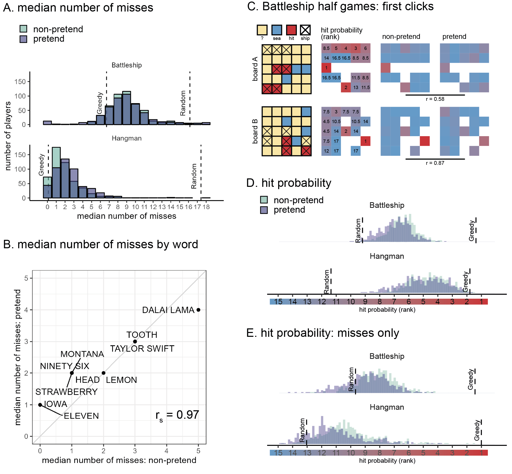
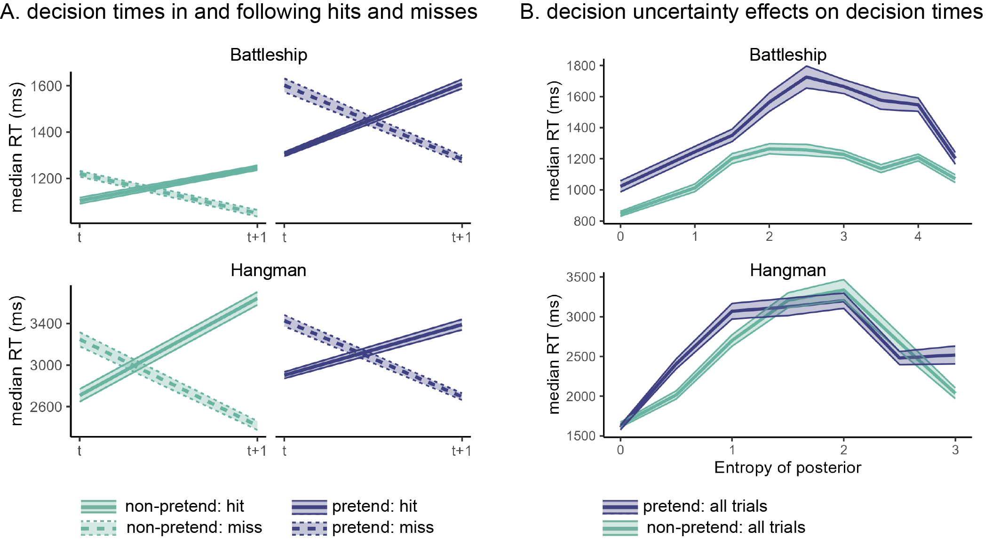
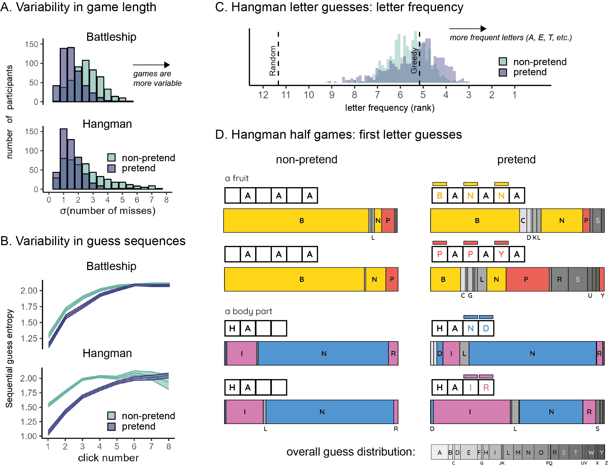

```{r analysis-preferences, warning=F, message=F}
# Seed for random number generation
set.seed(42)
knitr::opts_chunk$set(cache.extra = knitr::rand_seed, warning=F, message=F)

# Load packages with groundhog
library(groundhog)
groundhog.library(c(
  'png',
  'grid',
  'ggplot2',
  'svglite',
  'xtable',
  'papaja',
  'tidyverse',
  'broom',
  'cowplot',
  'MESS', # for AUCs
  'lsr', # for effect sizes
  'pwr', # for power calculations
  'brms', # for mixed effects modeling
  'BayesFactor', # for Bayesian t test
  'jsonlite', # parsing data from sort_trial
  'caret', #for cross validation
  'ggrepel' #for word scatterplots
), '2022-12-01')

# Load workspace (after running preregisteredMethodsAndResults.Rmd, 
# exploratoryResults.Rmd, and all the scripts that are linked to from these 
# documents). 
load('../.RData')

r_refs("r-references.bib")


#color scheme
colors <-  list()
colors$p <- "#404080"
colors$np <- "#69b3a2"
colors$random <- 'gray'
colors$greedy <- 'black'
```

# Introduction

<!-- The ability to intentionally deceive others relies on a capacity to reason about mental states [@frith2005theory]. This is evident in a similar developmental trajectory for the acquisition of theory of mind and the ability to deceive and detect deception [@wimmer1983beliefs; @shultz1981development; @sodian1991early], and a similar distribution of deception and theory of mind in the animal kingdom [e.g., @emery2004mentality; @hall2017cooperation]. This link makes conceptual sense: to deceive others, one needs to understand that others can have different knowledge and beliefs than one's own. -->

Pretense relies on an ability to simulate and mimic one's own behavior under a counterfactual belief state. For example, in order to successfully deceive your friends into thinking that you were surprised by the birthday party they threw for you, it is not sufficient that you are able to reason about their mental states ("I know that they are planning a surprise party, but they don't know that I know that...") --- you also need to convincingly simulate and mimic your hypothetical behavior had you not known about the party ("Where would I look first had I not known? What would I say? How long would it take me to recover from the surprise?"). This is not a trivial challenge: previous research on "hindsight biases" suggests that knowledge about the actual state of the world can interfere with our ability to correctly judge what we would have believed [@fischhoff1975; @fischhoff1977; @wood1978; @roese2012] or perceived [@harley2004; @bernstein2007; @bernstein2012] without this knowledge. Such biases remain potent even when instructing participants to overcome them [@harley2004; @pohl1996]. Moreover, even if pretenders can correctly determine what they would have believed, they must further accurately simulate how they would think and behave in this different belief state.

The reliance of this kind of epistemic pretense on self-simulation makes it a promising tool for revealing the structure and content of people's internal models of their own minds. When directly asked, participants are able to provide relatively accurate descriptions of their own decision-making [@morris] and perception [@levin2008; @mazor2023]. Pretending not to know opens a new window into the structure and content of this metacognitive knowledge, with two important advantages. First, by not relying on explicit reports, pretense has the potential to reveal implicit self-knowledge -- that is, structured knowledge about the self that is not reportable. And second, data obtained from pretense experiments can be analyzed and modeled using the same tools employed by cognitive scientists to study non-pretense behavior, affording a direct and finer-grained comparison between pretend and genuine decision-making.

<!-- to what extent humans are capable of generating complex behavior that is aligned with a counterfactual belief state, and specifically with a counterfactual state of ignorance. -->

To this end, we examine pretense in a game setting. Using an online version of the games Battleship and Hangman (in which players seek to uncover the locations of enemy ships or the identity of a word), participants played a 'non-pretend' (normal) version of the game, as well as a 'pretend' version where they were given complete information about the hidden ships / target word but were instructed to behave as if they didn't have this information. Overall, we find a highly impressive capacity for pretending not to know, with pretenders mirroring broad patterns and subtle features of real players' decisions and decision times. However, we also find that pretense was characterized by over-acting, stereotypical behavior, and suboptimal incorporation of new information, although these were undetected by human observers.

# Results

In two experiments, players played online versions of two information-seeking games: Battleship (N=`r E2.df$subj_id%>%unique()%>%length()` players) and Hangman (N=`r E4.df$subj_id%>%unique()%>%length()` players). These games traditionally start in a state of ignorance, with a player's goal being to reveal an unknown world state (ship locations in Battleship, a hidden word in Hangman) in as few steps (cell or letter selections) as possible. Critically, in addition to playing five standard games, players in our experiments also completed five 'pretend' games in which the solution to the game was known to them from the start, but where their task was to behave as if it was not -- i.e. to play as though they did not have this information (see Fig. \@ref(fig:design)). We measured participants' capacity to simulate a counterfactual state of ignorance by comparing patterns of decisions and decision times in pretend and non-pretend games. Our full pre-registered results are available [online](https://matanmazor.github.io/ignorance/docs/exp.-1-battleship.html) together with the report-generating code. Readers are invited to try [demos of the experiments](https://matanmazor.github.io/ignorance/experiments/demos/pretend).

```{r design, echo=FALSE, fig.cap="Experimental Design in Exp. 1 (upper panel) and 2 (lower panel). In non-pretend games, players revealed ships by guessing cells in a grid (A) or revealed a word by guessing letters (D). In pretend games, we marked ship locations with a cross (B) and revealed the target word from the start (E), but asked players to play as if they didn’t have this information. Lastly, players watched replays of the games of previous players and guessed which were pretend games (C and F).", out.width = '100%'}
knitr::include_graphics("figures/methods2.png")
```

## Measuring pretense quality

As a first measure of pretense quality, we compared the total number of guesses in pretend and non-pretend games. Among Battleship players, the number of cell selections was similar in pretend (mean = `r E2.median_clicks%>%pull(pretend)%>%mean()%>%printnum()`) and non-pretend games (mean = `r E2.median_clicks%>%pull(nonpretend)%>%mean()%>%printnum()`; $p=$ `r apa_print(E2.median_clicks$diff%>%t.test())$table$p.value`; Fig. \@ref(fig:decisions)A). `r E2.lucky_pretenders%>%length` pretenders who immediately discovered all ships without making errors were excluded from all further analyses, in accordance with our pre-registered plan. With these subjects excluded, the number of cell selections remained very similar in pretend (mean = `r  E2.median_clicks_filtered%>%pull(pretend)%>%mean()%>%printnum()`) and non-pretend games (mean = `r E2.median_clicks_filtered%>%pull(nonpretend)%>%mean()%>%printnum()`; $p=$`r apa_print(E2.median_clicks_filtered%>%mutate(diff=pretend-nonpretend)%>%pull(diff)%>%t.test())$table$p.value`; Fig. \@ref(fig:decisions)A)). In Hangman, pretenders tended to make about one additional letter guess on average than did non-pretenders, controlling for word length (pretend: `r E4.median_misses%>%pull(pretend)%>%mean()%>%printnum()` misses; non-pretend: `r E4.median_misses%>%pull(nonpretend)%>%mean()%>%printnum()` misses; $p$ `r apa_print(E4.median_misses%>%mutate(diff=pretend-nonpretend)%>%pull(diff)%>%t.test())$table$p.value`; Fig. \@ref(fig:decisions)B). Despite an overall bias in the number of guesses, pretend Hangman games showed an impressive, item-specific alignment: pretenders were successful in making more letter guesses when attempting to reveal words that would have been harder to guess had they been playing for real (`r cor.test(E4.misses_per_word$pretend, E4.misses_per_word$nonpretend,method='spearman')%>%apa_print()%>%'$'(estimate)`; Fig. \@ref(fig:decisions)B). This strong correlation provides evidence for a human capacity to act in accordance with a counterfactual knowledge state.

(ref:decisions-caption) Battleship and Hangman guesses in pretend and non-pretend games. A: median number of misses in Battleship and Hangman games, in non-pretend (green) and pretend (purple) games. For reference, the expected number of misses is indicated by a reference line for a fully random agent, and for a "greedy" agent that maximizes the probability of a hit in each step. B: The median number of misses in Hangman for pretend and non-pretend games, as a function of the target word. C: Spatial guess distributions for pretend and non-pretend half-games (where players continued the game from a half-finished state) alongside their corresponding hit probability maps. D: Cell and letter selections were ranked according to their relative hit probability. Plotting the median rank per subject in pretend and non-pretend games, with reference lines for the expected rank probability for a random agent, and for a "greedy" agent that maximizes the probability of a hit in each step. E: same as panel D but discarding all guesses that resulted in a hit.

```{r decisions, echo=FALSE, message= F, warning=F, fig.cap="(ref:decisions-caption)", out.width = '100%'}

num_misses_df <- E2.click_df %>%
  dplyr::select(subj_id,test_part, num_clicks) %>%
  mutate(subj_id=as.character(subj_id)) %>%
  # rbind(E2.optimal_click_df) %>%
  # rbind(E2.random_click_df) %>%
  mutate(test_part = factor(test_part, levels=c(
    'nonpretend','pretend'), labels = c(
    'non-pretend','pretend'))) %>%
  group_by(subj_id,test_part) %>%
  summarise(num_misses=median(num_clicks)-7) %>%
  mutate(game='Battleship') %>%
  rbind(
    E4.click_df %>%
  dplyr::select(subj_id,test_part, num_misses) %>%
  mutate(subj_id=as.character(subj_id)) %>%
  # rbind(E2.optimal_click_df) %>%
  # rbind(E2.random_click_df) %>%
  mutate(test_part = factor(test_part, levels=c(
    'nonpretend','pretend'), labels = c(
    'non-pretend','pretend'))) %>%
  group_by(subj_id,test_part) %>%
  summarise(num_misses=median(num_misses)) %>%
    mutate(game='Hangman')
  )
load('../analysis/simulated_hangman_games.RData')

E2.random_mean_misses <- E2.random_click_df %>%
           group_by(subj_id) %>%
           summarise(num_misses=median(num_clicks)-7) %>%
           pull(num_misses) %>%
                  mean()

E2.greedy_mean_misses <- E2.optimal_click_df %>%
           group_by(subj_id) %>%
           summarise(num_misses=median(num_clicks)-7) %>%
           pull(num_misses) %>%
                  mean()

E4.random_mean_misses <- simulated_random_hangman_games %>% 
  group_by(subj_id) %>%
  summarise(num_misses=median(nmisses)) %>%
  pull(num_misses) %>%
  mean()

E4.greedy_mean_misses <- simulated_optimal_hangman_games %>% 
  pull(nmisses) %>%
  mean()


ref_lines <- data.frame(
  game = c('Battleship','Battleship','Hangman','Hangman'),
  xintercept = c(E2.random_mean_misses, E2.greedy_mean_misses, 
                 E4.random_mean_misses, E4.greedy_mean_misses),
  label = c('Random','Greedy','Random','Greedy'),
  y = c(75,75,75,115)
)

p <- num_misses_df %>%
  ggplot(aes(x=num_misses,fill=test_part, color=test_part))+
  scale_fill_manual(values=c(colors$np,colors$p, colors$random, colors$greedy)) +
  scale_x_continuous(limits=c(-1,19), breaks=seq(0,18)) +
  labs(x='median number of misses', y='number of players')+
  theme(legend.position='none') +
  theme_classic() +
  geom_vline(data=ref_lines, aes(xintercept = xintercept), color='black', linetype=2) +
  geom_text(data=ref_lines, aes(x = xintercept, y=y, label=label), angle = 90, vjust = -1, size = 3, inherit.aes = FALSE)+
  geom_bar(alpha=0.6, position = 'identity', color='black', size=0.5) +
  facet_wrap(~game, nrow=2) +
  theme(legend.position='na',strip.background = element_blank(), panel.border=element_blank())

ggsave('figures/num_misses_facet.png',p, width=4, height=3)

p<-  E2.click_df %>%
  dplyr::select(subj_id,test_part, num_clicks) %>%
  mutate(subj_id=as.character(subj_id)) %>%
  # rbind(E2.optimal_click_df) %>%
  # rbind(E2.random_click_df) %>%
  mutate(test_part = factor(test_part, levels=c(
    'nonpretend','pretend'), labels = c(
    'non-pretend','pretend'))) %>%
  group_by(subj_id,test_part) %>%
  summarise(num_misses=median(num_clicks)-7) %>%
  ggplot(aes(x=num_misses,fill=test_part, color=test_part))+
  scale_fill_manual(values=c(colors$np,colors$p, colors$random, colors$greedy)) +
  scale_x_continuous(limits=c(-1,19), breaks=seq(0,18)) +
  labs(x='median number of misses', y='number of players')+
  theme(legend.position='none') +
  theme_classic() +
  geom_vline(xintercept = E2.greedy_mean_misses, color='black', linetype=2) +
  annotate("text", x = E2.greedy_mean_misses, y = 75, label = "Greedy", angle = 90, vjust = -1, size = 5)+
  geom_vline(xintercept = E2.random_mean_misses, color='black', linetype=2) +
  annotate("text", x = E2.random_mean_misses, y = 75, label = "Random", angle = 90, vjust = -1, size = 5)+
  geom_bar(alpha=0.6, position = 'identity', color='black', size=0.5) +
  theme(legend.pos='na')

ggsave('figures/num_misses_E2.png',p, width=4.5, height=2.5)

p <- E4.click_df %>%
  dplyr::select(subj_id,test_part, num_misses) %>%
  mutate(subj_id=as.character(subj_id)) %>%
  # rbind(E2.optimal_click_df) %>%
  # rbind(E2.random_click_df) %>%
  mutate(test_part = factor(test_part, levels=c(
    'nonpretend','pretend'), labels = c(
    'non-pretend','pretend'))) %>%
  group_by(subj_id,test_part) %>%
  summarise(num_misses=median(num_misses)) %>%
  ggplot(aes(x=num_misses,fill=test_part, color=test_part))+
  scale_fill_manual(values=c(colors$np,colors$p, colors$random, colors$greedy)) +
  scale_x_continuous(limits=c(-1,19), breaks=seq(0,18)) +
  labs(x='median number of misses', y='number of players')+
  theme(legend.position='none') +
  theme_classic() +
  geom_vline(xintercept = E4.greedy_mean_misses, color='black', linetype=2) +
  annotate("text", x = E4.greedy_mean_misses, y = 95, label = "Greedy", angle = 90, vjust = -1, size = 5)+
  geom_vline(xintercept = E4.random_mean_misses, color='black', linetype=2) +
  annotate("text", x = E4.random_mean_misses, y = 95, label = "Random", angle = 90, vjust = -1, size = 5)+
  geom_bar(alpha=0.6, position = 'identity', color='black', size=0.5) +
  theme(legend.pos='na')

ggsave('figures/num_misses_E4.png', p, width=4.5, height=2.5)


```

Having established an alignment in the total number of guesses, we next turned to the content of pretend and non-pretend guesses. In order to directly compare pretend and non-pretend guesses for the same board state, Battleship players completed two half-games in which they were instructed to continue the game from a half-completed state. Hundreds of cell selections for the same board state revealed a strong correlation between the spatial distributions of pretend and non-pretend guesses (board A: $r=$ `r apa_print(cor_A_pretend_nonpretend)$table$estimate`, $p=$ `r apa_print(cor_A_pretend_nonpretend)$table$p.value`; board B: $r=$ `r apa_print(cor_B_pretend_nonpretend)$table$estimate`, $p$ `r apa_print(cor_B_pretend_nonpretend)$table$p.value`; Fig. \@ref(fig:decisions)C), confirming that pretenders were sensitive not only to the number of guesses they would have made had they been playing for real, but also to their content.

To further examine the decisional processes behind this strong alignment, we compared the degree to which pretend and non-pretend guesses made sense within the context of the game. When playing Battleship and Hangman, it makes sense to guess cells or letters for which the probability of hitting a ship or revealing a letter is high [this "greedy" behavior is not strictly optimal, but approximates optimal behavior in most cases, @audinot2014optimal, Section 3.3]. In the non-pretend versions of both games, guesses were more rational according to this measure than expected by chance (Battleship: `r E2.mean_P_click_rank%>%spread(test_part,p_click_rank)%>%mutate(diff=-nonpretend+random)%>%pull(diff)%>%t.test()%>%apa_print()%>%'$'(statistic)`, Hangman: `r E4.mean_P_click_rank%>%spread(test_part,p_click_rank)%>%mutate(diff=-nonpretend+random)%>%pull(diff)%>%t.test()%>%apa_print()%>%'$'(statistic)`). Despite being less rational than non-pretend guesses, pretend guesses were also more rational than expected by chance (Battleship: `r E2.mean_P_click_rank%>%spread(test_part,p_click_rank)%>%mutate(diff=-pretend+random)%>%pull(diff)%>%t.test()%>%apa_print()%>%'$'(statistic)`, Hangman: `r t.test(-E4.mean_P_click_rank_wide%>%pull(np_vs_r))%>%apa_print%>%'$'(statistic)`; Fig. \@ref(fig:decisions)D). Critically, the same was true when restricting the analysis to unsuccessful guesses (Battleship: `r E2.mean_P_click_rank_misses_only%>%spread(test_part,p_click_rank)%>%mutate(diff=-pretend+random)%>%pull(diff)%>%t.test()%>%apa_print()%>%'$'(statistic)`, Hangman: `r t.test(-E4.mean_P_click_rank_misses_wide%>%pull(p_vs_r))%>%apa_print%>%'$'(statistic)`; Fig. \@ref(fig:decisions)E): that is, even when incorrectly guessing a ship's location or a letter's identity, pretend guesses made sense given the limited information players pretended to have.

Good pretense is a function not only of the number and content of players' decisions, but also of their timing. Here too, pretend games showed the same qualitative patterns as non-pretend games. Like non-pretenders, pretenders were faster in their successful guesses (Difference in decision time between hits and misses in Battleship: $\Delta_{non-pretend}=$ `r E2.RT_by_hit_lags %>% filter(test_part=='nonpretend')%>%pull(hit_diff)%>%median()%>%round()` ms, $\Delta_{pretend}=$ `r E2.RT_by_hit_lags %>% filter(test_part=='pretend')%>%pull(hit_diff)%>%median()%>%round()` ms; Hangman: $\Delta_{non-pretend}=$ `r E4.RT_by_hit_lags %>% filter(test_part=='nonpretend')%>%pull(hit_diff)%>%median(na.rm=T)%>%round()` ms, $\Delta_{pretend}=$ `r E4.RT_by_hit_lags %>% filter(test_part=='pretend')%>%pull(hit_diff)%>%median(na.rm=T)%>%round()` ms) and slowed down immediately after a hit (Difference in decision time between guesses that followed hits versus misses in Battleship: $\Delta_{non-pretend}=$ `r E2.RT_by_hit_lags %>% filter(test_part=='nonpretend')%>%pull(lag1_diff)%>%median()%>%round()` ms, $\Delta_{pretend}=$ `r E2.RT_by_hit_lags %>% filter(test_part=='pretend')%>%pull(lag1_diff)%>%median()%>%round()` ms; Hangman: $\Delta_{non-pretend}=$ `r E4.RT_by_hit_lags %>% filter(test_part=='nonpretend')%>%pull(lag1_diff)%>%median(na.rm=T)%>%round()` ms, $\Delta_{pretend}=$ `r E4.RT_by_hit_lags %>% filter(test_part=='pretend')%>%pull(lag1_diff)%>%median(na.rm=T)%>%round()` ms; Fig. \@ref(fig:time)A). Furthermore, decision uncertainty, quantified as the Shannon entropy of the posterior distribution over cell or letter options, had a similar quadratic effect on decision time in both non-pretend and pretend versions of the games, with the slowest responses associated with mid-range levels of entropy (see Fig. \@ref(fig:time)B). In other words, despite knowing the game's solution with full certainty, pretenders successfully feigned subtle qualitative effects of counterfactual uncertainty on their decision times.

```{r time, echo=FALSE, message= F, warning=F, fig.cap="Patterns of decision time in pretend and non-pretend games. A: median decision times for hits and misses, as well as the decisions following them. In both Battleship and Hangman, hits were faster on average than misses, but guesses following a hit were slower on average than those following a miss. This pattern was mimicked in pretend games. B: median decision times as a function of decision uncertainty, quantified as the entropy of the posterior over guess options. In both Hangman and Battleship, guesses were slowest for mid-range levels of entropy, and this pattern was mimicked in pretend games.", out.width = '100%'}

```

```{r sd_misses, echo=FALSE, cache=TRUE}

sd_misses_df <- E2.click_df %>%
  dplyr::select(subj_id,test_part, num_clicks) %>%
  mutate(subj_id=as.character(subj_id)) %>%
  # rbind(E2.optimal_click_df) %>%
  # rbind(E2.random_click_df) %>%
  mutate(test_part = factor(test_part, levels=c(
    'nonpretend','pretend'), labels = c(
    'non-pretend','pretend'))) %>%
  group_by(subj_id,test_part) %>%
  summarise(sd_misses=sd(num_clicks)) %>%
  mutate(game='Battleship') %>%
  rbind(
    E4.click_df %>%
  dplyr::select(subj_id,test_part, num_misses) %>%
  mutate(subj_id=as.character(subj_id)) %>%
  # rbind(E2.optimal_click_df) %>%
  # rbind(E2.random_click_df) %>%
  mutate(test_part = factor(test_part, levels=c(
    'nonpretend','pretend'), labels = c(
    'non-pretend','pretend'))) %>%
  group_by(subj_id,test_part) %>%
  summarise(sd_misses=sd(num_misses)) %>%
    mutate(game='Hangman')
  )

sd_misses_df_wide <- sd_misses_df %>%
  mutate(test_part=ifelse(test_part=='pretend','p','np'))%>%
  pivot_wider(values_from=sd_misses,
              names_from=c(test_part,game))

p <- sd_misses_df %>%
  mutate(sd_misses = round(sd_misses*2)/2)%>%
  ggplot(aes(x=sd_misses,fill=test_part, color=test_part))+
  scale_fill_manual(values=c(colors$np,colors$p, colors$random, colors$greedy)) +
  scale_x_continuous(limits=c(0,8), breaks=seq(0,10)) +
  labs(x='median number of misses', y='number of players')+
  theme(legend.position='none') +
  theme_classic() +
  # geom_vline(data=ref_lines, aes(xintercept = xintercept), color='black', linetype=2) +
  # geom_text(data=ref_lines, aes(x = xintercept, y=y, label=label), angle = 90, vjust = -1, size = 3, inherit.aes = FALSE)+
  geom_bar(alpha=0.6, position = 'identity', colour='black', size=0.5) +
  facet_wrap(~game, nrow=2) +
  theme(legend.position='na',strip.background = element_blank(), panel.border=element_blank())+
  labs(y='number of players',x="\u03C3(number of misses)")

ggsave('figures/sd_misses_facet.png',p, width=2.5, height=3)

```

## Stereotypical, imperfect self-simulation

Though impressive, the capacity for simulating a state of ignorance was not perfect. Importantly, the limitations and biases we observe are consistent with the simulation of a stereotypical, “cartoon” model of decision-making, rather than leakage of concealed information into the decision-making process. First, despite showing the same qualitative effects, decision time patterns in Battleship pretend games (but not Hangman pretend games) were systematically more pronounced relative to non-pretend games: a form of “over-acting”. Furthermore, pretend games followed stereotypical patterns, and as a result were more homogeneous than non-pretend games. Despite a highly similar average number of misses in pretend and non-pretend games (Fig. \@ref(fig:decisions)A), the number of unsuccessful guesses was overwhelmingly less variable in pretend relative to non-pretend games (Battleship: sd=`r sd_misses_df_wide$p_Battleship%>%mean(na.rm=T)%>%printnum()` in pretend versus `r sd_misses_df_wide$np_Battleship%>%mean(na.rm=T)%>%printnum()` in non-pretend games, $p$ `r apa_print(sd_misses_df_wide%>%mutate(diff=p_Battleship-np_Battleship)%>%pull(diff)%>%t.test())$table$p.value`; Hangman: sd=`r sd_misses_df_wide$p_Hangman%>%mean(na.rm=T)%>%printnum()` in pretend versus `r sd_misses_df_wide$np_Hangman%>%mean(na.rm=T)%>%printnum()` in non-pretend games, $p$ `r apa_print(sd_misses_df_wide%>%mutate(diff=p_Hangman-np_Hangman)%>%pull(diff)%>%t.test())$table$p.value`; Fig. \@ref(fig:rigidity)A).  Moreover, the within-participant sequential guess entropy, a measure of the inverse predictability of decision sequences across different games of the same player, was significantly reduced in pretend games (Fig. \@ref(fig:rigidity)B; see [online supplementary materials](https://matanmazor.github.io/ignorance/docs/exp.-1-battleship-exploratory-results.html#within-participant-click-entropy)), consistent with an attempt to enact typical, or average, behavior in a state of ignorance. Finally, Hangman pretenders were more likely to guess letters that appear frequently in English words (E, T, A, etc.) irrespective of the game state, compared to genuine players (Fig. \@ref(fig:rigidity)C). This suggests that in their attempt to behave as if they didn't know the true state of the game, pretenders had an increased tendency to follow rigid heuristics and rules, ignoring useful information as a result.

This limitation on incorporating evidence into the (simulated) decision-making process was especially evident in Hangman half-games, where players completed the game from a half-completed state. When asked to reveal the hidden fruit "\_A_A_A", `r round(100*E4.first_click_half_games %>% filter(test_part=='nonpretend_half_game' & word %in% c('banana', 'papaya'))%>%pull(bananahand)%>%mean())`% of the non-pretenders guessed one of the letters 'B' or 'N' (Fig. \@ref(fig:rigidity)D, yellow bars in left column). Among pretenders who knew that the hidden word was BANANA, this preference was reduced to `r round(100*E4.first_click_half_games %>% filter(test_part=='pretend_half_game' & word== 'banana')%>%pull(bananahand)%>%mean())`%. Importantly, half of the pretenders were given different information: they were told that the hidden word was the less prototypical fruit PAPAYA. Although good pretenders should simulate their behavior had they not known this information, only `r round(100*E4.first_click_half_games %>% filter(test_part=='pretend_half_game' & word =='papaya')%>%pull(bananahand)%>%mean())`% selected the letters 'B' or 'N', revealing that many pretenders were unable to predict that the first fruit that would have come to their minds was BANANA, not PAPAYA (Fig. \@ref(fig:rigidity)D, yellow bars in right column). A similar pattern was observed for the prototypical body part word HA(ND) and its surprising counterpart HA(IR): when playing normally, `r round(100*E4.first_click_half_games %>% filter(test_part=='nonpretend_half_game' & word %in% c('hand', 'hair'))%>%pull(bananahand)%>%mean())`% of the players selected letters that are consistent with the prototypical option HAND. This figure was `r round(100*E4.first_click_half_games %>% filter(test_part=='pretend_half_game' & word =='hand')%>%pull(bananahand)%>%mean())`% among pretenders for whom the target word was HAND, in contrast to only `r round(100*E4.first_click_half_games %>% filter(test_part=='pretend_half_game' & word =='hair')%>%pull(bananahand)%>%mean())`% among pretenders for whom the target word was HAIR (Fig. \@ref(fig:rigidity)D, blue bars).

```{r rigidity, echo=FALSE, message= F, warning=F, fig.cap="Limitations on flexible decision-making when pretending. A: variability in the number of misses (extracted individually for each player and then averaged) was lower in pretend games. B: sequential guess entropy, a measure of the (inverse) predictability of individual players’ guesses as a function of click number and guess number. In both Battleship and Hangman, sequential guess entropy increased with click number, and was overall lower in pretend games. C: letter frequency of Hangman guesses: the median rank frequency per participant in pretend and non-pretend games, with reference lines for the expected rank frequency for a random agent, and for a “greedy” agent that maximizes the probability of a hit in each step. D: first letter guesses in Hangman half-games, as a function of pretense condition and target word. Letters appear in alphabetical order. letters that appear in the target word are marked in yellow (BANANA), red (PAPAYA), blue (HAND) and magenta (HAIR). For reference, the overall distribution of letter guesses across all games and conditions is given below.", out.width = '100%'}

```

## Failure to detect pretending

Despite these limitations, pretenders' behavior resembled real players' behavior closely enough that they were able to fool other participants into believing they were playing for real. After performing pretend and non-pretend games, participants were presented with game replays of previous players and took on the new role of being a 'judge' who had to determine who was pretending and who was playing for real. In both games, pretense detection was at chance (Battleship: `r E2.judge_df%>%group_by(subj_id)%>%summarise(accuracy=sum(correct)*20)%>%pull(accuracy)%>%mean()%>%round()`%, Hangman: `r round(E4.judge_summary_df$accuracy%>%mean()*100)`%). This is in line with previous findings of near-chance accuracy in lie detection [@bond2006]. Moreover, we find no sign of a correlation between pretense quality (measured as players' ability to trick judges into thinking they were not pretending) and pretense detection ability (measured as proportion correct; Battleship: `r apa_print(cor.test(E2.performance_df$judge_rate,E2.performance_df$pretend_rate, method='spearman'))$estimate`, Hangman: `r apa_print(cor.test(E4.performance_df$pretend_rate,E4.performance_df$judge_rate,method='spearman'))$estimate`), indicating that pretense and pretense detection rely on at least partly different cognitive processes.

# Discussion

In two experiments, we examined participants' ability to mimic a state of ignorance in a game setting, building on the recent recognition of games as a powerful tool for studying decision making [@allen2024]. We find that pretenders were able to successfully emulate decisions taken under a true state of ignorance, including reproducing both broad patterns and subtle effects of guess accuracy and decision uncertainty on decision time. We also identify reliable signatures of pretend-ignorance on players' decisions, including a cost to decision rationality and an increased tendency to follow heuristics and rules, even though these signatures went undetected by 'judges' asked to discriminate real from pretend games. Collectively, our findings reveal a rich and impressive, but ultimately limited, capacity for online simulation of counterfactual belief states.

Previous research has identified limitations in our capacity to prevent knowledge from influencing our decisions and behavior [@fischhoff1975; @fischhoff1977; @wood1978; @roese2012; @harley2004]. Our findings reveal that notwithstanding these limitations, humans are capable of approximating their hypothetical behavior had they not known what they in fact do know. This capacity goes beyond making similar decisions to the ones they would have made had they not known; pretenders were also able to generate decision times that reproduce subtle qualitative patterns observed under a true state of ignorance.

This alignment between pretend and non-pretend decision times may indicate that pretenders were capable of controlling their decision times at will, enacting their intuitive beliefs of how decision time should be affected by knowledge and uncertainty. In a recent developmental study, children aged 5-10 were capable of making inferences about knowledge from the observed response time of other agents [e.g., inferring that decision-makers who take longer to decide make higher-quality decisions, @richardson2022]. Our findings here may show that people are also capable of using this sort of intuitive knowledge to guide their own pretense behavior. Alternatively, this mimicry of decision time patterns may reflect a similarity in the computations leading to pretend and non-pretend decision making. According to this interpretation, pretenders may have paused for longer when making some decisions because the simulated computation that led to these decisions took longer.

Research on Bayesian Theory of Mind provides some support for such internal simulations of decision-making processes. These are often studied by measuring participants' ability to infer beliefs and desires from observed behavior, either explicitly [@baker2009action; @baker2017rational; @richardson2022], or implicitly [@onishi2005fifteen; @liu2017ten]. Here we have proposed a complementary approach: Asking participants to generate behavior based on a counterfactual mental state---In this case, a counterfactual knowledge state in which a known piece of information is unknown. Instead of relying on model inversion (e.g., "Which belief states would give rise to this behavior?"), we ask participants to run the model forward, taking counterfactual beliefs and desires as input and producing behavior as output. Due to the unconstrained space of possible behaviors in our task (cell selections x decision latencies), successfully pretending not to know demands a rich model of cognition, and is much harder to achieve based on a quasi-scientific theory of mental states [@gopnik1994theory].

An alternative interpretation of our results is that instead of simulating a counterfactual knowledge state, participants actively suppressed or ignored the revealed game state such that their entire cognitive machinery was available to play the game. This would not require self-simulation, only a capacity to intentionally 'unsee', or forget, relevant evidence. While we cannot fully rule out this interpretation, we think it is unlikely to explain our players' successful pretense, for at least five reasons. First, we tried to make such suppression as hard as possible, by presenting the game solution on top of the game board for the entire duration of pretend games, and by having participants type the target word before pretend Hangman games. Second, suppressing thoughts on demand is notoriously difficult, and often has an opposite, positive effect on the suppressed content [@wegner1987paradoxical]. Third, when asked how they had performed the task in a debrief question, the responses of a significant majority of participants were aligned with self-simulation or rule-following (see [exploratory analysis](https://matanmazor.github.io/ignorance/docs/exp.-1-battleship-exploratory-results.html#suppression-or-simulation)). Fourth, response time patterns were exaggerated in pretend Battleship relative to non-pretend Battleship games (see Fig. \@ref(fig:time)A): a finding that is consistent with the simulation of a simplified self-model, but is hard to explain if participants were merely suppressing their current knowledge. Finally, pretend games were more similar to each other than were non-pretend games to themselves. This is again consistent with an attempt to simulate typical behavior.

Together, our findings reveal a non-trivial capacity for pretending not to know. Complementing previous work on cognitive and perceptual hindsight biases, we show that people are capable of accurately simulating diverse aspects of their decision-making processes, although they exhibit systematic shortcomings. Further research into these and similar limitations may continue to reveal the simplifications, abstractions, and biases in people's models of their own minds.

<!-- including patterns of active information seeking and knowledge update in the face of new evidence. -->

<!-- We consider two possible explanations to  -->

<!-- Our subjects rose to the challenge. Their pretense behavior, although not perfect, closely resembled that of non-pretenders \-\-- not only in gross measures such as total number of clicks, but also in subtler patterns of cell selection and decision latency. Our interpretation of this finding is that participants engaged in rich and relatively accurate counterfactual self-simulation: "What would I have done if I didn't have this piece of knowledge?". -->

<!-- An alternative interpretation is that instead of simulating a counterfactual knowledge state, participants actively suppressed or ignored unwanted knowledge, such that their entire cognitive machinery was available to play the game. This does not require any self-modeling or self-simulation, beyond the knowledge that suppressing knowledge can be beneficial for pretending not to know something. While we cannot fully rule out this interpretation, we think it is unlikely to explain participants' pretense ability in our data, for two indirect reasons. First, suppressing thoughts on demand is notoriously difficult [\@wegner1987paradoxical], and our first-person experience of performing the task is that suppressing knowledge of ship locations is hardly possible. Second, when asked how they had performed the task in a debrief question, the responses of most participants were aligned with self-simulation or rule-following (see [exploratory analysis](https://matanmazor.github.io/ignorance/docs/exp.-1-battleship-exploratory-results.html#suppression-or-simulation)). -->

<!-- In conclusion, we propose that pretense behavior provides a unique opportunity to directly test the richness and accuracy of subjects' models of their own cognitive processes, and find evidence for accurate pretending that surprisingly does not translate to an ability to detect pretense. While more work is needed to exclude alternative explanations, we interpret our findings as providing preliminary evidence for a remarkable capacity for counterfactual self-simulation. -->

# Methods

We report how we determined our sample size, all data exclusions (if any), all manipulations, and all measures in the study. <!-- 21-word solution (Simmons, Nelson & Simonsohn, 2012; retrieved from http://ssrn.com/abstract=2160588) -->

## Exp. 1: Battleship

A detailed pre-registration can be accessed at [osf.io/v9zsb](https://osf.io/v9zsb). The pre-registration was time-locked using cryptographic randomization-based time-locking [@mazor2019] (protocol sum: 60c270410375e8a192468fc1a0e9c93da60d5e203eb2760b621a8631a26f4c5c; [link to relevant lines in experimental code](https://github.com/matanmazor/ignorance/blob/44ef964c0d7d4a8f3b76ec52316a8e624c41a047/experiments/Battleships2/code/index.html#L865-L876)). All pre-registered analyses are available [in this link](https://matanmazor.github.io/ignorance/docs/exp.-1-battleship.html).

### Participants

The research complied with all relevant ethical regulations and was approved by the Institutional Review Board of Johns Hopkins University. `E2.df$subj_id%>%unique()%>%length()` Participants were recruited via Prolific (prolific.co) and gave their informed consent prior to their participation. They were selected based on their acceptance rate (\>95%) and for being native English speakers. The entire experiment took approximately 20 minutes to complete. Participants' pay was equivalent to an hourly wage of 9.50 USD, in addition to a bonus payment (`r E2.bonus$bonus%>%min()` - `r E2.bonus$bonus%>%max()` USD, mean = `r E2.bonus$bonus%>%mean()%>%printnum()`).

### Procedure

Participants were first instructed that the experiment, based on the game Battleship, had three parts, and that they could accumulate 'points' that would later translate to a monetary bonus payment. They were then presented with a leaderboard of previous players, and given the rules of the game:

> *"In the game Battleship, your task is to sink all ships located in a grid with as few clicks as possible. What makes the game difficult is that you can't see the ships; all you can see is a grid of squares, and you have to guess where the ships are. To sink a ship, you need to click on all of the squares it is located in. If you hit part of a ship, the square will turn red. If there is no ship in the square, it will turn blue.*"

We further explained that in this version of the game, ships can touch corners, but their sides can't touch. This explanation was accompanied by a visual presentation of legal and illegal ship configurations.

After completing a comprehension question and a practice round, participants completed one 'pretend' and one 'non-pretend' block, each comprising five full games and one half-game (see below for details). The order of pretend and non-pretend blocks was counterbalanced between participants. The allocation of boards to conditions was randomized between participants such that exactly one board was played in both pretend and non-pretend conditions, and this common board was different for different participants. The order of boards within a block was fully randomized, with the exception that half-games were always played last.

#### Non-pretend (normal) games

In non-pretend games (Fig. \@ref(fig:design)A), participants aimed to sink two 2-square patrol boats and one 3-square submarine with as few clicks as possible. An online counter of the number of clicks was displayed on the screen. After each game, feedback was given about the number of clicks and resulting number of points obtained.

#### Pretend games

Participants in pretend games were given the same explanation of Battleship, and played a practice round. However, they were then given an additional instruction:

> *"This time your goal is different. In this round, we're going to tell you where the ships are, but **we want you to act like you don't know this information**. We've marked the ships' locations with a cross, so you'll know where they are the whole time; but your job is to play the game as if these hints aren't there. To see how good you are at this, we're going to compare your games to the games of people who actually had no hints, and see how similar they are. We will measure where and when you clicked; if your clicks look similar to people who played like normal (trying to reveal all ships with as few clicks as possible, but without any hints), you'll get bonus points. But if your games look different, you won't get these bonus points. Your number of clicks in this part will not affect your bonus. Only your ability to play like you had no hints.*"

We informed participants that both the location and timing of their cell clicks would be measured. After one practice round and one comprehension question, participants played five pretend games (Fig. \@ref(fig:design)B), followed by one pretend half-game. Each game was followed by a short message, reminding them that a game that looks similar to the games of participants who had no hints would be awarded 10 bonus points.

#### Half-games

In order to directly compare participants' pretend and non-pretend games for identical belief states (genuine or pretended ignorance about where the ships are hidden), participants completed one pretend and one non-pretend game given a partly finished board with the content of 7 cells already revealed (Fig. \@ref(fig:design)C). We designed our half-games to produce a strong expectation to find a ship in specific cells, but not in others. The assignment of half-completed boards to pretend and non-pretend conditions was randomized between participants.

#### Judge trials

```{r judge-game-proportion-Battleship, echo=FALSE, message= F, warning=F}
E2.judge_np_game_proportion <- E2.click_log %>% 
  filter(genuine_first & test_part=='nonpretend') %>%
  group_by(subj_id,test_part,grid_number, genuine_first) %>% 
  summarise(duration=sum(RT)/1000) %>% 
  mutate(included = duration<=60) %>%
  pull(included) %>%
  mean()

E2.judge_p_game_proportion <- E2.click_log %>% 
  filter(test_part=='pretend') %>%
  group_by(subj_id,test_part,grid_number, genuine_first) %>% 
  summarise(duration=sum(RT)/1000) %>% 
  mutate(included = duration<=60) %>%
  pull(included) %>%
  mean()
```

In the final part of the experiment, participants observed the games of previous players and tried to determine who were pretenders and who were non-pretenders. On each trial, two empty grids were presented side by side, with a smaller grid on top, displaying the hidden positions of ships on the grid (Fig. \@ref(fig:design)D). The two grids corresponded to the true games of two previous players who played a version of the top grid either as pretenders or as non-pretenders. For non-pretend games, only games from the group of participants that pretended in the second block (and played normally in the first block) were chosen for presentation in this part. For both pretend and non-pretend games, only games shorter than one minute (`r (E2.judge_np_game_proportion*100)%>%round()`% of included non-pretend games and `r (E2.judge_p_game_proportion*100)%>%round()`% of pretend games) were presented. Judge participants observed a real time replay of the two grids, showing not only where participants clicked, but also when. After making a decision, participants were informed whether they would receive the 10 bonus points, or alternatively, whether the pretender would receive them in the event the pretender managed to trick them.

Readers are invited to try a [demo of the experiment](https://matanmazor.github.io/ignorance/experiments/demos/Battleship).

## Hangman

A detailed pre-registration can be accessed at [osf.io/3thry](https://osf.io/3thry). The pre-registration was time-locked using cryptographic randomization-based time-locking [@mazor2019]. Due to an error in the experiment code, time-locking took effect only from player number 221 (batch 3) and on (protocol sum: c4929c7fe33df1b7b52f15c789d98eab30a9cee09a8121807a3c59e28e7430a4; [relevant lines in experimental code](https://github.com/matanmazor/ignorance/blob/f98903f3f2d0e21800497dc65f8d5f823c910c88/experiments/Hangman2/code/index.html#L772-L783)).

### Participants

The research complied with all relevant ethical regulations and was approved by the Institutional Review Board of Johns Hopkins University. `E4.df$subj_id%>%unique()%>%length()` Participants were recruited via Prolific (prolific.co) and gave their informed consent prior to their participation. They were selected based on their acceptance rate (\>95%) and for being native English speakers. The entire experiment took approximately 20 minutes to complete. Participants' pay was equivalent to an hourly wage of 9.50 USD, in addition to a bonus payment of 1 USD that was awarded to `r E4.bonus$bonus%>%sum(na.rm=T)` players who earned 100 points or more.

### Procedure

The first instructions screen informed participants that the experiment, based on the game Hangman, had three parts, and that the points they accumulate translate to a monetary bonus payment. They were then presented with a leaderboard of previous players. Then, the rules of the game were presented:

> *"In the following game, your task is to reveal a hidden word or phrase by guessing letters. What makes the game difficult is that you can't see the word; all you can see is a row of squares - a square for each letter. Use your mouse to make letter guesses. We will have five types of words: body parts, numbers, US states, fruit, and famous people. You will start each game with 15 points and lose one point for every guess of a letter that is not in the word.*"

We then explained that "the words in this game are the kind of words that will be familiar to most English-speaking fifth-graders. We didn't pick any strange or particularly difficult words".

Once they responded correctly to a multiple-choice comprehension question ("the goal of the game is to...": "reveal the word with as few letter guesses as possible"), participants played a practice round, revealing the word PIGEON (see Fig. \@ref(fig:design)E).

After the main instructions, comprehension question and practice round, participants completed one pretend and one non-pretend block, each followed by one half-game (see below for details). The order of pretend and non-pretend blocks was counterbalanced between participants. Each block comprised five games played with five out of ten different words, and one half-game. The allocation of words to conditions was randomized between participants, with the constraint that both pretend and non-pretend blocks included exactly one word from each category. The order of words within a block was randomized, except for the half-game, which was always delivered at the end.

The ten words included two number words (ELEVEN, NINETY SIX), two famous people (DALAI LAMA, TAYLOR SWIFT), two fruits (STRAWBERRY, LEMON), two body parts (TOOTH, HEAD), and two US states (MONTANA, IOWA).

#### Non-pretend games

In non-pretend games, participants revealed a hidden word with as few letter guesses as possible. An online counter of the number of points was displayed on the screen, deducting one point for every guess of a letter that is not in the target word. After each game, feedback was given about the number of points obtained.

After completing the five games, participants performed one half-game (see below for details).

#### Pretend games

Participants were given the following instructions:

> *"*In the next part of the experiment, you'll play 6 games where you reveal a hidden word by guessing letters.

> However, this time your goal is different.

> In this round, we're going to tell you the word in advance, but **we want you to act like you don't know this information**.

> To see how good you are at this, we're going to compare your games to the games of people who played normally, without knowing what the word was, and see how similar they are. We will measure which letters you click and the timing of your guesses; if your clicks look similar to people who played like normal (trying to reveal the word with as few guesses as possible, but without any hints), you'll get bonus points. But if your games look different, you won't get these bonus points. Your number of clicks in this part will not affect your bonus. Only your ability to play like you didn't see the word in advance.*"*

After one practice round, pretending not to know that the hidden word is PIGEON, and one comprehension question ("In this part of the experiment my goal is to...": "play the game as if I don't know what the word is so that I look like someone who had no hints"), participants played five pretend games (Fig. \@ref(fig:design)F). Each game was preceded by a short message informing subjects about the identity of the target word. To start pretending, players were asked to type in the target word on their keyboard. The target word remained on the screen, in green letters, until the end of the game. After pretending, we reminded players that a game that looks similar to the games of participants who had no hints will be awarded 10 bonus points.

After completing the five games, participants performed one half-game (see below for details).

#### Half-games

In order to directly compare participants' pretend and non-pretend games for identical belief states (true or pretended knowledge about the identity of the word), we asked participants to also complete one pretend and one non-pretend game, given a partly finished game with some letters already guessed (they were told that the computer made these guesses; Fig. \@ref(fig:design)G). The two half-game words were one fruit: PAPAYA or BANANA, with guessed letters [A, E, I, O, M, T], and one body part: HAND, or HAIR with guessed letters (A, E, O, M, T, H, P). The assignment of category (fruit or body part) to condition (pretend and non-pretend), as well as the identity of the target word within each category (e.g., PAPAYA or BANANA), was randomized between participants.

Instructions for the non-pretend half-game were:

> *"For the next game, the computer chose the first letters for you; you can take over from where it left off. Your challenge is to complete the game. Just like in the previous games, here also you will lose one point for each letter that you guess and is not in the word.*"

Instructions for the pretend half-game were:

> *"For the next game, the computer chose the first letters for you; you can take over from where it left off. Just like in the previous games, here also you will know what the word is, but your bonus points will depend on your ability to play as if you didn't know the word.*"

#### Judge trials

```{r judge-game-proportion-Hangman, echo=FALSE, message= F, warning=F}
E4.judge_np_game_proportion <- E4.click_log %>% 
  filter(genuine_first & test_part=='nonpretend') %>%
  group_by(subj_id,test_part,word, genuine_first) %>% 
  summarise(duration=sum(RT)/1000) %>% 
  mutate(included = duration<=90) %>%
  pull(included) %>%
  mean()

E4.judge_p_game_proportion <- E4.click_log %>% 
  filter(test_part=='pretend') %>%
  group_by(subj_id,test_part,word, genuine_first) %>% 
  summarise(duration=sum(RT)/1000) %>% 
  mutate(included = duration<=90) %>%
  pull(included) %>%
  mean()
```

In the final part of the experiment, participants observed five games of previous players and determined who had hints and who didn't. Instructions for this part were:

> *"In this third and last part of the experiment, we ask you to be a judge for previous players, and see if you can tell which of the players were shown the word (but acted like they weren't). We will show you 5 replays of the games of previous players. Your task is to decide whether they played normally or pretended. For each game that you get right, you will receive 10 points. Good luck!*"

Then, on each judge trial, one game of a previous player was replayed in real time, with the target word presented above. For non-pretend games, only games from the group of participants that pretended in the second block (and played normally in the first block) were chosen for presentation in this part. For both pretend and non-pretend games, only games shorter than 1.5 minutes (`r (E4.judge_np_game_proportion*100)%>%round()`% of included non-pretend games and `r (E4.judge_p_game_proportion*100)%>%round()`% of pretend games) were presented. Judge participants indicated their decision by pressing the P and N keys on their keyboard. After making a decision, participants were informed whether they received the 10 points. Whenever a pretend game was classified as a non-pretend game, they were informed that the pretender received these 10 points instead of them.

Lastly, participants were asked the following debrief questions:

> *"Did you have a strategy that you used for pretending you did not see the word? What was most difficult about pretending? How about telling between players who pretenders and who played for real - did you have a strategy for that?*"

And:

> *"We would appreciate it if you could share any thoughts you had about the experiment, or anything we should take into account when analyzing your data.*"

Readers are invited to try a [demo of the experiment](https://matanmazor.github.io/ignorance/experiments/demos/Hangman).

\newpage

# References

::: {#refs custom-style="Bibliography"}
:::
