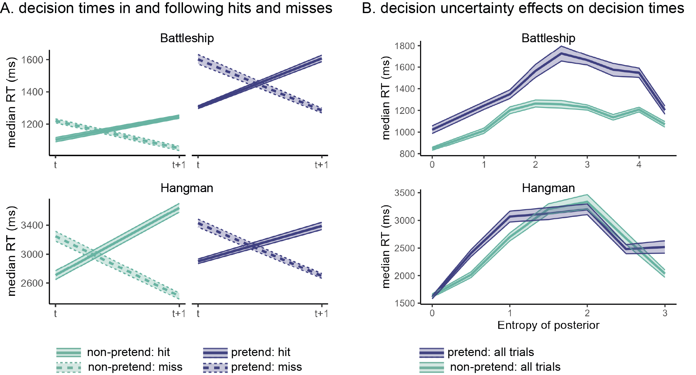

```{r analysis-preferences, warning=F, message=F, echo=FALSE}
# Seed for random number generation
set.seed(42)
knitr::opts_chunk$set(cache.extra = knitr::rand_seed, warning=F, message=F)

# Load packages with groundhog
library(groundhog)
groundhog.library(c(
  'png',
  'grid',
  'ggplot2',
  'svglite',
  'xtable',
  'papaja',
  'tidyverse',
  'broom',
  'cowplot',
  'MESS', # for AUCs
  'lsr', # for effect sizes
  'pwr', # for power calculations
  'brms', # for mixed effects modeling
  'BayesFactor', # for Bayesian t test
  'jsonlite', # parsing data from sort_trial
  'caret', #for cross validation
  'ggrepel' #for word scatterplots
), '2022-12-01')


# Load workspace (after running preregisteredMethodsAndResults.Rmd, 
# exploratoryResults.Rmd, and all the scripts that are linked to from these 
# documents). 
load('prereg_results.RData')
load('explor_results.RData')

papaja::r_refs("references.bib")


#color scheme
colors <-  list()
colors$p <- "#404080"
colors$np <- "#69b3a2"
colors$random <- 'gray'
colors$greedy <- 'black'
```

# Research Transparency Statement

## General Disclosures

The authors declare no conflicts of interest. Funding: This study was supported by an NSF BCS grant #2021053 awarded to C.F. M.M is supported by a post-doctoral research fellowship at All Souls College. Artificial intelligence: No artificial intelligence assisted technologies were used in this research or the creation of this article. Ethics: The research complied with all relevant ethical regulations and was approved by the Institutional Review Board of Johns Hopkins University.

## Experiment 1 (Battleship)

Preregistration: The hypotheses and methods were preregistered on 2021-12–21, prior to data collection, and following the analysis of an independent pilot sample. A detailed pre-registration can be accessed at <https://osf.io/v9zsb>. The pre-registration was time-locked using cryptographic randomisation-based time-locking (Mazor, Mazor, & Mukamel, 2019) (protocol sum: 60c270410375e8a192468fc1a0e9c93da60d5e203eb2760b621a8631a26f4c5c; [link to relevant lines in experimental code](https://github.com/self-model/pretendingNotToKnow/blob/44ef964c0d7d4a8f3b76ec52316a8e624c41a047/experiments/Battleships2/code/index.html#L865-L876), making experimental randomisation causally dependent on the content of the pre-registration and thus ensuring that all data were collected after pre-registration. All pre-registered analyses are publicly available, including the report-generating R script (<https://self-model.github.io/pretendingNotToKnow/docs/exp.-1-battleship.html>). Exploratory analyses are flagged as such. Materials: All study materials, including demos of analysis experiments, are publicly available (<https://github.com/self-model/pretendingNotToKnow>). Data: All primary data are publicly available (<https://osf.io/zma9b>). Analysis scripts: All analysis scripts are publicly available (<https://osf.io/zma9b>).

## Experiment 2 (Hangman)

Preregistration: The hypotheses and methods were preregistered on 2022-06–22, prior to data collection, and following the analysis of an independent pilot sample. A detailed pre-registration can be accessed at osf.io/3thry. The pre-registration was time-locked using cryptographic randomisation-based time-locking, making experimental randomisation causally dependent on the content of the pre-registration and thus ensuring that all data were collected after pre-registration [@mazor2019]. Due to an error in the experiment code, time-locking took effect only from player number 221 (batch 3) and on (protocol sum: c4929c7fe33df1b7b52f15c789d98eab30a9cee09a8121807a3c59e28e7430a4;[relevant lines in experimental code](https://github.com/self-model/pretendingNotToKnow/blob/f98903f3f2d0e21800497dc65f8d5f823c910c88/experiments/Hangman2/code/index.html#L772-L783). All pre-registered analyses are publicly available, including the report-generating R script (<https://self-model.github.io/pretendingNotToKnow/docs/exp.-2-hangman.html>). Exploratory analyses are flagged as such. Materials: All study materials, including demos of the experiments, are publicly available (<https://github.com/self-model/pretendingNotToKnow>). Data: All primary data are publicly available (<https://osf.io/zma9b>). Analysis scripts: All analysis scripts are publicly available (<https://osf.io/zma9b>).

# Introduction


Pretense relies on an ability to simulate and mimic one's own behavior under a counterfactual belief state. For example, in order to successfully deceive your friends into thinking that you were surprised by the birthday party they threw for you, it is not sufficient that you are able to reason about their mental states ("*I know that they are planning a surprise party, but they don't know that I know that...*") --- you also need to convincingly simulate and mimic your hypothetical behavior had you not known about the party ("*Where would I look first had I not known? What would I say? How long would it take me to recover from the surprise?*"). Similar examples abound in higher-stakes contexts such as diplomacy, warcraft and law. This is not a trivial challenge: previous research on "hindsight biases" suggests that knowledge about the actual state of the world can interfere with our ability to correctly judge what we would have believed [@fischhoff1975; @fischhoff1977; @wood1978; @roese2012] or perceived [@harley2004; @bernstein2007; @bernstein2012] without this knowledge. Such biases remain potent even when instructing participants to overcome them [@harley2004; @pohl1996]. Moreover, even if pretenders can correctly determine what they would have believed, they must further accurately simulate how they would think and behave in this different belief state.

The reliance of this kind of epistemic pretense on self-simulation makes it a promising tool for revealing the structure and content of people's internal models of their own minds. When directly asked, participants are able to provide relatively accurate descriptions of their own decision-making [@morris] and perception [@levin2008; @mazor2023]. Pretending not to know opens a new window into the structure and content of this metacognitive knowledge, with two important advantages. First, by not relying on explicit reports, pretense has the potential to reveal implicit self-knowledge -- that is, structured knowledge about the self that is not reportable. And second, data obtained from pretense experiments can be analyzed and modeled using the same tools employed by cognitive scientists to study non-pretense behavior, affording a direct and finer-grained comparison between pretend and genuine decision-making.

Our research question is whether people can mentally simulate their actions under a counterfactual knowledge state of ignorance. To that end, we had participants “pretend not to know” in a game setting. Using an online version of the games Battleship and Hangman (in which players seek to uncover the locations of enemy ships or the identity of a word), participants played a ‘non-pretend’ (normal) version of the game, as well as a ‘pretend’ version where they were given complete information about the hidden ships / target word but were instructed to behave as if they didn’t have this information. Participants’ pretense behaviour mirrored broad patterns and subtle features of real players’ decisions and decision times. At the same time, epistemic pretense was characterized by over-acting, stereotypical behavior, and suboptimal incorporation of new information: all markers of model-based simulation. Together, we take these findings as evidence for a capacity to mentally simulate decisions and actions using a simplified and schematic self-model.


# Method

The research complied with all relevant ethical regulations and was approved by the Institutional Review Board of Johns Hopkins University. In two experiments, online participants played online versions of two information-seeking games. In Battleship (Exp. 1), `r E2.df$subj_id%>%unique()%>%length()` English-speaking players (recruited from Prolific.com) were presented with a 5x5 grid of yellow squares, and attempted to reveal one size-3 submarine and two size-2 patrol boats with as few guesses as possible. In our version of the game, ships could only touch corner-to-corner, but not side-to-side (this was explained to participants before playing), and participants were not notified once they had sunk a ship (only whether their guess was a hit or a miss). In Hangman, N=`r E4.df$subj_id%>%unique()%>%length()` English-speaking players attempted to reveal a hidden word, name or number (hereafter referred to broadly as "word') with as few letter-guesses as possible, based on word length and category (a famous person, number, fruit, US state, or body part). To ensure familiarity with US states, Hangman participants were all US-based.

Both games traditionally start in a state of ignorance, with a player’s goal being to reveal an unknown world state (ship locations in Battleship, a hidden word in Hangman) in as few steps (cell or letter selections) as possible. Critically, in addition to playing five standard games, players in our experiments also completed five ‘pretend’ games in which the solution to the game was known to them from the start and remained visible on the screen throughout the entire game (pretend-Battleship ship locations were marked with a cross, pretend-Hangman words were presented visually and had to be typed by players before the game, to ensure encoding; see Fig. \@ref(fig:design)). In these games, players’ task was to behave as if they were playing for real – i.e. to play as though they did not have this information.

Throughout the game, participants accrued points that were later converted to a monetary bonus. In non-pretend games, participants received points for revealing the ships, or the target word, with as few guesses as possible. In pretend games, participants were given different instructions:

> “In this round, we’re going to tell you where the ships are, but we want you to act like you don’t know this information. We’ve marked the ships’ locations with a cross, so you’ll know where they are the whole time; but your job is to play the game as if these hints aren’t there. To see how good you are at this, we’re going to compare your games to the games of people who actually had no hints, and see how similar they are. We will measure where and when you clicked; if your clicks look similar to people who played like normal (trying to reveal all ships with as few clicks as possible, but without any hints), you’ll get bonus points. But if your games look different, you won’t get these bonus points. Your number of clicks in this part will not affect your bonus. Only your ability to play like you had no hints.”

And in Hangman:

> “In this round, we’re going to tell you the word in advance, but we want you to act like you don’t know this information. To see how good you are at this, we’re going to compare your games to the games of people who played normally, without knowing what the word was, and see how similar they are. We will measure which letters you click and the timing of your guesses; if your clicks look similar to people who played like normal (trying to reveal the word with as few guesses as possible, but without any hints), you’ll get bonus points. But if your games look different, you won’t get these bonus points. Your number of clicks in this part will not affect your bonus. Only your ability to play like you didn’t see the word in advance.”

We intentionally included no reference to an observer in these instructions, to have participants focusing on simulating their own behaviour rather than simulating how their behaviour would be perceived by another person. In reality, participants’ games were presented to other participants, and they received bonus points if they tricked these other participants into believing they did not have hints.

Players played pretend and standard games in separate blocks that were presented in random order after a first ‘practice’ game. In principle, participants could learn about their own behaviour from this practice game. To minimize such learning effects, we distinguished practice games from the main experimental blocks, using a smaller 4x4 grid with only two size-2 ships in Battleship, and a word category (animals) that was not used in the main experiment in Hangman. Each experimental block was followed by a half-game, where players were instructed to complete the game from a half-finished state. Finally, players were presented with replays of the games of previous players, and judged which were standard and which were pretend games. We measured players’ capacity to simulate a counterfactual state of ignorance by comparing patterns of decisions and decision times in pretend and non-pretend games. Our full pre-registered results are available [online](https://self-model.github.io/pretendingNotToKnow/docs/exp.-1-battleship.html) together with the report-generating code. Unless otherwise specified, all reported findings similarly hold when analysing only the first condition performed by each subject in a between-subject analysis, thereby ensuring that findings are not driven by learning effects^[In both experiments, the order of pretend and non-pretend blocks was counterbalanced between participants. We observed no significant interaction between the strength of any of our effects (i.e., differences between pretend and non-pretend conditions) and part of the experiment (i.e., first versus second). For full details see Supplementary Materials.]. Readers are invited to try [demos of the experiments](https://self-model.github.io/pretendingNotToKnow/experiments/demos/pretend).

```{r design, echo=FALSE, fig.cap="Experimental Design in Exp. 1 (upper panel) and 2 (lower panel). In non-pretend games, players revealed ships by guessing cells in a grid (A) or revealed a word by guessing letters (D). In pretend games, we marked ship locations with a cross (B) and revealed the target word from the start (E), but asked players to play as if they didn’t have this information. Lastly, players watched replays of the games of previous players and guessed which were pretend games (C and F).", out.width = '100%'}
knitr::include_graphics("figures/methods2.png")
```

# Results

## Measuring pretense quality

As a first measure of pretense quality, we compared the total number of guesses in pretend and non-pretend games. Among Battleship players, the number of cell selections was similar in pretend (mean = `r E2.median_clicks%>%pull(pretend)%>%mean()%>%printnum()`, SD = `r E2.median_clicks%>%pull(pretend)%>%sd()%>%printnum()`) and non-pretend games (mean = `r E2.median_clicks%>%pull(nonpretend)%>%mean()%>%printnum()`, SD = `r E2.median_clicks%>%pull(nonpretend)%>%sd()%>%printnum()`; `r apa_print(E2.median_clicks%>%mutate(diff=pretend-nonpretend)%>%pull(diff)%>%t.test())$statistic`; Cohen's $d$ = `r E2.median_clicks%>%mutate(diff=pretend-nonpretend)%>%pull(diff)%>%cohensD()%>%printnum()`; Fig. \@ref(fig:decisions)A). `r E2.lucky_pretenders%>%length` pretenders who immediately discovered all ships without making errors were excluded from all further analyses, in accordance with our pre-registered plan. With these subjects excluded, the number of cell selections remained very similar in pretend (mean = `r  E2.median_clicks_filtered%>%pull(pretend)%>%mean()%>%printnum()`) and non-pretend games (mean = `r E2.median_clicks_filtered%>%pull(nonpretend)%>%mean()%>%printnum()`; `r apa_print(E2.median_clicks_filtered%>%mutate(diff=pretend-nonpretend)%>%pull(diff)%>%t.test())$statistic`; Fig. \@ref(fig:decisions)A). In Hangman, pretenders tended to make about one additional letter guess on average than did non-pretenders, controlling for word length (pretend: `r E4.median_misses%>%pull(pretend)%>%mean()%>%printnum()` misses, SD = `r E4.median_misses%>%pull(pretend)%>%sd()%>%printnum()`; non-pretend: `r E4.median_misses%>%pull(nonpretend)%>%mean()%>%printnum()` misses, , SD = `r E4.median_misses%>%pull(nonpretend)%>%sd()%>%printnum()`; `r apa_print(E4.median_misses%>%mutate(diff=pretend-nonpretend)%>%pull(diff)%>%t.test())$statistic`; Cohen's $d$ = `r E4.median_misses%>%mutate(diff=pretend-nonpretend)%>%pull(diff)%>%cohensD()%>%printnum()`; Fig. \@ref(fig:decisions)B). Despite an overall bias in the number of guesses, pretend Hangman games showed a near-perfect item-specific alignment: pretenders were successful in making more incorrect letter guesses when attempting to reveal words that would have been harder to guess had they been playing for real (`r cor.test(E4.misses_per_word$pretend, E4.misses_per_word$nonpretend,method='spearman')%>%apa_print()%>%'$'(estimate)`; Fig. \@ref(fig:decisions)B). This strong correlation provides evidence for a human capacity to act in accordance with a counterfactual knowledge state.

(ref:decisions-caption) Battleship and Hangman guesses in pretend and non-pretend games. A: median number of misses in Battleship and Hangman games, in non-pretend (green) and pretend (purple) games. For reference, the expected number of misses is indicated by a reference line for a fully random agent, and for a "greedy" agent that maximizes the probability of a hit in each step. B: The median number of misses in Hangman for pretend and non-pretend games, as a function of the target word. C: Spatial guess distributions for pretend and non-pretend half-games (where players continued the game from a half-finished state) alongside their corresponding hit probability maps. D: Cell and letter selections were ranked according to their relative hit probability given the players’ knowledge at the time of making the decision (dynamically updated after each guess). Plotting the median rank per subject in pretend and non-pretend games, with reference lines for the expected rank probability for a random agent, and for a “greedy” agent that maximizes the probability of a hit in each step. Note that the expected rank for a greedy agent is greater than 1 because there was not always a single optimal choice. E: same as panel D but discarding all guesses that resulted in a hit.

```{r decisions, echo=FALSE, message= F, warning=F, fig.cap="(ref:decisions-caption)", out.width = '100%'}

num_misses_df <- E2.click_df %>%
  dplyr::select(subj_id,test_part, num_clicks) %>%
  mutate(subj_id=as.character(subj_id)) %>%
  mutate(test_part = factor(test_part, levels=c(
    'nonpretend','pretend'), labels = c(
    'non-pretend','pretend'))) %>%
  group_by(subj_id,test_part) %>%
  summarise(num_misses=median(num_clicks)-7) %>%
  mutate(game='Battleship') %>%
  rbind(
    E4.click_df %>%
  dplyr::select(subj_id,test_part, num_misses) %>%
  mutate(subj_id=as.character(subj_id)) %>%
  mutate(test_part = factor(test_part, levels=c(
    'nonpretend','pretend'), labels = c(
    'non-pretend','pretend'))) %>%
  group_by(subj_id,test_part) %>%
  summarise(num_misses=median(num_misses)) %>%
    mutate(game='Hangman')
  )
load('../analysis/simulated_hangman_games.RData')

E2.random_mean_misses <- E2.random_click_df %>%
           group_by(subj_id) %>%
           summarise(num_misses=median(num_clicks)-7) %>%
           pull(num_misses) %>%
                  mean()

E2.greedy_mean_misses <- E2.optimal_click_df %>%
           group_by(subj_id) %>%
           summarise(num_misses=median(num_clicks)-7) %>%
           pull(num_misses) %>%
                  mean()

E4.random_mean_misses <- simulated_random_hangman_games %>% 
  group_by(subj_id) %>%
  summarise(num_misses=median(nmisses)) %>%
  pull(num_misses) %>%
  mean()

E4.greedy_mean_misses <- simulated_optimal_hangman_games %>% 
  pull(nmisses) %>%
  mean()


ref_lines <- data.frame(
  game = c('Battleship','Battleship','Hangman','Hangman'),
  xintercept = c(E2.random_mean_misses, E2.greedy_mean_misses, 
                 E4.random_mean_misses, E4.greedy_mean_misses),
  label = c('Random','Greedy','Random','Greedy'),
  y = c(75,75,75,115)
)

p <- num_misses_df %>%
  ggplot(aes(x=num_misses,fill=test_part, color=test_part))+
  scale_fill_manual(values=c(colors$np,colors$p, colors$random, colors$greedy)) +
  scale_x_continuous(limits=c(-1,19), breaks=seq(0,18)) +
  labs(x='median number of misses', y='number of players')+
  theme(legend.position='none') +
  theme_classic() +
  geom_vline(data=ref_lines, aes(xintercept = xintercept), color='black', linetype=2) +
  geom_text(data=ref_lines, aes(x = xintercept, y=y, label=label), angle = 90, vjust = -1, size = 3, inherit.aes = FALSE)+
  geom_bar(alpha=0.6, position = 'identity', color='black', size=0.5) +
  facet_wrap(~game, nrow=2) +
  theme(legend.position='na',strip.background = element_blank(), panel.border=element_blank())

ggsave('figures/num_misses_facet.png',p, width=4, height=3)

p<-  E2.click_df %>%
  dplyr::select(subj_id,test_part, num_clicks) %>%
  mutate(subj_id=as.character(subj_id)) %>%
  mutate(test_part = factor(test_part, levels=c(
    'nonpretend','pretend'), labels = c(
    'non-pretend','pretend'))) %>%
  group_by(subj_id,test_part) %>%
  summarise(num_misses=median(num_clicks)-7) %>%
  ggplot(aes(x=num_misses,fill=test_part, color=test_part))+
  scale_fill_manual(values=c(colors$np,colors$p, colors$random, colors$greedy)) +
  scale_x_continuous(limits=c(-1,19), breaks=seq(0,18)) +
  labs(x='median number of misses', y='number of players')+
  theme(legend.position='none') +
  theme_classic() +
  geom_vline(xintercept = E2.greedy_mean_misses, color='black', linetype=2) +
  annotate("text", x = E2.greedy_mean_misses, y = 75, label = "Greedy", angle = 90, vjust = -1, size = 5)+
  geom_vline(xintercept = E2.random_mean_misses, color='black', linetype=2) +
  annotate("text", x = E2.random_mean_misses, y = 75, label = "Random", angle = 90, vjust = -1, size = 5)+
  geom_bar(alpha=0.6, position = 'identity', color='black', size=0.5) +
  theme(legend.pos='na')

ggsave('figures/num_misses_E2.png',p, width=4.5, height=2.5)

p <- E4.click_df %>%
  dplyr::select(subj_id,test_part, num_misses) %>%
  mutate(subj_id=as.character(subj_id)) %>%
  # rbind(E2.optimal_click_df) %>%
  # rbind(E2.random_click_df) %>%
  mutate(test_part = factor(test_part, levels=c(
    'nonpretend','pretend'), labels = c(
    'non-pretend','pretend'))) %>%
  group_by(subj_id,test_part) %>%
  summarise(num_misses=median(num_misses)) %>%
  ggplot(aes(x=num_misses,fill=test_part, color=test_part))+
  scale_fill_manual(values=c(colors$np,colors$p, colors$random, colors$greedy)) +
  scale_x_continuous(limits=c(-1,19), breaks=seq(0,18)) +
  labs(x='median number of misses', y='number of players')+
  theme(legend.position='none') +
  theme_classic() +
  geom_vline(xintercept = E4.greedy_mean_misses, color='black', linetype=2) +
  annotate("text", x = E4.greedy_mean_misses, y = 95, label = "Greedy", angle = 90, vjust = -1, size = 5)+
  geom_vline(xintercept = E4.random_mean_misses, color='black', linetype=2) +
  annotate("text", x = E4.random_mean_misses, y = 95, label = "Random", angle = 90, vjust = -1, size = 5)+
  geom_bar(alpha=0.6, position = 'identity', color='black', size=0.5) +
  theme(legend.pos='na')

ggsave('figures/num_misses_E4.png', p, width=4.5, height=2.5)
knitr::include_graphics("figures/decisions.png")

```

Having established an alignment in the total number of guesses, we next turned to the content of pretend and non-pretend guesses. In order to directly compare pretend and non-pretend guesses for the same board state, Battleship players completed two half-games in which they were instructed to continue the game from a half-completed state. In standard games, players start in the same (blank) board state but quickly diverge as they make different guess sequences. Including half games allowed us access to hundreds of cell selections for the same board state from pretenders and non-pretenders. This way, we had sufficient statistical power to compare the two guess distributions. We find a strong correlation between the spatial distributions of pretend and non-pretend guesses (board A: $r=$ `r apa_print(cor_A_pretend_nonpretend)$table$estimate`, $p$ `r apa_print(cor_A_pretend_nonpretend)$table$p.value`; board B: $r=$ `r apa_print(cor_B_pretend_nonpretend)$table$estimate`, $p$ `r apa_print(cor_B_pretend_nonpretend)$table$p.value`; Fig. \@ref(fig:decisions)C), confirming that pretenders were sensitive not only to the number of guesses they would have made had they been playing for real, but also to their content.

To further examine the decisional processes behind this strong alignment, we compared the degree to which pretend and non-pretend guesses made sense within the context of the game. When playing Battleship and Hangman, it makes sense to guess cells or letters for which the probability of hitting a ship or revealing a letter is high [this "greedy" behavior is not strictly optimal, but approximates optimal behavior in most cases, @audinot2014optimal]. To this end, we ranked cells based on the Bayesian probability of a hit given players’ knowledge at the time of making the decision. Critically, hit probability maps were dynamically updated after each guess. In Battleship, this model assumed that all legal board configurations are equally likely a priori, but board configurations were ruled out as the game progressed and the content of individual cells was revealed. In Hangman, we used the category information (e.g., ‘a fruit’), to obtain a probability-weighted list of category-compatible words (or names, in the case of famous people). We relied on prototypicality norms [@uyeda1980prototypicality] for words, and number of visits to Wikipedia entries for famous people. The full prior distributions for each category were included in the pre-registration (for details, see Supplementary Materials). Similar to Battleship, in deriving hit probability we assume access to the full list of options that is consistent with the game state (the number of hidden letters, the revealed letters and their positions, and the list of letters that do not appear in the game solution) at the time of making the decision.

In the non-pretend versions of both games, guesses were more rational according to this measure than expected by chance (Battleship: `r E2.mean_P_click_rank%>%spread(test_part,p_click_rank)%>%mutate(diff=-nonpretend+random)%>%pull(diff)%>%t.test()%>%apa_print()%>%'$'(statistic)`, Cohen's $d$ = `r E2.mean_P_click_rank%>%spread(test_part,p_click_rank)%>%mutate(diff=-nonpretend+random)%>%pull(diff)%>%cohensD()%>%printnum()`; Hangman: `r E4.mean_P_click_rank%>%spread(test_part,p_click_rank)%>%mutate(diff=-nonpretend+random)%>%pull(diff)%>%t.test()%>%apa_print()%>%'$'(statistic)`, Cohen's $d$ = `r E4.mean_P_click_rank%>%spread(test_part,p_click_rank)%>%mutate(diff=-nonpretend+random)%>%pull(diff)%>%cohensD()%>%printnum()`). Pretend guesses were also more rational than expected by chance (Battleship: `r E2.mean_P_click_rank%>%spread(test_part,p_click_rank)%>%mutate(diff=-pretend+random)%>%pull(diff)%>%t.test()%>%apa_print()%>%'$'(statistic)`, Cohen's $d$ = `r E2.mean_P_click_rank%>%spread(test_part,p_click_rank)%>%mutate(diff=-pretend+random)%>%pull(diff)%>%cohensD()%>%printnum()`; Hangman: `r t.test(-E4.mean_P_click_rank_wide%>%pull(p_vs_r))%>%apa_print%>%'$'(statistic)`, Cohen's $d$ = `r cohensD(-E4.mean_P_click_rank_wide%>%pull(p_vs_r))%>%printnum()`), but significantly less rational than non-pretend guesses (Battleship: `r E2.mean_P_click_rank%>%spread(test_part,p_click_rank)%>%mutate(diff=pretend-nonpretend)%>%pull(diff)%>%t.test()%>%apa_print()%>%'$'(statistic)`, Cohen's $d$ = `r E2.mean_P_click_rank%>%spread(test_part,p_click_rank)%>%mutate(diff=pretend-nonpretend)%>%pull(diff)%>%cohensD()%>%printnum()`; Hangman: `r t.test(-E4.mean_P_click_rank_wide%>%pull(p_vs_np))%>%apa_print%>%'$'(statistic)`, Cohen's $d$ = `r cohensD(-E4.mean_P_click_rank_wide%>%pull(p_vs_np))%>%printnum()` Fig. \@ref(fig:decisions)D). Critically, pretend guesses were more rational than random guesses even when restricting the analysis to unsuccessful guesses (Battleship: `r E2.mean_P_click_rank_misses%>%spread(test_part,p_click_rank)%>%mutate(diff=-pretend+random)%>%pull(diff)%>%t.test()%>%apa_print()%>%'$'(statistic)`, Cohen's $d$ = `r E2.mean_P_click_rank_misses%>%spread(test_part,p_click_rank)%>%mutate(diff=-pretend+random)%>%pull(diff)%>%cohensD()%>%printnum()`; Hangman: `r t.test(-E4.mean_P_click_rank_misses_wide%>%pull(p_vs_r))%>%apa_print%>%'$'(statistic)`, Cohen's $d$ = `r cohensD(-E4.mean_P_click_rank_misses_wide%>%pull(p_vs_r))%>%printnum()`; Fig. \@ref(fig:decisions)E): that is, even when incorrectly guessing a ship's location or a letter's identity, pretend guesses made sense given the limited information players pretended to have.

```{r pneighbour, echo=FALSE, message= F, warning=F}
source('../analysis/pneighbour.R')
```

A specific example of this effect in the game of Battleship can be observed in players’ behaviour immediately after hitting the last cell of a size-2 patrol boat (players attempted to reveal two size-2 patrol boats and one size-3 submarine). Among non-pretenders, the next cell selection was often directed at checking whether the two cells were part of the size-3 submarine, but this was only true if the size-3 submarine had not been sunk yet (`r round(E2.pneighbour_nonpretend$second%>%mean(na.rm=T)*100)`% of all cell selections), and not when it had been sunk (`r round(E2.pneighbour_nonpretend$secondlast%>%mean(na.rm=T)*100)`% of all cell selections, and significantly lower than `r round(E2.pneighbour_nonpretend$second%>%mean(na.rm=T)*100)`%: `r apa_print(t.test(E2.pneighbour_nonpretend$diff))$statistic`, Cohen’s $d$ = `r printnum(cohensD(E2.pneighbour_nonpretend$diff))`). Despite knowing with full certainty that the size-2 patrol boat was not a size-3 submarine, pretenders showed the same qualitative pattern: pretending to check if the revealed cells were part of a size-3 submarine only when they pretended not to know that it was fully sunk (`r round(E2.pneighbour_pretend$second%>%mean(na.rm=T)*100)`% of all cell selections), but not when the size-3 submarine had been sunk (`r round(E2.pneighbour_pretend$secondlast%>%mean(na.rm=T)*100)`% of all cell selections, `r apa_print(t.test(E2.pneighbour_pretend$diff))$statistic`, Cohen’s $d$ = `r printnum(cohensD(E2.pneighbour_pretend$diff))`). The tendency to check if the two cells were part of a bigger ship was weaker among pretenders (`r apa_print(t.test(E2.pneighbour_wide$diff_second))$statistic`, Cohen’s $d$ = `r printnum(cohensD(E2.pneighbour_wide$diff_second))`).

Good pretense is a function not only of the number and content of players' decisions, but also of their timing. Here too, pretend games showed the same qualitative patterns as non-pretend games. Like non-pretenders, pretenders were faster in their successful guesses (difference in decision time between hits and misses in Battleship: $\Delta_{non-pretend}=$ `r E2.RT_by_hit_lags %>% filter(test_part=='nonpretend')%>%pull(hit_diff)%>%median()%>%round()` ms, $\Delta_{pretend}=$ `r E2.RT_by_hit_lags %>% filter(test_part=='pretend')%>%pull(hit_diff)%>%median()%>%round()` ms; Hangman: $\Delta_{non-pretend}=$ `r E4.RT_by_hit_lags %>% filter(test_part=='nonpretend')%>%pull(hit_diff)%>%median(na.rm=T)%>%round()` ms, $\Delta_{pretend}=$ `r E4.RT_by_hit_lags %>% filter(test_part=='pretend')%>%pull(hit_diff)%>%median(na.rm=T)%>%round()` ms) and slowed down immediately after a hit (difference in decision time between guesses that followed hits versus misses in Battleship: $\Delta_{non-pretend}=$ `r E2.RT_by_hit_lags %>% filter(test_part=='nonpretend')%>%pull(lag1_diff)%>%median()%>%round()` ms, $\Delta_{pretend}=$ `r E2.RT_by_hit_lags %>% filter(test_part=='pretend')%>%pull(lag1_diff)%>%median()%>%round()` ms; Hangman: $\Delta_{non-pretend}=$ `r E4.RT_by_hit_lags %>% filter(test_part=='nonpretend')%>%pull(lag1_diff)%>%median(na.rm=T)%>%round()` ms, $\Delta_{pretend}=$ `r E4.RT_by_hit_lags %>% filter(test_part=='pretend')%>%pull(lag1_diff)%>%median(na.rm=T)%>%round()` ms; Fig. \@ref(fig:time)A). All effects are significant at the $0.001$ level with the pre-registered within-subject t-test, except for the post-hit slowing down in Battleship, which, due to outliers with extreme effects in the opposite direction (\>10 s), was only significant in a non-parametric Wilcoxon sign-rank test (`r apa_print(E4.RT_by_hit_lags %>% filter(test_part=='nonpretend')%>%pull(lag1_diff)%>%wilcox.test())$statistic`). Effects remain significant at the $0.001$ level when statistically controlling for the serial position of guesses within the game.

We also examined the effect of decision uncertainty, quantified as the Shannon entropy of the posterior distribution over cell or letter options, on decision times. To this end we fitted subject-level linear models, predicting reaction times from the linear and quadratic expansions of decision entropy, and contrasted the coefficients against zero in a group-level t-test. In the non-pretend versions of the games, the quadratic coefficients were significantly negative, with the slowest responses associated with mid-range levels of entropy (see Fig. \@ref(fig:time)B; Battleship: `r apa_print(E2.RT_by_entropy_coefs %>% spread(test_part,estimate) %>% filter(term=='entropy_squared')%>%pull(nonpretend)%>%t.test())$statistic`, Cohen's $d$ = `r E2.RT_by_entropy_coefs  %>% spread(test_part,estimate) %>% filter(term=='entropy_squared')%>%pull(nonpretend)%>%cohensD()%>%printnum()`; Hangman: `r apa_print(E4.RT_by_entropy_coefs %>% spread(test_part,estimate) %>% filter(term=='entropy_squared')%>%pull(nonpretend)%>%t.test())$statistic`, Cohen's $d$ = `r E4.RT_by_entropy_coefs %>% spread(test_part,estimate) %>% filter(term=='entropy_squared')%>%pull(nonpretend)%>%cohensD()%>%printnum()`. When restricting the analysis to those Battleship players who pretended after playing normally, this effect was significant only in a Wilcoxon rank-sum test, due to outliers in the sample: `r apa_print(E2.RT_by_entropy_coefs %>% spread(test_part,estimate) %>% filter(term=='entropy_squared' & genuine_first)%>%pull(nonpretend)%>%wilcox.test())$statistic`). Critically, the quadratic coefficients were significantly negative also in pretend games (see Fig. \@ref(fig:time)B; Battleship: `r apa_print(E2.RT_by_entropy_coefs  %>% spread(test_part,estimate) %>% filter(term=='entropy_squared')%>%pull(pretend)%>%t.test())$statistic`, Cohen's $d$ = `r E2.RT_by_entropy_coefs %>% spread(test_part,estimate) %>% filter(term=='entropy_squared')%>%pull(pretend)%>%cohensD()%>%printnum()`; Hangman: `r apa_print(E4.RT_by_entropy_coefs %>% spread(test_part,estimate) %>% filter(term=='entropy_squared')%>%pull(pretend)%>%t.test())$statistic`, Cohen's $d$ = `r E4.RT_by_entropy_coefs %>% spread(test_part,estimate) %>% filter(term=='entropy_squared')%>%pull(pretend)%>%cohensD()%>%printnum()`). In other words, despite knowing the game's solution with full certainty, pretenders successfully feigned subtle qualitative effects of counterfactual uncertainty on their decision times.

```{r time, echo=FALSE, message= F, warning=F, fig.cap="Patterns of decision time in pretend and non-pretend games. A: median decision times for hits and misses, as well as the decisions following them. In both Battleship and Hangman, hits were faster on average than misses, but guesses following a hit were slower on average than those following a miss. This pattern was mimicked in pretend games. B: median decision times as a function of decision uncertainty, quantified as the entropy of the posterior over guess options. In both Hangman and Battleship, guesses were slowest for mid-range levels of entropy, and this pattern was mimicked in pretend games. Shaded areas represent the bootstrapped standard error of the median.", out.width = '100%'}

```

```{r sd_misses, echo=FALSE, cache=TRUE}

sd_misses_df <- E2.click_df %>%
  dplyr::select(genuine_first, subj_id,test_part, num_clicks) %>%
  mutate(subj_id=as.character(subj_id)) %>%
  mutate(test_part = factor(test_part, levels=c(
    'nonpretend','pretend'), labels = c(
    'non-pretend','pretend'))) %>%
  group_by(subj_id,genuine_first, test_part) %>%
  summarise(sd_misses=sd(num_clicks)) %>%
  mutate(game='Battleship') %>%
  rbind(
    E4.click_df %>%
  dplyr::select(genuine_first, subj_id,test_part, num_misses) %>%
  mutate(subj_id=as.character(subj_id)) %>%
  mutate(test_part = factor(test_part, levels=c(
    'nonpretend','pretend'), labels = c(
    'non-pretend','pretend'))) %>%
  group_by(subj_id,genuine_first, test_part) %>%
  summarise(sd_misses=sd(num_misses)) %>%
    mutate(game='Hangman')
  )

sd_misses_df_wide <- sd_misses_df %>%
  mutate(test_part=ifelse(test_part=='pretend','p','np'))%>%
  pivot_wider(values_from=sd_misses,
              names_from=c(test_part,game))

p <- sd_misses_df %>%
  mutate(sd_misses = round(sd_misses*2)/2)%>%
  ggplot(aes(x=sd_misses,fill=test_part, color=test_part))+
  scale_fill_manual(values=c(colors$np,colors$p, colors$random, colors$greedy)) +
  scale_x_continuous(limits=c(0,8), breaks=seq(0,10)) +
  labs(x='median number of misses', y='number of players')+
  theme(legend.position='none') +
  theme_classic() +
  geom_bar(alpha=0.6, position = 'identity', colour='black', size=0.5) +
  facet_wrap(~game, nrow=2) +
  theme(legend.position='na',strip.background = element_blank(), panel.border=element_blank())+
  labs(y='number of players',x="\u03C3(number of misses)")

ggsave('figures/sd_misses_facet.png',p, width=2.5, height=3)

```

## Stereotypical, imperfect self-simulation

Though impressive, the capacity for simulating a state of ignorance was not perfect. Importantly, the limitations and biases we observe are consistent with the simulation of a stereotypical, “cartoon” model of decision-making, rather than leakage of concealed information into the decision-making process as would be expected if pretenders’ success was due to efficient, but imperfect, suppression of their knowledge of the game solution. First, despite showing the same qualitative effects, decision time patterns in Battleship pretend games (but not Hangman pretend games) were systematically more pronounced relative to non-pretend games: a form of “over-acting”. Specifically, the difference in reaction times as a function of guess outcome (Fig.3A) was larger in pretend games, both when measured with respect to the current guess (`r E2.RT_by_hit_lags_long %>% filter(position==0)%>%spread(test_part,difference)%>%mutate(diff=-pretend+nonpretend)%>%pull(diff)%>%t.test()%>%apa_print()%>%'$'(statistic)`, Cohen's $d$ = `r E2.RT_by_hit_lags_long %>% filter(position==0)%>%spread(test_part,difference)%>%mutate(diff=pretend-nonpretend)%>%pull(diff)%>%cohensD()%>%printnum()`), and with respect to the following guess (`r E2.RT_by_hit_lags_long %>% filter(position==1)%>%spread(test_part,difference)%>%mutate(diff=pretend-nonpretend)%>%pull(diff)%>%t.test()%>%apa_print()%>%'$'(statistic)`, Cohen's $d$ = `r E2.RT_by_hit_lags_long %>% filter(position==1)%>%spread(test_part,difference)%>%mutate(diff=pretend-nonpretend)%>%pull(diff)%>%cohensD()%>%printnum()`). Similarly, the quadratic effect of decision entropy on decision times was stronger in pretend games (`r E2.RT_by_entropy_coefs%>%filter( term=='entropy_squared')%>%spread(test_part,estimate)%>%mutate(diff=-pretend+nonpretend)%>%pull(diff)%>%t.test()%>%apa_print()%>%'$'(statistic)`, Cohen's $d$ = `r E2.RT_by_entropy_coefs%>%filter( term=='entropy_squared')%>%spread(test_part,estimate)%>%mutate(diff=pretend-nonpretend)%>%pull(diff)%>%cohensD()%>%printnum()`).

Furthermore, pretend games followed stereotypical patterns, and as a result were more homogeneous than non-pretend games. Despite a highly similar average number of misses in pretend and non-pretend games (Fig. \@ref(fig:decisions)A), the number of unsuccessful guesses was overwhelmingly less variable in pretend relative to non-pretend games (Battleship: sd=`r sd_misses_df_wide$p_Battleship%>%mean(na.rm=T)%>%printnum()` in pretend versus `r sd_misses_df_wide$np_Battleship%>%mean(na.rm=T)%>%printnum()` in non-pretend games, `r apa_print(sd_misses_df_wide%>%mutate(diff=p_Battleship-np_Battleship)%>%pull(diff)%>%t.test())$statistic`, Cohen's $d$ = `r printnum(sd_misses_df_wide%>%mutate(diff=p_Battleship-np_Battleship)%>%pull(diff)%>%cohensD())`; Hangman: sd=`r sd_misses_df_wide$p_Hangman%>%mean(na.rm=T)%>%printnum()` in pretend versus `r sd_misses_df_wide$np_Hangman%>%mean(na.rm=T)%>%printnum()` in non-pretend games, `r apa_print(sd_misses_df_wide%>%mutate(diff=p_Hangman-np_Hangman)%>%pull(diff)%>%t.test())$statistic`, Cohen's $d$ = `r printnum(sd_misses_df_wide%>%mutate(diff=p_Hangman-np_Hangman)%>%pull(diff)%>%cohensD())`; Fig. \@ref(fig:rigidity)A). Moreover, while pretenders produced more letter misses for harder words (Fig. 2B), they underestimated the difficulty of the very hard “DALAI LAMA” and overestimated the difficulty of the easy number (“ELEVEN” and “NINETY SIX”) and state (“MONTANA” and “IOWA”) words. That is, pretenders consistently enacted what they saw as a ‘typical’ or a ‘representative’ game, one that is not unusual in the number of lucky or unlucky guesses. This is again consistent with shrinkage toward the mean of a generative self-model [@mazor2021; @jansen2021], with an attempt to avoid extreme outcomes to appear convincing to a hypothetical observer [@oey2023], and with representativeness skewing intuitions about randomness [@kahneman1972].

```{r entropy, echo=FALSE, message= F, warning=F}
source('../analysis/clickEntropyBattleship.R')
source('../analysis/clickEntropyHangman.R')
```

Next, we examined variability not in the number of guesses, but in their contents. We separately computed the Shannon entropy of the guess distribution across different games for each player, condition (pretend or non-pretend), and serial guess number. High entropy then corresponds to pronounced variability in the guess sequences of different games, and low entropy to a tendency to repeat the same sequence of guesses in different games. For example, if a player always starts their games by clicking in the top left corner, their guess entropy for the first click will be H([1,1,1,1,1])=0. Unsurprisingly, the within-participant sequential guess entropy increased as a function of guess number, consistent with players adjusting their behaviour in light of the outcomes of previous guesses, making individual games increasingly more varied (Fig. \@ref(fig:rigidity)B). If pretend games were a similar but noisier version of standard games, their associated guess entropy would be higher, reflecting the additional noise in the decision-making process, or the game-specific biases that are associated with the suppression of specific words or game states. Critically, however, entropy was systematically reduced in pretend games (p\<0.001 for a within-subject t-test of guess entropy in guesses number 1-4 in both Battleship and Hangman, see Supplementary Materials for guess-specific statistics). Thus, when pretending, participants produced similar guess sequences across different games. In Hangman, for example, this meant that non-pretenders more flexibly adjusted their first letter guess to the word category and number of letters, compared to pretenders, who tended to open the game with the same letter guess irrespective of the specific game state. This seems consistent with an attempt to enact what they saw as typical, representative, or average behaviour. In contrast, a reduction in the guess sequence entropy is inconsistent with leakage of suppressed knowledge into the decision-making process, as would be expected if differences between pretend and non-pretend games reflected the imperfect suppression of the game’s solution.

One possible account of the reduced decision entropy in pretend games is that it reflects pretenders’ miscalibrated intuitions about randomness, conforming to a prototype of randomness that is itself too ordered. If the same prototype of randomness is used by pretenders to determine the number of unsuccessful guesses per game, the two measures should be correlated across participants. Crucially, we find the exact opposite pattern: a negative correlation between variability in the number of unsuccessful guesses and game entropy (Battleship: `r apa_print(cor.test(E2.entropy_sd$pretend_entropy,E2.entropy_sd$pretend_sd, method='spearman'))$full_result`, Hangman: `r apa_print(cor.test(E4.entropy_sd$pretend_entropy,E4.entropy_sd$pretend_sd, method='spearman'))$full_result`). This negative correlation was not observed in non-pretend games (and was even positive for Battleship: `r apa_print(cor.test(E2.entropy_sd$nonpretend_entropy,E2.entropy_sd$nonpretend_sd, method='spearman'))$full_result`; Hangman: `r apa_print(cor.test(E4.entropy_sd$nonpretend_entropy,E4.entropy_sd$nonpretend_sd, method='spearman'))$full_result`). We interpret this as evidence that the reduction in variance reflects miscalibrated beliefs not only about randomness, but also about participants’ behaviour under a counterfactual knowledge state. Those players who thought they would strictly follow a particular sequence of guesses (low entropy), ended up producing games of more variable lengths, as their success depended more on luck. Other players adjusted their decision strategy more flexibly, perhaps attempting to produce games that are not too long or short, in line with their intuitions about randomness.

Finally, Hangman pretenders were more likely to guess letters that appear frequently in English words (E, T, A, etc.) irrespective of the game state, compared to genuine players (Fig. \@ref(fig:rigidity)C). This suggests that in their attempt to behave as if they didn't know the true state of the game, pretenders had an increased tendency to follow rigid heuristics and rules, ignoring useful information as a result (but see Supplementary Materials for evidence that heuristic use alone cannot fully explain pretenders' behaviour).

This limitation on incorporating evidence into the (simulated) decision-making process was especially evident in Hangman half-games, where players completed the game from a half-completed state. When asked to reveal the hidden fruit "\_A_A_A", `r round(100*E4.first_click_half_games %>% filter(test_part=='nonpretend_half_game' & word %in% c('banana', 'papaya'))%>%pull(bananahand)%>%mean())`% of the non-pretenders guessed one of the letters 'B' or 'N' (Fig. \@ref(fig:rigidity)D, yellow bars in left column). Among pretenders who knew that the hidden word was BANANA, this preference was reduced to `r round(100*E4.first_click_half_games %>% filter(test_part=='pretend_half_game' & word== 'banana')%>%pull(bananahand)%>%mean())`% (this drop was significant in a binomial test: $p=$`r apa_print(binom.test(E4.first_click_half_games %>% filter(test_part=='pretend_half_game' & word =='banana')%>%pull(bananahand)%>%sum(),E4.first_click_half_games %>% filter(test_part=='pretend_half_game' & word =='banana')%>%nrow(),E4.first_click_half_games %>% filter(test_part=='nonpretend_half_game' & word =='banana')%>%pull(bananahand)%>%mean(na.rm=T)))$table$p.value`). Importantly, half of the pretenders were given different information: they were told that the hidden word was the less prototypical fruit PAPAYA. Although good pretenders should simulate their behavior had they not known this information, only `r round(100*E4.first_click_half_games %>% filter(test_part=='pretend_half_game' & word =='papaya')%>%pull(bananahand)%>%mean())`% selected the letters 'B' or 'N', with many guessing letters that are not consistent with either PAPAYA or BANANA (gray bars in Fig. 4D), revealing that many pretenders had the knowledge that PAPAYA would be a hard fruit to guess, therefore avoiding the letter ‘P’, but were still unable to predict that BANANA would have immediately come to their minds (Fig. \@ref(fig:rigidity)D, yellow bars in right column). A similar pattern was observed for the prototypical body part word HA(ND) and its surprising counterpart HA(IR): when playing normally, `r round(100*E4.first_click_half_games %>% filter(test_part=='nonpretend_half_game' & word %in% c('hand', 'hair'))%>%pull(bananahand)%>%mean())`% of the players selected letters that are consistent with the prototypical option HAND. This figure was `r round(100*E4.first_click_half_games %>% filter(test_part=='pretend_half_game' & word =='hand')%>%pull(bananahand)%>%mean())`% among pretenders for whom the target word was HAND, in contrast to only `r round(100*E4.first_click_half_games %>% filter(test_part=='pretend_half_game' & word =='hair')%>%pull(bananahand)%>%mean())`% among pretenders for whom the target word was HAIR (Fig. \@ref(fig:rigidity)D, blue bars).

```{r rigidity, echo=FALSE, message= F, warning=F, fig.cap="Limitations on flexible decision-making when pretending. A: variability in the number of misses (extracted individually for each player and then averaged) was lower in pretend games. B: sequential guess entropy, a measure of the (inverse) predictability of individual players’ guesses as a function of click number and guess number. In both Battleship and Hangman, sequential guess entropy increased with click number, and was overall lower in pretend games. Shaded areas represent the mean +- one standard error. C: letter frequency of Hangman guesses: the median rank frequency per participant in pretend and non-pretend games, with reference lines for the expected rank frequency for a random agent, and for a “greedy” agent that maximizes the probability of a hit in each step. D: first letter guesses in Hangman half-games, as a function of pretense condition and target word. Letters appear in alphabetical order. letters that appear in the target word are marked in yellow (BANANA), red (PAPAYA), blue (HAND) and magenta (HAIR). For reference, the overall distribution of letter guesses across all games and conditions is given below.", out.width = '100%'}

```

## Failure to detect pretending

These systematic deviations of pretend games from behaviour under true ignorance made pretend games discernible from non-pretend games. To illustrate, a support vector machine (SVM) algorithm reached an accuracy level of 72% (Battleship, 2AFC) and 60% (Hangman, yes/no) in linearly classifying condition (pretend / non-pretend) based on just three basic summary features: median decision latency, game optimality score, and number of irrational guesses per game. Despite this, human observers were entirely fooled by players’ pretending. After performing pretend and non-pretend games, participants were presented with game replays of previous players and took on the new role of being a 'judge' who had to determine who was pretending and who was playing for real. In Battleship, judges were presented with five pairs of game replays from different players. Within each pair, one player was a pretender, and judges’ task was to identify the pretender (or, for a random half of the judges, identify the real player). In Hangman, judges were presented with five game replays, each from a different player attempting to reveal a different word. For each individual game replay, the probability of it being a pretend game was 0.5, such that the number of pretend game replays was anywhere between 0 and 5 following a binomial distribution. Judges’ task was to decide, for each game, whether it was played as a pretend or a non-pretend game. In both games, pretense detection was at chance (Battleship: `r E2.judge_df%>%group_by(subj_id)%>%summarise(accuracy=sum(correct)*20)%>%pull(accuracy)%>%mean()%>%round()`%, `r apa_print(E2.judge_df%>%group_by(subj_id)%>%summarise(accuracy=mean(correct))%>%pull(accuracy)%>%t.test(mu=0.5))$statistic`; Hangman: `r round(E4.judge_summary_df$accuracy%>%mean()*100)`%, `r apa_print(E4.judge_df%>%group_by(subj_id)%>%summarise(accuracy=mean(correct))%>%pull(accuracy)%>%t.test(mu=0.5))$statistic`). This is in line with previous findings of near-chance accuracy in lie detection [@bond2006]. Moreover, we find no sign of a correlation between pretense quality (measured as players' ability to trick judges into thinking they were not pretending) and pretense detection ability (measured as proportion correct; Battleship: `r apa_print(cor.test(E2.performance_df$judge_rate,E2.performance_df$pretend_rate, method='spearman'))$estimate`, Hangman: `r apa_print(cor.test(E4.performance_df$pretend_rate,E4.performance_df$judge_rate,method='spearman'))$estimate`), indicating that pretense and pretense detection rely on at least partly different cognitive processes.

# Discussion

In two experiments, we examined participants' ability to mimic a state of ignorance in a game setting, building on the recent recognition of games as a powerful tool for studying decision making [@allen2024]. We find that pretenders were able to successfully emulate decisions taken under a true state of ignorance. By extracting the same statistical and model-derived measures from pretend and non-pretend behaviour, we were able to directly compare how people truly solve a puzzle with how they believe they would solve the puzzle had they not known the solution. This approach revealed that people are capable of reproducing both broad patterns and subtle effects of guess accuracy and decision uncertainty on decision time. We also identify reliable signatures of pretend-ignorance on players’ decisions, including a cost to decision rationality and an increased tendency to follow heuristics and rules, even though these signatures went undetected by ‘judges’ asked to discriminate real from pretend games. Collectively, our findings are most consistent with epistemic pretense involving model-based self-simulation, based on a simplified model of participants’ own cognition

Previous research has identified limitations in our capacity to prevent knowledge from influencing our decisions and behavior [@fischhoff1975; @fischhoff1977; @wood1978; @roese2012; @harley2004]. In some cases, attempts to suppress thoughts even give rise to the paradoxical enhancement of suppressed representations [@wegner1987paradoxical; @earp2013; @giuliano2010]. Our findings reveal that notwithstanding these limitations, humans are capable of approximating their hypothetical behavior had they not known what they in fact do know. This capacity goes beyond making similar decisions to the ones they would have made had they not known; pretenders were also able to generate decision times that reproduce subtle qualitative patterns observed under a true state of ignorance.

Internal simulations of decision-making processes are often studied (for example, in research on Bayesian Theory of Mind) by measuring participants' ability to infer beliefs and desires from observed behavior, either explicitly [@baker2009action; @baker2017rational; @richardson2022], or implicitly [@onishi2005fifteen; @liu2017ten]. Here we have proposed a complementary approach: Asking participants to generate behavior based on a counterfactual mental state---In this case, a counterfactual knowledge state in which a known piece of information is unknown. Instead of relying on model inversion (e.g., "*Which belief states would give rise to this behavior?*"), we ask participants to run the model forward, taking counterfactual beliefs and desires as input and producing behavior as output.

Due to the unconstrained space of possible behaviors in our task (cell selections x decision latencies), successfully pretending not to know demands a rich model of cognition, and is much harder to achieve based on a quasi-scientific theory of mental states [@gopnik1994theory]. As such, our findings support a simulation model of epistemic pretense, and perhaps of mentalizing more generally. Critically, however, unlike classic “self-simulation” accounts of mindreading and theory of mind [@gallese1998; @gordon1986; @perner1996], which, in their purest form, entail that simulating ignorance should require effectively deleting or hiding mental representations from one’s self [@gordon2007], here the simulation is not of one’s actual cognitive machinery, but of a simplified, “cartoon” model of it that depicts its most salient surface-level aspects while ignoring details [@graziano2015]. A simulation of a schematic model explains both participants’ ability to mimic subtle patterns of true ignorance in an online fashion, as well as their consistent biases and limitations relative to behaviour when in a true state of ignorance [@saxe2005].

We interpret participants’ success in emulating a state of ignorance as revealing a non-trivial capacity for model-based counterfactual simulation, over and beyond any ability to suppress or ignore information (here, the game’s solution). This interpretation is supported by our finding, observed in both experiments, that pretend games were more similar to each other than were non-pretend games to each other, consistent with an attraction to the mean of a prior distribution [@mazor2021], or with an attempt to simulate representative behavior [@kahneman1972]. Such a tendency to avoid extreme events has been observed in the way people lie to an opponent [@oey2023], and in the generation of pseudorandom sequences of coin flips [@bar-hillel1991; @falk1997; @nickerson2002]. A similar effect is observed in Generative Adversarial Networks (GANs) where the distribution of generated samples is often narrower than the distribution of training data [an effect known as “mode collapse”, @kossale2022]. This underestimation of variability in game length cannot be explained by suppression alone. Additional support for a model-based simulation interpretation comes from the exaggerated, over-acted response-time profiles in pretend Battleship.

An alternative interpretation of our results is that instead of simulating a counterfactual knowledge state, participants actively suppressed or ignored the revealed game state such that their entire cognitive machinery was available to play the game. This would not require self-simulation, only a capacity to intentionally ‘unsee’, or forget, relevant evidence. While we cannot fully rule out this interpretation, we think it is unlikely to explain players’ successful pretense, for at least three reasons over and above the tendency to produce representative behaviour described above. First, we tried to make such suppression as hard as possible, by presenting the game solution for the entire duration of pretend games, and by having participants type the target word before pretend Hangman games. Second, suppressing thoughts on demand is notoriously difficult, and often has an opposite, positive effect on the suppressed content [@wegner1987paradoxical; @earp2013; @giuliano2010]. Third, when asked how they had performed the task in a debrief question, the responses of a significant majority of participants were aligned with self-simulation or rule-following, and our main findings hold when excluding the 32 Battleship and 10 Hangman players who mentioned suppression in response to this question (see exploratory analysis).

```{r num_suppressors, echo=FALSE, cache=TRUE}

E2.n_suppressors <- 10;
E4.n_suppressors <- 32;

suppression_table <- matrix(c(E2.n_suppressors, 
                                      E2.df$subj_id%>%unique()%>%length()-E2.n_suppressors, 
                                      E4.n_suppressors, 
                                      E4.df$subj_id%>%unique()%>%length()-E4.n_suppressors), nrow = 2, byrow = TRUE)

```

Findings from Battleship and Hangman mostly aligned: For both environments, the median number of guesses was similar in pretend and non-pretend games, guesses (correct and incorrect) made sense within the context of the game, and reaction times were similarly sensitive to guess accuracy and uncertainty. We also observed a similar tendency to produce representative and stereotypical behaviour in both experiments. At the same time, some differences are worth noting. First, fewer participants reported suppression as a strategy in pretend-Hangman games (`r round(100*E2.n_suppressors/E2.df$subj_id%>%unique()%>%length())`% of all pretenders) compared to pretend-Battleship games (`r round(100*E4.n_suppressors/E2.df$subj_id%>%unique()%>%length())`% of all pretenders; $p$ `r printp(chisq.test(suppression_table)$p.value,add_equals = TRUE)` in a Chi-square test of independence). This may be related to the fact that only in Hangman were players required to type in the target word before pretending, making suppression much harder. A second notable difference is the failure of many participants to predict their behaviour in Hangman half-games — most notably, their inability to appreciate that a high frequency word (e.g., BANANA) would immediately come to mind — when knowing that the solution is a low-frequency word (e.g., PAPAYA). This failure may have to do with an important difference between the two games: in Battleship, success in the game depends on players’ ability to weigh the relative likelihood of a relatively constrained set of hypotheses (grid configurations), which are fully specified by the rules of the game. In Hangman, in contrast, even though the set of hypotheses may be tightly constrained, these hypotheses are not evident from the rules of the game themselves. As a result, success in Hangman depends also on specific hypotheses coming to mind: a process that is largely masked from awareness [@bear2020]. It is possible that, having conscious access to the process of deliberation between existing hypotheses but not to the process of generating new hypotheses, participants can successfully simulate the first but not the second. An additional, not mutually exclusive explanation is that successful pretense requires suppressing available representations as a precondition for the model-based simulation process, and that words are harder to suppress than grid configurations. Either way, identifying the limiting conditions on epistemic pretense would be an important next step for understanding the underlying cognitive mechanisms, and in identifying the scope and content of people’s models of their own minds

Our findings speak not only to people’s ability to simulate counterfactual mental states, but also to their ability to pretend, deceive and lie more broadly. Previous research has mostly focused on the simulation of counterfactual world states, with theoretical models that suggest a key role for model-based simulations in pretense behaviour [@nichols2000; @weisberg2013], a role for pretense in the development of reasoning about causation [@walker2013], and hard constraints on the capacity to deceive [@depaulo2003; @verschuere2023; @walczyk2003]. Others have focused on the interaction between liars and recipients, modelling the effect of liars’ models of recipients’ mental states [@oey2023] and showing consistently poor ability of observers to detect lies or pretense in others[@bond2006]. In contrast, our focus here is on a special kind of pretense, one involving simulations of a counterfactual internal belief state rather than a counterfactual state of the external world, and with no reference to a specific recipient. Such simulations are required not only in adversarial settings such as pretense and deceit, but also in teaching and explaining (“*Would I have understood my explanation if I was not familiar with the subject matter?*”), fairness judgments (“*Would I have been so impressed with this candidate if I didn't know they went to Harvard*”), intelligence attribution based on observed behaviour (“*They solved the puzzle faster than it would have taken me to solve it had I not known the solution*”) and legal settings (“*Please ignore this witness’s testimony in your decision, as they were found unreliable*”). As such, while our findings should be considered within the broader context of people’s ability to behave in accordance with an imaginary world state, we focus not on the dependence of deceit on models of the world or of other agents, but on its reliance on a model of the self. We suggest that this novel perspective may open entirely new avenues for research about self-models and metacognitive knowledge.

Together, our findings reveal a non-trivial capacity for pretending not to know. Complementing previous work on cognitive and perceptual hindsight biases, which traditionally focus on people’s inability to emulate ignorance, we show that people are in fact capable of accurately simulating diverse aspects of their decision-making processes, although they exhibit systematic shortcomings. We speculate that these shortcomings are consistent with the simulation of a simplified model of cognition, over and above any suppression of knowledge or sensory input. In revealing this powerful capacity, our findings raise many new theoretical questions to which we don’t yet have answers. Are there specific aspects of our knowledge, beliefs, or inferences that are harder than others to simulate, and is this related to a lack of metacognitive understanding of these aspects? Does pretending not to know rely on explicit, reportable self-knowledge, or on an implicit self-model? Is the ability to overcome the curse of knowledge in the context of pretending predictive of the ability to overcome it in communicating information to a naive audience? Further research into these and similar limitations may continue to reveal the simplifications, abstractions, and biases in people’s models of their own minds.


# References

::: {#refs custom-style="Bibliography"}
:::
