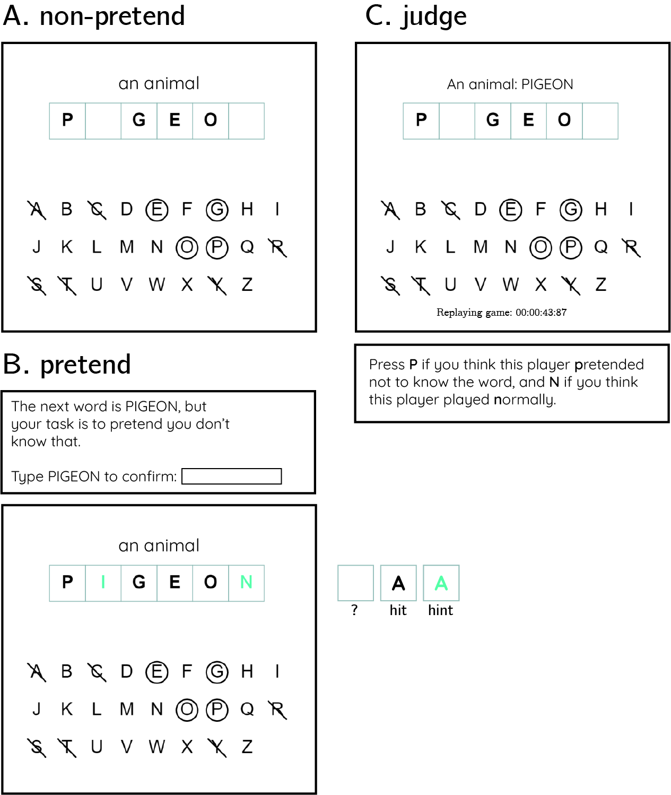

```{r global_options, include=FALSE}
set.seed(42)
knitr::opts_chunk$set(fig.crop = F, fig.pos = "tb", fig.path='figs/',
                      echo=F, warning=F, cache=T, 
                      message=F, sanitize = T, 
                      fig.width = 10, fig.height = 5)
```

```{r, libraries, echo=FALSE, warning=FALSE, cache=F}

library(groundhog)

groundhog.library(c(
  'png',
  'grid',
  'ggplot2',
  'svglite',
  'xtable',
  'papaja',
  'tidyverse',
  'broom',
  'cowplot',
  'MESS', # for AUCs
  'lsr', # for effect sizes
  'pwr', # for power calculations
  'brms', # for mixed effects modeling
  'BayesFactor', # for Bayesian t test
  'jsonlite', # parsing data from sort_trial
  'caret', #for cross validation
  'ggrepel' #for word scatterplots
), '2022-12-01')

```

# Exp. 1: Battleship

## Methods

We report how we determined our sample size, all data exclusions (if any), all manipulations, and all measures in the study. <!-- 21-word solution (Simmons, Nelson & Simonsohn, 2012; retrieved from http://ssrn.com/abstract=2160588) -->

A detailed pre-registration can be accessed at [osf.io/v9zsb](https://osf.io/v9zsb). The pre-registration was time-locked using cryptographic randomization-based time-locking [@mazor2019] (protocol sum: 60c270410375e8a192468fc1a0e9c93da60d5e203eb2760b621a8631a26f4c5c; [link to relevant lines in experimental code](https://github.com/matanmazor/ignorance/blob/44ef964c0d7d4a8f3b76ec52316a8e624c41a047/experiments/Battleships2/code/index.html#L865-L876)).

```{r battleship-load-data, warning=FALSE}

E2.df <- read.csv('../experiments/Battleships2/data/batch1/jatos_results_batch1.csv',na.strings=c(""," ","NA")) %>%
  mutate(subj_id = paste(as.character(participant_number),substr(PROLIFIC_PID,1,4),sep='')) %>%
  mutate(subj_id = factor(subj_id)) %>%
  # the dash is breaking r
  mutate(test_part = ifelse(test_part=='non-pretend','nonpretend',test_part)) %>%
  mutate(genuine_first=genuine_first=='True');

E2.export <- read.csv('../experiments/Battleships2/data/batch1/prolific_export_batch1.csv',na.strings=c(""," ","NA"));

E2.bonus <- read.csv('../experiments/Battleships2/data/batch1/bonus.csv',na.strings=c(""," ","NA"))

```

### Participants

The research complied with all relevant ethical regulations and was approved by the Research Ethics Committee of Johns Hopkins University. 500 Participants were recruited via Prolific (prolific.co) and gave their informed consent prior to their participation. They were selected based on their acceptance rate (\>95%) and for being native English speakers. The entire experiment took approximately 20 minutes to complete. Participants' pay was equivalent to an hourly wage of 9.50 USD, in addition to a bonus payment (`r E2.bonus$bonus%>%min()` - `r E2.bonus$bonus%>%max()` USD, mean = `r E2.bonus$bonus%>%mean()%>%printnum()`).

### Procedure

Participants were first instructed that the experiment, based on the game Battleships, had three parts, and that they could accumulate 'points' that would later translate to a monetary bonus payment. They were then presented with a leaderboard of previous players, and given the rules of the game:

> "In the game Battleships, your task is to sink all ships located in a grid with as few clicks as possible. What makes the game difficult is that you can't see the ships; all you can see is a grid of squares, and you have to guess where the ships are. To sink a ship, you need to click on all of the squares it is located in. If you hit part of a ship, the square will turn red. If there is no ship in the square, it will turn blue."

We further explained that in this version of the game, ships can touch corners, but their sides can't touch. This explanation was accompanied by a visual presentation of legal and illegal ship configurations.

After completing a comprehension question and a practice round, participants completed one 'pretend' and one 'non-pretend' block, each comprising five full games and one half game (see below for details). The order of pretend and non-pretend blocks was counterbalanced between participants. The allocation of boards (spatial configurations of ships; see Fig. 1A) to conditions was randomized between participants such that exactly one board was played in both pretend and non-pretend conditions, and this common board was different for different participants. The order of boards within a block was fully randomized, with the exception that half-games were always played last.

#### Non-pretend (normal) games

In non-pretend games (Fig. 1B), participants aimed to sink two 2-square patrol boats and one 3-square submarine with as few clicks as possible. An online counter of the number of clicks was displayed on the screen. After each game, feedback was given about the number of clicks and resulting number of points obtained.

#### Pretend games

Participants in pretend games were given the same explanation of Battleships, and played a practice round. However, they were then given an additional twist:

> "This time your goal is different. In this round, we're going to tell you where the ships are, but **we want you to act like you don't know this information**. We've marked the ships' locations with a cross, so you'll know where they are the whole time; but your job is to play the game as if these hints aren't there. To see how good you are at this, we're going to compare your games to the games of people who actually had no hints, and see how similar they are. We will measure where and when you clicked; if your clicks look similar to people who played like normal (trying to reveal all ships with as few clicks as possible, but without any hints), you'll get bonus points. But if your games look different, you won't get these bonus points. Your number of clicks in this part will not affect your bonus. Only your ability to play like you had no hints."

We informed participants that both the location and timing of their cell clicks will be measured. After one practice round and one comprehension question, participants played five pretend games (Fig. 1C), followed by one pretend half-game. Each game was followed by a short message, reminding them that a game that looks similar to the games of participants who had no hints would be awarded 10 bonus points.

```{r battleship-design, echo=FALSE, fig.cap="Experimental Design. See Methods for details.", out.width = '100%'}
knitr::include_graphics("figures/Battleships_design.png")
```

#### Half games

In order to directly compare participants' pretend and non-pretend games for identical belief states (genuine or pretended ignorance about where the ships are hidden), participants completed one pretend and one non-pretend game given a partly finished board with the content of 7 cells already revealed (see Fig. 1D). We designed our half games to produce a strong expectation to find a ship in specific cells, but not in others. The assignment of half-completed boards to pretend and non-pretend conditions was randomized between participants.

#### Judge trials

In the final part of the experiment, participants observed the games of previous players and tried to determine who had hints and who didn't. On each trial, two empty grids were presented side by side, with a smaller grid on top, displaying the hidden positions of ships on the grid (Fig. 1F). The two grids corresponded to the true games of two previous players who played a version of the top grid either as pretenders or as non-pretenders. Only games shorter than one minute were chosen for presentation in this part. For non-pretend games, only games from the group of participants that pretended in the second block (and played normally in the first block) were chosen for presentation in this part. Judge participants observed a real time replay of the two grids, showing not only where participants clicked, but also when. After making a decision, participants were informed whether they would receive the 10 bonus points, or alternatively, whether the pretender would receive them in the event the pretender managed to trick them.

A more detailed description of the study procedure is provided in the study [pre-registration document](https://osf.io/v9zsb). Readers are also invited to try a [demo of the experiment](https://jatos.mindprobe.eu/publix/NervzpM0Y0z).

### Data analysis

We used `r cite_r("r-references.bib")` for all our analyses.

## Results

```{r battleship-subject-comments, echo=FALSE}

E2.comments <- E2.df %>%
  filter(!is.na(responses) & is.na(test_part)) %>%
  dplyr::select(subj_id,responses) %>%
  mutate(comments = map(responses, ~fromJSON(.) %>%as.data.frame()))%>%
  unnest(comments)%>%
  dplyr::select(subj_id,worker_comments)%>%
  filter(!is.na(worker_comments) & worker_comments!="") %>%
  mutate(worker_comments = gsub("[\r\n]", "",worker_comments))

E2.debrief <- E2.df %>%
  filter(!is.na(responses) & is.na(test_part)) %>%
  dplyr::select(subj_id,responses) %>%
  mutate(comments = map(responses, ~fromJSON(.) %>%as.data.frame()))%>%
  unnest(comments)%>%
  dplyr::select(subj_id,debrief)%>%
  filter(!is.na(debrief) & debrief != "")%>%
  mutate(debrief = gsub("[\r\n]", "",debrief))

```

We designed our analyses to explore subjects' capacity for self-simulation under a counterfactual knowledge state, and the limits of this capacity. We focused on where subjects clicked and when, and asked whether this differed between pretend and non-pretend games. All analyses were pre-registered unless otherwise specified. In our pre-registration document, we committed to separately analyzing participants according to whether they pretended before or after completing a non-pretend block. Whenever there is a mismatch between the two groups, we focus on the first block of each participant (only pretend games from participants who pretended first, and only standard games from participants who played normally first). We do so to ensure that any successful pretending is not due to memory of one's own behavior in a previous block, and that non-pretend games are not biased by experience with the pretend block.

```{r battleship-num_clicks, echo=FALSE, cache=TRUE}

E2.click_df <- E2.df %>%
  dplyr::select(subj_id, 
         test_part, 
         grid_number, 
         num_clicks,
         click_log,
         genuine_first) %>%
  mutate(click_log = gsub("\'","\"", click_log)) %>%
  filter(test_part=='pretend' | test_part=='nonpretend');

E2.median_clicks <- E2.click_df %>%
  group_by(subj_id,test_part, genuine_first) %>%
  summarise(num_clicks=median(num_clicks)) %>%
  spread(test_part,num_clicks);

E2.lucky_pretenders <- E2.click_df%>%filter(num_clicks==7)%>%pull(subj_id)%>%unique();

E2.median_clicks_filtered <- E2.click_df %>%
  filter(!(subj_id %in% E2.lucky_pretenders))%>%
  group_by(subj_id,test_part, genuine_first) %>%
  summarise(num_clicks=median(num_clicks)) %>%
  spread(test_part,num_clicks);

p<- E2.click_df %>%
    group_by(subj_id,test_part, genuine_first) %>%
    summarise(num_clicks=median(num_clicks)) %>%
    mutate(genuine_first = ifelse(genuine_first, 'non-pretend then pretend', 'pretend then non-pretend'))%>%
    ggplot(aes(x=num_clicks,fill=test_part))+
    geom_bar( color="#e9ecef", alpha=0.6, position = 'identity') +
    scale_fill_manual(values=c("#69b3a2", "#404080")) +
    labs(x='median number of clicks', y='number of players')+
    theme(legend.position=c(0.10,0.85)) +
    theme_classic()
    # geom_vline(xintercept= median_simulated)+
    # facet_wrap(~genuine_first, nrow=2);

ggsave('../docs/figures/E2_num_clicks.png',p,width=5,height=2, dpi=300)

```

```{r battleship-useful_functions, echo=FALSE, cache=TRUE}

all_possible_boards <- read.csv('../analysis/flat_boards.csv',header=FALSE);

create_board_states <- function(flat_positions,hit) {
  
  board_state = rep(NA,25)
  board_states = c();
  for (p in seq_along(flat_positions)) {
    board_states = c(board_states, paste(board_state,collapse=','));
    board_state[flat_positions[p]]=ifelse(hit[p],1,0);
  }
  
  return(board_states)
};

get_likelihood <- function(board_state) {
  
  board_state = scan(text= board_state, what = numeric(), sep="," , quiet = TRUE);
  
  revealed_positions <- which(!is.na(board_state));
  
  boards_to_remove = c();
  
  for (position in revealed_positions) {
    boards_to_remove = union(boards_to_remove, which(all_possible_boards[,position] != board_state[position]))
  }
  
  survived_boards = setdiff(1:nrow(all_possible_boards), boards_to_remove);
  likelihood = all_possible_boards[survived_boards,]%>%colMeans();
  likelihood[revealed_positions]=NA;
  
  return(paste(likelihood,collapse=','))
  
};

get_posterior <- function(likelihood) {
    likelihood = scan(text= likelihood, what = numeric(), sep="," , quiet = TRUE);
    posterior = likelihood/sum(likelihood,na.rm=TRUE); # assuming a uniform prior
    return(paste(posterior,collapse=','))
}


get_p_click <- function(posterior, flat_position) {
  posterior <- scan(text= posterior, what = numeric(), sep="," , quiet = TRUE);
  return(posterior[flat_position])
}

get_p_click_rank <- function(posterior, flat_position) {
  posterior <- scan(text= posterior, what = numeric(), sep="," , quiet = TRUE);
  rank_posterior = rank(-posterior)
  return(rank_posterior[flat_position])
}

get_posterior_entropy <- function(posterior) {
  posterior <- scan(text= posterior, what = numeric(), sep="," , quiet = TRUE);
  posterior[which(posterior==0)]=NA; #to avoid infinity*0
  entropy <- -sum(unlist(posterior)*(unlist(log(posterior))),na.rm=TRUE);
  return(entropy);
}

```

```{r battleship-parse-click-log, echo-FALSE, cache=TRUE}

E2.click_log <- readRDS('../experiments/Battleships2/data/batch1/click_log.Rda');

# E2.click_log <- data.frame(matrix(ncol=10,nrow=0, 
#                                dimnames=list(NULL, 
#                                              c("subj_id",
#                                               "test_part", 
#                                               "grid_number", 
#                                               "num_clicks",
#                                               "i",
#                                               "j",
#                                               "hit",
#                                               "t",
#                                               "click_number",
#                                               "genuine_first"))))
# 
# 
# for (row in 1:nrow(E2.click_df)) {
#   
#     subject_click_log <- data.frame(fromJSON(E2.click_df[row, ]$click_log)) %>%
#     mutate(
#       click_number = 1:n(),
#       subj_id = E2.click_df[row, ]$subj_id,
#       test_part = E2.click_df[row, ]$test_part,
#       grid_number = E2.click_df[row, ]$grid_number,
#       num_clicks = E2.click_df[row, ]$num_clicks,
#       genuine_first = E2.click_df[row, ]$genuine_first
#     )
#     
#     E2.click_log <- rbind(E2.click_log, subject_click_log);
# }
#     
# 
# E2.click_log <- E2.click_log %>%
#   relocate(subj_id, .before = i) %>%
#   relocate(genuine_first, .before = i) %>% 
#   relocate(test_part, .before=i) %>% 
#   relocate(grid_number, .before=i) %>% 
#   relocate(click_number, .before=i) %>%
#   group_by(subj_id,test_part,grid_number) %>%
#   mutate(RT=t-lag(t,default=0)) %>%
#   filter(!(subj_id %in% E2.lucky_pretenders))%>%
#  mutate(hit_bin = hit !=0,
#         lag3 = lag(hit,3)!=0,
#         lag2 = lag(hit,2)!=0,
#         lag1 = lag(hit,1)!=0,
#         lead1 = lead(hit,1)!=0,
#         lead2 = lead(hit,2)!=0,
#         lead3 = lead(hit,3)!=0)

```

```{r battleship-duration, echo-FALSE, cache=TRUE}

E2.duration_log <- E2.click_log %>% 
  group_by(subj_id,test_part,grid_number, genuine_first) %>%
  summarise(duration=sum(RT)) %>% 
  group_by(subj_id,test_part,genuine_first) %>% 
  summarise(duration=median(duration)) %>% 
  spread(test_part,duration) %>%
  mutate(diff=pretend-nonpretend)

```

### Hypothesis 1 (game duration)

Pretend games were longer than non-pretend games by `r (E2.duration_log %>%pull(diff)%>%median()/1000)%>%round()` seconds on average. This was true in the pretend-first group (`r E2.duration_log %>% filter(!genuine_first)%>%pull(diff)%>%t.test()%>%apa_print()%>%'$'(statistic)`), and in the pretend-second groups (`r E2.duration_log %>% filter(genuine_first)%>%pull(diff)%>%t.test()%>%apa_print()%>%'$'(statistic)`).

```{r battleship-h1-plot, echo-FALSE, cache=TRUE, fig.width=10,fig.height=5}

E2.click_log %>% 
  group_by(subj_id,test_part,grid_number, genuine_first) %>%
  summarise(duration=sum(RT)/1000) %>% 
  group_by(subj_id,test_part,genuine_first) %>% 
  summarise(duration=median(duration)) %>%
  ggplot(aes(x=duration,color=test_part, fill=test_part)) +
  geom_histogram(position='identity',alpha=0.5)  +  
  scale_fill_manual(values=c("#69b3a2", "#404080")) +
  scale_color_manual(values=c("#69b3a2", "#404080")) +
    labs(x='game duration (seconds)')+
    theme(legend.position=c(0.10,0.85)) +
    theme_classic()

```

```{r battleship-first-click, echo-FALSE, cache=TRUE}

E2.first_click_log <- E2.click_log %>% 
  group_by(subj_id,test_part,grid_number, genuine_first) %>%
  summarise(RT=RT[click_number==1]) %>% 
  group_by(subj_id,test_part,genuine_first) %>% 
  summarise(RT=median(RT)) %>% 
  spread(test_part,RT) %>%
  mutate(diff=pretend-nonpretend)

```

### Hypothesis 2 (first click latency)

The first click in pretend games took longer to execute by `r E2.first_click_log %>%pull(diff)%>%median()%>%round()` ms. This was true in the pretend-first group (`r E2.first_click_log %>% filter(!genuine_first)%>%pull(diff)%>%t.test()%>%apa_print()%>%'$'(statistic)`), but not in the pretend-second groups (`r E2.first_click_log %>% filter(genuine_first)%>%pull(diff)%>%t.test()%>%apa_print()%>%'$'(statistic)`). As per our pre-registration document, we focused our analysis on the first blocks only, using a between-subject t-test. This test revealed a significant difference in the first click latency (`r t.test(E2.first_click_log%>%filter(!genuine_first)%>%pull(pretend), E2.first_click_log%>%filter(genuine_first)%>%pull(nonpretend))%>%apa_print()%>%'$'(full_result)`).

```{r battleship-h2-plot, echo-FALSE, cache=TRUE, fig.width=10,fig.height=5}

E2.click_log %>% 
  group_by(subj_id,test_part,grid_number, genuine_first) %>%
  summarise(RT=RT[click_number==1]) %>% 
  group_by(subj_id,test_part,genuine_first) %>% 
  summarise(RT=median(RT)) %>%
  filter(RT<20000)%>%
  ggplot(aes(x=RT,color=test_part, fill=test_part)) +
  geom_histogram(position='identity',alpha=0.5)  +  
  scale_fill_manual(values=c("#69b3a2", "#404080")) +
  scale_color_manual(values=c("#69b3a2", "#404080")) +
    labs(x='time to first cell selection (ms)')+
    theme(legend.position=c(0.10,0.85)) +
    theme_classic()

```

```{r battleship-num-clicks, echo=FALSE, cache=TRUE}

E2.click_df <- E2.df %>%
  dplyr::select(subj_id, 
         test_part, 
         grid_number, 
         num_clicks,
         click_log,
         genuine_first) %>%
  mutate(click_log = gsub("\'","\"", click_log)) %>%
  filter(test_part=='pretend' | test_part=='nonpretend');

E2.median_clicks <- E2.click_df %>%
  group_by(subj_id,test_part, genuine_first) %>%
  summarise(num_clicks=median(num_clicks)) %>%
  spread(test_part,num_clicks) %>%
  mutate(diff=pretend-nonpretend);

E2.lucky_pretenders <- E2.click_df%>%filter(num_clicks==7)%>%pull(subj_id)%>%unique();

E2.median_clicks_filtered <- E2.click_df %>%
  filter(!(subj_id %in% E2.lucky_pretenders))%>%
  group_by(subj_id,test_part, genuine_first) %>%
  summarise(num_clicks=median(num_clicks)) %>%
  spread(test_part,num_clicks);

p<- E2.click_df %>%
    group_by(subj_id,test_part, genuine_first) %>%
    summarise(num_clicks=median(num_clicks)) %>%
    mutate(genuine_first = ifelse(genuine_first, 'non-pretend then pretend', 'pretend then non-pretend'))%>%
    ggplot(aes(x=num_clicks,fill=test_part))+
    geom_bar( color="#e9ecef", alpha=0.6, position = 'identity') +
    scale_fill_manual(values=c("#69b3a2", "#404080")) +
    labs(x='median number of clicks', y='number of players')+
    theme(legend.position=c(0.10,0.85)) +
    theme_classic()
    # geom_vline(xintercept= median_simulated)+
    # facet_wrap(~genuine_first, nrow=2);

ggsave('../docs/figures/E2_num_clicks.png',p,width=5,height=2, dpi=300)

```

```{r simulate_nclicks, echo=FALSE, cache=TRUE}

## simulate number of clicks for random play

num_clicks_sim = c();
nsim = 2500
boards = rep(NaN,25)

for (i in 1:nsim) {
  board = rep(c(0),25);
  while (sum(board)<7) {
    board[sample(1:25,1)]=1
  }
  nc = which(board==1)%>%tail(n=1);
  num_clicks_sim = c(num_clicks_sim, nc);
  if (nc<25) {
    board[(nc+1):length(board)]=NaN;
  }
  boards = rbind(boards,board)
}


## OPTIMAL PLAYER


simulate_optimal_game <- function(ship_positions) {
  #initialize
  board_state <- rep(NA,25); 
  nhits <- 0;
  nclicks <- 0;
  nships <- sum(ship_positions);
  
  while (nships>nhits) {
    
    posterior <- get_likelihood(paste(board_state,collapse=',')) %>%
      get_posterior() %>%
      scan(text = ., what= numeric(), sep="," , quiet = TRUE);
    
    best_shot = which.max(posterior);
    
    #click on best shot
    nclicks = nclicks+1;
    result = ship_positions[best_shot]
    if (result==1) {
      nhits = nhits+1;
    }
    board_state[best_shot]=result;

  }
  
  return(nclicks)
  
}

# nsim = 2500;
# nboards = all_possible_boards%>%nrow();

# for (i in 1:nsim) {
#   cur_board = all_possible_boards[sample(1:nboards,1),];
#   num_clicks_optimal_sim = c(num_clicks_optimal_sim,simulate_optimal_game(cur_board));
# }
# save(num_clicks_sim, num_clicks_optimal_sim, file='num_clicks_sim.RData')

load('num_clicks_sim.RData')
simulated_hits <- data.frame(click_number=1:25,mean_hit=colMeans(boards,na.rm=T))

```

### Hypothesis 3 (number of clicks)

To sink all ships, players had to click on at least 7 and at most 25 squares. A simulated player that clicks randomly had a median total click number of `r num_clicks_sim%>%median()`, and a near-optimal greedy player that consistently selected the square with the highest objective probability of containing a ship had a median total click number of `r num_clicks_optimal_sim%>%median()`. Among our players, the median number of clicks was `r E2.median_clicks%>%pull(nonpretend)%>%median()` in both pretend and non-pretend games.

No significant difference in the total number of clicks was observed in the pretend-first group (`r E2.median_clicks%>%filter(!genuine_first)%>%pull(diff)%>%t.test()%>%apa_print()%>%'$'(statistic)`), but a significant difference was observed in the pretend-second group (`r E2.median_clicks%>%filter(genuine_first)%>%pull(diff)%>%t.test()%>%apa_print()%>%'$'(statistic)`). Note that the two effects point in opposite directions, reflecting a tendency to make fewer clicks in the second block of the game. Crucially, when focusing on the first block only, We observed no significant difference in the number of clicks between the two conditions (`r t.test(E2.median_clicks%>%filter(genuine_first)%>%pull(nonpretend),E2.median_clicks%>%filter(!genuine_first)%>%pull(pretend))%>%apa_print()%>%'$'(statistic)`).

In `r E2.click_df%>%filter(num_clicks==7)%>%nrow()` pretend games from `r E2.lucky_pretenders%>%length()` players, games were completed after 7 clicks only, without ever missing a ship. This never happened in non-pretend games. We assumed that these participants did not follow the task instructions, and excluded them from all analyses.

```{r battleship-h3-plot, echo-FALSE, cache=TRUE, fig.width=10,fig.height=5}

E2.random_click_df <- data.frame(num_clicks_sim) %>% 
  rename(num_clicks = num_clicks_sim) %>% 
  mutate(test_part='random', 
         subj_id=rep(seq(500),each=5));

num_clicks_optimal_sim_2500 = num_clicks_optimal_sim[1:2500]

E2.optimal_click_df <- data.frame(num_clicks_optimal_sim_2500) %>% 
  rename(num_clicks = num_clicks_optimal_sim_2500) %>% 
  mutate(test_part='optimal', 
         subj_id=rep(seq(500),each=5))

E2.click_df %>%
  dplyr::select(subj_id,test_part, num_clicks) %>%
  mutate(subj_id=as.character(subj_id)) %>%
  rbind(E2.optimal_click_df) %>%
  rbind(E2.random_click_df) %>%
  mutate(test_part = factor(test_part, levels=c(
    'nonpretend','pretend','optimal','random'
  ))) %>%
  group_by(subj_id,test_part) %>%
  summarise(num_clicks=median(num_clicks)) %>%
  ggplot(aes(x=num_clicks,fill=test_part))+
  geom_bar( color="black", alpha=0.6, position = 'identity') +
  scale_fill_manual(values=c("#69b3a2", "#404080", "#FDE725", 'black')) +
  labs(x='median number of clicks', y='number of players')+
  theme(legend.position=c(0.10,0.85)) +
  theme_classic()

```

```{r RT_by_accuracy}

N_perm <- 1000;
bootstrap_error <- function(x, N_perm) {
  N <- length(x)
  medians = c();
  for (i in 1:N_perm) {
    medians = c(medians,sample(x,replace=TRUE,size=N)%>%median())
  };
  return(sd(medians))
}


E2.RT_by_lag3 <- E2.click_log %>%
  filter(click_number>3) %>%
  group_by(subj_id,test_part,lag3,genuine_first)%>%
  summarise(RT=median(RT))  %>%
  spread(lag3,RT,sep='_') %>%
  mutate(lag3_diff = lag3_TRUE-lag3_FALSE);

E2.RT_by_lag2 <- E2.click_log %>%
  filter(click_number>2) %>%
  group_by(subj_id,test_part,lag2,genuine_first)%>%
  summarise(RT=median(RT))  %>%
  spread(lag2,RT,sep='_') %>%
  mutate(lag2_diff = lag2_TRUE-lag2_FALSE);

E2.RT_by_lag1 <- E2.click_log %>%
  filter(click_number>1) %>%
  group_by(subj_id,test_part,lag1,genuine_first)%>%
  summarise(RT=median(RT))  %>%
  spread(lag1,RT,sep='_') %>%
  mutate(lag1_diff = lag1_TRUE-lag1_FALSE)

E2.RT_by_hit <- E2.click_log %>%
  filter(click_number>0) %>%
  group_by(subj_id,test_part,hit_bin,genuine_first)%>%
  summarise(RT=median(RT))  %>%
  spread(hit_bin,RT,sep='_') %>%
  mutate(hit_diff = hit_bin_TRUE-hit_bin_FALSE)


E2.RT_by_lead1 <- E2.click_log %>%
  filter(click_number<num_clicks) %>%
  group_by(subj_id,test_part,lead1,genuine_first)%>%
  summarise(RT=median(RT))  %>%
  spread(lead1,RT,sep='_') %>%
  mutate(lead1_diff = lead1_TRUE-lead1_FALSE);

E2.RT_by_lead2 <- E2.click_log %>%
  filter(click_number<num_clicks-1) %>%
  group_by(subj_id,test_part,lead2,genuine_first)%>%
  summarise(RT=median(RT))  %>%
  spread(lead2,RT,sep='_') %>%
  mutate(lead2_diff = lead2_TRUE-lead2_FALSE)

E2.RT_by_lead3 <- E2.click_log %>%
  filter(click_number<num_clicks-2) %>%
  group_by(subj_id,test_part,lead3,genuine_first)%>%
  summarise(RT=median(RT))  %>%
  spread(lead3,RT,sep='_') %>%
  mutate(lead3_diff = lead3_TRUE-lead3_FALSE)

E2.RT_by_hit_lags <- E2.RT_by_lag3 %>%
  merge(E2.RT_by_lag2) %>%
  merge(E2.RT_by_lag1) %>%
  merge(E2.RT_by_hit) %>%
  merge(E2.RT_by_lead1) %>%
  merge(E2.RT_by_lead2) %>%
  merge(E2.RT_by_lead3);

E2.RT_by_hit_lags_long <- E2.RT_by_hit_lags %>%
  gather("position","difference",c("lag3_diff","lag2_diff", "lag1_diff", "hit_diff", "lead1_diff", "lead2_diff", "lead3_diff"))%>%
  mutate(position = ifelse(position=="lag3_diff", 3,
                           ifelse(position=="lag2_diff",2,
                                  ifelse(position=="lag1_diff",1,
                                         ifelse(position=="hit_diff",0,
                                                ifelse(position=="lead1_diff",-1,
                                                       ifelse(position=="lead2_diff",-2,-3
                                                              ))))))) %>%
  dplyr::select(subj_id,test_part,genuine_first,position,difference);

p<- E2.RT_by_hit_lags_long %>% 
  filter(position<2 & position > -2)%>%
  group_by(test_part,position) %>%
  summarise(median_difference=median(difference),
            sem_difference=bootstrap_error(difference,N_perm)) %>%
  ggplot(aes(x=position,color=test_part,fill=test_part,y=median_difference)) +
  scale_fill_manual(values=c("#69b3a2", "#404080")) +
  scale_color_manual(values=c("#69b3a2", "#404080")) +
  scale_x_continuous(breaks=-1:1,labels=c('hit on next trial', 'hit on current trial', 'hit on previous trial'))+
  geom_abline(slope=0,intercept=0,linetype=3)+
  geom_path(size=1)+
  geom_ribbon(aes(ymin=median_difference-sem_difference,ymax=median_difference+sem_difference),alpha=0.3,show.legend=F)+
  labs(fill=' ',x='', y='RT effect (ms) of hit on trial t')+
  theme_classic()

ggsave('figures/E2_RT_by_lag.pdf',p,width=7)
ggsave('figures/E2_RT_by_lag.png',p,width=4, height=3.5, dpi=300)


```

### Hypothesis 4 (click latency by outcome)

In non-pretend games, cell selections that resulted in a hit were faster by `r E2.RT_by_hit_lags %>% filter(test_part=='nonpretend')%>%pull(hit_diff)%>%median()%>%round()%>%abs()` ms. than those that resulted in a miss (pretend-first group: `r E2.RT_by_hit_lags %>% filter(test_part=='nonpretend' & !genuine_first)%>%pull(hit_diff)%>%t.test()%>%apa_print()%>%'$'(statistic)`; pretend-second group: `r E2.RT_by_hit_lags %>% filter(test_part=='nonpretend' & genuine_first)%>%pull(hit_diff)%>%t.test()%>%apa_print()%>%'$'(statistic)`).

In pretend games, cell selections that resulted in a hit were faster by `r E2.RT_by_hit_lags %>% filter(test_part=='pretend')%>%pull(hit_diff)%>%median()%>%round()%>%abs()` ms. than those that resulted in a miss (pretend-first group: `r E2.RT_by_hit_lags %>% filter(test_part=='pretend' & !genuine_first)%>%pull(hit_diff)%>%t.test()%>%apa_print()%>%'$'(statistic)`; pretend-second group: `r E2.RT_by_hit_lags %>% filter(test_part=='pretend' & genuine_first)%>%pull(hit_diff)%>%t.test()%>%apa_print()%>%'$'(statistic)`). The effect of hitting versus missing a ship was significantly stronger in pretend games (pretend-first group: `r E2.RT_by_hit_lags_long %>% filter(position==0 & !genuine_first)%>%spread(test_part,difference)%>%mutate(diff=pretend-nonpretend)%>%pull(diff)%>%t.test()%>%apa_print()%>%'$'(statistic)`; pretend-second group: `r E2.RT_by_hit_lags_long %>% filter(position==0 & genuine_first)%>%spread(test_part,difference)%>%mutate(diff=pretend-nonpretend)%>%pull(diff)%>%t.test()%>%apa_print()%>%'$'(statistic)`).

### Hypothesis 5 (click latency by previous outcome)

In non-pretend games, cell selections that followed a hit were slower by `r E2.RT_by_hit_lags %>% filter(test_part=='nonpretend')%>%pull(lag1_diff)%>%median()%>%round()%>%abs()` ms. than those that followed a miss (pretend-first group: `r E2.RT_by_hit_lags %>% filter(test_part=='nonpretend' & !genuine_first)%>%pull(lag1_diff)%>%t.test()%>%apa_print()%>%'$'(statistic)`; pretend-second group: `r E2.RT_by_hit_lags %>% filter(test_part=='nonpretend' & genuine_first)%>%pull(lag1_diff)%>%t.test()%>%apa_print()%>%'$'(statistic)`).

In pretend games, cell selections that followed in a hit were slower by `r E2.RT_by_hit_lags %>% filter(test_part=='pretend')%>%pull(lag1_diff)%>%median()%>%round()%>%abs()` ms. than those that followed a miss (pretend-first group: `r E2.RT_by_hit_lags %>% filter(test_part=='pretend' & !genuine_first)%>%pull(lag1_diff)%>%t.test()%>%apa_print()%>%'$'(statistic)`; pretend-second group: `r E2.RT_by_hit_lags %>% filter(test_part=='pretend' & genuine_first)%>%pull(lag1_diff)%>%t.test()%>%apa_print()%>%'$'(statistic)`). The effect of following a hit versus a miss was significantly stronger in pretend games only in the pretend-second group (`r E2.RT_by_hit_lags_long %>% filter(position==1 & genuine_first)%>%spread(test_part,difference)%>%mutate(diff=pretend-nonpretend)%>%pull(diff)%>%t.test()%>%apa_print()%>%'$'(statistic)`; pretend-first group: `r E2.RT_by_hit_lags_long %>% filter(position==1 & !genuine_first)%>%spread(test_part,difference)%>%mutate(diff=pretend-nonpretend)%>%pull(diff)%>%t.test()%>%apa_print()%>%'$'(statistic)`). Crucially, the effect was significantly stronger when focusing on the first blocks only (`r t.test(E2.RT_by_hit_lags %>% filter(test_part=='pretend' & !genuine_first)%>%pull(lag1_diff), E2.RT_by_hit_lags %>% filter(test_part=='nonpretend' & genuine_first)%>%pull(lag1_diff))%>%apa_print()%>%'$'(statistic)`).

### Hypothesis 6 (click latency by next outcome)

In non-pretend games, cell selections that preceded a hit were slower than those that preceded a miss only in the group that played normally first (pretend-second group: `r E2.RT_by_hit_lags %>% filter(test_part=='nonpretend' & genuine_first)%>%pull(lead1_diff)%>%t.test()%>%apa_print()%>%'$'(full_result)`), but not in the group that pretended first (`r E2.RT_by_hit_lags %>% filter(test_part=='nonpretend' & !genuine_first)%>%pull(lead1_diff)%>%t.test()%>%apa_print()%>%'$'(full_result)`).

In pretend games, the timing of cell selections did not covary with the outcomes of future cell selections (pretend-first group: `r E2.RT_by_hit_lags %>% filter(test_part=='pretend' & !genuine_first)%>%pull(lead1_diff)%>%t.test()%>%apa_print()%>%'$'(statistic)`; pretend-second group: `r E2.RT_by_hit_lags %>% filter(test_part=='pretend' & genuine_first)%>%pull(lead1_diff)%>%t.test()%>%apa_print()%>%'$'(statistic)`). The effect of the next outcome was significantly weaker in pretend games only in the pretend-second group (`r E2.RT_by_hit_lags_long %>% filter(position==-1 & genuine_first)%>%spread(test_part,difference)%>%mutate(diff=pretend-nonpretend)%>%pull(diff)%>%t.test()%>%apa_print()%>%'$'(statistic)`) but not in the pretend-first group (`r E2.RT_by_hit_lags_long %>% filter(position==-1 & !genuine_first)%>%spread(test_part,difference)%>%mutate(diff=pretend-nonpretend)%>%pull(diff)%>%t.test()%>%apa_print()%>%'$'(statistic)`). Crucially, the effect was significantly weaker when focusing on the first blocks only (`r t.test(E2.RT_by_hit_lags %>% filter(test_part=='pretend' & !genuine_first)%>%pull(lead1_diff), E2.RT_by_hit_lags %>% filter(test_part=='nonpretend' & genuine_first)%>%pull(lead1_diff))%>%apa_print()%>%'$'(statistic)`).

```{r battleship-h4-6-plot, echo-FALSE, cache=TRUE, fig.width=10,fig.height=5}

E2.RT_by_hit_lags_long %>% 
  filter(position<2 & position > -2)%>%
  group_by(test_part,position) %>%
  summarise(median_difference=median(difference),
            sem_difference=bootstrap_error(difference,N_perm)) %>%
  ggplot(aes(x=position,color=test_part,fill=test_part,y=median_difference)) +
  scale_fill_manual(values=c("#69b3a2", "#404080")) +
  scale_color_manual(values=c("#69b3a2", "#404080")) +
  scale_x_continuous(breaks=-1:1,labels=c('hit on next trial', 'hit on current trial', 'hit on previous trial'))+
  geom_abline(slope=0,intercept=0,linetype=3)+
  geom_path(size=1)+
  geom_ribbon(aes(ymin=median_difference-sem_difference,ymax=median_difference+sem_difference),alpha=0.3,show.legend=F)+
  labs(fill=' ',x='', y='RT effect (ms) of hit on trial t')+
  theme(legend.position=c(0.10,0.85)) +
  theme_classic()

```
### Model based analysis

Pretend games were similar to non pretend games in the total number of clicks --- but were they also similar in *where* participants clicked? More specifically, did cell selections in pretend games make sense given the limited information those participants pretended to have? To ask this, we approximated optimal behavior by calculating the probability that a ship is hidden in each cell given available information, $p(ship(x_{i}))$, and the posterior probability that one should click on a square, assuming a uniform prior over cells $P(x_{i})=\frac{p(Ship(x_i))}{\sum_{j=1}^{k}p(Ship(x_j))}$. Critically, in modeling pretend games we did not treat hints as part of this available information for extracting $p(ship(x_{i}))$, because an optimal player should ignore hints in choosing where to click next. Given this posterior map, a rational player should choose cells where $P(x_{i})$ is high [this behavior is not strictly optimal, but approximates optimal behavior in most cases; @audinot2014optimal, Section 3.3]. To quantify optimality, before each cell selection we computed the posterior probability map for all 'unknown' cells. Then, we ranked cells from high to low according to their posterior probability and recorded the rank of the chosen cell: a lower rank indicating more optimal behavior.

```{r battleship-p_click, echo = FALSE, cache=TRUE}

# E2.click_log_with_boards <-E2.click_log %>%
#   dplyr::select(subj_id,genuine_first,test_part,grid_number,click_number,i,j,RT,hit_bin) %>%
#   mutate(flat_position = 1+i*5+j) %>%
#   group_by(subj_id,genuine_first,test_part,grid_number) %>%
#   arrange(click_number) %>%
#   summarise(click_number = click_number,
#             board_state=create_board_states(flat_position,hit_bin),
#             flat_position=flat_position,
#             i=i,
#             j=j,
#             RT=RT,
#             hit_bin=hit_bin) %>%
#   rowwise()%>%
#   mutate(likelihood = get_likelihood(board_state),
#          posterior = get_posterior(likelihood),
#          p_click = get_p_click(posterior,flat_position),
#          entropy = get_posterior_entropy(posterior),
#          p_click_rank = get_p_click_rank(posterior,flat_position));

E2.click_log_with_boards <- readRDS('../experiments/Battleships2/data/batch1/click_log_with_boards.Rda')

get_random_flat_position <- function(board_state) {
  
  board_state = scan(text= board_state, what = numeric(), sep="," , quiet = TRUE);
  return(which(is.na(board_state))%>%sample(1))
  
}

get_optimal_flat_position <- function(posterior) {
  
  posterior = scan(text= posterior, what = numeric(), sep="," , quiet = TRUE);
  return(which.max(posterior))
  
}

E2.click_log_with_boards_optimal <- E2.click_log_with_boards %>%
  mutate(flat_position = get_optimal_flat_position(posterior),
         p_click = get_p_click(posterior,flat_position),
         p_click_rank = get_p_click_rank(posterior,flat_position),
         test_part = 'optimal')

E2.click_log_with_boards_random <- E2.click_log_with_boards %>%
  mutate(flat_position = get_random_flat_position(board_state),
         p_click = get_p_click(posterior,flat_position),
         p_click_rank = get_p_click_rank(posterior,flat_position),
         test_part = 'random')

E2.mean_P_click_rank <- E2.click_log_with_boards %>%
  rbind(E2.click_log_with_boards_optimal) %>%
  rbind(E2.click_log_with_boards_random) %>%
  group_by(subj_id,test_part, genuine_first) %>%
  summarise(p_click_rank=mean(p_click_rank));

E2.mean_P_click_rank_misses_only <- E2.click_log_with_boards %>%
  rbind(E2.click_log_with_boards_optimal) %>%
  rbind(E2.click_log_with_boards_random) %>%
  rowwise() %>%
  filter(!hit_bin) %>%
  group_by(subj_id,test_part, genuine_first) %>%
  summarise(p_click_rank=mean(p_click_rank))

p<- E2.mean_P_click_rank %>%
    filter(test_part != 'optimal') %>%
    mutate(genuine_first = ifelse(genuine_first, 'non-pretend then pretend', 'pretend then non-pretend'))%>%
    ggplot(aes(x=p_click_rank,fill=test_part))+
    geom_histogram( color="#e9ecef", alpha=0.6, position = 'identity') +
    scale_fill_manual(values=c("#69b3a2", "#404080", "#FDE725")) +
    labs(x='p(ship in clicked square) - rank', y='number of players')+
    theme(legend.position=c(0.10,0.85)) +
    # facet_wrap(~genuine_first, nrow=2)+
    # scale_x_reverse() +
    theme_classic();

ggsave('figures/E2_pclick_rank.pdf',p)
ggsave('figures/E2_pclick_rank.png',p,width=5,height=2,dpi=300)

p<- E2.mean_P_click_rank_misses_only %>%
    filter(test_part != 'optimal') %>%
    mutate(genuine_first = ifelse(genuine_first, 'non-pretend then pretend', 'pretend then non-pretend'))%>%
    ggplot(aes(x=p_click_rank,fill=test_part))+
    geom_histogram( color="#e9ecef", alpha=0.6, position = 'identity') +
    scale_fill_manual(values=c("#69b3a2", "#404080", "#FDE725")) +
    labs(x='p(ship in clicked square) - rank', y='number of players')+
    scale_x_continuous(limits=c(0,15))+
    theme(legend.position=c(0.10,0.85)) +
    # facet_wrap(~genuine_first, nrow=2)+
    # scale_x_reverse() +
    theme_classic();

ggsave('figures/E2_pclick_rank_misses_only.pdf',p)
ggsave('figures/E2_pclick_rank_misses_only.png',p,width=5,height=2,dpi=300)

E2.num_irrational_clicks <- E2.click_log_with_boards %>%
  group_by(subj_id,test_part, genuine_first) %>%
  summarise(nic=sum(p_click==0)/5);

p<- E2.num_irrational_clicks %>%
    mutate(genuine_first = ifelse(genuine_first, 'non-pretend then pretend', 'pretend then non-pretend'))%>%
    ggplot(aes(x=nic,fill=test_part))+
    geom_histogram( color="#e9ecef", alpha=0.6, position = 'identity') +
    scale_fill_manual(values=c("#69b3a2", "#404080")) +
    labs(x='mean number of irrational clicks per game', y='number of players')+
    theme(legend.position=c(0.10,0.85)) +
    facet_wrap(~genuine_first, nrow=2)+
    theme_classic();

ggsave('figures/E2_num_irrational_clicks.png',p,width=5,height=3,dpi=300)

 E2.RT_p_click_cor <- E2.click_log_with_boards %>%
     filter(click_number<9 & click_number>1) %>%
     group_by(subj_id,test_part, genuine_first) %>%
     summarise(r=cor(RT,p_click,method='spearman'));
 
 E2.RT_entropy_cor <- E2.click_log_with_boards %>%
     filter(click_number<9 & click_number>1) %>%
     group_by(subj_id,test_part, genuine_first) %>%
     summarise(r=cor(entropy,RT,method='spearman'))


```

### Hypothesis 7 (game optimality)

The mean posterior rank of non-pretend cell selections was `r E2.mean_P_click_rank%>%filter(test_part=='nonpretend')%>%pull(p_click_rank)%>%mean()%>%printnum()` and significantly lower (more optimal) than that of a simulated random agent (`r E2.mean_P_click_rank%>%filter(test_part=='random')%>%pull(p_click_rank)%>%mean()%>%printnum()`, `r E2.mean_P_click_rank%>%spread(test_part,p_click_rank)%>%mutate(diff=nonpretend-random)%>%pull(diff)%>%t.test()%>%apa_print()%>%'$'(statistic)`). Pretend games were significantly less optimal than non-pretend games (`r E2.mean_P_click_rank%>%filter(test_part=='pretend')%>%pull(p_click_rank)%>%mean()%>%printnum()`; pretend-first group: `r E2.mean_P_click_rank%>%filter(!genuine_first)%>%spread(test_part,p_click_rank)%>%mutate(diff=pretend-nonpretend)%>%pull(diff)%>%t.test()%>%apa_print()%>%'$'(statistic)`; pretend-second group: `r E2.mean_P_click_rank%>%filter(genuine_first)%>%spread(test_part,p_click_rank)%>%mutate(diff=pretend-nonpretend)%>%pull(diff)%>%t.test()%>%apa_print()%>%'$'(statistic)`), but still more optimal than those of a random agent (`r E2.mean_P_click_rank%>%spread(test_part,p_click_rank)%>%mutate(diff=pretend-random)%>%pull(diff)%>%t.test()%>%apa_print()%>%'$'(statistic)`). Critically, the same pattern was observed when restricting analysis to cell selections that resulted in a miss (non-pretend - pretend: `r apa_print(t.test(E2.mean_P_click_rank_misses_only%>%filter(genuine_first&test_part=='nonpretend')%>%pull(p_click_rank), E2.mean_P_click_rank_misses_only%>%filter(!genuine_first&test_part=='pretend')%>%pull(p_click_rank)))$statistic`; pretend - random: `r E2.mean_P_click_rank_misses_only%>%spread(test_part,p_click_rank)%>%mutate(diff=pretend-random)%>%pull(diff)%>%t.test()%>%apa_print()%>%'$'(statistic)`). In other words, the optimality of pretend games relative to random cell selection was not merely due to the fact that pretenders clicked on ships more than expected by chance. Even when missing a ship, their cell selections made sense given the limited information they pretended to have.

```{r battleship-h7-plot, echo-FALSE, cache=TRUE, fig.width=10,fig.height=5}

E2.mean_P_click_rank %>%
    filter(test_part != 'optimal') %>%
    mutate(genuine_first = ifelse(genuine_first, 'non-pretend then pretend', 'pretend then non-pretend'))%>%
    ggplot(aes(x=p_click_rank,fill=test_part))+
    geom_histogram( color="black", alpha=0.6, position = 'identity') +
    scale_fill_manual(values=c("#69b3a2", "#404080", "#FDE725")) +
    labs(x='p(ship in clicked square) - rank', y='number of players')+
    theme(legend.position=c(0.10,0.85)) +
    # facet_wrap(~genuine_first, nrow=2)+
    # scale_x_reverse() +
    theme_classic();

```

### Hypothesis 8 (entropy-RT relation)

When playing Battleships, it is sometimes clear what the next cell selection should be, and sometimes more difficult to decide where to click next. To capture this notion of decision uncertainty, we calculated the entropy of the posterior distribution over cell selections $H(P)=-\sum_{i=1}^{k}P(x_i) \log P(x_{i})$, where $P(x_{i})=\frac{p(Ship(x_i))}{\sum_{j=1}^{k}p(Ship(x_j))}$, and asked how this measure relates to decision latency, or the time taken to click on the next cell. $H(P)$ is high when players need to decide between multiple cells with a similar probability of hiding a ship, and low when there are only a few candidates with a high probability of hiding a ship. For every player and condition separately, we fitted a multiple linear regression to predict decision latency based on $H(P)$ and $H(P)^2$. The resulting coefficients were then subjected to a group-level inference. The first cell selection of each game was excluded from this analysis, because entropy was constant for the first click.

```{r entropy-RT, echo=FALSE, cache=TRUE}

E2.RT_by_entropy <- E2.click_log_with_boards %>%
  filter(click_number>1) %>%
  mutate(entropy_bin=round(entropy*2)/2) %>%
  group_by(subj_id,test_part,click_number) %>%
  mutate(corrected_RT = RT-mean(RT)) %>%
  group_by(test_part,subj_id,entropy_bin) %>%
  summarise(RT=median(RT),
            corrected_RT = median(corrected_RT)) %>%
  group_by(test_part,entropy_bin) %>%
  summarise(median_RT=median(RT),
            sem_RT=bootstrap_error(RT,N_perm),
            median_corrected_RT=median(corrected_RT),
            sem_corrected_RT=bootstrap_error(corrected_RT,N_perm))


p <- E2.RT_by_entropy %>%
  ggplot(aes(x=entropy_bin,color=test_part,fill=test_part,y=median_RT)) +
  scale_fill_manual(values=c("#69b3a2", "#404080")) +
  scale_color_manual(values=c("#69b3a2", "#404080")) +
  geom_path(size=1)+
  geom_ribbon(aes(ymin=median_RT-sem_RT,ymax=median_RT+sem_RT),alpha=0.3,show.legend=F)+
  labs(fill=' ',x='Entropy of posterior', y='median RT (ms)')+
  theme_classic()

ggsave('figures/E2_RT_by_entropy_no_split.png',p,width=5,height=2,dpi=300)
# ggsave('../figures/E2_RT_by_entropy_no_split.svg',p,width=5,height=2,dpi=300)

p <- E2.RT_by_entropy %>%
  ggplot(aes(x=entropy_bin,color=test_part,fill=test_part,y=median_corrected_RT)) +
  scale_fill_manual(values=c("#69b3a2", "#404080")) +
  scale_color_manual(values=c("#69b3a2", "#404080")) +
  geom_path(size=1)+
  geom_ribbon(aes(ymin=median_corrected_RT-sem_corrected_RT,ymax=median_corrected_RT+sem_corrected_RT),alpha=0.3,show.legend=F)+
  labs(fill=' ',x='Entropy of posterior', y='median residual RT (ms)')+
  theme_classic()

ggsave('figures/E2_corrected_RT_by_entropy_no_split.png',p,width=5,height=2,dpi=300)


E2.RT_by_entropy_coefs <- E2.click_log_with_boards %>%
  filter(click_number>1) %>%
  group_by(genuine_first,subj_id,test_part,grid_number) %>%
  mutate(entropy_centered = entropy-mean(entropy),
         entropy_squared = entropy_centered^2) %>%
  select(genuine_first,subj_id,test_part,grid_number,click_number,entropy_centered,entropy_squared,RT) %>%
  group_by(genuine_first,subj_id,test_part,grid_number) %>%
  do(model=lm(RT~entropy_centered+entropy_squared,data=.)) %>%
  mutate(tidys=list(broom::tidy(model))) %>%
  unnest(tidys) %>%
  dplyr::select(!c(std.error,statistic,p.value)) %>%
  group_by(genuine_first,subj_id,test_part,term) %>%
  summarise(estimate = mean(estimate))


E2.RT_by_entropy_coefs_summary <- E2.RT_by_entropy_coefs %>%
  group_by(test_part,term) %>%
  summarise(mean_estimate = mean(estimate),
            se_estimate = se(estimate))

p <- E2.RT_by_entropy_coefs_summary %>%
  mutate(term = factor(term,levels=c('entropy_centered','entropy_squared'), labels = c('entropy','entropy squared')))%>%
  filter(term!='(Intercept)') %>%
  ggplot(aes(x=term,y=mean_estimate,fill=test_part)) +
  scale_fill_manual(values=c("#69b3a2", "#404080")) +
  scale_color_manual(values=c("#69b3a2", "#404080")) +
  geom_bar(stat='identity',color='black',position=position_dodge()) +
  geom_errorbar(aes(ymin=mean_estimate-se_estimate,ymax=mean_estimate+se_estimate),width=.2,position=position_dodge(.9))+
  labs(fill=' ',x='term', y='coefficient')+
  theme_classic()

ggsave('figures/E2_RT_by_entropy_coefficients_no_split.png',p,width=5,height=2,dpi=300)


E2.corrected_RT_by_entropy_coefs <- E2.click_log_with_boards %>%
  filter(click_number>1) %>%
  group_by(subj_id,test_part,click_number) %>%
  mutate(corrected_RT = RT-mean(RT)) %>%
  group_by(genuine_first,subj_id,test_part) %>%
  mutate(entropy_centered = entropy-mean(entropy),
         entropy_squared = entropy_centered^2) %>%
  select(genuine_first,subj_id,test_part,entropy_centered,entropy_squared,corrected_RT) %>%
  group_by(genuine_first,subj_id,test_part) %>%
  do(model=lm(corrected_RT~entropy_centered+entropy_squared,data=.)) %>%
  mutate(tidys=list(broom::tidy(model))) %>%
  unnest(tidys) %>%
  dplyr::select(!c(std.error,statistic,p.value))

E2.corrected_RT_by_entropy_coefs_summary <- E2.corrected_RT_by_entropy_coefs %>%
  group_by(test_part,term) %>%
  summarise(mean_estimate = mean(estimate),
            se_estimate = se(estimate)) 

p <- E2.corrected_RT_by_entropy_coefs_summary %>%
  mutate(term = factor(term,levels=c('entropy_centered','entropy_squared'), labels = c('entropy','entropy squared')))%>%
  filter(term!='(Intercept)') %>%
  ggplot(aes(x=term,y=mean_estimate,fill=test_part)) +
  scale_fill_manual(values=c("#69b3a2", "#404080")) +
  scale_color_manual(values=c("#69b3a2", "#404080")) +
  geom_bar(stat='identity',color='black',position=position_dodge()) +
  geom_errorbar(aes(ymin=mean_estimate-se_estimate,ymax=mean_estimate+se_estimate),width=.2,position=position_dodge(.9))+
  labs(fill=' ',x='term', y='coefficient')+
  theme_classic()

ggsave('figures/E2_corrected_RT_by_entropy_coefficients_no_split.png',p,width=5,height=2,dpi=300)


```

In non-pretend games, we found no evidence for a linear relation between decision entropy and decision latency among participants who played normally in the first block (`r apa_print(E2.RT_by_entropy_coefs%>%filter(test_part=='nonpretend' &term=='entropy_centered' & genuine_first)%>%pull(estimate)%>%t.test())$statistic`). In contrast, a significantly negative linear modulation was observed in the group that pretended in the first and played normally in the second block (`r apa_print(E2.RT_by_entropy_coefs%>%filter(test_part=='nonpretend' &term=='entropy_centered' & !genuine_first)%>%pull(estimate)%>%t.test())$statistic`).

In pretend games, this negative relation between $H(P)$ and click latency was significant in both groups (pretend-first group: `r apa_print(E2.RT_by_entropy_coefs%>%filter(test_part=='pretend' &term=='entropy_centered' & !genuine_first)%>%pull(estimate)%>%t.test())$statistic`; pretend-second group: `r apa_print(E2.RT_by_entropy_coefs%>%filter(test_part=='pretend' &term=='entropy_centered' & genuine_first)%>%pull(estimate)%>%t.test())$statistic`). We found no significant difference between the magnitude of the linear effect in pretend and non-pretend games (pretend-first group: `r E2.RT_by_entropy_coefs%>%filter(!genuine_first & term=='entropy_centered')%>%spread(test_part,estimate)%>%mutate(diff=pretend-nonpretend)%>%pull(diff)%>%t.test()%>%apa_print()%>%'$'(statistic)`; pretend-second group: `r E2.RT_by_entropy_coefs%>%filter(genuine_first & term=='entropy_centered')%>%spread(test_part,estimate)%>%mutate(diff=pretend-nonpretend)%>%pull(diff)%>%t.test()%>%apa_print()%>%'$'(statistic)`).

Similarly, we found no evidence for a quadratic relation between decision entropy and decision latency in non-pretend games of participants who played normally in the first block (`r apa_print(E2.RT_by_entropy_coefs%>%filter(test_part=='nonpretend' &term=='entropy_squared' & genuine_first)%>%pull(estimate)%>%t.test())$statistic`). Again, a significantly negative quadratic modulation was observed in the non-pretend games of players who pretended in the first and played normally in the second block (`r apa_print(E2.RT_by_entropy_coefs%>%filter(test_part=='nonpretend' &term=='entropy_squared' & !genuine_first)%>%pull(estimate)%>%t.test())$statistic`). Like the linear effect, this negative quadratic relation was significant in the pretend games of both groups (pretend-first group: `r apa_print(E2.RT_by_entropy_coefs%>%filter(test_part=='pretend' &term=='entropy_squared' & !genuine_first)%>%pull(estimate)%>%t.test())$statistic`; pretend-second group: `r apa_print(E2.RT_by_entropy_coefs%>%filter(test_part=='pretend' &term=='entropy_squared' & genuine_first)%>%pull(estimate)%>%t.test())$statistic`). This negative quadratic effect was stronger in pretend compared to non-pretend games (pretend-first group: `r E2.RT_by_entropy_coefs%>%filter(!genuine_first & term=='entropy_squared')%>%spread(test_part,estimate)%>%mutate(diff=pretend-nonpretend)%>%pull(diff)%>%t.test()%>%apa_print()%>%'$'(statistic)`; pretend-second group: `r E2.RT_by_entropy_coefs%>%filter(genuine_first & term=='entropy_squared')%>%spread(test_part,estimate)%>%mutate(diff=pretend-nonpretend)%>%pull(diff)%>%t.test()%>%apa_print()%>%'$'(statistic)`).

```{r battleship-h8-plot, echo-FALSE, cache=TRUE, fig.width=10,fig.height=5}

E2.RT_by_entropy %>%
  ggplot(aes(x=entropy_bin,color=test_part,fill=test_part,y=median_RT)) +
  scale_fill_manual(values=c("#69b3a2", "#404080")) +
  scale_color_manual(values=c("#69b3a2", "#404080")) +
  geom_path(size=1)+
  geom_ribbon(aes(ymin=median_RT-sem_RT,ymax=median_RT+sem_RT),alpha=0.3,show.legend=F)+
  labs(fill=' ',x='Entropy of posterior', y='median RT (ms)')+
  theme_classic()

```
  
```{r judge}

get_common_board = function(grid_number,test_part) {
  pretend_grids = grid_number[which(test_part=='pretend')];
  nonpretend_grids = grid_number[which(test_part=='nonpretend')];
  common_board = intersect(pretend_grids,nonpretend_grids);
  return(common_board)
};

common_boards <- E2.df %>%
  filter(test_part=='pretend' | test_part=='nonpretend') %>%
  dplyr::select(subj_id,grid_number,test_part) %>%
  group_by(subj_id) %>%
  summarise(common_board = get_common_board(grid_number,test_part))


used_for_pretend <- function(s, g) {
  
  return (E2.df%>%filter(test_part=='pretend' &
                           subj_id==s & 
                           grid_number == g) %>%
            nrow()==1)
}

used_for_nonpretend <- function(s, g) {
  
  return (E2.df%>%filter(test_part=='nonpretend' &
                           subj_id==s & 
                           grid_number == g) %>%
            nrow()==1)
}

E2.judge_df <- E2.df %>%
  filter(test_part=='judge' & !(cheat_player %in% E2.lucky_pretenders))%>%
  dplyr::select(subj_id, 
         grid_number, 
         cheat_player,
         genuine_player,
         cheater,
         noncheater,
         decision,
         replay_log,
         choose_pretender,
         correct)%>%
  rowwise()%>%
  mutate(choose_pretender=choose_pretender=='True',
         used_for_pretend = used_for_pretend(subj_id,grid_number),
         used_for_nonpretend = used_for_nonpretend(subj_id,grid_number),
         common_board = used_for_pretend & used_for_nonpretend,
         board_type = ifelse(common_board, 'common',
                             ifelse(used_for_pretend, 'pretend',
                                    ifelse(used_for_nonpretend,'nonpretend','new')))
)


p <- E2.judge_df %>%
  group_by(subj_id) %>%
  summarise(ncorrect=sum(correct)) %>%
  ggplot(aes(x=ncorrect)) +
  geom_bar(fill='black') +
  theme_classic() +
  labs(x='number of correct guesses (out of 5)',y='number of players') +
  scale_x_continuous(breaks=c(0,1,2,3,4,5));

ggsave('figures/E2_correct_guesses.png',p,width=5,height=3,dpi=300)

p <- E2.judge_df %>%
  mutate(choose_pretender = ifelse(choose_pretender,
                                   'who had hints?', 
                                   'who had no hints?')) %>% 
  group_by(choose_pretender,subj_id) %>%
  summarise(ncorrect=sum(correct)) %>%
  ggplot(aes(x=ncorrect)) + 
  geom_bar(fill='black') +
  theme_classic() +
  labs(x='number of correct guesses (out of 5)',y='number of players') + 
  scale_x_continuous(breaks=c(0,1,2,3,4,5)) + 
  facet_wrap(~choose_pretender,nrow=2);

ggsave('figures/E2_correct_guesses_by_choose_pretender.png',p,width=5,height=3,dpi=300);

p <- E2.judge_df %>% 
  group_by(board_type,subj_id) %>%
  summarise(acc=mean(correct)) %>%
  ggplot(aes(x=acc)) + 
  geom_bar(fill='black') +
  theme_classic() +
  labs(x='Accuracy',y='number of players') + 
  scale_x_continuous(breaks=c(0,1,2,3,4,5)) + 
  facet_wrap(~board_type,nrow=1);

ggsave('figures/E2_acc_by_board_type.png',p,width=5,height=3,dpi=300)
```

### Hypothesis 9 (judge accuracy)

Participants were not significantly above chance in judging which of the two presented games came from a pretender (mean accuracy: `r E2.judge_df%>%group_by(subj_id)%>%summarise(accuracy=sum(correct)*20)%>%pull(accuracy)%>%mean()%>%round()`%; t test against 50: `r apa_print(E2.judge_df%>%group_by(subj_id)%>%summarise(accuracy=sum(correct)*20)%>%pull(accuracy)%>%t.test(mu=50))$statistic`).

For a subset of `r E2.judge_df%>%filter(common_board)%>%pull(correct)%>%length()` players, one of the five boards presented in the judging block was already presented both in the pretend and in the non-pretend blocks. Still, even this subset of participants who had just experienced a board both as pretenders and as non-pretenders were not significantly above chance in telling which of two other players had hints for this same board (mean accuracy: 55%, $p=.141$).

```{r judge-pretend-cor, echo=FALSE}

unidentifiable_ss <- E2.judge_df %>%
  mutate(subj_num=substr(as.character(subj_id),1,3))%>%
  group_by(subj_num)%>%
  summarise(subj_id=subj_id, n=n())%>%
  filter(n>5)%>%
  pull(subj_id)%>%
  unique();

E2.judge_performance <- E2.judge_df %>%
  filter(!(subj_id %in% unidentifiable_ss)) %>%
  mutate(subj_num=as.numeric(substr(as.character(subj_id),1,3)))%>%
  group_by(subj_num)%>%
  summarise(judge_rate=sum(correct)/5);

E2.pretend_performance <- E2.judge_df %>%
  filter(!(subj_id %in% unidentifiable_ss)) %>%
  mutate(subj_num=cheat_player)%>%
  group_by(subj_num)%>%
  summarise(ntrials=n(),
            successful_pretend=ntrials-sum(correct),
            pretend_rate = successful_pretend/ntrials);

E2.performance_df <- merge(E2.judge_performance,E2.pretend_performance);

p <- E2.performance_df %>%
  ggplot(aes(x=judge_rate,y=pretend_rate)) +
  geom_jitter() + 
  labs(x='judge accuracy',y='pretense success rate') +
  theme_classic()

ggsave('../figures/E2_judge_pretend_accuracy.png',p,width=5,height=3,dpi=300)

min_njudge = seq(0,10);
cors =c()
ns = c()

for (minn in min_njudge) {
  
  temp_df = E2.performance_df %>%
    filter(ntrials>minn)
  
  cur_cor = cor(temp_df$pretend_rate,temp_df$judge_rate);
  cur_n = temp_df%>%nrow()
  cors = c(cors,cur_cor)
  ns = c(ns, cur_n)
}

judge_pretend_correlation_df <- data.frame(min_njudge,cors,ns);

```

```{r judge-optimality-cor, echo=FALSE}
E2.judge_summary <- E2.judge_df %>%
  group_by(subj_id) %>%
  summarise(judge = sum(correct));

E2.optimality_summary <- E2.click_log_with_boards %>%
  group_by(subj_id,test_part) %>%
  summarise(p_click_rank = mean(p_click_rank)) %>%
  spread(test_part,p_click_rank)

E2.judge_summary <- E2.judge_summary %>%
  merge(E2.optimality_summary)
```

### Hypothesis 10 (judge-pretend relation)

Pretense quality was quantified as the number of pretend games that were misclassified by other participants as non-pretend games, divided by the number of pretend games that were presented to other participants. Due to randomization, this denominator is different for different participants. We tested for a correlation between pretense quality and judge accuracy at the group level. To maximize statistical power, this hypothesis was tested on the pooled data from both groups of participants. We find no evidence for such a correlation (`r  apa_print(cor.test(E2.performance_df$judge_rate,E2.performance_df$pretend_rate))$full_result`). Furthermore, we find no significant correlation between participants' accuracy in detecting the pretender and their decision optimality in pretend games (measured as the mean rank posterior probability of their cell selections; `r apa_print(cor.test(E2.judge_summary$judge,E2.judge_summary$pretend))$full_result`), nor with the cost to optimality relative to non-pretend games (`r apa_print(cor.test(E2.judge_summary$judge,E2.judge_summary$pretend-E2.judge_summary$nonpretend))$full_result`).

```{r battleship-h10-plot, echo-FALSE, cache=TRUE, fig.width=10,fig.height=5}

# E2.performance_df %>%
#   group_by(judge_rate) %>%
#   summarise(mean_pretend_rate = mean(pretend_rate),
#             se_pretend_rate=se(pretend_rate)) %>%
#   ggplot(aes(x=judge_rate, y=mean_pretend_rate, 
#          ymin=mean_pretend_rate-se_pretend_rate, 
#          ymax=mean_pretend_rate+se_pretend_rate)) +
#   geom_point(size=3) +
#   geom_errorbar()

E2.performance_df %>%
  ggplot(aes(x=pretend_rate, y=judge_rate)) +
  geom_point() +
  labs(x= 'successful pretense rate', y='judge accuracy') +
  theme_classic()

```

# Exp. 2: Hangman

```{r hangman-load-data, warning=FALSE}

E4.df <- read.csv('..\\experiments\\Hangman2\\data\\jatos_results_batch2.csv',na.strings=c(""," ","NA")) %>%
  rbind(read.csv('..\\experiments\\Hangman2\\data\\jatos_results_batch1.csv',na.strings=c(""," ","NA"))) %>%
  mutate(subj_id = paste(as.character(participant_number),substr(PROLIFIC_PID,1,5),sep='')) %>%
  mutate(subj_id = factor(subj_id)) %>%
  # the dash is breaking r
  mutate(test_part = ifelse(test_part=='non-pretend','nonpretend',test_part)) %>%
  filter(PROLIFIC_PID != '5ec4a156bc5aac3819ac52f2' & #reported some of the letters not showing up on their screen
        PROLIFIC_PID != '58211fc787f6b90001f13f9' & #reported some of the letters not showing up on their screen
        PROLIFIC_PID != '6149256f6335b06ade3723e0' &  # due a PROLFIIC bug, participated twice
        PROLIFIC_PID != '615ddab1e4f013092538b6c5')# due a PROLFIIC bug, participated twice

E4.export1 <- read.csv('..\\experiments\\Hangman2\\data\\prolific_export1.csv');
E4.export2 <- read.csv('..\\experiments\\Hangman2\\data\\prolific_export2.csv');
E4.export3 <- read.csv('..\\experiments\\Hangman2\\data\\prolific_export3.csv');
E4.export4 <- read.csv('..\\experiments\\Hangman2\\data\\prolific_export4.csv');
E4.export5 <- read.csv('..\\experiments\\Hangman2\\data\\prolific_export5.csv');
E4.export6 <- read.csv('..\\experiments\\Hangman2\\data\\prolific_export6.csv');

E4.export <- E4.export1 %>%
  rbind(E4.export2) %>%
  rbind(E4.export3) %>%
  rbind(E4.export4) %>%
  rbind(E4.export5) %>%
  rbind(E4.export6)

E4.bonus <- read.csv('..\\experiments\\Hangman2\\data\\bonuses\\all_bonuses.csv')

```

## Methods

We report how we determined our sample size, all data exclusions (if any), all manipulations, and all measures in the study. <!-- 21-word solution (Simmons, Nelson & Simonsohn, 2012; retrieved from http://ssrn.com/abstract=2160588) -->

A detailed pre-registration can be accessed at [osf.io/3thry](https://osf.io/3thry). The pre-registration was time-locked using cryptographic randomization-based time-locking [@mazor2019]. Due to an error in the experiment code, time-locking took effect only from player number 221 (batch 3) and on (protocol sum: c4929c7fe33df1b7b52f15c789d98eab30a9cee09a8121807a3c59e28e7430a4; [relevant lines in experimental code](https://github.com/matanmazor/ignorance/blob/f98903f3f2d0e21800497dc65f8d5f823c910c88/experiments/Hangman2/code/index.html#L772-L783)).

### Participants

The research complied with all relevant ethical regulations and was approved by the Research Ethics Committee of Johns Hopkins University. 500 Participants were recruited via Prolific (prolific.co) and gave their informed consent prior to their participation. They were selected based on their acceptance rate (\>95%) and for being native English speakers. The entire experiment took approximately 20 minutes to complete. Participants' pay was equivalent to an hourly wage of 9.50 USD, in addition to a bonus payment of 1 USD that was awarded to `r E4.bonus$bonus%>%sum(na.rm=T)` players who earned 100 points or more.

### Procedure

```{r hangman-design, echo=FALSE, fig.cap="Experimental Design: players will play 12 games of the game Hangman in two conditions presented in two blocks of 6 games. The order of blocks will be randomized between players. A: In non-pretend games, players will start the game not knowing the identity of the hidden word, and try to reveal the word with as few letter guesses as possible. B: In pretend games, players will be told the identity of the word, and their task will be to play the game as if they do not have this information. Before pretending, players will verify they had read the hidden word by typing it. C: Lastly, in 5 judge trials players will observe a replay of the game of a previous player, and try to tell whether the player was pretending or not.", out.width = '100%'}

```

The first instructions screen informed participants that the experiment, based on the game Hangman, had three parts, and that the points they accumulate translate to a monetary bonus payment. They were then be presented with a leaderboard of previous players. Then, the rules of the game were presented:

> In the following game, your task is to reveal a hidden word or phrase by guessing letters. What makes the game difficult is that you can't see the word; all you can see is a row of squares - a square for each letter. Use your mouse to make letter guesses. We will have five types of words: body parts, numbers, US states, fruit, and famous people. You will start each game with 15 points and lose one point for every guess of a letter that is not in the word.

We then explained that "the words in this game are the kind of words that will be familiar to most English-speaking fifth-graders. We didn't pick any strange or particularly difficult words".

Once they responded correctly to a multi-choice comprehension question ("the goal of the game is to...": "reveal the word with as few letter guesses as possible"), participants played a practice round, revealing the word PIGEON (see Fig. \@ref(fig:hangman-design)A).

After the main instructions, comprehension question and practice round, participants completed one pretend and one non-pretend block, each followed by one half-game (see below for details). The order of pretend and non-pretend blocks was counterbalanced between participants. Each block comprised five games played with five out of ten different words, and one half-game. The allocation of words to conditions was randomized between participants, with the constraint that both pretend and non-pretend blocks included exactly one word from each category. The order of words within a block was randomized, except for the half-game, which was always delivered at the end.

The ten words included two number words (ELEVEN, NINETY SIX), two famous people (DALAI LAMA, TAYLOR SWIFT), two fruits (STRAWBERRY, LEMON), two body parts (TOOTH, HEAD), and two US states (MONTANA, IOWA).

### Non-pretend games

In non-pretend games, participants revealed a hidden word with as few letter guesses as possible. An online counter of the number of points was displayed on the screen, deducting one point for every guess of a letter that is not in the target word. After each game, feedback was given about the number of points obtained.

After completing the five games, participants performed one half-game (see below for details).

### Pretend games

Participants were given the following instructions:

> In the next part of the experiment, you'll play 6 games where you reveal a hidden word by guessing letters.

> However, this time your goal is different.

> In this round, we're going to tell you the word in advance, but **we want you to act like you don't know this information**.

> To see how good you are at this, we're going to compare your games to the games of people who played normally, without knowing what the word was, and see how similar they are. We will measure which letters you click and the timing of your guesses; if your clicks look similar to people who played like normal (trying to reveal the word with as few guesses as possible, but without any hints), you'll get bonus points. But if your games look different, you won't get these bonus points. Your number of clicks in this part will not affect your bonus. Only your ability to play like you didn't see the word in advance.

After one practice round, pretending not to know that the hidden word is PIGEON, and one comprehension question ("In this part of the experiment my goal is to...": "play the game as if I don't know what the word is so that I look like someone who had no hints"), participants played five pretend games. Each game was preceded by a short message informing subjects about the identity of the target word. To start pretending, players were asked to type in the target word on their keyboard. After pretending, we reminded players that a game that looks similar to the games of participants who had no hints will be awarded 10 bonus points.

After completing the five games, participants performed one half-game (see below for details).

### Half games

In order to directly compare participants' pretend and non-pretend games for identical belief states (true or pretended knowledge about the identity of the word), we asked participants to also complete one pretend and one non-pretend game, given a partly finished game with some letters already guessed (they were told that the computer made these guesses). The two half-game words were one fruit: PAPAYA or BANANA, with guessed letters [A, E, I, O, M, T], and one body part: HAND, or HAIR with guessed letters (A, E, O, M, T, H, P). The assignment of category (fruit or body part) to condition (pretend and non-pretend), as well as the identity of the target word within each category (e.g., PAPAYA or BANANA), was randomized between participants.

Instructions for the non-pretend half-game were:

> For the next game, the computer chose the first letters for you; you can take over from where it left off. Your challenge is to complete the game. Just like in the previous games, here also you will lose one point for each letter that you guess and is not in the word.

Instructions for the pretend half-game were:

> For the next game, the computer chose the first letters for you; you can take over from where it left off. Just like in the previous games, here also you will know what the word is, but your bonus points will depend on your ability to play as if you didn't know the word.

### Judge trials

In the final part of the experiment, participants observed five games of previous players and determined who had hints and who didn't. Instructions for this part were:

> In this third and last part of the experiment, we ask you to be a judge for previous players, and see if you can tell which of the players were shown the word (but acted like they weren't). We will show you 5 replays of the games of previous players. Your task is to decide whether they played normally or pretended. For each game that you get right, you will receive 10 points. Good luck!

Then, on each judge trial, one game of a previous player was replayed in real time, with the target word presented above. For non-pretend games, only games from the group of participants that pretended in the second block (and played normally in the first block) were chosen for presentation in this part. For both pretend and non-pretend games, only games shorter than 1.5 minutes were presented. Judge participants indicated their decision by pressing the P and N keys on their keyboard. After making a decision, participants were informed whether they received the 10 points. Whenever a pretend game was classified as a non-pretend game, they were informed that the pretender received these 10 points instead of them.

Lastly, participants were asked the following debrief questions:

> Did you have a strategy that you used for pretending you did not see the word? What was most difficult about pretending? How about telling between players who pretenders and who played for real - did you have a strategy for that?

And:

> We would appreciate it if you could share any thoughts you had about the experiment, or anything we should take into account when analyzing your data.


## Results

```{r hangman-format-data}

E4.click_df <- E4.df %>%
  dplyr::select(subj_id, 
         PROLIFIC_PID,
         test_part, 
         category,
         word,
         num_clicks,
         click_log,
         genuine_first,
         trial_type) %>%
  rowwise()%>%
  mutate(num_hits = strsplit(gsub(' ','',word),split='')[[1]]%>%unique()%>%length(),
         genuine_first= genuine_first=='True',
         num_misses = num_clicks-num_hits,
         click_log = gsub("\'","\"", click_log),
         click_log = gsub("None","null", click_log),
         word = factor(word,levels=c(
           'eleven',
           'ninety six',
           'dalai lama',
           'taylor swift',
           'strawberry',
           'lemon',
           'tooth',
           'head',
           'iowa',
           'montana'
         ))) %>%
  filter(test_part=='pretend' | test_part=='nonpretend') %>%
  filter(trial_type=='Hangman')

E4.median_clicks <- E4.click_df %>%
  group_by(subj_id,test_part, genuine_first) %>%
  summarise(num_clicks=median(num_clicks)) %>%
  spread(test_part,num_clicks);

E4.median_misses <- E4.click_df %>%
  group_by(subj_id,test_part, genuine_first) %>%
  summarise(num_misses=median(num_misses)) %>%
  spread(test_part,num_misses);

E4.lucky_pretenders <- E4.median_misses%>%filter(pretend==0)%>%pull(subj_id)%>%unique();
E4.lucky_nonpretenders <- E4.median_misses%>%filter(nonpretend==0)%>%pull(subj_id)%>%unique()

# 
# median_simulated = num_clicks%>%median()
p<- E4.click_df %>%
    mutate(genuine_first = ifelse(genuine_first, 'non-pretend then pretend', 'pretend then non-pretend'))%>%
    ggplot(aes(x=num_misses,fill=test_part))+
    geom_bar( color="#e9ecef", alpha=0.6, position = 'identity') +
    scale_fill_manual(values=c("#69b3a2", "#404080")) +
    labs(x='median number of misses', y='number of players')+
    theme(legend.position=c(0.10,0.85)) +
    theme_classic()+
    # geom_vline(xintercept= median_simulated)+
    facet_wrap(~genuine_first, nrow=2);

ggsave('figures/Hangman2/num_misses.png',p,width=5,height=3,dpi=300)


E4.misses_per_word <- E4.click_df %>%
  group_by(test_part,word) %>%
  summarise(num_misses=median(num_misses)) %>%
  spread(test_part,num_misses)

p <- E4.misses_per_word %>%
  ggplot(aes(x=nonpretend,y=pretend, label=word)) +
  geom_abline(intercept=0,slope=1) +
  geom_point()+
  geom_text_repel()+
  coord_fixed(ratio=1)+
  scale_x_continuous(limits=c(0,5.5), breaks=seq(0,5))+
  scale_y_continuous(limits=c(0,5.5), breaks=seq(0,5)) +
  theme(legend.position = 'none')+
  theme_bw() +
  labs(title='number of misses')

ggsave('figures/hangman2/num_misses_per_word.png',p,width=5,height=5,dpi=300)

```

```{r hangman-parse-click-log, echo-FALSE}

# E4.click_log <- data.frame(matrix(ncol=11,nrow=0,
#                                dimnames=list(NULL,
#                                              c("subj_id",
#                                               "test_part",
#                                               "word",
#                                               "category",
#                                               "num_clicks",
#                                               "num_misses",
#                                               "letter",
#                                               "hit",
#                                               "t",
#                                               "click_number",
#                                               "genuine_first"))))


# for (row in 1:nrow(E4.click_df)) {
# 
#     subject_click_log <- data.frame(fromJSON(E4.click_df[row, ]$click_log)) %>%
#     mutate(
#       letter = lead(letter,1),
#       t = lead(t,1),
#       hit = lead(hit,1),
#       click_number = 1:n(),
#       subj_id = E4.click_df[row, ]$subj_id,
#       test_part = E4.click_df[row, ]$test_part,
#       word = E4.click_df[row, ]$word,
#       category = E4.click_df[row, ]$category,
#       num_clicks = E4.click_df[row, ]$num_clicks,
#       num_misses = E4.click_df[row, ]$num_misses,
#       genuine_first = E4.click_df[row, ]$genuine_first
#     )%>%
#       filter(click_number<=num_clicks)
# 
#     E4.click_log <- rbind(E4.click_log, subject_click_log);
# }


# E4.click_log <- E4.click_log %>%
#   relocate(subj_id, .before = letter) %>%
#   relocate(genuine_first, .before = letter) %>%
#   relocate(test_part, .before=letter) %>%
#   relocate(word, .before=letter) %>%
#   relocate(category, .before=letter) %>%
#   relocate(click_number, .before=letter) %>%
#   group_by(subj_id,test_part,word) %>%
#   mutate(RT=t-lag(t,default=0)) %>%
#   group_by(subj_id,word) %>%
#   rowwise()

# save(E4.click_log, file='E4.click_log.RData')

load('E4.click_log.RData')
```

```{r hangman-total_time, echo=FALSE}

E4.total_time_df <- E4.click_log %>%
 filter(click_number==num_clicks)%>%
  mutate(t=t/1000)


p <- E4.total_time_df %>%
  ggplot(aes(x=word,y=t)) +
  geom_boxplot() +
  scale_y_continuous(limits=c(0,150))

ggsave('figures/hangman_nonpretend_pilot_time_per_word.png',p)

E4.median_time <- E4.total_time_df %>%
  group_by(subj_id,test_part, genuine_first) %>%
  summarise(t=median(t)) %>%
  spread(test_part,t) %>%
  mutate(diff=pretend-nonpretend);

# anova
E4.time_anva <- aov(t ~ genuine_first * condition,
                         data = E4.median_time %>%
                           gather('condition','t',nonpretend,pretend) %>%
                           mutate(condition=as.factor(condition)))

p<- E4.total_time_df %>%
    mutate(genuine_first = ifelse(genuine_first, 'non-pretend then pretend', 'pretend then non-pretend'))%>%
    ggplot(aes(x=t,fill=test_part))+
    geom_histogram( alpha=0.5, position = 'identity',bins=100) +
    scale_fill_manual(values=c("#69b3a2", "#404080")) +
    scale_x_continuous(limits = c(0,200))+
    labs(x='median game duration', y='number of players')+
    theme(legend.position=c(0.90,0.85)) +
    facet_wrap(~genuine_first, nrow=2) +
    theme_classic();

ggsave('figures/Hangman2/total_time.pdf',p)
ggsave('figures/Hangman2/total_time.png',width=5,height=3,dpi=300)


E4.time_per_word <- E4.total_time_df %>%
  group_by(test_part,word) %>%
  summarise(t=median(t)) %>%
  spread(test_part,t)

p <- E4.time_per_word %>%
  ggplot(aes(x=pretend,y=nonpretend, label=word)) +
  geom_abline(intercept=0,slope=1) +
  geom_point()+
  geom_text(position=position_jitter(), size=3.5)+
  coord_fixed(ratio=1)+
  scale_x_continuous(limits=c(15,60))+
  scale_y_continuous(limits=c(15,60)) +
  theme(legend.position = 'none')+
  theme_classic()

ggsave('figures/Hangman2/time_per_word.png',width=3,height=3,dpi=300)

```

### Hypothesis 1 (Game duration)

The median game duration in non-pretend games was `r round(E4.median_time$nonpretend%>%median())` seconds in non-pretend games and `r round(E4.median_time$nonpretend%>%median())` seconds in pretend games. Pretend games were significantly shorter among subjects that pretended in the first block (`r apa_print(E4.median_time%>%filter(!genuine_first)%>%pull(diff)%>%t.test())$statistic`) and in the second block (`r apa_print(E4.median_time%>%filter(genuine_first)%>%pull(diff)%>%t.test())$statistic`).

```{r hangman-duration-plot, echo-FALSE, cache=TRUE, fig.width=10,fig.height=5}

E4.click_log %>% 
  group_by(subj_id,test_part,word, genuine_first) %>%
  summarise(duration=sum(RT)/1000) %>% 
  group_by(subj_id,test_part,genuine_first) %>% 
  summarise(duration=median(duration)) %>%
  ggplot(aes(x=duration,color=test_part, fill=test_part)) +
  geom_histogram(position='identity',alpha=0.5)  +  
  scale_fill_manual(values=c("#69b3a2", "#404080")) +
  scale_color_manual(values=c("#69b3a2", "#404080")) +
    labs(x='game duration (seconds)')+
    theme(legend.position=c(0.10,0.85)) +
    theme_classic()

```

```{r hangman-time_per_click, echo=FALSE}

N_perm <- 1000;
bootstrap_error <- function(x, N_perm) {
  N <- length(x)
  medians = c();
  for (i in 1:N_perm) {
    medians = c(medians,sample(x,replace=TRUE,size=N)%>%median(.,na.rm=T))
  };
  return(sd(medians))
}


E4.time_per_click_number <- E4.click_log %>%
  group_by(subj_id,test_part,genuine_first,click_number)%>%
  summarise(RT=median(RT)) 


p <- E4.time_per_click_number %>%
  group_by(genuine_first,test_part,click_number) %>%
  summarise(median_RT=median(RT),
            sem_RT = bootstrap_error(RT,1000)) %>%
    mutate(genuine_first = ifelse(genuine_first, 'non-pretend then pretend', 'pretend then non-pretend'))%>%
  filter(click_number>=0 & click_number<=10) %>%
  ggplot(aes(x=click_number,y=median_RT, color=test_part, fill=test_part)) +
  geom_line() +
  geom_ribbon(aes(ymin=median_RT-sem_RT,ymax=median_RT+sem_RT), alpha=0.5)+
  scale_y_continuous(limits=c(0,7500))+
  scale_fill_manual(values=c("#69b3a2", "#404080")) +
  scale_color_manual(values=c("#69b3a2", "#404080")) +
  facet_wrap(~genuine_first,nrow=2) +
  theme_classic()
  
ggsave('figures/Hangman2/time_per_click_number.png',width=5,height=3,dpi=300)


E4.first_click_time_per_word <- E4.click_log %>%
  filter(click_number==1) %>%
  group_by(test_part,word)%>%
  summarise(t=median(t))%>%
  spread(test_part,t)

# p <- E4.time_per_first_click %>%
#   ggplot(aes(x=word,y=RT)) +
#   geom_boxplot() +
#   scale_y_continuous(limits=c(0,15000))
# 
# ggsave('figures/hangman_nonpretend_pilot_time_per_first_click.png',p)
```

### Hypothesis 2 (first click latency)

The median time taken to make the first letter selection was `r printnum(E4.time_per_click_number %>%filter(test_part=='pretend' & click_number==1)%>%pull(RT)%>%median()/1000)` seconds in pretend games and `r printnum(E4.time_per_click_number %>%filter(test_part=='nonpretend' & click_number==1)%>%pull(RT)%>%median()/1000)` in non-pretend games. First letter selections were slower in non-pretend games in both groups (pretend-first group: `r E4.time_per_click_number %>%filter(test_part=='nonpretend' & click_number==1 & !genuine_first)%>%pull(RT)%>%t.test()%>%apa_print()%>%'$'(statistic)`; pretend-second group: `r E4.time_per_click_number %>%filter(test_part=='nonpretend' & click_number==1 & genuine_first)%>%pull(RT)%>%t.test()%>%apa_print()%>%'$'(statistic)`).


```{r hangman-h2-plot, echo-FALSE, cache=TRUE, fig.width=10,fig.height=5}

E4.time_per_click_number %>% 
  filter(click_number==1 & subj_id != '5975df4') %>%
  mutate(RT=RT/1000)%>%
  filter(RT<40) %>%
  ggplot(aes(x=RT,color=test_part, fill=test_part)) +
  geom_histogram(position='identity',alpha=0.5)  +  
  scale_fill_manual(values=c("#69b3a2", "#404080")) +
  scale_color_manual(values=c("#69b3a2", "#404080")) +
    labs(x='time to first cell selection (seconds)')+
    theme(legend.position=c(0.10,0.85)) +
    theme_classic()

```

### Hypothesis 3 (number of misses)

The median number of misses was `r E4.median_misses%>%pull(nonpretend)%>%median()` in non-pretend games and `r E4.median_misses%>%pull(pretend)%>%median()` in pretend games. The difference between the two was significant among players that pretended in the first part (`r t.test(E4.median_misses%>%filter(!genuine_first)%>%pull(nonpretend)-E4.median_misses%>%filter(!genuine_first)%>%pull(pretend))%>%apa_print()%>%'$'(statistic)`), and among those that pretended in the second part (`r t.test(E4.median_misses%>%filter(genuine_first)%>%pull(nonpretend)-E4.median_misses%>%filter(genuine_first)%>%pull(pretend))%>%apa_print()%>%'$'(statistic)`).

```{r hangman-h3-plot, echo-FALSE, cache=TRUE, fig.width=10,fig.height=5}

E4.click_df %>%
  group_by(subj_id,test_part) %>%
  summarise(num_misses=median(num_misses)) %>%
  mutate(test_part = factor(test_part, levels=c(
    'nonpretend','pretend','optimal','random'
  ))) %>%
  group_by(subj_id,test_part) %>%
  summarise(num_clicks=median(num_misses)) %>%
  ggplot(aes(x=num_clicks,fill=test_part))+
  geom_bar( color="black", alpha=0.6, position = 'identity') +
  scale_fill_manual(values=c("#69b3a2", "#404080", "#FDE725", 'black')) +
  labs(x='median number of misses', y='number of players')+
  theme(legend.position=c(0.10,0.85)) +
  theme_classic()

```

```{r hangman-RT-by-accuracy}


E4.click_log <- E4.click_log %>%
  group_by(subj_id,test_part,word) %>%
 mutate(hit_bin = hit !=0,
        lag3 = lag(hit,3)!=0,
        lag2 = lag(hit,2)!=0,
        lag1 = lag(hit,1)!=0,
        lead1 = lead(hit,1)!=0,
        lead2 = lead(hit,2)!=0,
        lead3 = lead(hit,3)!=0)

E4.RT_by_lag1 <- E4.click_log %>%
  filter(click_number>1 & click_number<num_clicks-1) %>%
  group_by(genuine_first,subj_id,test_part,lag1)%>%
  summarise(RT=median(RT, na.rm=T))  %>%
  spread(lag1,RT,sep='_') %>%
  mutate(lag1_diff = lag1_TRUE-lag1_FALSE)

E4.RT_by_hit <- E4.click_log %>%
  filter(click_number>1 & click_number<num_clicks-1) %>%
  group_by(genuine_first,subj_id,test_part,hit_bin)%>%
  summarise(RT=median(RT, na.rm=T))  %>%
  spread(hit_bin,RT,sep='_') %>%
  mutate(hit_diff = hit_bin_TRUE-hit_bin_FALSE)


E4.RT_by_lead1 <- E4.click_log %>%
  filter(click_number>1 & click_number<num_clicks-1) %>%
  group_by(genuine_first,subj_id,test_part,lead1)%>%
  summarise(RT=median(RT, na.rm=T))  %>%
  spread(lead1,RT,sep='_') %>%
  mutate(lead1_diff = lead1_TRUE-lead1_FALSE);


E4.RT_by_hit_lags <- E4.RT_by_lag1 %>%
  merge(E4.RT_by_hit) %>%
  merge(E4.RT_by_lead1) 

E4.RT_by_hit_lags_long <- E4.RT_by_hit_lags %>%
  gather("position","difference",c("lag1_diff", "hit_diff", "lead1_diff"))%>%
  mutate(position = ifelse(position=="lag1_diff",1,
                                         ifelse(position=="hit_diff",0,-1))) %>%
  dplyr::select(genuine_first,subj_id,test_part,position,difference);

p<- E4.RT_by_hit_lags_long %>%
    mutate(genuine_first = ifelse(genuine_first, 'non-pretend then pretend', 'pretend then non-pretend'))%>%
  group_by(genuine_first,test_part,position) %>%
  summarise(median_difference=median(difference, na.rm=T),
            sem_difference=bootstrap_error(difference,N_perm)) %>%
  # mutate(genuine_first = ifelse(genuine_first, 'non-pretend then pretend', 'pretend then non-pretend'))%>%
  ggplot(aes(x=position,color=test_part,fill=test_part,y=median_difference)) +
  scale_fill_manual(values=c("#69b3a2", "#404080")) +
  scale_color_manual(values=c("#69b3a2", "#404080")) +
  scale_x_continuous(breaks=-3:3,labels=c('t-3','t-2','t-1','t','t+1','t+2','t+3'))+
  geom_abline(slope=0,intercept=0,linetype=3)+
  geom_vline(xintercept=0,linetype=3)+
  geom_path(size=1)+
  geom_ribbon(aes(ymin=median_difference-sem_difference,ymax=median_difference+sem_difference),alpha=0.3,show.legend=F)+
  facet_wrap(~genuine_first,nrow=2)+
  labs(fill=' ',x='Relative serial position', y='RT difference (ms) between hit or miss on timepoint t')+
  theme_classic()

ggsave('figures/Hangman2/RT_by_lag_acc.pdf',p,width=7)
ggsave('figures/Hangman2/RT_by_lag_acc.png',p,width=5, height=3, dpi=300)

E4.RT_by_hit_lags_by_condition <- E4.RT_by_hit_lags_long %>%
  spread(test_part,difference) %>%
  mutate(interaction = pretend-nonpretend)


p<- E4.RT_by_hit_lags_long %>%
    mutate(genuine_first = ifelse(genuine_first, 'non-pretend then pretend', 'pretend then non-pretend'))%>%
  group_by(genuine_first,test_part,position) %>%
  summarise(mean_difference=mean(difference, na.rm=T),
            se_difference=se(difference)) %>%
  # mutate(genuine_first = ifelse(genuine_first, 'non-pretend then pretend', 'pretend then non-pretend'))%>%
  ggplot(aes(x=position,color=test_part,fill=test_part,y=mean_difference)) +
  scale_fill_manual(values=c("#69b3a2", "#404080")) +
  scale_color_manual(values=c("#69b3a2", "#404080")) +
  scale_x_continuous(breaks=-3:3,labels=c('t-3','t-2','t-1','t','t+1','t+2','t+3'))+
  geom_abline(slope=0,intercept=0,linetype=3)+
  geom_vline(xintercept=0,linetype=3)+
  geom_path(size=1)+
  geom_ribbon(aes(ymin=mean_difference-se_difference,ymax=mean_difference+se_difference),alpha=0.3,show.legend=F)+
  facet_wrap(~genuine_first,nrow=2)+
  labs(fill=' ',x='Relative serial position', y='RT difference (ms) between hit or miss on timepoint t')+
  theme_classic()

ggsave('figures/Hangman2/RT_by_lag_acc_with_mean_instead_of_median_at_the_group_level.png',p,width=5, height=3, dpi=300)


```

### Hypothesis 4 (click latency by outcome)

In non-pretend games, cell selections that resulted in a hit were faster by `r round(abs(E4.RT_by_hit_lags_by_condition%>%filter(position==0)%>%pull(nonpretend)%>%median(na.rm=T)))` ms than those that resulted in a miss (pretend-first group: `r E4.RT_by_hit_lags %>% filter(test_part=='nonpretend' & !genuine_first)%>%pull(hit_diff)%>%t.test()%>%apa_print()%>%'$'(statistic)`; pretend-second group: `r E4.RT_by_hit_lags %>% filter(test_part=='nonpretend' & genuine_first)%>%pull(hit_diff)%>%t.test()%>%apa_print()%>%'$'(statistic)`).

In pretend games, cell selections that resulted in a hit were faster by `r round(abs(E4.RT_by_hit_lags_by_condition%>%filter(position==0)%>%pull(pretend)%>%median(na.rm=T)))` ms than those that resulted in a miss (pretend-first group: `r E4.RT_by_hit_lags %>% filter(test_part=='pretend' & !genuine_first)%>%pull(hit_diff)%>%t.test()%>%apa_print()%>%'$'(statistic)`; pretend-second group: `r E4.RT_by_hit_lags %>% filter(test_part=='pretend' & genuine_first)%>%pull(hit_diff)%>%t.test()%>%apa_print()%>%'$'(statistic)`). The effect of hitting versus missing a ship was marginally weaker in pretend games in the group that pretended first(`r E4.RT_by_hit_lags_long %>% filter(position==0 & !genuine_first)%>%spread(test_part,difference)%>%mutate(diff=pretend-nonpretend)%>%pull(diff)%>%t.test()%>%apa_print()%>%'$'(statistic)`) but not in the group that played normally first (`r E4.RT_by_hit_lags_long %>% filter(position==0 & genuine_first)%>%spread(test_part,difference)%>%mutate(diff=pretend-nonpretend)%>%pull(diff)%>%t.test()%>%apa_print()%>%'$'(statistic)`). Crucially, pretend and nonpretend games were not different according to this measure when focusing on the first block only (`r t.test(E4.RT_by_hit_lags %>% filter(test_part=='pretend' & !genuine_first)%>%pull(hit_diff), E4.RT_by_hit_lags %>% filter(test_part=='nonpretend' & genuine_first)%>%pull(hit_diff))%>%apa_print()%>%'$'(statistic)`).

### Hypothesis 5 (click latency by previous outcome)

In non-pretend games, cell selections that followed a hit were not faster or slower than those that followed a hit (pretend-first group: `r E4.RT_by_hit_lags %>% filter(test_part=='nonpretend' & !genuine_first)%>%pull(lag1_diff)%>%t.test()%>%apa_print()%>%'$'(statistic)`; pretend-second group: `r E4.RT_by_hit_lags %>% filter(test_part=='nonpretend' & genuine_first)%>%pull(lag1_diff)%>%t.test()%>%apa_print()%>%'$'(statistic)`).

In contrast, pretend cell selections that followed in a hit were slower by `r E4.RT_by_hit_lags %>% filter(test_part=='pretend')%>%pull(lag1_diff)%>%median(na.rm=T)%>%round()%>%abs()` ms. than those that followed a miss (pretend-first group: `r E4.RT_by_hit_lags %>% filter(test_part=='pretend' & !genuine_first)%>%pull(lag1_diff)%>%t.test()%>%apa_print()%>%'$'(statistic)`; pretend-second group: `r E4.RT_by_hit_lags %>% filter(test_part=='pretend' & genuine_first)%>%pull(lag1_diff)%>%t.test()%>%apa_print()%>%'$'(statistic)`). The effect of following a hit versus a miss was not significantly stronger in pretend games (pretend-first group: `r E4.RT_by_hit_lags_long %>% filter(position==1 & !genuine_first)%>%spread(test_part,difference)%>%mutate(diff=pretend-nonpretend)%>%pull(diff)%>%t.test()%>%apa_print()%>%'$'(statistic)`; pretend-second group: `r E4.RT_by_hit_lags_long %>% filter(position==1 & genuine_first)%>%spread(test_part,difference)%>%mutate(diff=pretend-nonpretend)%>%pull(diff)%>%t.test()%>%apa_print()%>%'$'(statistic)`).

### Hypothesis 6 (click latency by next outcome)

Letter selections preceding a hit were faster than those preceding a miss in non-pretend games only in the group that pretended first (`r apa_print(E4.RT_by_hit_lags_by_condition%>%filter(position==-1 & !genuine_first)%>%pull(nonpretend)%>%t.test())$full_result`) but not in the group that played normally first (`r apa_print(E4.RT_by_hit_lags_by_condition%>%filter(position==-1 & genuine_first)%>%pull(nonpretend)%>%t.test())$full_result`). This effect was not observed in pretend games (pretend first: `r apa_print(E4.RT_by_hit_lags_by_condition%>%filter(position==-1 & !genuine_first)%>%pull(pretend)%>%t.test())$full_result`; non-pretend first: `r apa_print(E4.RT_by_hit_lags_by_condition%>%filter(position==-1 & genuine_first)%>%pull(pretend)%>%t.test())$full_result`). We find a significant interaction between these effects in the group that pretended first (`r apa_print(E4.RT_by_hit_lags_by_condition%>%filter(position==-1 & !genuine_first)%>%pull(interaction)%>%t.test())$full_result`) but not in the other group (`r apa_print(E4.RT_by_hit_lags_by_condition%>%filter(position==-1 & genuine_first)%>%pull(interaction)%>%t.test())$full_result`). The difference was not significant when analyzing first blocks only (`r apa_print(t.test(E4.RT_by_hit_lags_by_condition%>%filter(position==-1 & genuine_first)%>%pull(nonpretend),E4.RT_by_hit_lags_by_condition%>%filter(position==-1 & !genuine_first)%>%pull(pretend)))$statistic`).

```{r hangman-h4-6-plot, echo-FALSE, cache=TRUE, fig.width=10,fig.height=5}

E4.RT_by_hit_lags_long %>% 
  filter(position<2 & position > -2)%>%
  group_by(test_part,position) %>%
  summarise(median_difference=median(difference, na.rm=T),
            sem_difference=bootstrap_error(difference,N_perm)) %>%
  ggplot(aes(x=position,color=test_part,fill=test_part,y=median_difference)) +
  scale_fill_manual(values=c("#69b3a2", "#404080")) +
  scale_color_manual(values=c("#69b3a2", "#404080")) +
  scale_x_continuous(breaks=-1:1,labels=c('hit on next trial', 'hit on current trial', 'hit on previous trial'))+
  geom_abline(slope=0,intercept=0,linetype=3)+
  geom_path(size=1)+
  geom_ribbon(aes(ymin=median_difference-sem_difference,ymax=median_difference+sem_difference),alpha=0.3,show.legend=F)+
  labs(fill=' ',x='', y='RT effect (ms) of hit on trial t')+
  theme(legend.position=c(0.10,0.85)) +
  theme_classic()

```

### Model based analysis

The next analyses were designed to test for differences in game optimality between pretend and non-pretend games, and for a relationship between decision difficulty and click latency. To do so, we approximated optimal behaviour by approximating the posterior probability that a letter appears in the word, given available information. Critically, in modelling pretend games we do not treat hints as part of this available information, because an optimal player should ignore this information in choosing where to click next. Given this posterior, a rational player should choose letters that have a high posterior probability of appearing in the word.

To approximate the posterior probability of letters given a game state, we followed the following procedure:

1.  We used the category information (e.g., 'a fruit'), to obtain a probability-weighted list of category-compatible words (or names, in the case of famous people). The lists were obtained in the following way: for US states and number names, we used an exhaustive list (in the case of numbers, of numbers of 1-2 words), fruit names were taken from Wikipedia ([simple.wikipedia.org/wiki/List_of_fruits](https://simple.wikipedia.org/wiki/List_of_fruits)), famous people names from a [crowdsourced document](https://docs.google.com/spreadsheets/d/1mWez4KH0wueV_SSzdN16MMUG4qCa_nFFHToJcUvtJIA/edit#gid=4), and body-part words from existing prototypicality norms [@uyeda1980prototypicality]. We extended Uyeda and Mandler's list of body part words by adding all body part words commonly appearing in lists on the internet. In the case of famous people, names were given prior probabilities in proportion to the number of visits their Wikipedia entries received in 2021. The top 100 most popular entries were given a prior probability twice that of the next 100, three times that of the next 100, and so forth. All entries from 600 and on were given the same prior probability, seven times smaller than that of entries at the top 100 positions. In the cases of fruits and body parts, we used prototypicality norms from Uyeda and Mandler (1980) to assign higher prior probability to more prototypical words (mapped to lower numbers on the 1-7 scale used by Uyeda and Mandler). Words that were not included in the norm were given the maximum score (that is, the lowest perceived prototypicality), of 7. Body parts and fruits were included in both singular and plural forms. The plural forms were assigned a prototypicality score of 100, due to the fact that category names were presented in the singular form ('a fruit' and 'a body part'). We then took the reciprocal for each score, and normalized it by the total sum to get a probability distribution over words $p(w)$. The full prior distributions for each category are included in this pre-registration.

2.  The likelihood of a game state given a target word $p(s|w)$ equals 0 when the word is inconsistent with the information available to the player (this includes the word length, the identity of letters that do not appear in the word based on previous guesses, and the identity and position of letters that do appear in the word based on previous guesses). When consistent, the likelihood is a non-zero quantity that is equal for all consistent words. Bayes rule was used to extract the posterior over words given game state $p(w|s)=\frac{p(s|w)p(w)}{\Sigma_{w'}{p(s|w')p(w')}}$. The full non-zero $p(w|s)$ distributions for the initial states of all games are included in this pre-registration.

3.  The probability that an individual letter appears in the target word $p(l|s)$ is the sum of posterior probabilities of words that contain this letter $p(l|s)=\Sigma_{w}p(w|s)\times includes(w,l)$ where $includes(w,l)$ returns 1 if $l$ appears in $w$ and 0 otherwise.

4.  A posterior probability over letter selections was obtained by dividing the probabilities of individual letters by their total sum $\frac{p(l|s)}{\Sigma_{l}p(l|s)}$.

To quantify this notion of optimality, before each cell selection we computed the posterior probability that each of the unclicked letters appeared in the target word, given the game state. Then, we ranked letters from highest to lowest according to their posterior probability and recorded the rank of the chosen cell.

```{r hangman-optimality-analysis, echo=FALSE}

number_words_df <- read.csv('../analysis/word_lists/numbers.csv')
states_df <- read.csv('../analysis/word_lists/USstates.csv')
fruit_df <- read.csv('../analysis/word_lists/fruit.csv')
body_df <-  read.csv('../analysis/word_lists/bodypart.csv')
celebrity_df <- read.csv('../analysis/word_lists/celebrities.csv')
letter_df <- read.csv('../analysis/word_lists/letters.csv')


word_is_consistent <- function(word_state, asked,  word) {

  word_state = strsplit(toupper(word_state),'')[[1]];
  word = strsplit(toupper(word),'')[[1]];
  asked = strsplit(toupper(asked),'')[[1]];
  not_in_word = asked[!(asked %in% word_state)]

  # check if number of letters is consistent
  if (length(word_state) != length(word)) {
    return(FALSE)
  }

  # check if the letters in the masked word are consistent
  for (i in seq_along(word)) {
    if (word_state[i] != word[i]) {
      if (word_state[i] != '_' | word[i] == ' ' | word[i] == '.') {
      return(FALSE)
      }
    }
  }

  # check if any of the misses appear in the candidate word
  if (length(Reduce(intersect,list(word,not_in_word)))>0) {
    return(FALSE)
  }

  #if the function hasn't returned FALSE, return TRUE
  return(TRUE)

}

get_word_prior <- function(category) {

  return(
    switch(category,
         "a number" = number_words_df,
         "a US state" = states_df,
         "a body part" = body_df,
         "a famous person" = celebrity_df,
         "a fruit" = fruit_df)
  )
}

get_word_probabilities <- function(word_state, asked, category) {

  word_probabilities <- get_word_prior(category) %>%
    rowwise() %>%
    mutate(likelihood = ifelse(word_is_consistent(word_state, asked,word),1, 0),
           pword = prior * likelihood) %>%
    ungroup() %>%
    mutate(posterior = pword/sum(pword))%>%
    filter(posterior>0) %>%
    arrange(desc(posterior))


  return(word_probabilities)

};


get_letter_posterior <- function(word_state, asked, category) {

  word_probabilities <- get_word_probabilities(word_state, asked, category);

  letter_probabilities = c();
  for (letter in toupper(letters)) {
    if (grepl(letter,asked)) {
      letter_probabilities = c(letter_probabilities,
                               NA)
    } else {
      letter_probabilities = c(letter_probabilities,
                             word_probabilities %>%
                               filter(grepl(letter,toupper(word))) %>%
                               pull(posterior) %>%
                               sum()
    )
    }
  }
  posterior = letter_probabilities/sum(letter_probabilities, na.rm=T)

  return(paste(posterior,collapse=','))

};

get_letter_prob_posterior <- function(asked) {

  letter_probabilities <- letter_df %>%
    rowwise() %>%
    mutate(prob = ifelse(
      grepl(toupper(letter),toupper(asked)),
      NA,
      frequency)
      ) %>%
    ungroup()%>%
    mutate(
      posterior = prob/sum(prob,na.rm=T)
    )

  return(paste(letter_probabilities$posterior,collapse=','))

};

get_p_letter <- function(posterior, letter) {
  posterior <- scan(text= posterior, what = numeric(), sep="," , quiet = TRUE);
  return(posterior[which(toupper(letters)==letter)])
}

get_p_letter_rank <- function(posterior, letter) {
  posterior <- scan(text= posterior, what = numeric(), sep="," , quiet = TRUE);
  rank_posterior = rank(-posterior)
  return(rank_posterior[which(toupper(letters)==letter)])
}

get_letter_posterior_entropy <- function(posterior) {
  posterior <- scan(text= posterior, what = numeric(), sep="," , quiet = TRUE);
  posterior[which(posterior==0)]=NA; #to avoid infinity*0
  entropy <- -sum(unlist(posterior)*(unlist(log(posterior))),na.rm=TRUE);
  return(entropy);
}

# E4.click_log_with_boards <- E4.click_log %>%
#   dplyr::select(subj_id,genuine_first,test_part,word,category,word_state,asked,click_number,letter,RT,hit_bin) %>%
#   rowwise()%>%
#   mutate(posterior = get_letter_posterior(word_state,asked,category),
#          p_click = get_p_letter(posterior,letter),
#          entropy = get_letter_posterior_entropy(posterior),
#          p_click_rank = get_p_letter_rank(posterior,letter));

get_random_letter <- function(asked) {

  asked = strsplit(tolower(asked),'')[[1]];
  not_asked = setdiff(letters,asked)
  return(toupper(not_asked)%>%sample(1))

}

get_most_frequent_letter <- function(asked) {

   lp <- letter_df %>%
    rowwise() %>%
    mutate(prob = ifelse(
      grepl(toupper(letter),toupper(asked)),
      NA,
      frequency)
      ) %>%
    ungroup()

     return(lp[which.max(lp$prob),]$letter%>%toupper())

}

# E4.click_log_with_boards_random <- E4.click_log_with_boards %>%
#   mutate(letter = get_random_letter(asked),
#          p_click = get_p_letter(posterior,letter),
#          p_click_rank = get_p_letter_rank(posterior,letter),
#          hit_bin = tolower(letter) %in% strsplit(tolower(word),'')[[1]],
#          test_part='random');

# E4.click_log_with_boards_most_frequent <- E4.click_log_with_boards %>%
#   mutate(letter = get_most_frequent_letter(asked),
#          p_click = get_p_letter(posterior,letter),
#          p_click_rank = get_p_letter_rank(posterior,letter),
#          hit_bin = tolower(letter) %in% strsplit(tolower(word),'')[[1]],
#          test_part='most_frequent');

# E4.letter_prob_click_log_with_boards <- E4.click_log %>%
#   dplyr::select(subj_id,genuine_first,test_part,word,category,word_state,asked,click_number,letter,RT,hit_bin) %>%
#   rowwise()%>%
#   mutate(posterior = get_letter_prob_posterior(asked),
#          p_click = get_p_letter(posterior,letter),
#          entropy = get_letter_posterior_entropy(posterior),
#          p_click_rank = get_p_letter_rank(posterior,letter));

 
# E4.letter_prob_click_log_with_boards_random <- E4.letter_prob_click_log_with_boards %>%
#   mutate(letter = get_random_letter(asked),
#          p_click = get_p_letter(posterior,letter),
#          p_click_rank = get_p_letter_rank(posterior,letter),
#          hit_bin = tolower(letter) %in% strsplit(tolower(word),'')[[1]],
#          test_part='random');

# save(E4.click_log_with_boards,
#      E4.click_log_with_boards_random,
#      E4.click_log_with_boards_most_frequent,
#      E4.letter_prob_click_log_with_boards,
#      E4.letter_prob_click_log_with_boards_random,
#      file='E4.click_log_with_boards.RData')

load('E4.click_log_with_boards.RData') # this file includes all the above dataframes.

```

```{r hangman-word-probabilities, echo=F}

words <-E4.click_log %>%
  group_by(word) %>% summarise(word_state=word_state[1], category=category[1],asked=asked[1]) %>%
  filter(word != 'vladimir putin') %>%
  mutate(word=as.character(word), category=as.character(category))

words[nrow(words)+1,] = list('taylor swift','______ _____','a famous person','')
words[nrow(words)+1,] = list('papaya','_A_A_A','a fruit','AEIOMT')
words[nrow(words)+1,] = list('banana','_A_A_A','a fruit','AEIOMT')
words[nrow(words)+1,] = list('hand','HA__','a body part','AEOMTHP')
words[nrow(words)+1,] = list('hair','HA__','a body part','AEOMTHP')

save_word_probs <- function(word,word_state, asked, category) {
  probs <- get_word_probabilities(word_state, asked, category);
  probs %>%
      write.csv(paste('../analysis/word_lists/per_game/',word,'.csv',sep=''))
  return('')
}

```

```{r hangman-p-click, echo=F}


E4.mean_P_click_rank <- E4.click_log_with_boards %>%
  rbind(E4.click_log_with_boards_random)%>%
  group_by(subj_id,test_part, genuine_first) %>%
  summarise(p_click_rank=mean(p_click_rank))

E4.mean_P_click_rank_wide <- E4.mean_P_click_rank %>%
  spread(test_part,p_click_rank) %>%
  mutate(p_vs_r = pretend-random,
         np_vs_r = nonpretend-random,
         p_vs_np = pretend-nonpretend)

E4.mean_letter_prob_P_click_rank <- E4.letter_prob_click_log_with_boards %>%
  rbind(E4.click_log_with_boards_random)%>%
  group_by(subj_id,test_part, genuine_first) %>%
  summarise(p_click_rank=mean(p_click_rank))

E4.mean_letter_prob_P_click_rank_wide <- E4.mean_letter_prob_P_click_rank %>%
  spread(test_part,p_click_rank) %>%
  mutate(p_vs_r = pretend-random,
         np_vs_r = nonpretend-random,
         p_vs_np = pretend-nonpretend)

p<- E4.mean_P_click_rank %>%
    mutate(genuine_first = ifelse(genuine_first, 'non-pretend then pretend', 'pretend then non-pretend'))%>%
    ggplot(aes(x=p_click_rank,fill=test_part))+
    geom_histogram( alpha=0.6, position = 'identity', nbins=100) +
    scale_fill_manual(values=c("#69b3a2", "#404080",  "#FDE725")) +
    labs(x='p(letter in word) - rank', y='number of players')+
    theme(legend.position=c(0.10,0.85)) +
    facet_wrap(~genuine_first, nrow=2)+
    theme_classic();

ggsave('figures/Hangman2/pclick_rank.pdf',p)
ggsave('figures/Hangman2/pclick_rank.png',p,width=5,height=3,dpi=300);


p<- E4.mean_letter_prob_P_click_rank %>%
    mutate(genuine_first = ifelse(genuine_first, 'non-pretend then pretend', 'pretend then non-pretend'))%>%
    ggplot(aes(x=p_click_rank,fill=test_part))+
    geom_histogram( alpha=0.6, position = 'identity', nbins=100) +
    scale_fill_manual(values=c("#69b3a2", "#404080",  "#FDE725")) +
    labs(x='p(letter) - rank', y='number of players')+
    theme(legend.position=c(0.10,0.85)) +
    facet_wrap(~genuine_first, nrow=2)+
    theme_classic();

ggsave('figures/Hangman2/letter_prob_pclick_rank.pdf',p)
ggsave('figures/Hangman2/letter_prob_pclick_rank.png',p,width=5,height=3,dpi=300)

E4.mean_P_click_rank_misses <- E4.click_log_with_boards %>%
  filter(!hit_bin) %>%
  rbind(E4.click_log_with_boards_random %>%filter(!hit_bin))%>%
  group_by(subj_id,test_part, genuine_first) %>%
  summarise(p_click_rank=mean(p_click_rank))

E4.mean_P_click_rank_misses_wide <- E4.mean_P_click_rank_misses %>%
  spread(test_part,p_click_rank) %>%
  mutate(p_vs_r = pretend-random,
         np_vs_r = nonpretend-random,
         p_vs_np = pretend-nonpretend)

E4.mean_letter_prob_P_click_rank_misses <- E4.letter_prob_click_log_with_boards %>%
  filter(!hit_bin) %>%
  rbind(E4.click_log_with_boards_random %>%filter(!hit_bin))%>%
  group_by(subj_id,test_part, genuine_first) %>%
  summarise(p_click_rank=mean(p_click_rank))

E4.mean_letter_prob_P_click_rank_misses_wide <- E4.mean_letter_prob_P_click_rank_misses %>%
  spread(test_part,p_click_rank) %>%
  mutate(p_vs_r = pretend-random,
         np_vs_r = nonpretend-random,
         p_vs_np = pretend-nonpretend)

p<- E4.mean_P_click_rank_misses %>%
    mutate(genuine_first = ifelse(genuine_first, 'non-pretend then pretend', 'pretend then non-pretend'))%>%
    ggplot(aes(x=p_click_rank,fill=test_part))+
    geom_histogram( alpha=0.6, position = 'identity', nbins=100) +
    scale_fill_manual(values=c("#69b3a2", "#404080", "#FDE725")) +
    labs(x='p(letter in word) - rank', y='number of players')+
    theme(legend.position=c(0.10,0.85)) +
    facet_wrap(~genuine_first, nrow=2)+
    theme_classic();

ggsave('figures/Hangman2/pclick_rank_misses.pdf',p)
ggsave('figures/Hangman2/pclick_rank_misses.png',p,width=5,height=3,dpi=300)

p<- E4.mean_letter_prob_P_click_rank_misses %>%
    mutate(genuine_first = ifelse(genuine_first, 'non-pretend then pretend', 'pretend then non-pretend'))%>%
    ggplot(aes(x=p_click_rank,fill=test_part))+
    geom_histogram( alpha=0.6, position = 'identity', nbins=100) +
    scale_fill_manual(values=c("#69b3a2", "#404080", "#FDE725")) +
    labs(x='p(letter) - rank', y='number of players')+
    theme(legend.position=c(0.10,0.85)) +
    facet_wrap(~genuine_first, nrow=2)+
    theme_classic();

ggsave('figures/Hangman2/letter_prob_pclick_rank_misses.pdf',p)
ggsave('figures/Hangman2/letter_prob_pclick_rank_misses.png',p,width=5,height=3,dpi=300)

E4.num_irrational_clicks <- E4.click_log_with_boards %>%
  group_by(subj_id,test_part, genuine_first) %>%
  summarise(nic=sum(p_click==0)/5) %>%
  spread(test_part,nic)

E4.irrational_clicks_misses_ratio <- E4.click_log_with_boards %>%
  filter(!hit_bin)%>%
  rbind(E4.click_log_with_boards_random %>%
           filter(!hit_bin))%>%
    rbind(E4.click_log_with_boards_most_frequent %>%
           filter(!hit_bin))%>%
  group_by(subj_id,test_part, genuine_first) %>%
  summarise(nic=sum(p_click==0)/n()) %>%
  spread(test_part,nic) %>%
  mutate(diff=pretend-nonpretend)

E4.rank_misses_by_category <- E4.click_log_with_boards %>%
  filter(!hit_bin) %>%
  rbind(E4.click_log_with_boards_random %>%filter(!hit_bin))%>%
  group_by(subj_id,test_part, category, word) %>%
  summarise(p_click_rank=mean(p_click_rank)) %>%
  group_by(test_part,category,word)%>%
  summarise(p_rank = mean(p_click_rank,na.rm=T),
            se = se(p_click_rank,na.rm=T))

p <- E4.rank_misses_by_category %>% ggplot(
  aes(x=as.factor(word),y=p_rank,fill=test_part)
) + 
  geom_bar(position=position_dodge(),
           stat='identity', color='black')+
    scale_fill_manual(values=c("#69b3a2", "#404080", "#FDE725")) +
  geom_errorbar(aes(ymin=p_rank-se, ymax=p_rank+se), width=.2,position=position_dodge(.9)) +
  labs(x='word',
       y='posterior rank')

ggsave('figures/Hangman2/prank_by_word.png',p,width=12,height=3,dpi=300)

```

### Hypothesis 7 (optimality)

Letter selections in pretend games had a higher posterior probability to be included in the word than in random games (pretend first: `r E4.mean_P_click_rank_wide%>%filter(!genuine_first)%>%pull(np_vs_r)%>%t.test()%>%apa_print%>%'$'(statistic)`; non-pretend first: `r E4.mean_P_click_rank_wide%>%filter(genuine_first)%>%pull(np_vs_r)%>%t.test()%>%apa_print%>%'$'(statistic)`). The same was true for letter selections in pretend games (pretend first: `r E4.mean_P_click_rank_wide%>%filter(!genuine_first)%>%pull(p_vs_r)%>%t.test()%>%apa_print%>%'$'(statistic)`; non-pretend first: `r E4.mean_P_click_rank_wide%>%filter(genuine_first)%>%pull(p_vs_r)%>%t.test()%>%apa_print%>%'$'(statistic)`). Non-pretend letter selections had a higher posterior probability among players who pretended first (`r E4.mean_P_click_rank_wide%>%filter(!genuine_first)%>%pull(p_vs_np)%>%t.test()%>%apa_print%>%'$'(statistic)`) but not in the group that played normally first (`r E4.mean_P_click_rank_wide%>%filter(genuine_first)%>%pull(p_vs_np)%>%t.test()%>%apa_print%>%'$'(statistic)`). Comparing data from the first condition only in a between-subject manner revealed a significant difference (`r t.test(E4.mean_P_click_rank_wide%>%filter(genuine_first)%>%pull(nonpretend),E4.mean_P_click_rank_wide%>%filter(!genuine_first)%>%pull(pretend))%>%apa_print%>%'$'(full_result)`).

When focusing on misses, non-pretend letter selections were more optimal than random (pretend first: `r E4.mean_P_click_rank_misses_wide%>%filter(!genuine_first)%>%pull(np_vs_r)%>%t.test()%>%apa_print%>%'$'(statistic)`; non-pretend first: `r E4.mean_P_click_rank_misses_wide%>%filter(genuine_first)%>%pull(np_vs_r)%>%t.test()%>%apa_print%>%'$'(statistic)`), as well as pretend games (pretend first: `r E4.mean_P_click_rank_misses_wide%>%filter(!genuine_first)%>%pull(p_vs_r)%>%t.test()%>%apa_print%>%'$'(statistic)`; non-pretend first: `r E4.mean_P_click_rank_misses_wide%>%filter(genuine_first)%>%pull(p_vs_r)%>%t.test()%>%apa_print%>%'$'(statistic)`). In both cases, non-pretend games were more optimal than pretend games (pretend first: `r E4.mean_P_click_rank_misses_wide%>%filter(!genuine_first)%>%pull(p_vs_np)%>%t.test()%>%apa_print%>%'$'(statistic)`; non-pretend first: `r E4.mean_P_click_rank_misses_wide%>%filter(genuine_first)%>%pull(p_vs_np)%>%t.test()%>%apa_print%>%'$'(statistic)`)

```{r hangman-h7-plot, echo-FALSE, cache=TRUE, fig.width=10,fig.height=5}

E4.mean_P_click_rank %>%
    filter(test_part != 'optimal') %>%
    mutate(genuine_first = ifelse(genuine_first, 'non-pretend then pretend', 'pretend then non-pretend'))%>%
    ggplot(aes(x=p_click_rank,fill=test_part))+
    geom_histogram( color="black", alpha=0.6, position = 'identity') +
    scale_fill_manual(values=c("#69b3a2", "#404080", "#FDE725")) +
    labs(x='p(ship in clicked square) - rank', y='number of players')+
    theme(legend.position=c(0.10,0.85)) +
    # facet_wrap(~genuine_first, nrow=2)+
    # scale_x_reverse() +
    theme_classic();

```
### Hypothesis 7b (Letter frequency)

Non-pretenders selected high-frequency letters more than expected by chance (pretend first: `r E4.mean_letter_prob_P_click_rank_wide%>%filter(!genuine_first)%>%pull(np_vs_r)%>%t.test()%>%apa_print%>%'$'(statistic)`; non-pretend first: `r E4.mean_letter_prob_P_click_rank_wide%>%filter(genuine_first)%>%pull(np_vs_r)%>%t.test()%>%apa_print%>%'$'(statistic)`). The same was true for letter selections in pretend games (pretend first: `r E4.mean_letter_prob_P_click_rank_wide%>%filter(!genuine_first)%>%pull(p_vs_r)%>%t.test()%>%apa_print%>%'$'(statistic)`; non-pretend first: `r E4.mean_letter_prob_P_click_rank_wide%>%filter(genuine_first)%>%pull(p_vs_r)%>%t.test()%>%apa_print%>%'$'(statistic)`). Letters selected by pretenders had a higher overall frequency compared to letters selected by non-pretenders (pretend first: `r E4.mean_letter_prob_P_click_rank_wide%>%filter(!genuine_first)%>%pull(p_vs_np)%>%t.test()%>%apa_print%>%'$'(statistic)`; non-pretend first: `r E4.mean_letter_prob_P_click_rank_wide%>%filter(genuine_first)%>%pull(p_vs_np)%>%t.test()%>%apa_print%>%'$'(statistic)`). but not in the group that played normally first (`r E4.mean_letter_prob_P_click_rank_wide%>%filter(genuine_first)%>%pull(p_vs_np)%>%t.test()%>%apa_print%>%'$'(statistic)`). Comparing data from the first condition only in a between-subject manner revealed a significant difference (`r t.test(E4.mean_P_click_rank_wide%>%filter(genuine_first)%>%pull(nonpretend),E4.mean_P_click_rank_wide%>%filter(!genuine_first)%>%pull(pretend))%>%apa_print%>%'$'(full_result)`).

This was the case also when focusing on misses only ( pretend first: `r E4.mean_letter_prob_P_click_rank_misses_wide%>%filter(!genuine_first)%>%pull(p_vs_np)%>%t.test()%>%apa_print%>%'$'(statistic)`; non-pretend first: `r E4.mean_P_click_rank_misses_wide%>%filter(genuine_first)%>%pull(p_vs_np)%>%t.test()%>%apa_print%>%'$'(statistic)`; first block only: `r t.test(E4.mean_P_click_rank_misses_wide%>%filter(genuine_first)%>%pull(nonpretend),E4.mean_P_click_rank_misses_wide%>%filter(!genuine_first)%>%pull(pretend))%>%apa_print%>%'$'(full_result)`).

```{r hangman-h7b-plot, echo-FALSE, cache=TRUE, fig.width=10,fig.height=5}

E4.mean_letter_prob_P_click_rank %>%
    filter(test_part != 'optimal') %>%
    mutate(genuine_first = ifelse(genuine_first, 'non-pretend then pretend', 'pretend then non-pretend'))%>%
    ggplot(aes(x=p_click_rank,fill=test_part))+
    geom_histogram( color="black", alpha=0.6, position = 'identity') +
    scale_fill_manual(values=c("#69b3a2", "#404080", "#FDE725")) +
    labs(x='p(ship in clicked square) - rank', y='number of players')+
    theme(legend.position=c(0.10,0.85)) +
    # facet_wrap(~genuine_first, nrow=2)+
    # scale_x_reverse() +
    theme_classic();

```

```{r hangman-RT-entropy, echo=F}

E4.RT_by_entropy <- E4.click_log_with_boards %>%
  filter(click_number>1) %>%
  mutate(entropy_bin=round(entropy*10)/10) %>%
  group_by(test_part,subj_id,genuine_first,entropy_bin) %>% 
  summarise(RT=median(RT)) %>%
  group_by(test_part,genuine_first,entropy_bin) %>%
  summarise(median_RT=median(RT),
            sem_RT=bootstrap_error(RT,N_perm))


p <- E4.RT_by_entropy %>%
  mutate(genuine_first = ifelse(genuine_first, 'non-pretend then pretend', 'pretend then non-pretend'))%>%
  ggplot(aes(x=entropy_bin,color=test_part,fill=test_part,y=median_RT)) +
  scale_fill_manual(values=c("#69b3a2", "#404080")) +
  scale_color_manual(values=c("#69b3a2", "#404080")) +
  geom_path(size=1)+
  geom_ribbon(aes(ymin=median_RT-sem_RT,ymax=median_RT+sem_RT),alpha=0.3,show.legend=F)+
  facet_wrap(~genuine_first,nrow=2)+
  labs(fill=' ',x='Entropy of posterior', y='median RT (ms)')+
  theme_classic()

ggsave('figures/Hangman2/RT_by_entropy.png',p,width=5,height=3,dpi=300)


E4.RT_by_entropy_trimmed <- E4.click_log_with_boards %>%
  # filter(click_number>1) %>%
  filter(RT<5000 & RT>100) %>%
  mutate(entropy_bin=round(entropy*5)/5) %>%
  group_by(test_part,subj_id,genuine_first,entropy_bin) %>% 
  summarise(RT=median(RT)) %>%
  group_by(test_part,genuine_first,entropy_bin) %>%
  summarise(median_RT=median(RT),
            sem_RT=bootstrap_error(RT,N_perm))


p <- E4.RT_by_entropy_trimmed %>%
  mutate(genuine_first = ifelse(genuine_first, 'non-pretend then pretend', 'pretend then non-pretend'))%>%
  ggplot(aes(x=entropy_bin,color=test_part,fill=test_part,y=median_RT)) +
  scale_fill_manual(values=c("#69b3a2", "#404080")) +
  scale_color_manual(values=c("#69b3a2", "#404080")) +
  geom_path(size=1)+
  geom_ribbon(aes(ymin=median_RT-sem_RT,ymax=median_RT+sem_RT),alpha=0.3,show.legend=F)+
  facet_wrap(~genuine_first,nrow=2)+
  labs(fill=' ',x='Entropy of posterior', y='median RT (ms)')+
  theme_classic()

ggsave('figures/hangman2/RT_by_entropy_trimmed.png',p,width=5,height=3,dpi=300)

E4.RT_by_entropy_coefs <- E4.click_log_with_boards %>%
  # filter(click_number>1) %>%
  group_by(genuine_first,subj_id,test_part,word) %>%
  mutate(entropy_centered = entropy-mean(entropy),
         entropy_squared = entropy_centered^2) %>%
  select(genuine_first,subj_id,test_part,word,click_number,entropy_centered,entropy_squared,RT) %>%
  group_by(genuine_first,subj_id,test_part,word) %>%
  do(model=lm(RT~entropy_centered+entropy_squared,data=.)) %>%
  mutate(tidys=list(broom::tidy(model))) %>%
  unnest(tidys) %>%
  dplyr::select(!c(std.error,statistic,p.value)) %>%
  group_by(genuine_first,subj_id,test_part,term) %>%
  summarise(estimate = mean(estimate))

E4.RT_by_entropy_coefs_wide <- E4.RT_by_entropy_coefs %>% 
  spread(test_part,estimate) %>%
  mutate(diff=pretend-nonpretend)

E4.RT_by_entropy_coefs_summary <- E4.RT_by_entropy_coefs %>%
  group_by(test_part,term, genuine_first) %>%
  summarise(mean_estimate = mean(estimate),
            se_estimate = se(estimate))

p <- E4.RT_by_entropy_coefs_summary %>%
    mutate(genuine_first = ifelse(genuine_first, 'non-pretend then pretend', 'pretend then non-pretend'))%>%
  mutate(term = factor(term,levels=c('entropy_centered','entropy_squared'), labels = c('entropy','entropy squared')))%>%
  filter(term!='(Intercept)') %>%
  ggplot(aes(x=term,y=mean_estimate,fill=test_part)) +
  scale_fill_manual(values=c("#69b3a2", "#404080")) +
  scale_color_manual(values=c("#69b3a2", "#404080")) +
  geom_bar(stat='identity',color='black',position=position_dodge()) +
  geom_errorbar(aes(ymin=mean_estimate-se_estimate,ymax=mean_estimate+se_estimate),width=.2,position=position_dodge(.9))+
  labs(fill=' ',x='term', y='coefficient')+
  theme_classic() +
  facet_grid(rows=vars(genuine_first))

ggsave('figures/Hangman2/RT_by_entropy_coefficientst.png',p,width=5,height=5,dpi=300)


E4.corrected_RT_by_entropy_coefs <- E4.click_log_with_boards %>%
  group_by(subj_id,test_part,click_number) %>%
  mutate(corrected_RT = RT-mean(RT)) %>%
  group_by(genuine_first,subj_id,test_part) %>%
  mutate(entropy_centered = entropy-mean(entropy),
         entropy_squared = entropy_centered^2) %>%
  select(genuine_first,subj_id,test_part,entropy_centered,entropy_squared,corrected_RT) %>%
  group_by(genuine_first,subj_id,test_part) %>%
  do(model=lm(corrected_RT~entropy_centered+entropy_squared,data=.)) %>%
  mutate(tidys=list(broom::tidy(model))) %>%
  unnest(tidys) %>%
  dplyr::select(!c(std.error,statistic,p.value))


E4.corrected_RT_by_entropy_coefs_summary <- E4.corrected_RT_by_entropy_coefs %>%
  group_by(test_part,term,genuine_first) %>%
  summarise(mean_estimate = mean(estimate),
            se_estimate = se(estimate)) 

p <- E4.corrected_RT_by_entropy_coefs_summary %>%
      mutate(genuine_first = ifelse(genuine_first, 'non-pretend then pretend', 'pretend then non-pretend'))%>%
  mutate(term = factor(term,levels=c('entropy_centered','entropy_squared'), labels = c('entropy','entropy squared')))%>%
  filter(term!='(Intercept)') %>%
  ggplot(aes(x=term,y=mean_estimate,fill=test_part)) +
  scale_fill_manual(values=c("#69b3a2", "#404080")) +
  scale_color_manual(values=c("#69b3a2", "#404080")) +
  geom_bar(stat='identity',color='black',position=position_dodge()) +
  geom_errorbar(aes(ymin=mean_estimate-se_estimate,ymax=mean_estimate+se_estimate),width=.2,position=position_dodge(.9))+
  labs(fill=' ',x='term', y='coefficient')+
  theme_classic()+
  facet_grid(rows=vars(genuine_first))


ggsave('figures/Hangman2/corrected_RT_by_entropy_coefficients_no_split.png',p,width=5,height=5,dpi=300)


```

### Hypothesis 8 (Entropy/RT relationship)

In non-pretend games, high uncertainty was associated with longer decision times (pretend-first group: `r E4.RT_by_entropy_coefs_wide %>% filter(term=='entropy_centered' & !genuine_first)%>%pull(nonpretend)%>%t.test()%>%apa_print()%>%'$'(statistic)`; pretend-second group: `r E4.RT_by_entropy_coefs_wide %>% filter(term=='entropy_centered' & genuine_first)%>%pull(nonpretend)%>%t.test()%>%apa_print()%>%'$'(statistic)`). The same was true for pretend games (pretend-first group: `r E4.RT_by_entropy_coefs_wide %>% filter(term=='entropy_centered' & !genuine_first)%>%pull(pretend)%>%t.test()%>%apa_print()%>%'$'(statistic)`; pretend-second group: `r E4.RT_by_entropy_coefs_wide %>% filter(term=='entropy_centered' & genuine_first)%>%pull(pretend)%>%t.test()%>%apa_print()%>%'$'(statistic)`). The effects were significantly weaker in pretend games (pretend-first group: `r E4.RT_by_entropy_coefs_wide %>% filter(term=='entropy_centered' & !genuine_first)%>%pull(diff)%>%t.test()%>%apa_print()%>%'$'(statistic)`; pretend-second group: `r E4.RT_by_entropy_coefs_wide %>% filter(term=='entropy_centered' & !genuine_first)%>%pull(diff)%>%t.test()%>%apa_print()%>%'$'(statistic)`).

In non-pretend games, the relationship between uncertainty and RT was negatively quadratic, such that the longest responses were the one associated with intermediate uncertainty levels (pretend-first group: `r E4.RT_by_entropy_coefs_wide %>% filter(term=='entropy_squared' & !genuine_first)%>%pull(nonpretend)%>%t.test()%>%apa_print()%>%'$'(statistic)`; pretend-second group: `r E4.RT_by_entropy_coefs_wide %>% filter(term=='entropy_squared' & !genuine_first)%>%pull(nonpretend)%>%t.test()%>%apa_print()%>%'$'(statistic)`). The same was true for pretend games (pretend-first group: `r E4.RT_by_entropy_coefs_wide %>% filter(term=='entropy_squared' & !genuine_first)%>%pull(pretend)%>%t.test()%>%apa_print()%>%'$'(statistic)`; pretend-second group: `r E4.RT_by_entropy_coefs_wide %>% filter(term=='entropy_squared' & genuine_first)%>%pull(pretend)%>%t.test()%>%apa_print()%>%'$'(statistic)`). The effects were significantly weaker in pretend games (pretend-first group: `r E4.RT_by_entropy_coefs_wide %>% filter(term=='entropy_squared' & !genuine_first)%>%pull(diff)%>%t.test()%>%apa_print()%>%'$'(statistic)`; pretend-second group: `r E4.RT_by_entropy_coefs_wide %>% filter(term=='entropy_squared' & !genuine_first)%>%pull(diff)%>%t.test()%>%apa_print()%>%'$'(statistic)`).

```{r hangman-h8-plot, echo-FALSE, cache=TRUE, fig.width=10,fig.height=5}

E4.click_log_with_boards %>%
  filter(click_number>1) %>%
  mutate(entropy_bin=round(entropy*3)/3) %>%
  group_by(test_part,subj_id,entropy_bin) %>% 
  summarise(RT=median(RT)) %>%
  group_by(test_part,entropy_bin) %>%
  summarise(median_RT=median(RT),
            sem_RT=bootstrap_error(RT,N_perm)) %>%
  ggplot(aes(x=entropy_bin,color=test_part,fill=test_part,y=median_RT)) +
  scale_fill_manual(values=c("#69b3a2", "#404080")) +
  scale_color_manual(values=c("#69b3a2", "#404080")) +
  geom_path(size=1)+
  geom_ribbon(aes(ymin=median_RT-sem_RT,ymax=median_RT+sem_RT),alpha=0.3,show.legend=F)+
  labs(fill=' ',x='Entropy of posterior', y='median RT (ms)')+
  theme_classic()

```

```{r hangman-judge, echo=F}


word_used_for_pretend <- function(s, w) {
  
  return (E4.df%>%filter(test_part=='pretend' &
                           subj_id==s & 
                           word == w) %>%
            nrow()>0)
}

word_used_for_nonpretend <- function(s, w) {
  
  return (E4.df%>%filter(test_part=='nonpretend' &
                           subj_id==s & 
                           word == w) %>%
            nrow()>0)
}

# E4.judge_df <- E4.df %>%
#   filter(test_part=='judge' & trial_type=='html-keyboard-response')%>%
#   dplyr::select(subj_id,
#          word,
#          player,
#          correct_response,
#          key_press,
#          correct)%>%
#   rowwise()%>%
#   mutate(used_for_pretend = word_used_for_pretend(subj_id,word),
#          used_for_nonpretend = word_used_for_nonpretend(subj_id,word),
#          subj_id = as.numeric(substr(subj_id,1,3)),
#          common_board = used_for_pretend & used_for_nonpretend,
#          word_type = ifelse(common_board, 'common',
#                              ifelse(used_for_pretend, 'pretend',
#                                     ifelse(used_for_nonpretend,'nonpretend','new')))
# )

load('E4.judge_df.RData')

E4.judge_summary_df <- E4.judge_df %>%
  group_by(subj_id) %>%
  summarise(accuracy=mean(correct),
            accuracy_pretend_words = mean(correct[word_type=='pretend']),
            accuracy_nonpretend_words = mean(correct[word_type=='nonpretend']),
            bias = mean(key_press==80),
            bias_pretend_words = mean(key_press[word_type=='pretend']==80),
            bias_nonpretend_words = mean(key_press[word_type=='nonpretend']==80)) %>%
  mutate(bias_experience_effect = bias_pretend_words-bias_nonpretend_words)


```


### Hypothesis 9 (judge accuracy):

Participants were not significantly above chance in judging which of the two presented games came from a pretender (`r apa_print(t.test(E4.judge_summary_df$accuracy, mu=0.5))$full_result`). This was the case also when focusing on words that judges encountered when pretending (`r apa_print(t.test(E4.judge_summary_df$accuracy_pretend_words, mu=0.5))$full_result`), and when focusing on words that judges encountered when playing normally (`r apa_print(t.test(E4.judge_summary_df$accuracy_nonpretend_words, mu=0.5))$full_result`).

*Hypothesis 9B (judge bias):* Participants were slightly biased to classify games as pretend games (`r apa_print(E4.judge_summary_df$bias%>%t.test(mu=0.5))$full_result`). 

```{r hangman-judge-pretend-correlation}

unidentifiable_ss <- E4.judge_df %>%
  group_by(subj_id)%>%
  summarise(n=n())%>%
  filter(n>5)%>%
  pull(subj_id)%>%
  unique();

E4.judge_performance <- E4.judge_df %>%
  filter(!(subj_id %in% unidentifiable_ss)) %>%
  group_by(subj_id)%>%
  summarise(judge_rate=sum(correct)/5);

E4.pretend_performance <- E4.judge_df %>%
  mutate(pretend = correct_response=='P')%>%
  filter(!(player %in% unidentifiable_ss) & pretend) %>%
  group_by(player)%>%
  summarise(ntrials=n(),
            successful=ntrials-sum(correct),
            pretend_rate = successful/ntrials) %>%
  mutate(subj_id=player)

E4.optimality_cost <- E4.click_log_with_boards %>%
  mutate(subj_id = as.numeric(substr(subj_id,1,3))) %>%
  filter(!(subj_id %in% unidentifiable_ss)) %>%
  group_by(subj_id,test_part) %>%
  summarise(p_click_rank=mean(p_click_rank)) %>%
  spread(test_part,p_click_rank) %>%
  mutate(optimality_cost=nonpretend-pretend)

E4.performance_df <- merge(E4.judge_performance,
                           E4.pretend_performance %>%
                             dplyr::select(subj_id,pretend_rate)) %>%
  merge(E4.optimality_cost, by='subj_id');

p <- E4.performance_df %>%
  ggplot(aes(x=judge_rate,y=pretend_rate)) +
  geom_jitter() + 
  labs(x='judge accuracy',y='pretense success rate') +
  theme_classic()

ggsave('figures/Hangman2/judge_pretend_accuracy.png',p,width=5,height=3,dpi=300)

p <- E4.performance_df %>%
  ggplot(aes(x=judge_rate,y=optimality_cost)) +
  geom_jitter() + 
  labs(x='judge accuracy',y='optimality cost') +
  theme_classic()

ggsave('figures/Hangman2/optimality_judge_accuracy.png',p,width=5,height=3,dpi=300)

```

### Hypothesis 10 (judge-pretend relation)

No significant correlation between judge accuracy and ability to trick others (`r cor.test(E4.performance_df$pretend_rate,E4.performance_df$judge_rate,method='spearman')%>%apa_print()%>%'$'(full_result)`), nor with the optimality cost to pretending (`r cor.test(E4.performance_df$optimality_cost,E4.performance_df$judge_rate,method='spearman')%>%apa_print()%>%'$'(full_result)`).

```{r hangman-h10-plot, echo-FALSE, cache=TRUE, fig.width=10,fig.height=5}

# E4.performance_df %>%
#   group_by(judge_rate) %>%
#   summarise(mean_pretend_rate = mean(pretend_rate),
#             se_pretend_rate=se(pretend_rate)) %>%
#   ggplot(aes(x=judge_rate, y=mean_pretend_rate,
#          ymin=mean_pretend_rate-se_pretend_rate,
#          ymax=mean_pretend_rate+se_pretend_rate)) +
#   geom_point(size=3) +
#   geom_errorbar()

E4.performance_df %>%
  ggplot(aes(x=pretend_rate, y=judge_rate)) +
  geom_point() +
  labs(x= 'successful pretense rate', y='judge accuracy') +
  theme_classic()

```

```{r hangman-half-games}

E4.half_game_click_df <- E4.df %>%
  dplyr::select(subj_id, 
         test_part, 
         word,
         num_clicks,
         click_log,
         genuine_first) %>%
  rowwise()%>%
  mutate(num_hits = strsplit(gsub(' ','',word),split='')[[1]]%>%unique()%>%length(),
         num_misses = num_clicks-num_hits,
         click_log = gsub("\'","\"", click_log),
         click_log = gsub("None","null", click_log),
         word = factor(word,levels=c(
           'papaya',
           'banana',
           'hair',
           'hand'
         )),
         category = ifelse(word=='papaya'|word=='banana','a fruit','a body part')) %>%
  filter(test_part=='pretend_half_game' | test_part=='nonpretend_half_game')

E4.half_game_click_log <- data.frame(matrix(ncol=11,nrow=0, 
                               dimnames=list(NULL, 
                                             c("subj_id",
                                              "test_part", 
                                              "word",
                                              "category",
                                              "num_clicks",
                                              "num_misses",
                                              "letter",
                                              "hit",
                                              "t",
                                              "click_number",
                                              "genuine_first"))))


for (row in 1:nrow(E4.half_game_click_df)) {
  
    subject_click_log <- data.frame(fromJSON(E4.half_game_click_df[row, ]$click_log)) %>%
    mutate(
      letter = lead(letter,1),
      t = lead(t,1),
      hit = lead(hit,1),
      click_number = 1:n(),
      subj_id = E4.half_game_click_df[row, ]$subj_id,
      test_part = E4.half_game_click_df[row, ]$test_part,
      word = E4.half_game_click_df[row, ]$word,
      category = E4.half_game_click_df[row, ]$category,
      num_clicks = E4.half_game_click_df[row, ]$num_clicks,
      num_misses = E4.half_game_click_df[row, ]$num_misses,
      genuine_first = E4.half_game_click_df[row, ]$genuine_first
    )%>%
      filter(click_number<=num_clicks)
    
    E4.half_game_click_log <- rbind(E4.half_game_click_log, subject_click_log);
}
    

E4.half_game_click_log <- E4.half_game_click_log %>%
  relocate(subj_id, .before = letter) %>%
  relocate(genuine_first, .before = letter) %>% 
  relocate(test_part, .before=letter) %>% 
  relocate(word, .before=letter) %>% 
  relocate(category, .before=letter) %>% 
  relocate(click_number, .before=letter) %>%
  group_by(subj_id,test_part,word) %>%
  mutate(RT=t-lag(t,default=0)) %>%
  group_by(subj_id,word) %>%
  rowwise()


E4.letter_choice_frequency <- E4.half_game_click_log %>%
  filter(click_number==1) %>%
  dplyr::select(subj_id,test_part,word_state,letter) %>%
  mutate(letter=factor(letter,levels=toupper(letters))) %>%
  group_by(letter,test_part,word) %>%
  summarise(count = n()) %>%
  group_by(test_part,word) %>%
  mutate(p=count/sum(count)) %>%
  complete(letter,fill=list(count=0,p=0)) %>%
  mutate(test_part=ifelse(test_part=='pretend_half_game','pretend','non-pretend'))

E4.first_click_half_games <- E4.half_game_click_log %>%
  filter(click_number==1) %>%
  dplyr::select(subj_id,genuine_first,word,letter,t,hit,test_part) %>%
  mutate(
    makes_sense = 
    (word %in% c('hair','hand') & letter %in% c('N','D','I','R')) | 
      (word %in% c('banana','papaya') & letter %in% c('P','Y','B','N')),
    bananahand = letter %in% c('B','N','D')
  )

p <- E4.first_click_half_games %>%
  group_by(test_part,genuine_first) %>%
  summarise(makes_sense=mean(makes_sense)) %>%
  mutate(genuine_first = ifelse(genuine_first, 'non-pretend then pretend', 'pretend then non-pretend'),
         test_part=ifelse(test_part=='pretend_half_game','pretend','non-pretend')) %>%
  ggplot(aes(x=test_part,fill=test_part,y=makes_sense))+
  geom_bar(position=position_dodge(),
           stat='identity', color='black')+
    scale_fill_manual(values=c("#69b3a2", "#404080", "#FDE725")) +
  facet_grid(~genuine_first)+
  theme_classic()+
  labs(y='proportion of clicks that make sense')

ggsave('figures/Hangman2/halfgames_make_sense.png',p,width=6,height=3,dpi=300)

p <- E4.first_click_half_games %>%
  filter(makes_sense)%>%
  mutate(word_class = ifelse(word %in% c('banana','hand'),'BANANA or HAND','PAPAYA or HAIR'))%>%
  group_by(test_part,genuine_first,word_class) %>%
  summarise(bananahand = mean(bananahand)) %>%
  mutate(genuine_first = ifelse(genuine_first, 'non-pretend then pretend', 'pretend then non-pretend'),
         test_part=ifelse(test_part=='pretend_half_game','pretend','non-pretend')) %>%
  ggplot(aes(x=test_part,fill=test_part,y=bananahand))+
  geom_bar(position=position_dodge(),
           stat='identity', color='black')+
    scale_fill_manual(values=c("#69b3a2", "#404080", "#FDE725")) +
  facet_grid(rows=vars(genuine_first),col=vars(word_class))+
  theme_classic()+
  labs(y='(consistent with BANANA/HAND)/(cons. with something)')

ggsave('figures/Hangman2/halfgames_attraction.png',p,width=6,height=4,dpi=300)


E4.optimal_letter_choice <- E4.half_game_click_log %>% 
  filter(click_number==1) %>% 
  group_by(word) %>% 
  summarize(posterior = get_letter_posterior(word_state[1],asked[1],category[1]),
            word_state=word_state[1])

E4.optimal_by_letter <- data.frame(matrix(ncol=5,nrow=0, 
                               dimnames=list(NULL, 
                                             c("test_part", 
                                               "word",
                                              "word_state",
                                              "letter",
                                              "p"))))


for (row in 1:nrow(E4.optimal_letter_choice)) {
  
   p <- scan(text= E4.optimal_letter_choice[row,]$posterior, what = numeric(), sep="," , quiet = TRUE);
   letter = LETTERS;
   
   this.word <- tibble(letter,p) %>%
     mutate(
       word_state = E4.optimal_letter_choice[row,]$word_state,
       word = E4.optimal_letter_choice[row,]$word,
       test_part = 'optimal'
     )
    
    E4.optimal_by_letter <- rbind(E4.optimal_by_letter, this.word);
    
}
  


E4.letter_choice_frequency <-
  E4.letter_choice_frequency %>%
  rbind(E4.optimal_by_letter) 

p <- E4.letter_choice_frequency %>% 
  mutate(test_part = factor(test_part, levels=c('non-pretend','pretend','optimal'))) %>%
  ggplot(aes(x=letter,y=p, fill=test_part)) +
  geom_bar(stat='identity', position='dodge') +
  facet_grid(rows=vars(word)) +
  theme_minimal() +
  scale_fill_manual(values=c("#69b3a2", "#404080", "#49B240")) 

ggsave('figures/hangmanpilot_halfgames.png',p,width=6,height=3,dpi=300)

p <- E4.letter_choice_frequency %>%
  filter((word=='papaya' | word=='banana') & test_part != 'optimal') %>%
  mutate(letter = factor(
    ifelse(letter %in% c('B','N','P','Y'), letter, 'other'),
    levels=rev(c('B','N','P','Y','other'))),
    test_part = factor(test_part, levels=c('non-pretend','pretend'))) %>%
  group_by(test_part,word,letter) %>%
  summarise(p=sum(p)) %>%
  ggplot(aes(x=letter,y=p, fill=test_part)) +
  geom_bar(stat='identity', position='dodge') +
  coord_flip()+
  facet_grid(cols=vars(word)) +
  theme_minimal() +
  scale_fill_manual(values=c("#69b3a2", "#404080", "#49B240")) 


irrational_test_p_first <- binom.test(
  E4.first_click_half_games %>% 
    filter(test_part=='pretend_half_game' & genuine_first=='False') %>%
    pull(makes_sense) %>%
    sum(), 
  E4.first_click_half_games %>% 
    filter(test_part=='pretend_half_game' & genuine_first=='False') %>%
    nrow(),
  E4.first_click_half_games %>% 
    filter(test_part=='nonpretend_half_game' & genuine_first=='False') %>%
    pull(makes_sense) %>%
    mean())

irrational_test_np_first <- binom.test(
  E4.first_click_half_games %>% 
    filter(test_part=='pretend_half_game' & genuine_first=='True') %>%
    pull(makes_sense) %>%
    sum(), 
  E4.first_click_half_games %>% 
    filter(test_part=='pretend_half_game' & genuine_first=='True') %>%
    nrow(),
  E4.first_click_half_games %>% 
    filter(test_part=='nonpretend_half_game' & genuine_first=='True') %>%
    pull(makes_sense) %>%
    mean())

attraction_test_np_first <- prop.test(
  x=c(
    E4.first_click_half_games %>% 
    filter(test_part=='pretend_half_game' & genuine_first=='True' & makes_sense & word %in% c('banana','hand')) %>%
    pull(bananahand) %>%
    sum(), 
    E4.first_click_half_games %>% 
    filter(test_part=='pretend_half_game' & genuine_first=='True' & makes_sense & word %in% c('papaya','hair')) %>%
    pull(bananahand) %>%
    sum()), 
  n= c(
    E4.first_click_half_games %>% 
    filter(test_part=='pretend_half_game' & genuine_first=='True' & makes_sense & word %in% c('banana','hand')) %>%
    nrow(),
    E4.first_click_half_games %>% 
    filter(test_part=='pretend_half_game' & genuine_first=='True' & makes_sense & word %in% c('papaya','hair')) %>%
    nrow()))

attraction_test_p_first <- prop.test(
  x=c(
    E4.first_click_half_games %>% 
    filter(test_part=='pretend_half_game' & genuine_first=='False' & makes_sense & word %in% c('banana','hand')) %>%
    pull(bananahand) %>%
    sum(), 
    E4.first_click_half_games %>% 
    filter(test_part=='pretend_half_game' & genuine_first=='False' & makes_sense & word %in% c('papaya','hair')) %>%
    pull(bananahand) %>%
    sum()), 
  n= c(
    E4.first_click_half_games %>% 
    filter(test_part=='pretend_half_game' & genuine_first=='False' & makes_sense & word %in% c('banana','hand')) %>%
    nrow(),
    E4.first_click_half_games %>% 
    filter(test_part=='pretend_half_game' & genuine_first=='False' & makes_sense & word %in% c('papaya','hair')) %>%
    nrow()))

```

### Hypothesis 12 (irrational letter selections)

In non-pretend games, subjects almost always chose letters that made sense (pretend-first group: `r E4.first_click_half_games %>% filter(test_part=='nonpretend_half_game' & genuine_first=='False')%>%pull(makes_sense)%>%mean()%>%printnum()`; pretend-second group: `r E4.first_click_half_games %>% filter(test_part=='nonpretend_half_game' & genuine_first=='True')%>%pull(makes_sense)%>%mean()%>%printnum()`). In pretend games, these figures were significantly lower (pretend-first group: `r E4.first_click_half_games %>% filter(test_part=='pretend_half_game' & genuine_first=='False')%>%pull(makes_sense)%>%mean()%>%printnum()`, $p<.001$; pretend-second group: `r E4.first_click_half_games %>% filter(test_part=='pretend_half_game' & genuine_first=='True')%>%pull(makes_sense)%>%mean()%>%printnum()`, $p<.001$).


```{r hangman-h12-plot, echo-FALSE, cache=TRUE, fig.width=10,fig.height=5}

N_perm <- 1000;
bootstrap_error_binomial <- function(x, N_perm) {
  N <- length(x)
  means = c();
  for (i in 1:N_perm) {
    means = c(means,sample(x,replace=TRUE,size=N)%>%mean())
  };
  return(sd(means))
}

E4.first_click_half_games %>%
  group_by(test_part) %>%
  summarise(se = bootstrap_error_binomial(makes_sense,N_perm),
            makes_sense=mean(makes_sense)) %>%
  mutate(test_part=ifelse(test_part=='pretend_half_game','pretend','non-pretend')) %>%
  ggplot(aes(x=test_part,fill=test_part,y=makes_sense))+
  geom_bar(position=position_dodge(),
           stat='identity', color='black')+
  geom_errorbar(aes(ymax = makes_sense+se, ymin=makes_sense-se))+
    scale_fill_manual(values=c("#69b3a2", "#404080", "#FDE725")) +
  theme_classic()+
  labs(y='proportion of clicks that make sense')

```

### Hypothesis 13 (target word effect)

Excluding irrational clicks, non-pretenders had an overall preference to select letters that are consistent with the words 'BANANA' and 'HAND' (pretend-first group: `r E4.first_click_half_games %>% filter(test_part=='nonpretend_half_game' & genuine_first=='False' & makes_sense)%>%pull(bananahand)%>%mean()%>%printnum()`; pretend-second group: `r E4.first_click_half_games %>% filter(test_part=='nonpretend_half_game' & genuine_first=='True' & makes_sense)%>%pull(bananahand)%>%mean()%>%printnum()`). Pretenders' preference for the same letters was weaker (pretend-first group: `r E4.first_click_half_games %>% filter(test_part=='pretend_half_game' & genuine_first=='False' & makes_sense)%>%pull(bananahand)%>%mean()%>%printnum()`, $p<.001$; pretend-second group: `r E4.first_click_half_games %>% filter(test_part=='pretend_half_game' & genuine_first=='True' & makes_sense)%>%pull(bananahand)%>%mean()%>%printnum()`, $p<.001$). 

Within pretend games, preference for letters that are consistent with HAND or BANANA was significantly stronger when the word itself was BANANA or HAND, compared to when it was PAPAYA or HAIR (pretend-first group: `r E4.first_click_half_games %>% filter(test_part=='pretend_half_game' & genuine_first=='False' & makes_sense & word %in% c('hand','banana'))%>%pull(bananahand)%>%mean()%>%printnum()` vs. `r E4.first_click_half_games %>% filter(test_part=='pretend_half_game' & genuine_first=='False' & makes_sense & word %in% c('hair','papaya'))%>%pull(bananahand)%>%mean()%>%printnum()`, $p<.001$; pretend-second group: `r E4.first_click_half_games %>% filter(test_part=='pretend_half_game' & genuine_first=='True' & makes_sense & word %in% c('hand','banana'))%>%pull(bananahand)%>%mean()%>%printnum()` vs. `r E4.first_click_half_games %>% filter(test_part=='pretend_half_game' & genuine_first=='True' & makes_sense & word %in% c('hair','papaya'))%>%pull(bananahand)%>%mean()%>%printnum()`, $p<.001$).

```{r hangman-h13-plot, echo-FALSE, cache=TRUE, fig.width=10,fig.height=5}

E4.first_click_half_games %>%
  filter(makes_sense)%>%
  mutate(word_class = ifelse(word %in% c('banana','hand'),'BANANA or HAND','PAPAYA or HAIR'))%>%
  group_by(test_part,word_class) %>%
  summarise(se = bootstrap_error_binomial(bananahand,N_perm),
            bananahand= mean(bananahand)) %>%
  mutate(test_part=ifelse(test_part=='pretend_half_game','pretend','non-pretend')) %>%
  ggplot(aes(x=test_part,fill=test_part,y=bananahand))+
  geom_bar(position=position_dodge(),
           stat='identity', color='black')+
  geom_errorbar(aes(ymax = bananahand+se, ymin=bananahand-se))+
    scale_fill_manual(values=c("#69b3a2", "#404080", "#FDE725")) +
  theme_classic()+
  facet_grid(col=vars(word_class))+
  labs(y='(consistent with BANANA/HAND)/(cons. with something)')

```

\newpage

# References

::: {#refs custom-style="Bibliography"}
:::
