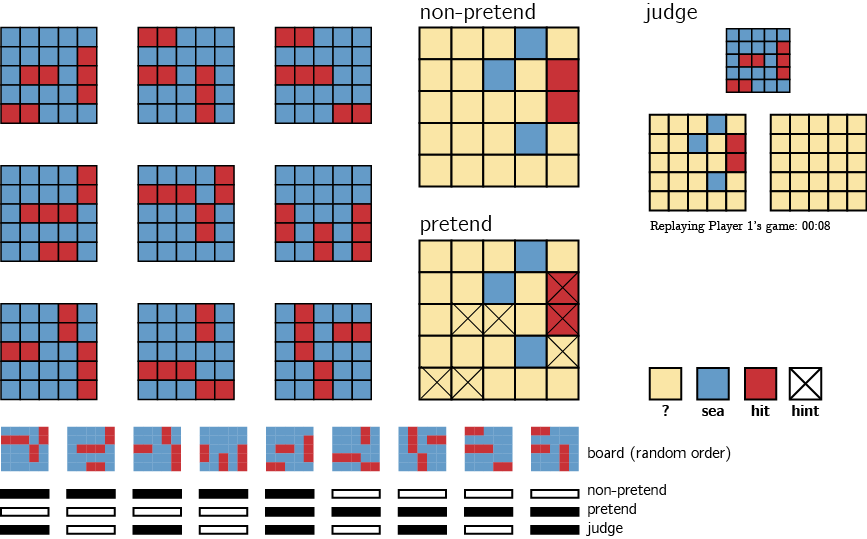

```{r setup, include = FALSE}
library("papaja")
r_refs("r-references.bib");
library('reticulate')
library('tidyverse')
library('broom')
library('cowplot')
library('MESS') # for AUCs
library('lsr') # for effect sizes
library('pwr') # for power calculations
library('brms') # for mixed effects modeling
library('BayesFactor') # for Bayesian t test

N <- 500;
```

```{r analysis-preferences}
# Seed for random number generation
set.seed(42)
knitr::opts_chunk$set(cache.extra = knitr::rand_seed)
```

```{r load-data, warning=FALSE}
E1.df <- read.csv('..\\experiments\\Battleships\\data\\batch1\\jatos_results_batch1.csv',na.strings=c(""," ","NA")) %>%
  rename(subj_id = participant_number) %>%
   # we accidentally have two subjects 251: 5c360ede943bda0001db4f1b and 6092f8b1c80be84bfe9fc57d.
  # to fix this, I change 6092f8b1c80be84bfe9fc57d to be 2511
  mutate(subj_id = ifelse(PROLIFIC_PID=='6092f8b1c80be84bfe9fc57d',2511,subj_id))%>%
  mutate(subj_id = factor(subj_id)) %>%
  # the dash is breaking r
  mutate(test_part = ifelse(test_part=='non-pretend','nonpretend',test_part)) %>%
  mutate(genuine_first=genuine_first=='True')

E1.export <-read.csv('..\\experiments\\Battleships\\data\\batch1\\prolific_export_batch1.csv');
```

# Motivation

<!-- The ability to reason about hypothetical mental states is critical for inferring goals and beliefs from observed behaviour [@baker2009action; @baker2011bayesian], predicting behaviour based on goals and belief states [@wimmer1983beliefs; @wellman2001meta], pre-commitment in action planning [@moran2021model], inference about the absence of memories [@dodson2002false], [...].  -->

The ability to intentionally deceive others relies on a capacity to reason about mental states [@frith2005theory]. This is evident in a similar developmental trajectory for the acquisition of theory of mind and the ability to deceive and detect deception [@wimmer1983beliefs; @shultz1981development; @sodian1991early], and a similar distribution of deception and theory of mind in the animal kingdom [e.g., @emery2004mentality; @hall2017cooperation]. This link makes conceptual sense: to deceive others, one needs to understand that others can have different knowledge and beliefs than one's own. Moreover, deception often involves pretense behaviour, which in turn relies on an ability to simulate and mimic one's own behaviour under a hypothetical belief state. For example, in order to successfully deceive your friends into thinking that you were surprised by the birthday party they threw for you, it is not sufficient that you are able to reason about their mental states ("I know that they are planning a surprise party, but they don't know that I know that.") — you also need to convincingly simulate and mimic your hypothetical behaviour had you not known about the party ("Where would I look first? What would I say? How long would it take me to recover from the surprise?"). This reliance of pretense behaviour on self-simulation makes it an ideal opportunity to examine metacognitive knowledge about one's own mental states, and the potential reliance of this knowledge on a self-simulation. By comparing non-pretend and pretend behaviour, we can ask which aspects of their cognitive processes subjects can simulate, and which aspects are not represented in their mental models of their own cognition.

To this end, here we examine pretense in a game setting. Using an online version of the game "Battleships", participants will play a non-pretend (normal) version of the game, as well as a pretend version where they will be given secret information about the location of hidden ships, but will try to behave as if they don't have this information. Examining different aspects of pretend and non-pretend games (such as decision latency, sequential dependencies and game optimality), we will ask to what extent can people simulate their own play behaviour under a different knowledge state. We will further ask whether participants can discriminate between pretend- and non-pretend games of other participants, and whether this ability predicts their own pretense quality.


# Methods
We report how we determined our sample size, all data exclusions (if any), all manipulations, and all measures in the study. <!-- 21-word solution (Simmons, Nelson & Simonsohn, 2012; retrieved from http://ssrn.com/abstract=2160588) -->

## Participants

The research complies with all relevant ethical regulations and was approved by the Research Ethics Committee of Johns Hopkins University. Participants will be recruited via Prolific and will give informed consent prior to their participation. They will be selected based on their acceptance rate (>95%) and for being native English speakers. We will collect data until we reach `r N` included participants. The entire experiment will take 20 minutes to complete (median completion time in our pilot data: `r printnum(E1.export%>%pull(time_taken)%>%median()/60)` minutes). Participants will be paid 3.15 USD for their participation, equivalent to an hourly wage of 9.50 USD, in addition to a bonus payment.

## Procedure

```{r design, echo=FALSE, fig.cap="Experimental Design: players will play 10 games of the game Battleships (on a 5x5 board) in two conditions presented in two blocks of 5 games. The order of blocks will be randomized between players. In non-pretend games, players will start the game not knowing where the ships are and will try to sink all ships with as few clicks as possible. In pretend games, ship locations will be marked with a cross such that players will know where they are hiding, and their task will be to play the game as if they do not have this information. Lastly, in judge trials, players will observe a replay of the games of two previous players – one pretender and one non-pretender, and their task will be to identify which was which. Lower panel: we created nine different boards, each containing two 2-square patrol boats and one 3-square submarine. The assignment of boards to conditions will be randomized across participants in the following way: first, the order of boards will be permuted randomly for each participant. Then, the first 5 boards in this permuted order will be used for non-pretend games, the last 5 boards will be used for pretend games, and boards 1,3,5,7 and 9 will be used for judge trials. This means that one board (“the common board”) will be used in all three parts of the experiment. The identity of the common board will be different for each participant.", out.width = '100%'}

```

The first instructions screen will inform participants that the experiment, based on the game Battleships, has three parts, and that the points they will accumulate will translate to a monetary bonus payment. They will then be presented with a leaderboard of previous players. Then, the rules of the game will be presented:

> In the game Battleships, your task is to sink all ships located in a grid with as few clicks as possible.
What makes the game difficult is that you can’t see the ships; all you can see is a grid of squares, and you have to guess where the ships are. To sink a ship, you need to click on all of the squares it is located in. If you hit part of a ship, the square will turn red. If there is no ship in the square, it will turn blue. 

We will further explain that in this version of the game, ships can touch corners, but their sides can't touch. This explanation will be accompanied by a visual presentation of legal and illegal ship configurations.

Once they respond correctly to a multi-choice comprehension question ("the goal of the game is to...": "sink all ships with as few clicks as possible"), participants will play a practice round on a 3x3 board.

After the main instructions, comprehension question and practice round, participants will complete one pretend and one non-pretend block, each followed by one half-game (see below for details). The order of pretend and non-pretend blocks will be counterbalanced between participants. Each block will comprise five games played on five out of nine different boards. The allocation of boards to conditions will be randomized between participants in the following way: for each participant, we will randomly determine a random permutation of the nine boards. Based on this permutation, boards 1-5 will be used in the non-pretend block, boards 5-9 will be used in the pretend block, and boards 1,3,5,7 and 9 will be used in the final judge block (see below for details). The order of boards within a block will be randomized.

### Non-pretend games

In non-pretend games, participants will sink one 3-square submarine and two 2-square patrol boats with as few clicks as possible. An online counter of the number of clicks will be displayed on the screen. After each game, feedback will be given about the number of clicks and resulting number of points obtained.

After completing the five games, participants will perform one half-game (see below for details). 

### Pretend games

Participants will be given the following instructions:

> In the next part of the experiment, you'll play 5 games where you sink one 3-square submarine and two 2-square patrol boats.

> However, this time your goal is different. 

> In this round, we’re going to tell you where the ships are, but **we want you to act like you don’t know this information**. We’ve marked the ships’ locations with a cross, so you’ll know where they are the whole time; but your job is to play the game as if these hints aren’t there.

> To see how good you are at this, we're going to compare your games to the games of people who actually had no hints, and see how similar they are. We will measure where and when you clicked; if your clicks look similar to people who played like normal (trying to reveal all ships with as few clicks as possible, but without any hints), you'll get bonus points. But if your games look different, you won't get these bonus points. Your number of clicks in this part will not affect your bonus. Only your ability to play like you had no hints.

After one practice round, pretending not to know the locations of two 2-square patrol boats on a 3x3 board, and one comprehension question ("In this part of the experiment my goal is to...": "play the game as if the cross hints were not there so that I look like someone who had no hints"), participants will play five pretend games. Each game will be followed by a short message, reminding them that a game that looks similar to the game of participants who had no hints will be awarded with 10 bonus points.

After completing the five games, participants will perform one half-game (see below for details). 


### Half games

In order to directly compare participants' pretend and non-pretend games for identical belief states (true or pretended knowledge about which cells hide water and which hide ships), we will ask participants to also complete one pretend and one non-pretend game, given a partly finished board with the content of 7 cells already revealed (see Fig. \@ref(fig:halfgames)). We designed our half games to produce a strong expectation to find a ship in specific cells, but not in others. In one of the two games (A), these expectations are not fulfilled. In the other (B), they are. The assignment of half-completed boards to pretend and non-pretend conditions will be randomized between participants. 

Instructions for the non-pretend half-game will be:

> For the next game, you will continue the game of another player from where he or she stopped. Just like in the previous games, here also there are two 2-square patrol boats and one 3-square submarine hiding in the water, and you will get a bonus for revealing all the ships with as few clicks as possible. 

Instructions for the pretend half-game will be:

> For the next game, you will continue the game of another player from where he or she stopped. Just like in the previous games, here also there are two 2-square patrol boats and one 3-square submarine hiding in the water. We marked for you the true locations of the ships with a cross, but your bonus points will depend on your ability to play as if you didn't have these hints.

```{r game_board_analysis, echo=FALSE}

all_possible_boards <- read.csv('../analysis/flat_boards.csv',header=FALSE);

create_board_states <- function(flat_positions,hit) {
  
  board_state = rep(NA,25)
  board_states = c();
  for (p in seq_along(flat_positions)) {
    board_states = c(board_states, paste(board_state,collapse=','));
    board_state[flat_positions[p]]=ifelse(hit[p],1,0);
  }
  
  return(board_states)
};

get_likelihood <- function(board_state) {
  
  board_state = scan(text= board_state, what = numeric(), sep="," , quiet = TRUE);
  
  revealed_positions <- which(!is.na(board_state));
  
  boards_to_remove = c();
  
  for (position in revealed_positions) {
    boards_to_remove = union(boards_to_remove, which(all_possible_boards[,position] != board_state[position]))
  }
  
  survived_boards = setdiff(1:nrow(all_possible_boards), boards_to_remove);
  likelihood = all_possible_boards[survived_boards,]%>%colMeans();
  likelihood[revealed_positions]=NA;
  
  return(paste(likelihood,collapse=','))
  
};

get_posterior <- function(likelihood) {
    likelihood = scan(text= likelihood, what = numeric(), sep="," , quiet = TRUE);
    posterior = likelihood/sum(likelihood,na.rm=TRUE); # assuming a uniform prior
    return(paste(posterior,collapse=','))
}
  
get_p_click <- function(posterior, flat_position) {
  posterior <- scan(text= posterior, what = numeric(), sep="," , quiet = TRUE);
  return(posterior[flat_position])
}

get_p_click_rank <- function(posterior, flat_position) {
  posterior <- scan(text= posterior, what = numeric(), sep="," , quiet = TRUE);
  rank_posterior = rank(-posterior)
  return(rank_posterior[flat_position])
}

get_posterior_entropy <- function(posterior) {
  posterior <- scan(text= posterior, what = numeric(), sep="," , quiet = TRUE);
  posterior[which(posterior==0)]=NA; #to avoid infinity*0
  entropy <- -sum(unlist(posterior)*(unlist(log(posterior))),na.rm=TRUE);
  return(entropy);
}

plot_posterior <- function(posterior,file_name) {
  posterior <- scan(text= posterior, what = numeric(), sep="," , quiet = TRUE);
  board_df <- data.frame(i=rep(c(1,2,3,4,5),each=5),j=rep(c(1,2,3,4,5),5),posterior=posterior);
  p <- ggplot(board_df,aes(x=j,y=i,fill=posterior)) +
    geom_tile() +
    coord_equal() +
    scale_x_continuous(breaks=c()) +
    scale_y_continuous(breaks=c(),trans='reverse') +
    scale_fill_gradient(low='#649bc8',high='#c83237',na.value = "white",limits = c(0,0.25))+
    labs(x='',y='') +
    theme_classic();
  
  ggsave(paste('figures/',file_name,'.pdf',sep=''),width=5,dpi=300);
}

board_state <- "NA,NA,NA,NA,NA,NA,NA,NA,NA,NA,0,1,1,0,NA,NA,NA,0,NA,NA,1,1,NA,NA,NA"
posterior <- board_state%>%get_likelihood()%>%get_posterior();
plot_posterior(posterior,'posterior_boardA');

board_state <- "NA,NA,NA,NA,0,NA,NA,0,NA,NA,NA,NA,NA,NA,0,NA,NA,1,0,NA,NA,NA,1,NA,1"
posterior <- board_state%>%get_likelihood()%>%get_posterior();
plot_posterior(posterior,'posterior_boardB');

```

```{r halfgames, echo=FALSE, fig.cap="The two half games. Left column: True location of ships is marked with a cross, but this will only be visible to participants in the pretend version. Right column: objective probability of hitting a ship, given board configuration.", out.width = '100%'}
knitr::include_graphics("figures/Half_games.png")
```

### Judge trials

In the final part of the experiment, participants will observe the games of previous players and determine who had hints and who didn't. Instructions for this part are:

>  In this third and last part of the experiment, we ask you to be a judge for previous players, and see if you can tell which of two players was given hints (and acted like they didn't). We will do 5 trials, each featuring two new players, only one of which had hints. 
  
For a random half of the participant, the instructions continue:

> We will show you replays of their games side by side. Your task is to decide who had hints (and acted like they didn't). After you've watched the games of both players, click on the board of the player who had hints. For each game that you get right, you will receive 10 points. Good luck!
   
For the other half, the instructions continue:

> We will show you replays of their games side by side. Your task is to decide who played the game normally (without hints). After you've watched the games of both players, click on the board of the player who played normally. For each game that you get right, you will receive 10 points. Good luck!

Then, on each judge trial, two empty grids will be presented side by side, with a smaller grid on top, displaying the hidden positions of ships on the grid. The two grids will correspond to the true games of two previous players who played a version of the top grid either as pretenders or as non-pretenders. Only games shorter than one minute will be chosen for presentation in this part. For non-pretend games, only games from the group of participants that pretended in the second block (and played normally in the first block) will be chosen for presentation in this part. Judge participants will press one of two buttons to start a replay of one of the two grids. Replays will be presented in "real time", mimicking not only where participants clicked, but also when. Only after watching both replays will it be possible to click on one of the two boards to indicate a decision. Alternatively, participants will be allowed re-watch the two games until they make up their minds. After making a decision, participants will be informed whether they will receive the 10 points, or alternatively, whether the pretender will receive them in case the pretender managed to trick them.

Lastly, participants will be asked the following debrief questions:

> Did you have a strategy that you used for pretending you had no hints? How about telling between players with and without hints - did you have a strategy for that?

And: 

> We would appreciate if you could share any thoughts you had about the experiment, or anything we should take into account when analyzing your data.

### Randomization

The order and timing of experimental events will be determined pseudo-randomly by the Mersenne Twister pseudorandom number generator, initialized in a way that ensures registration time-locking [@mazor2019novel]. 

## Data analysis

### Rejection criteria

Pretend games in which all clicks resulted in hits will not be included for analysis. Similarly, participants will be excluded if two or more of their pretend games were all hits.

### Data preprocessing

Data will not be preprocessed in any way.

### Hypotheses and analysis plan

This study is designed to explore subjects' capacity for self-simulation under a counterfactual knowledge state, and the limits of this capacity. In particular, we are interested in comparing non-pretend and pretend games and identifying similarities and differences. We will also assess subjects' capacity to discriminate pretend and non-pretend games, and how this capacity relates to their ability to pretend.

Unless otherwise specified, all hypotheses will be tested using a repeated measures t-test, with a significance level of 0.05. 

All hypotheses will be tested separately for the group of participants that pretended in the first and in the second block. If results for the two groups diverge, analysis will be repeated on the first block of all participants (pretend games of pretend-first participants and non-pretend games of pretend-second participants), in a between-subjects manner, and results will be interpreted in light of this analysis. 

*Hypothesis 1 (game duration)*: We will test the null hypothesis that pretend games take as long as non-pretend games. For each participant, a difference between median game duration in pretend and non-pretend games will be extracted. Subject-wise differences will then be carried over to a t-test at the group level. 

*Hypothesis 2 (first click latency)*: We will test the null hypothesis that the first click in pretend games takes as long to execute as in non-pretend games. For each participant, a difference between median first click latency in pretend and non-pretend games will be extracted. Subject-wise differences will then be carried over to a t-test at the group level. 

*Hypothesis 3 (number of clicks)*: We will test the null hypothesis that pretend games are as long, in terms of total number of clicks, as non-pretend games. For each participant, a difference between median number of clicks in pretend and non-pretend games will be extracted. Subject-wise differences will then be carried over to a t-test at the group level.

*Hypotheses 4-6 (click latency by click outcome)*: Trials will be classified based on whether they resulted in hitting a ship (*hit*) or not (*miss*). We will then contrast median click latency between hits and misses separately for pretend and non-pretend games. We will test for a difference in trial latency as a function of outcome on pretend games, on non-pretend games, and for an interaction effect between click outcome (hit or miss) and condition (pretend or non-pretend) on click latency. The same analysis will then be repeated by classifying trials on the basis of whether the previous trial resulted in a hit or a miss (*Hypothesis 5*), and whether the next trial will result in a hit or a miss (*Hypothesis 6*).

#### Model based analysis

The following analyses are designed to test for differences in game optimality between pretend and non-pretend games, and for a relationship between decision difficulty and click latency. To do so, we approximate optimal behaviour by calculating the posterior probability that a ship is hiding in each cell, given available information. Critically, in modelling pretend games we do not treat hints as part of this available information, because an optimal player should ignore this information in choosing where to click next. Given this posterior map, a rational player should choose cells that have a high posterior probability of hiding a ship. This behaviour is not strictly optimal, but approximates optimal behaviour in most cases [@audinot2014optimal, Section 3.3].

To quantify optimality, before each cell selection we will compute the posterior probability that a ship is hidden behind each of the ‘unknown’ cells. Then, we will rank cells from highest to lowest according to their posterior probability and record the rank of the chosen cell.

*Hypothesis 7 (game optimality):* We will test the null hypothesis that pretend games are as optimal as non-pretend games. Mean click optimality will be contrasted between the pretend and non-pretend games of each player.  Subject-wise differences will then be carried over to a t-test at the group level. 

*Hypothesis 8 (entropy-RT relation):* The entropy of the posterior map will be extracted before each cell selection using the following formula: $H(p)=\sum_{i=1}^{N} p_{i}\times log p_{i}$. We will test for within-subject associations between click latency and the linear and quadratic expansions of posterior entropy in pretend and in non-pretend games by fitting a multiple regression model to the data of each subject. We will contrast subject-wise beta values for pretend and non-pretend games to test the null hypothesis that the association between posterior entropy and click latency is the same in both conditions. 

#### Judge accuracy

*Hypothesis 9 (judge accuracy):* Judge accuracy will be quantified as the number of correct guesses in the judge block, divided by 5. This quantity will be extracted separately for each subject and contrasted against chance (50%) at the group level.

*Hypothesis 10 (judge-pretend relation):* Pretense quality will be quantified as the number of pretend games that were misclassified by other participants as non-pretend games, divided by the number of pretend games that were presented to other participants. Due to randomization, this denominator is different for different participants. We will test for a correlation between pretense quality and judge accuracy at the group level. To maximize statistical power, this hypothesis will be tested on the pooled data from both groups of participants. 

#### Half games

Data from half games will be subjected to exploratory analysis, focusing on the spatial distribution of clicks in pretend and non-pretend games. For each board (A or B) and condition (pretend or non-pretend), we will produce a heat map of click probabilities. This heat map will be compared against the true posterior map (see Fig. \@ref(fig:halfgames)). Depending on the consistency in cell selections among different players, we will perform this analysis not only for the first click, but also for subsequent clicks.


## Power calculations and sample size justification

With approximately `r N/2` participants in each group (allocation to group will be determined pseudorandomly), we will have 95% statistical power to detect an effect size of `r pwr.t.test(n=N/2,sig.level=0.05,power=0.95,type='paired')$d%>%printnum()` standard deviations in a repeated measures t-test (Hypotheses 1-9). In case of a conflict between the results of the two groups, a between-subjects comparison will be performed, using data from the first block only (pretend games from the pretend-first group and non-pretend games from the pretend-second group). For this between-subjects t-test, we will have 95% statistical power to detect an effect size of `r pwr.t2n.test(n1=N/2,n2=N/2,sig.level=0.05,power=0.95)$d%>%printnum()` standard deviations. 

With `r N` participants in both groups combined, we will have 95% statistical power to detect a Pearson correlation of `r pwr.r.test(n=N,sig.level=0.05,power=0.95)$r%>%printnum()` (Hypothesis 10).


\newpage

# References

\begingroup
\setlength{\parindent}{-0.5in}
\setlength{\leftskip}{0.5in}

<div id="refs" custom-style="Bibliography"></div>
\endgroup
