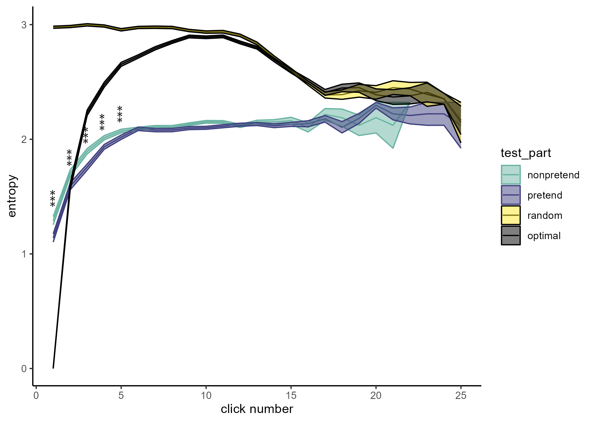

## Analysis of decision conformity (2023-01-18)

Instead of computing p(click) relative to places where a ship could be hiding, I now computed it relative to the behaviour of other players in the same click number in non-pretend games. My reasoning was that pretenders may be following what people usually do in a rigid and inflexible manner, instead of adapting it flexibly to the game state.

Turns out that's not the case. Pretenders and non-pretenders followed similarly stereotypical click sequences, with slightly less stereotypical sequences in pretend games. The relation between entropy of this new measure and RT was negatively quadratic, but not very strongly so, and only in pretend games.

The entropy of clicks across games seem generally similar in pretend and non-pretend games, but for some reason it decreases at a round the 10th click. I'm not sure why this happens.

## Analysis of decision conformity (2023-01-19)

Part of the solution to the problem is that entropy decreases when there are fewer possible events, and that happens when the click number is high enough such that some games have already ended. When restricting the analysis only to cases in which the games haven't ended yet, entropy remains high. But for some reason it does decrease for the random and optimal agents:

{width="615"}

It might be subjects that go over the board systematically that decrease this measure.

The important thing is that early on, entropy seems to be higher for nonpretend games.

Oddly, the difference is already apparent in the first click 🤔
